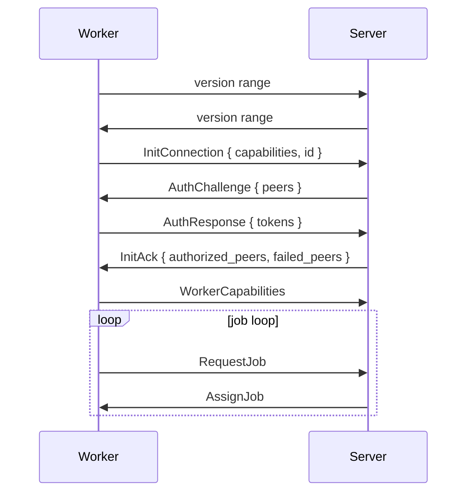
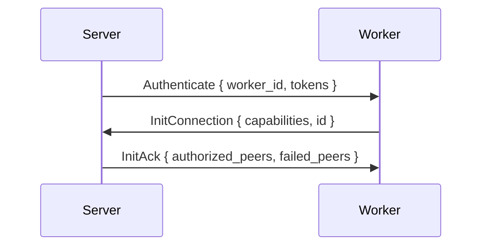
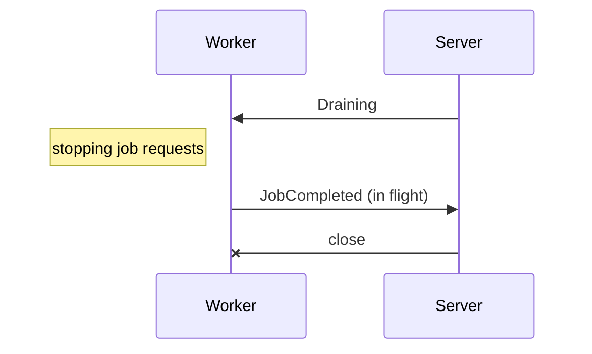

# Connection

Workers talk to the server over one WebSocket at `/proto`, with binary frames from the `Proto` derive. A session is running **version agreement -> handshake -> authorization -> capabilities -> job loop**.



## Handshake

| Step | Message | Content |
|---|---|---|
| 1 | `InitConnection` | `capabilities`, the worker's persistent `id` |
| 2 | `AuthChallenge` | The peers that registered this worker ID |
| 3 | `AuthResponse` | One token per challenged peer the worker is holding |
| 4 | `InitAck` or `Reject` | Authorized peers, failed peers with reasons |

`/var/lib/gradient-worker/worker-id` is holding the worker ID. The server is using the ID to match reconnects, reject duplicates and label the worker in the UI and logs.

`MAX_HANDSHAKE_MESSAGE_SIZE` (64 KiB) is capping every handshake message. A larger message is ending the session with close code `1002`, without decoding.

**Rejections:** The server is rejecting a session with the codes below. A dialed worker is rejecting the server with `400` or `401`, see [Server-Dialed Handshake](#server-dialed-handshake).

| Code | Reason |
|---|---|
| `400` | An unexpected message during the handshake |
| `401` | `no valid peer tokens provided` |
| `403` | `unknown worker`, `worker is deactivated`, `no project grants this team's workers`, or the server is not accepting connections |
| `495` | `project has no cache subscribed`: every authorized project is lacking a cache |
| `496` | `worker already connected` |

## Server-Dialed Handshake

The server is dialing every registration and team worker with a `url`. The server is proving itself with its tokens, and the worker's TLS certificate is proving the worker.



| Step | Message | Content |
|---|---|---|
| 1 | `Authenticate` | The dialed `worker_id`, one `(peer, token)` per registration with a stored token at the dialed URL |
| 2 | `InitConnection` or `Reject` | `401` for an unknown worker ID or any wrong token, `400` for any other first message |
| 3 | `InitAck` or `Reject` | The projects whose tokens the worker accepted, without a challenge round |

- The server is sending its tokens over `wss://`. A `ws://` URL is for local and operator setups only. The server is still sending the tokens and logging a warning.
- `services.gradient.worker.acceptedServerTokensFile` is holding the hashes a worker is checking. The worker is accepting every server without the file.
- A reauth of a server-dialed session is answered with `AuthUpdate`, never with `AuthChallenge`.
- A reauth finding a new registration is closing the session. The next dial is carrying the new project's token.
- Projects granting a team's workers join the running session. All of them share the team worker's one token for the team ID.
- A registration may not reuse the worker ID of a team worker. Gradient.CI worker IDs belong to one registration or team worker only.
- The server is keeping the last failure of every worker ID in memory as the worker's offline reason.
- The server is keeping a failure before the token check only for a registered worker ID.

## Capabilities

A capability is active only when both sides support the capability. The server alone is setting `core` and `cache`.

| Capability | Meaning |
|---|---|
| `core` | The server side of the protocol. Always on for the server, off for workers |
| `cache` | Serving as a binary cache. Always on for the server |
| `fetch` | Cloning repositories and prefetching flake inputs |
| `eval` | Running flake evaluations |
| `build` | Running Nix builds |
| `federate` | Reserved: negotiated in the handshake, no behavior yet |

Capability flags are gating new features, not version numbers.

## Authorization

A **peer** is anything registering a worker: a project, a cache or a proxy. Both sides consent. The peer is registering the worker ID, and the worker is holding the peer's token.

1. A peer is registering the worker ID. The server is generating a token for that pair.
2. The worker's peers file (`services.gradient.worker.peersFile`) is holding `peer_id:token` lines.
3. The server is challenging for every registering peer on connect. The server is checking each token on its own.

| Peer | Granted Access |
|---|---|
| Project | Jobs from the project's tasks |
| Cache | Serving and pulling from the cache |
| Proxy | Membership in the proxy's worker pool |

- The session is surviving some failed tokens with the remaining peers.
- Only a failure of all tokens is rejecting the session.
- A project without a cache subscription is moving to `failed_peers`.
- The reply is `495` if no peer is remaining.
- **Reauth** is adding peers without reconnecting.
- The server is sending `AuthChallenge` to a worker-dialed session when a peer is registering the worker.
- The worker is sending `ReauthRequest` when its peers file is changing.
- Both are ending in `AuthUpdate`. Reauth is never revoking granted peers.
- One connection per worker ID. The server is rejecting a second connection with `496`.
- The server is dropping a connection silent for `proto.workerHeartbeatTimeoutSecs` (120 s).
- A project's worker list is showing a worker as live only when the worker authenticated for that project.

## Build Timeouts

Each `BuildSpec` is carrying `timeout_secs` and `max_silent_secs`. The values are the derivation's own `timeout` and `maxSilent`. The fallbacks are `build.defaultTimeoutSecs` (14400) and `build.defaultMaxSilentSecs` (3600). `0` is disabling a limit. A build past a limit is ending as `FailedTimeout`. Evaluations have no timeout.

## Server Restart

A restart is losing work in flight, never a queued job.

| Side | Behavior |
|---|---|
| Worker | Aborting every running job and reconnecting with backoff (1 s, doubling up to 60 s) |
| Worker | Sending a full handshake, then `RequestJobList` and one `RequestJob` per kind |
| Server | Dropping every report whose `job_id` and `assignment_id` the current session did not hand out |
| Server | `recover_interrupted_work` is closing open assignments and aborting running attempts before the first session. The pass is also re-queuing `Building` builds and re-evaluating interrupted evaluations |

## Graceful Shutdown



- The server is sending `Draining` on `SIGTERM` and assigning nothing more.
- The server is closing each session once the worker is idle, after 20 s at the latest.
- Startup recovery is re-queuing whatever the cut-off interrupted.
- `Draining` is ending the session, never the worker process.
- The worker is reconnecting once the server is back.

## Version Agreement

```text
"GRAD" | oldest: u16 LE | newest: u16 LE
```

- Each side is sending this 8-byte frame before its first message. The frame format is never changing.
- `ProtoSocket` is agreeing on the first send or receive. Both sides are sending first and reading second.
- The agreed version is the lower of both newest versions. Every later frame is encoded for that version.
- Two ranges without overlap are ending the session with close code `1002` and `no shared protocol version: ours 27..=27, peer 30..=31`.
- A first frame without `GRAD` is coming from protocol 26 or older. The session is ending with `peer protocol is older than 27`.
- Both sides are logging the reason at `warn`. A server dialing a worker is keeping the reason as the worker's offline reason.
- `gradient_wire::PROTO_VERSIONS` is the supported range, computed from the `#[proto]` annotations.
- `writer.version()` is exposing the agreed version for feature checks.

## Changing a Message

| Change | Annotation | Effect |
|---|---|---|
| New field | `#[proto(28)]` | Field present since 28. The oldest supported version is rising to 28 |
| New field with a fallback | `#[proto(28, default)]` | Older peers are leaving the field out. Decoding is filling `Default::default()` |
| New variant | `#[proto(28)]` on the variant | Appended at the end. Sending the variant to a peer below 28 is an `EncodeError` |
| Removed or reordered field or variant, changed meaning | `#[proto(oldest = 30)]` on `ClientMessage` and `ServerMessage` | The oldest supported version is rising to 30 |

- A field without `default` is required. A forgotten `default` is costing compatibility, never correctness.
- Variants are append-only. A variant older than the one before is a compile error.
- `gradient-wire/schema/v{N}.txt` is holding the wire shape of each supported version. The `schema` test is comparing the files to the code.
- `cargo run --example wire_schema` is writing the file of a new version and deleting files below the oldest. Existing files are never rewritten.

## Cache Sessions

`/cache/{cache}/proto` is offering the same frames as a read-only session for one cache.

| Aspect | Rule |
|---|---|
| Public cache | No credentials, unless `proto.anonymousCache.enable` is off |
| Private cache | `Authorization: GRAD<key>` on the upgrade request |
| Handshake | `InitConnection`, then `InitAck` with no peers. No challenge |
| Allowed | `CacheQuery` in `Normal` or `Pull` mode, `NarRequest`. The server is rejecting everything else with `403` |
| Limits | `proto.anonymousCache.maxConnectionsPerIp` (32) anonymous connections per IP. Every session is counting against `proto.maxConnections` (256). `SAFE_INFLIGHT_MESSAGE_SIZE` (2 MiB) is capping each message, enough for a `CacheQuery` of 1000 paths |
| Idle | Closed after 120 s without a NAR transfer |

## Implementation

- One pure handshake state machine in `gradient-wire/src/session/handshake.rs` is driving every session.
- The server is running `as_authority` for a worker dialing in and `as_dialer` for a worker the server is dialing. The worker is running `as_peer` and `as_dialed`.
- The cache session is agreeing on a version like every other session.
- `session/frame.rs` is splitting each socket into a typed reader and a writer. The writer is holding a control lane and a bulk lane.
- Control is going first. A bulk batch is holding at most 256 KiB.
- A full bulk queue is never blocking control replies.
- Chunk payloads (`NarPush`, `UploadChunk`, `EvalCacheChunk`, `LogChunk`) reach the handler as slices of the frame, without a copy.
- `client::dial` is disabling Nagle's algorithm on every socket. Small control frames go out without waiting for a delayed ACK.
