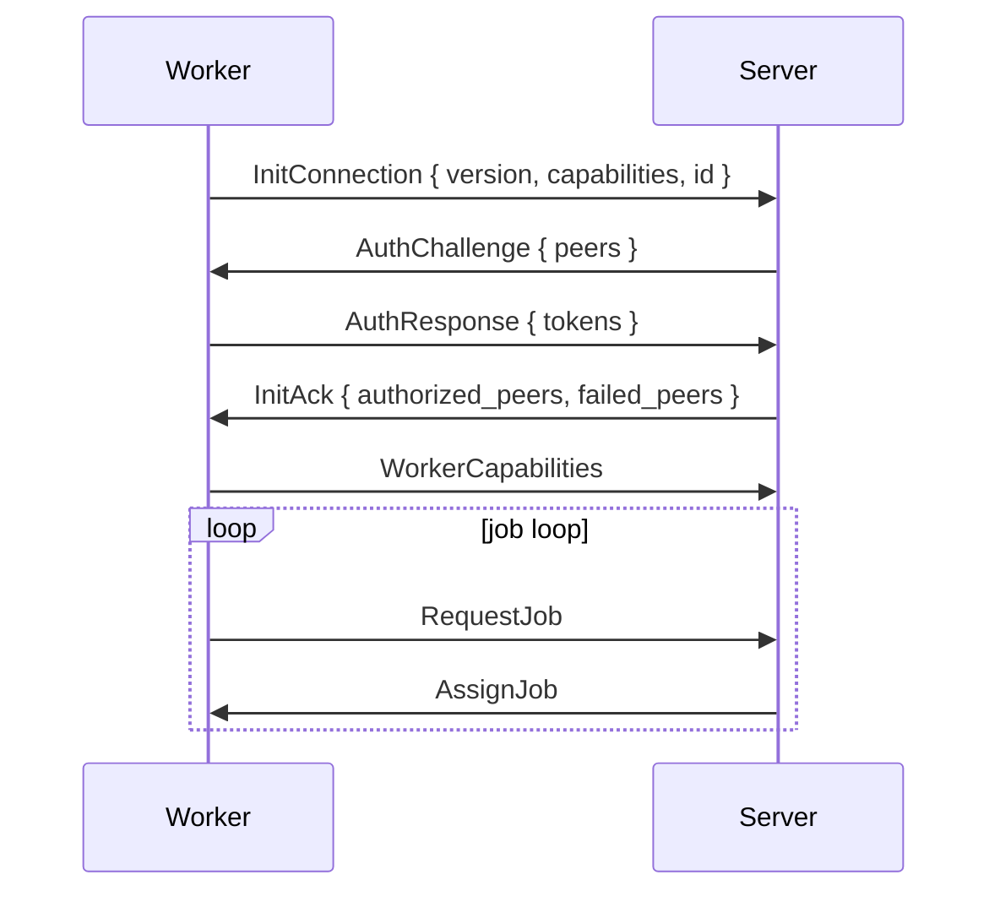
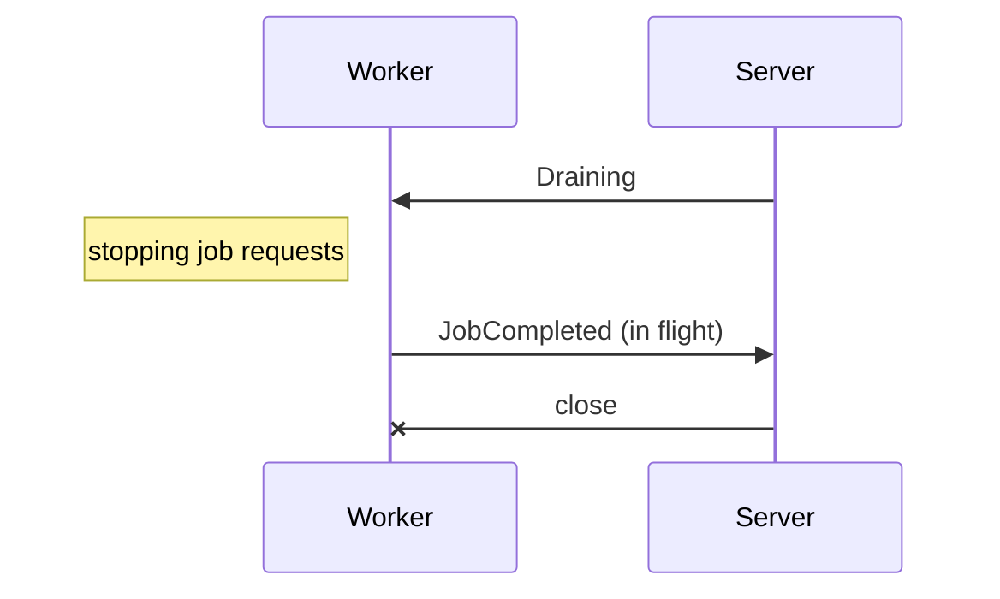

# Connection

Workers talk to the server over one WebSocket at `/proto`, with binary [rkyv](https://rkyv.org/) frames. A session is running **handshake -> authorization -> capabilities -> job loop**.

## Handshake

| Step | Message | Content |
|---|---|---|
| 1 | `InitConnection` | `version`, `capabilities`, the worker's persistent `id` |
| 2 | `AuthChallenge` | The peers that registered this worker ID |
| 3 | `AuthResponse` | One token per challenged peer the worker is holding |
| 4 | `InitAck` or `Reject` | Authorized peers, failed peers with reasons |

`/var/lib/gradient-worker/worker-id` is holding the worker ID. The server is using the ID to match reconnects, reject duplicates and label the worker in the UI and logs.

**Rejections:** The server is rejecting a session with the codes below. The worker is never rejecting the server.

| Code | Reason |
|---|---|
| `400` | Wrong protocol version, or an unexpected message during the handshake |
| `401` | `no valid peer tokens provided` |
| `403` | `unknown worker`, `worker is deactivated`, `base worker not enabled by any project`, or the server is not accepting connections |
| `495` | `project has no cache subscribed`: every authorized project is lacking a cache |
| `496` | `worker already connected` |

## Capabilities

A capability is active only when both sides support the capability. The server alone is setting `core` and `cache`.

| Capability | Meaning |
|---|---|
| `core` | The server side of the protocol. Always on for the server, off for workers |
| `cache` | Serving as a binary cache. Always on for the server |
| `fetch` | Cloning repositories and prefetching flake inputs |
| `eval` | Running flake evaluations |
| `build` | Running Nix builds |
| `federate` | Reserved: negotiated in the handshake, no behavior yet |

Capability flags are gating new features, not version numbers.

## Authorization

A **peer** is anything registering a worker: a project, a cache or a proxy. Both sides consent. The peer is registering the worker ID, and the worker is holding the peer's token.

1. A peer is registering the worker ID. The server is generating a token for that pair.
2. The worker's peers file (`services.gradient.worker.peersFile`) is holding `peer_id:token` lines.
3. The server is challenging for every registering peer on connect. The server is checking each token on its own.

| Peer | Granted Access |
|---|---|
| Project | Jobs from the project's tasks |
| Cache | Serving and pulling from the cache |
| Proxy | Membership in the proxy's worker pool |

- The session is surviving some failed tokens with the remaining peers.
- Only a failure of all tokens is rejecting the session.
- A project without a cache subscription is moving to `failed_peers`.
- The reply is `495` if no peer is remaining.
- **Reauth** is adding peers without reconnecting.
- The server is sending `AuthChallenge` when a peer is registering the worker.
- The worker is sending `ReauthRequest` when its peers file is changing.
- Both are ending in `AuthUpdate`. Reauth is never revoking granted peers.
- One connection per worker ID. The server is rejecting a second connection with `496`.
- The server is dropping a connection silent for `proto.workerHeartbeatTimeoutSecs` (120 s).
- A project's worker list is showing a worker as live only when the worker authenticated for that project.

## Build Timeouts

Each `BuildSpec` is carrying `timeout_secs` and `max_silent_secs`. The values are the derivation's own `timeout` and `maxSilent`. The fallbacks are `build.defaultTimeoutSecs` (14400) and `build.defaultMaxSilentSecs` (3600). `0` is disabling a limit. A build past a limit is ending as `FailedTimeout`. Evaluations have no timeout.

## Server Restart

A restart is losing work in flight, never a queued job.

| Side | Behavior |
|---|---|
| Worker | Aborting every running job and reconnecting with backoff (1 s, doubling up to 60 s) |
| Worker | Sending a full handshake, then `RequestJobList` and one `RequestJob` per kind |
| Server | Dropping every report whose `job_id` and `assignment_id` the current session did not hand out |
| Server | `recover_interrupted_work` is closing open assignments and aborting running attempts before the first session. The pass is also re-queuing `Building` builds and re-evaluating interrupted evaluations |

## Graceful Shutdown

- The server is sending `Draining` on `SIGTERM` and assigning nothing more.
- The server is closing each session once the worker is idle, after 20 s at the latest.
- Startup recovery is re-queuing whatever the cut-off interrupted.
- `Draining` is ending the session, never the worker process.
- The worker is reconnecting once the server is back.

## Versioning

`PROTO_VERSION` is `23` and is rising with every breaking wire change. Both sides must match exactly. One check in `session::handshake::on_init_connection` is covering every session kind.

## Cache Sessions

`/cache/{cache}/proto` is offering the same frames as a read-only session for one cache.

| Aspect | Rule |
|---|---|
| Public cache | No credentials, unless `proto.anonymousCache.enable` is off |
| Private cache | `Authorization: GRAD<key>` on the upgrade request |
| Handshake | `InitConnection`, then `InitAck` with no peers. No challenge |
| Allowed | `CacheQuery` in `Normal` or `Pull` mode, `NarRequest`. The server is rejecting everything else with `403` |
| Limits | `proto.anonymousCache.maxConnectionsPerIp` (32) anonymous connections per IP. Every session is counting against `proto.maxConnections` (256) |
| Idle | Closed after 120 s without a NAR transfer |

## Implementation

- One pure handshake state machine in `gradient-wire/src/session/handshake.rs` is driving every session.
- The server is running `as_authority`, and the worker is running `as_peer`.
- The cache session is reusing the version gate.
- `session/frame.rs` is splitting each socket into a typed reader and a writer. The writer is holding a control lane and a bulk lane.
- Control is going first. A bulk batch is holding at most 256 KiB.
- A full bulk queue is never blocking control replies.
- Validation of frames is happening where the socket put them.
- Chunk payloads (`NarPush`, `UploadChunk`, `EvalCacheChunk`, `LogChunk`) reach the handler as slices of the frame, without a copy.
- `client::dial` is disabling Nagle's algorithm on every socket. Small control frames go out without waiting for a delayed ACK.
