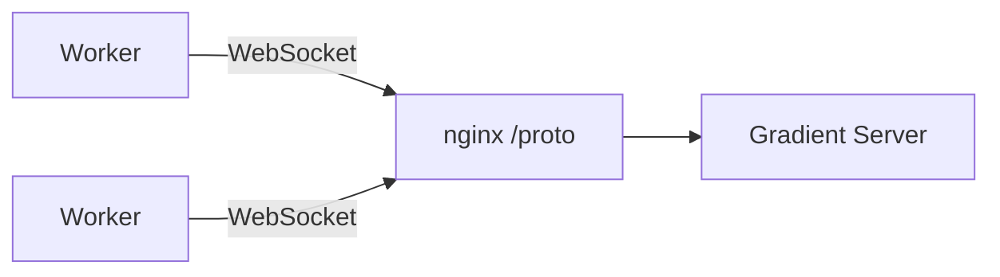
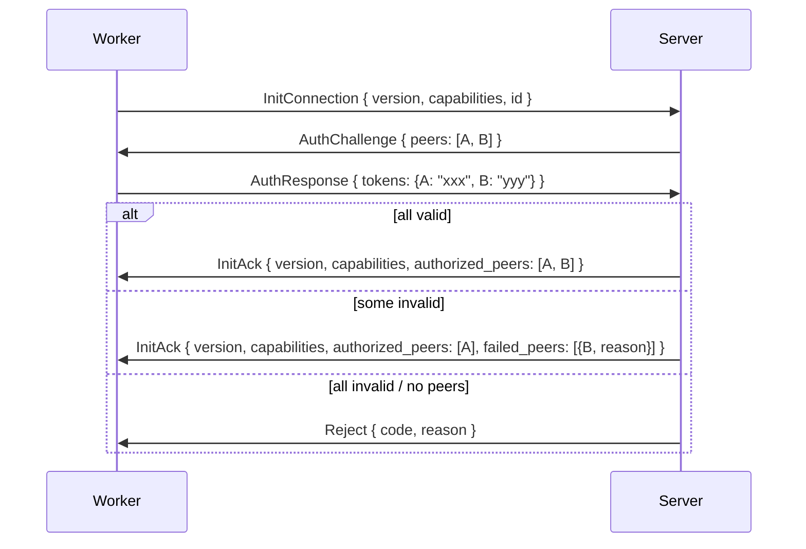
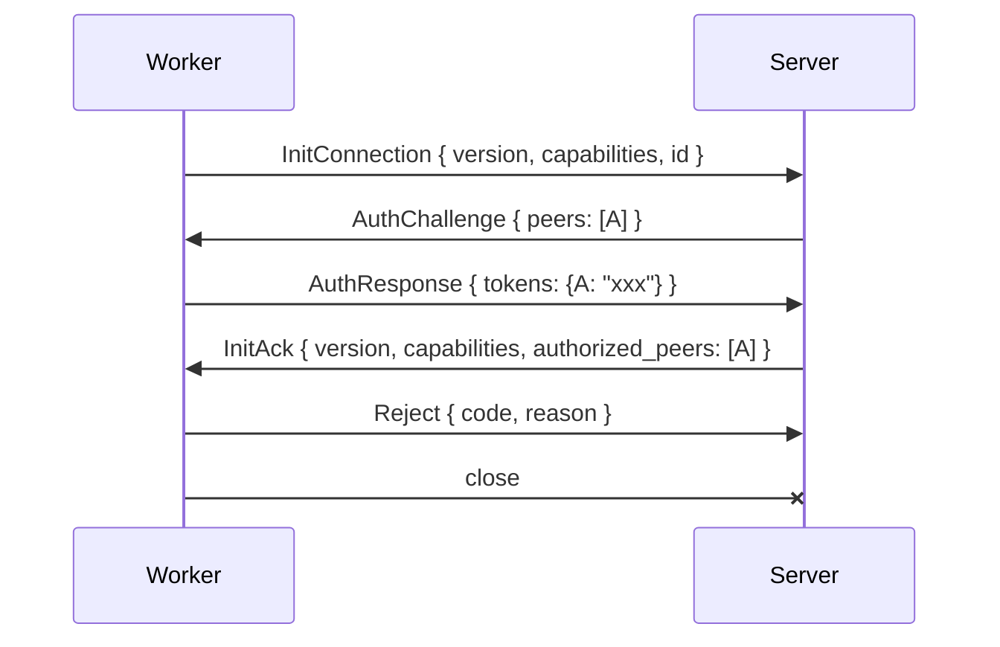
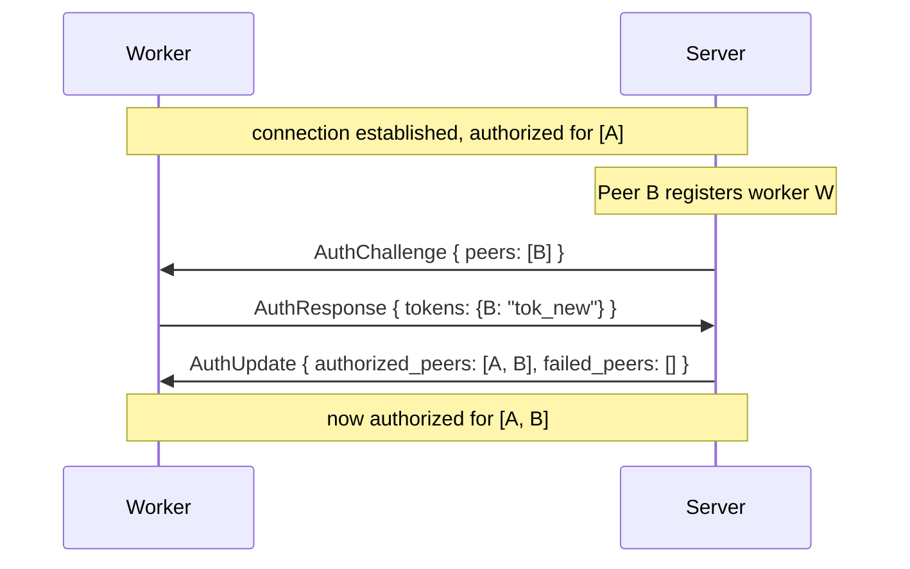
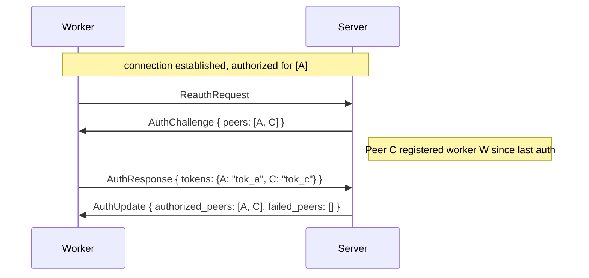
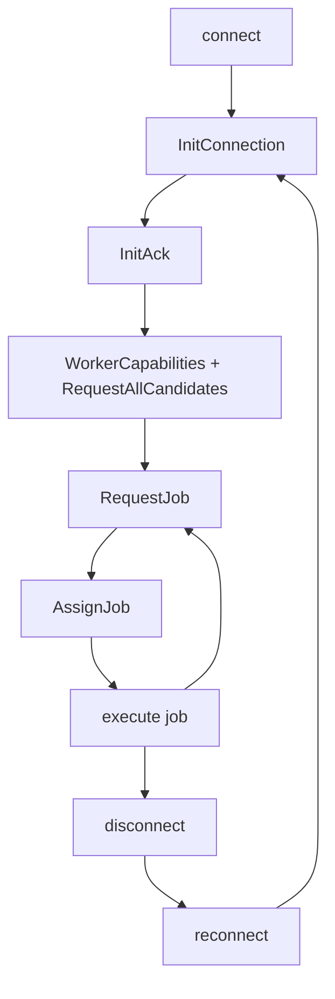
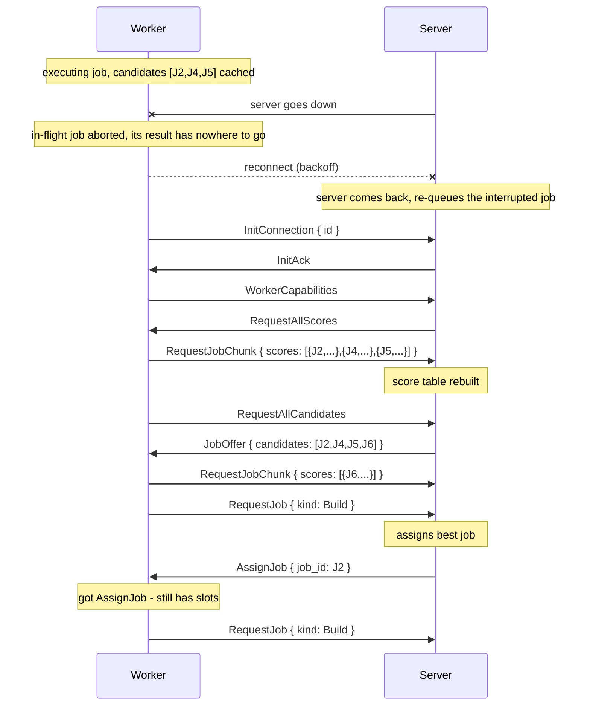
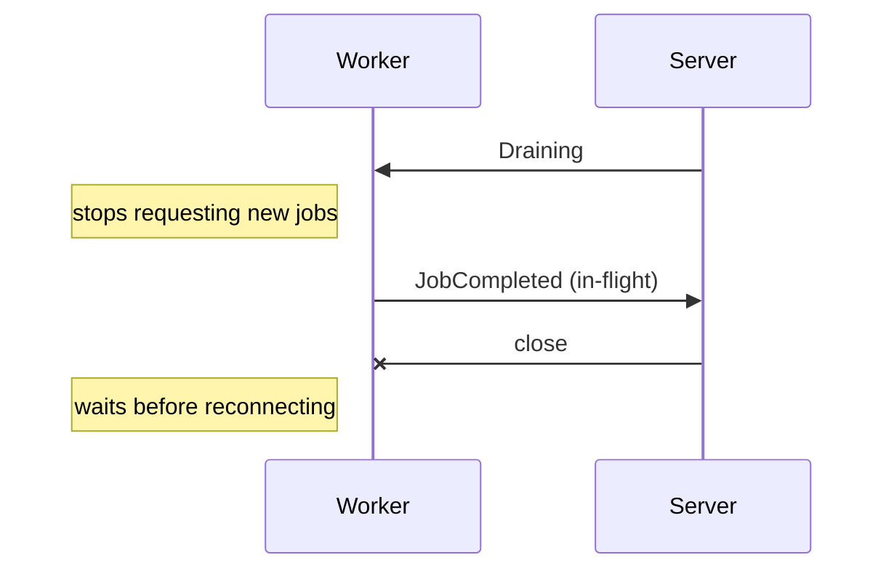
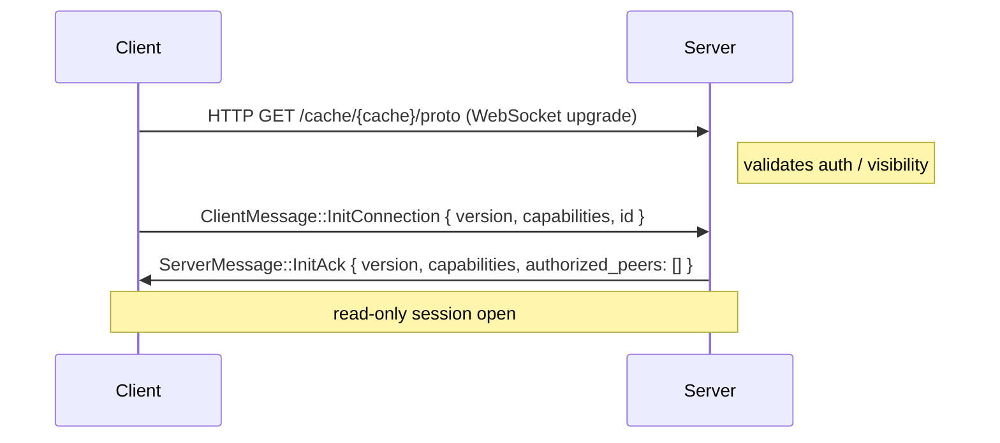

# Connection

How a worker connects to `/proto`: handshake, authorization, versioning, the connection lifecycle, timeouts and error codes, plus anonymous cache-scoped sessions.

Gradient workers connect to the server over a persistent WebSocket at `/proto`. All messages are binary frames serialized with [rkyv](https://rkyv.org/). WebSocket framing handles message boundaries - no additional length-prefix is needed.



Connection lifecycle: **handshake -> auth challenge -> capabilities -> pull-based job loop**.

Every proto socket is opened through `client::dial`, which applies the frame
ceiling and disables Nagle's algorithm; inbound sockets are tuned the same way
as they are accepted. A control frame is small and something is usually blocked
on its reply, so waiting for the peer's delayed ACK before putting it on the
wire costs tens of milliseconds for nothing.

## Handshake

The first message on every connection is `InitConnection`. The server responds with either an `AuthChallenge` (listing peers that have registered this worker) or `Reject`.

One handshake implementation drives every session: the pure FSM in `gradient-wire/src/session/handshake.rs`. The server runs `as_authority` with a `PeerAuthority` impl wrapping its registration tables and the `decide_auth` policy; the worker runs `as_peer` with its `PeerIdentity`/`CapabilitiesProvider` impls; the read-only cache session reuses the same `on_init_connection` transition for its version gate. Framing is likewise shared: both roles split one `ProtoSocket` into a typed reader plus a bounded, batch-draining writer (`session/frame.rs`).

Frames are read in place: rkyv archives are unaligned (`PROTO_VERSION` 13), so a received frame is validated where the socket put it and payload-bearing messages (`NarPush`, `UploadChunk`, `EvalCacheChunk`, `LogChunk`) hand their bytes to the handler as a slice of the frame. No copy of a chunk is made between the socket and the file it lands in. Control messages deserialise from the same view.

The writer drains the control lane first and fills a bulk batch only up to `BULK_BATCH_BYTES` (256 KiB), so a control reply never waits behind more than one 512 KiB chunk. Bulk and control queues have independent depth; a stalled transfer cannot fill the control lane.



The worker can also reject after receiving `InitAck`:



**Rejection reasons:**

 - Server rejects when no peers have registered this worker ID (unknown worker)
 - Server rejects a unknown peer (not authorized) when `federate` is not enabled on the server
 - Server rejects a worker whose capabilities are all disabled after negotiation (nothing useful to do)
 - Server rejects a duplicate connection (same worker ID already connected)
 - Server rejects when all peer tokens fail validation
 - Worker rejects a server it does not trust (e.g. unknown server identity, policy mismatch)

### Peer Identity

Each peer (worker or server) has a persistent `id: Uuid` generated on first start and stored locally (e.g. `/var/lib/gradient-worker/worker-id`). The peer sends it in `InitConnection`:

```rust
InitConnection {
    version: u16,
    capabilities: GradientCapabilities,
    id: Uuid,
}
```

The `worker-id` enables:
 - **Reconnect matching** - on reconnect after server restart, the server matches the peer to its previous session and reassigns orphaned jobs immediately instead of waiting for the grace period.
 - **Duplicate detection** - the server rejects a second connection with the same `worker-id`. One WebSocket connection per worker per server instance.
 - **Admin visibility** - the server tracks connected peers by ID for the frontend UI (list workers, their capabilities, assigned jobs, status).
 - **Logging** - all log lines and job assignments reference the peer ID for debugging.

### Negotiation

**Version:** the server accepts any `client_version == PROTO_VERSION`. If the client sends a other version, the server responds with `Reject { code: 400 }`.

**Capabilities:** each `GradientCapabilities` field is AND-ed - a capability is active only if both sides support it. Two fields are server-authoritative:

| Capability | Who controls |                        Description                           |
|------------|--------------|--------------------------------------------------------------|
| `core`     | Server only  | Always `true` on the server, always `false` on workers       |
| `federate` | AND          | Relay work and NAR traffic between peers                     |
| `fetch`    | AND          | Prefetch flake inputs and clone repositories                 |
| `eval`     | AND          | Run Nix flake evaluations                                    |
| `build`    | AND          | Execute Nix store builds                                     |
| `cache`    | Server only  | Always `true` on the server - Gradient always serves as a binary cache |

---

## Authorization

Authorization uses a challenge-response flow based on **peers**. A peer is any entity on the server that can register a worker - an **project**, a **cache**, or a **proxy**. The worker doesn't know or care what type of peer it's authenticating against - it just holds `peer_id -> token` pairs.

Mutual consent: the peer registers the worker ID (peer consents), the worker holds the peer's token (worker consents).

### Setup (before connection)

 1. A peer (project admin, cache owner, or proxy) registers a worker ID -> server generates a token for that `(peer, worker_id)` pair
 2. The peer gives the token to the worker operator
 3. Worker operator adds `peer_id -> token` to worker config

```yaml
# worker config
id: "w-550e8400-e29b-41d4-a716-446655440000"
peers:
  peer-alpha: "tok_abc123"    # could be a project, cache, or proxy
  peer-beta:  "tok_def456"    # worker doesn't know or care which type
```

### Auth challenge flow

At connection time, the server looks up which peers have registered this worker ID and challenges for their tokens:

```rust
// Server -> Worker: which peers have registered you
AuthChallenge {
    peers: Vec<Uuid>,          // peer IDs that registered this worker
}

// Worker -> Server: here are my tokens for those peers
AuthResponse {
    tokens: HashMap<Uuid, String>,  // peer_id -> token (only for peers the worker has tokens for)
}
```

The server validates each token independently. The worker is authorized for every peer whose token is valid. If some tokens fail, the connection continues with the successful peers - only a total failure causes `Reject`.

When validating peer tokens, the server additionally checks each authorized peer that is a project against the `project_cache` table. If the project has no subscribed cache, that peer is moved into `failed_peers` with reason `"project has no cache subscribed"`. If this leaves the authorized peer set empty - i.e. the worker authenticated but every peer it presented a valid token for lacks a cache - the connection is rejected with the dedicated `495 project has no cache subscribed` rather than a misleading `401`. A `401 no valid peer tokens provided` is only sent when no token validated at all.

What authorization means depends on the peer type:
 - **Project** - worker receives jobs from that project's tasks
 - **Cache** - worker can serve/pull from that cache
 - **Proxy** - worker is part of the proxy's pool

### Reauth

Tokens can be added or rotated without reconnecting. At any point during the connection, either side can initiate reauth:



Worker-initiated reauth (e.g. operator added a new peer token to config):



If a token fails during reauth, the worker keeps its existing authorizations for that peer (if any) - reauth never revokes already-granted access unless the server explicitly sends a revocation.

### Connection uniqueness

The server allows only **one WebSocket connection per worker ID per instance**. If a worker reconnects while its old connection is still open (e.g. network split), the server closes the old connection and accepts the new one.

### Key management

- Peers (project admins, cache owners, proxy operators) create worker tokens via the web API, scoped to a specific worker ID
- Workers store tokens in config file or environment (`GRADIENT_WORKER_PEERS="peer_id:token,peer_id:token"`)
- Keys can be rotated via reauth - no reconnect needed

### Admin visibility

The `GET /api/v1/workers` endpoint shows all connected workers and their status. Access is controlled by:

 - **Superuser users** - users with the `superuser` flag set on their account can always access the endpoint
 - **`GRADIENT_PUBLIC_STATS=true`** - when set, the workers/stats endpoints are publicly visible without authentication

The per-project listing `GET /api/v1/projects/{project}/workers` returns one entry per worker registration owned by that project. The `live` field on each entry is only populated when the worker is currently connected **and** the project's UUID is in the worker's `authorized_peers` set (i.e. the worker actually presented a valid token for this project during the handshake). A worker that registered with several projects but only authenticated for a subset will therefore appear as connected for the projects it authenticated for, and as disconnected (`live: null`) for the others.

---

## Timeouts

The server enforces timeouts on jobs. The timeout is communicated in `AssignJob`:

```rust
AssignJob {
    job_id: Uuid,
    job: Job,
    timeout_secs: Option<u64>,         // None = no timeout
}
```

When the timeout expires, the server sends `AbortJob { reason: "timeout" }`. The worker must stop and respond with `JobFailed`. If the worker is unreachable, the server marks the job as `Failed` after the grace period.

Default timeouts:
- FlakeJob (evaluation): none.
- BuildJob: `GRADIENT_BUILD_DEFAULT_TIMEOUT_SECS` (default: 3600s wall-clock) and `GRADIENT_BUILD_DEFAULT_MAX_SILENT_SECS` (default: 1800s silent-output). Per-derivation `timeout` / `maxSilent` attributes override the server defaults. Either limit set to `0` disables that check. A timeout triggers `FailedTimeout` (terminal).

---

## Connection Lifecycle



- **Reconnect:** worker opens a new WebSocket and sends a fresh `InitConnection`. No session resumption.
- **Heartbeat:** WebSocket ping/pong at 30-second intervals. Server closes connections that miss 3 consecutive pongs.
- **Idempotency:** jobs have UUIDs. The server will not re-assign a job that already completed or failed.

### Server Restart

When the server restarts (deploy, crash, maintenance), workers experience a WebSocket disconnect. Nothing is lost from the queue: the interrupted work is abandoned on both sides and re-queued.

**Worker behavior:**

 1. Detect disconnect (WebSocket close or missed pong).
 2. **Abort every in-flight job.** Its result can never reach the server over the dead writer, and the server re-queues the job on its side, so a job left running would only double-execute after the reconnect. The reference worker fires each job's abort channel as its dispatch loop unwinds (`worker/dispatch.rs`).
 3. **Keep candidate cache and scores in memory** - do not discard.
 4. Reconnect with exponential backoff: 1s -> 2s -> 4s -> ... -> 60s max, with jitter.
 5. On reconnect, send `InitConnection` + `WorkerCapabilities` (full re-handshake).
 6. Report nothing from the previous connection. The server matches every report by `job_id` **and** the `dispatch` id it assigned, and only within the session that handed the job out, so a report a worker buffered across the outage - its job has since been re-dispatched - is dropped. The check reads only the session's own map, so it does not yet cover a worker the heartbeat or zombie sweep evicted while its socket is still up; that comparison needs the dispatch id on the tracker's active entry and lands with the scheduler work in the next PR.
 7. Send `RequestAllCandidates` (startup-only) to resync the candidate cache (server may have revoked or added candidates during the outage).
 8. Respond to `RequestAllScores` (startup-only, sent by server at handshake) with all cached scores so the server can rebuild its in-memory score table.

**Server behavior on startup:** `recover_interrupted_work` runs once, before any session opens.

 1. Close every open `dispatched_job` row as `Abandoned` - nothing the dead process handed out is still out, and an open row gates both dispatch selections against the work step 3 re-queues.
 2. Abort every orphaned `Running` build attempt - the worker that owned it is gone.
 3. Reset every `Building` anchor to `Queued` - the worker that was building it is gone.
 4. Abort every active evaluation a restart loses (every `ACTIVE` status except `Queued`, re-offered by the eval dispatcher, and `Waiting`, picked up by build reconcile) and set `ForceEvaluation` on its task: a partly-walked graph is never merged with a new walk's, and a `Building` evaluation is re-evaluated too rather than resumed.
 5. Abort the anchors those evaluations drove (`Created`/`Queued`/`Building`), the ones step 3 just re-queued included, unless a still-live evaluation needs them as well. The forced re-evaluation resets them to `Created` and they promote again once their derivations are walked.
 6. Send `RequestAllScores` to each reconnected worker (once, at handshake completion) to rebuild the in-memory score table.



A server restart therefore costs the work in flight, never a queue entry: the interrupted jobs are aborted worker-side and re-queued server-side, and the next dispatch hands them out again. Score state is rebuilt in a single startup round-trip via `RequestAllScores` + `RequestAllCandidates` (both sent exactly once per connection). The 10-second `RequestJob` heartbeat ensures the server recovers the "worker needs work" state even if it restarts and loses that information.

### Graceful Server Shutdown

When the server is shutting down intentionally (deploy, maintenance), it sends `Draining` to all connected workers before closing:



On SIGTERM the server cancels its shutdown token. The sessions supervisor sends
`Draining` to every worker session and marks the worker draining, so it is
offered and assigned nothing more; a session closes as soon as the worker has
no job in flight, or 20 s after `Draining` at the latest. The rest of the tree
stops, and the graph actor is stopped after every other child so a draining
session's last batch still lands. Tracked tasks (NAR writes, action deliveries)
finish within the 30 s drain budget. Workers, on `Draining`, stop requesting jobs and
report their in-flight results over the still-open session; startup recovery re-queues
whatever the 20 s cut-off interrupted, so a restart loses no queue entry.

A server-side `Draining` ends the session, never the worker (#626): the worker
finishes its last jobs, disconnects, keeps serving any other server it is
connected to, and reconnects to this one with escalating backoff until it is
back. Only a local signal stops the worker process - a server can never
decommission a worker it does not own.

---

## Error Codes

| Code | Meaning |
|------|---------|
| 400  | Malformed message or unsupported protocol version |
| 401  | Unauthorized (missing or invalid token) |
| 495  | Project has no cache subscribed (incomplete server setup) |
| 499  | Capability not negotiated for this session |
| 498  | Job not found (e.g. AbortJob for unknown job_id) |
| 497  | Job already assigned or completed |
| 496  | Duplicate connection (already connected) |
| 500  | Internal server error |
| 599  | Peer shutting down |
| 598  | Peer starting |

---

## Versioning

 - `PROTO_VERSION` (currently `19`) is incremented on breaking wire changes.
 - Server accepts any `client_version == PROTO_VERSION`; the check lives once, in
   `session::handshake::on_init_connection`, and every session flavor (worker,
   cache-scoped, outbound) goes through it.
 - v5 dropped the dead `PresignedUpload`/`PresignedDownload` messages and
   `AssignJob.timeout_secs`; presigned URLs travel exclusively in `CacheQuery`
   replies (`CachedPath.url`).
 - v7 gave `CacheQuery`/`CacheStatus`/`CacheError` a per-query `query_id` and
   `NarUploaded` the path's content address (`ca`).
 - v8 added `BuildFailureKind::Aborted`.
 - v11 put the `dispatched_job` id on `AssignJob` and made `JobUpdate`,
   `JobCompleted` and `JobFailed` echo it, so a report from a dispatch the
   session did not hand out is dropped.
 - v12 reads rkyv archives unaligned and in place, gave `QueryKnownDerivations` a
   `query_id` that `KnownDerivations` echoes, and made bulk chunks 512 KiB with a
   byte-capped bulk write batch.
 - v13 put `nar_sizes` on a Push `CacheQuery`, so the server relays NARs at or
   under `smallNarBytes` and pulls small or unconfirmed ones over the stream.
 - v14 replaced `BuildSpec.external_cached` with `BuildSpec.kind`
   (`BuildSpecKind`), added `CacheQuery.external`, and removed
   `QueryMode::PullClosure`.
 - v15 added `CachedPath.multipart` (presigned S3 multipart upload for NARs
   over 1 GiB) and `NarUploaded.multipart` (its part ETags).
 - v16 made `CacheQuery.nar_sizes` entries `Option<u64>`, so an unknown size is
   never granted a multipart upload.
 - v17 added `BuildProgress`, the bytes a Substitute or Download has fetched.
 - v18 added `JobCandidate.output_paths` and `CandidateScore.outputs_present`.
 - v19 replaced push grants in `CacheQuery`, the `NarStreamHeader`/`NarPushResume`
   push handshake, `NarUploaded` and `EvalCachePush*` with per-path upload
   admission (`UploadRequest`, `UploadGrant`, `UploadChunk`, `UploadFinished`,
   `UploadCommitted`, `UploadCancel`).
 - New capabilities are gated by `GradientCapabilities` flags, not version numbers.

---

## Anonymous / cache-scoped sessions

In addition to the worker-facing `/proto` endpoint, Gradient exposes a **cache-scoped read-only WebSocket** at `/cache/{cache}/proto`. It uses the same rkyv-encoded binary frame format as `/proto` but runs a reduced session that never grants write or job-dispatch capabilities.

### Authentication

Access is gated by the cache's visibility setting:

| Cache visibility | Auth required | How to authenticate |
|---|---|---|
| PUBLIC | No (`GRADIENT_PROTO_ANONYMOUS_CACHE_ENABLE=true`, default) | Connect without credentials |
| PRIVATE | Yes | `Authorization: GRAD<key>` HTTP header on the upgrade request |

`GRADIENT_PROTO_ANONYMOUS_CACHE_ENABLE` (default `true`) controls whether anonymous access to public caches is permitted server-wide. Set it to `false` to require a key for every cache-proto connection.

### Minimal handshake

The cache-scoped session skips the worker peer-challenge flow:



There is no `AuthChallenge` / `AuthResponse` exchange and no peer identity registered - `authorized_peers` in `InitAck` is always empty. The client must still send `InitConnection` with a matching `PROTO_VERSION`; a version mismatch produces `Reject { code: 400 }`.

### Read-only allow-list

Only the following client messages are accepted. All others are rejected with `Reject { code: 499 }` (capability not negotiated):

| Message | Modes permitted |
|---|---|
| `CacheQuery` | `Normal` and `Pull` only |
| `NarRequest` | Unrestricted (path read) |

`CacheQuery { mode: Push }`, every upload message, and all job-related RPCs (`RequestJob`, `JobUpdate`, `JobCompleted`, `JobFailed`, `WorkerCapabilities`, …) are rejected. Cache results are scoped to the specific cache identified in the URL - a client cannot query across caches on a single session.

### Per-IP limits (anonymous sessions)

To prevent abuse from unauthenticated callers, anonymous sessions on public caches are subject to per-IP resource caps:

| Env var | Default | Description |
|---|---|---|
| `GRADIENT_PROTO_ANONYMOUS_CACHE_MAX_CONNECTIONS_PER_IP` | `32` | Maximum simultaneous open WebSocket connections per source IP |

Connections that exceed `GRADIENT_PROTO_ANONYMOUS_CACHE_MAX_CONNECTIONS_PER_IP` receive `503 Service Unavailable` on the HTTP upgrade. The upgrade request itself is per-IP rate-limited on the same generous token-bucket tier as the NAR-download cache surface (~50 req/s, burst 3000).

Authenticated sessions (PRIVATE caches with a valid API key) are not subject to the per-IP anonymous caps. **Every** cache-proto session - anonymous or authenticated - additionally counts against the global `/proto` connection semaphore (`GRADIENT_PROTO_MAX_CONNECTIONS`); once it is exhausted the upgrade is rejected with `503`. A session with no NAR transfer in flight is closed after 120 s of inactivity so a silent peer cannot pin a connection slot.
