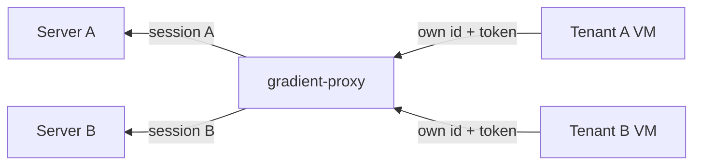

# Federation

The `gradient-proxy` service can join pools of workers to customers' Gradient servers. Customers (tenants) see the proxy as one worker. Both legs of the proxy use this protocol. The proxy is an authority to its own workers and a worker to every tenant's server.

`gradient-proxy` is a separate repository with its own NixOS module and `GRADIENT_PROXY_*` configuration. Full Gradient servers never connect to other servers.

## Upstream Leg

The proxy will open one normal worker session per tenant. These sessions follow `InitConnection`, `AuthChallenge`, `AuthResponse` and `InitAck` from the [connection page](connection.md) like any worker session. Customers register the proxy's worker ID and token on their server like any worker. The operator will store both as the tenant's upstream link.

- A session is open while the link is `enabled` and the tenant may run.
- An auth rejection (401 or 403) will mark the link `failing` with the reason.
- No new session can start until the link is set again.

| Aspect | Behavior |
|---|---|
| Capabilities | A fixed set, `GRADIENT_PROXY_UPSTREAM_CAPABILITIES` (default `fetch,eval,build`) |
| Hardware | `gradient_pool::aggregate()` over the downstream workers, sent as `WorkerCapabilities` and `WorkerMetrics` |
| Aggregation | Capabilities OR'd, architectures and features unioned, slots, CPUs and RAM summed, fastest core score |
| Aggregation scope | Per tenant: only that tenant's workers count |
| Peer tokens | Per tenant, sealed with AES-GCM under `GRADIENT_PROXY_ENCRYPTION_KEY_FILE`, never returned by the admin API |

## Downstream Leg

The proxy will authorize its own workers from its small Postgres database.

- Each authorized worker is a row: ID, name, tenant, argon2 token hash and allowed capabilities.
- The `AuthChallenge` will name only the worker's own ID.
- The negotiated capabilities are the worker's offer AND the allowed set, with `federate` always off.
- Revoking a row will close the worker's live session.
- Every worker can take jobs from every peer its tenant's server authorized.

## Job Forwarding

| Step | Proxy behavior |
|---|---|
| Tenants | One hub per tenant. A worker's row is naming its tenant, and frames never cross tenants |
| Offers | Mirroring the upstream offer book and handing candidates out to capable workers |
| Scores | Forwarding the best score per candidate, changes only, once per second |
| `RequestJob` | A worker's poll is becoming an upstream poll. The best capable waiting worker is getting the `AssignJob`. The proxy is declining without such a worker |
| Reports | Routed by `job_id`. Queries get a fresh `query_id`. The proxy is dropping reports for jobs the worker does not own |
| Uploads | Each `UploadRequest` is getting a fresh `request_id`. The proxy is mapping grants, chunks and commits back to the requesting worker |
| Cluster jobs | `StartCluster`, `ClusterSignal` and `AbortCluster` reach every worker holding a member of the attempt. The roster is naming the worker behind the proxy, with its zone and endpoint |
| Worker lost | Reporting `JobFailed` (transient) upstream on a disconnect or a 120 s heartbeat timeout |
| Upstream lost | Sending `AbortJob` to that tenant's workers and answering the tenant's open queries with errors. Closing the tenant's worker sessions after `Draining`. Other tenants stay untouched |

## Passthrough

- NAR pulls, cache queries and uploads go to the tenant's own Gradient server, under the remapped `job_id`, `query_id` or `request_id`.
- Nothing is stored on the proxy.
- The tenant's server is the cache.
- Transfers over upstream presigned URLs bypass the proxy.
- No cache on the proxy is exposed to its upstream servers.

## Hetzner Workers

The proxy can boot Hetzner Cloud VMs dedicated to one tenant. A reconcile pass every 60 s will compare each tenant's pending jobs with the tenant's VMs and the servers labelled `gradient-tenant`.

| Rule | Behavior |
|---|---|
| Scale up | `min(max VMs, ceil(pending / slots))` VMs per system with a configured server type |
| Boot | From the uploaded worker snapshot. The user data is holding the proxy URL, a worker ID and a one-time token, stored as an argon2 hash |
| Scale down | The proxy is deleting an idle VM within the last 5 minutes of its billing unit (default 60 minutes) |
| Boot deadline | The proxy is deleting a VM not connected within the boot deadline (default 5 minutes). The VM's usage row is ending as `failed_boot`, without a bill |
| Failing link or tenant may not run | The tenant is stopping upstream polls. The tenant's VMs drain, and the proxy is deleting the VMs after the drain grace (default 15 minutes) |
| Leak guard | The proxy is deleting a labelled server without a VM row. The proxy is closing a row with a missing server |
| Rate limit | Hetzner `429` and `5xx` back the tenant off from 1 s to 5 minutes. Billing is starting only after server creation |

Deleting a VM will revoke the VM's token. The `vm_usage` table will meter each VM's uptime, from creation to deletion.

## Access Control

| Level | Controlled by |
|---|---|
| Server -> proxy | Per project: the proxy's `worker_registration` rows, tokens and `enable_fetch` / `enable_eval` / `enable_build` |
| Proxy -> worker | Per worker: `authorized_peers` rows with tenant, token hash and allowed capabilities |

The handshake will negotiate the `federate` capability, `proto.federate` on the server and `capabilities.federate` on the worker. The flag has no effect in the code yet.
