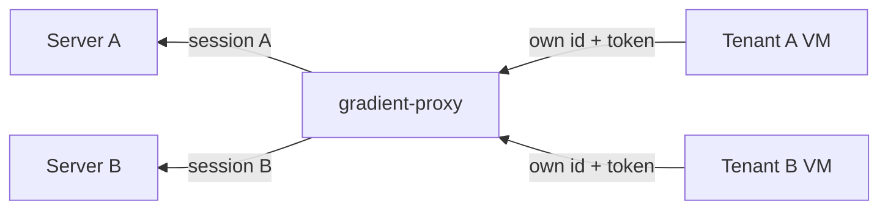

# Federation

`gradient-proxy` joins pools of workers to customers' Gradient servers. Each customer (tenant) sees the proxy as one worker. The proxy speaks this protocol on both legs: an authority to its own workers, a worker to every tenant's server.

`gradient-proxy` lives in its own repository with its own NixOS module and `GRADIENT_PROXY_*` configuration. A full Gradient server never connects to another server.

## Upstream Leg

The proxy opens one normal worker session per tenant: `InitConnection`, `AuthChallenge`, `AuthResponse`, `InitAck`, as on the [connection page](connection.md). The customer registers the proxy's worker ID and token on their server like any worker; the operator stores both as the tenant's upstream link.

- A session is open while the link is `enabled` and the tenant may run.
- An auth rejection (401 or 403) marks the link `failing` with the reason. No new session starts until the link is set again.

| Aspect | Behavior |
|---|---|
| Capabilities | A fixed set, `GRADIENT_PROXY_UPSTREAM_CAPABILITIES` (default `fetch,eval,build`) |
| Hardware | `gradient_pool::aggregate()` over the downstream workers, sent as `WorkerCapabilities` and `WorkerMetrics` |
| Aggregation | Capabilities OR'd, architectures and features unioned, slots, CPUs and RAM summed, fastest core score |
| Aggregation scope | Per tenant: only that tenant's workers count |
| Peer tokens | Per tenant, sealed with AES-GCM under `GRADIENT_PROXY_ENCRYPTION_KEY_FILE`, never returned by the admin API |

## Downstream Leg

The proxy authorizes its own workers from its small Postgres database.

- Each authorized worker is a row: ID, name, tenant, argon2 token hash and allowed capabilities.
- `AuthChallenge` names only the worker's own ID; the negotiated capabilities are the worker's offer AND the allowed set, `federate` always off.
- Revoking a row closes the worker's live session.
- Every worker serves every peer its tenant's server authorized.

## Job Forwarding

| Step | Proxy behavior |
|---|---|
| Tenants | One hub per tenant; a worker's row names its tenant, and frames never cross tenants |
| Offers | Mirrors the upstream offer book and fans candidates out to capable workers |
| Scores | Forwards the best score per candidate, changes only, once per second |
| `RequestJob` | A worker's poll becomes an upstream poll; the best capable waiting worker gets the `AssignJob`, otherwise the proxy declines |
| Reports | Routed by `job_id`; queries get a fresh `query_id`; reports for jobs a worker does not own are dropped |
| Uploads | Each `UploadRequest` gets a fresh `request_id`; grants, chunks and commits are mapped back to the requesting worker |
| Cluster jobs | `StartCluster`, `ClusterSignal` and `AbortCluster` reach every worker holding a member of the attempt; the roster names the worker behind the proxy, with its zone and endpoint |
| Worker lost | Disconnect or 120 s heartbeat timeout reports `JobFailed` (transient) upstream |
| Upstream lost | Sends `AbortJob` to that tenant's workers, answers its open queries with errors, closes its worker sessions after `Draining`; other tenants are untouched |

## Passthrough

- Every NAR pull, cache query and upload goes to the tenant's own Gradient server, under the remapped `job_id`, `query_id` or `request_id`.
- Nothing is stored on the proxy; the tenant's server is the cache.
- Transfers over upstream presigned URLs bypass the proxy.
- The proxy exposes no cache to its upstream servers.

## Hetzner Workers

The proxy boots Hetzner Cloud VMs dedicated to one tenant. A reconcile pass every 60 s compares each tenant's pending jobs with its VMs and the servers labelled `gradient-tenant`.

| Rule | Behavior |
|---|---|
| Scale up | `min(max VMs, ceil(pending / slots))` VMs per system that has a configured server type |
| Boot | From the uploaded worker snapshot; the user data holds the proxy URL, a worker ID and a one-time token stored as an argon2 hash |
| Scale down | An idle VM is deleted within the last 5 minutes of its billing unit (default 60 minutes) |
| Boot deadline | A VM not connected within the boot deadline (default 5 minutes) is deleted; its usage row is marked `failed_boot` and not billed |
| Failing link or tenant may not run | The tenant stops polling upstream; its VMs drain and are deleted after the drain grace (default 15 minutes) |
| Leak guard | A labelled server without a VM row is deleted; a row whose server is gone is closed |
| Rate limit | Hetzner `429` and `5xx` back the tenant off from 1 s to 5 minutes; nothing is billed before the server exists |

Deleting a VM revokes its token. Each VM's uptime is metered in `vm_usage`, from creation to deletion.

## Access Control

| Level | Controlled by |
|---|---|
| Server -> proxy | Per project: the proxy's `worker_registration` rows, tokens and `enable_fetch` / `enable_eval` / `enable_build` |
| Proxy -> worker | Per worker: `authorized_peers` rows with tenant, token hash and allowed capabilities |

The `federate` capability, `proto.federate` on the server and `capabilities.federate` on the worker, is negotiated in the handshake, but no code acts on the flag yet.
