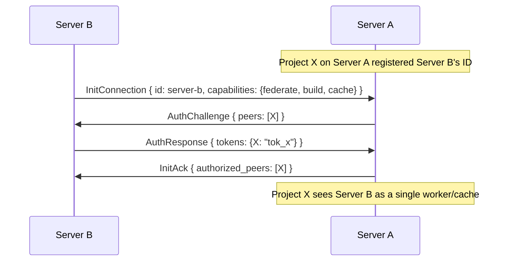
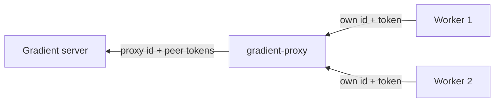
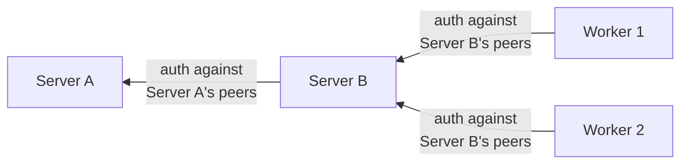

# Federation

Gradient servers and `gradient-proxy` acting as workers of another server: aggregation, cache federation and access control.

Federation connects Gradient instances or workers to each other. A server with `federate` enabled can connect to other servers using the same proto protocol - it authenticates using the standard challenge-response, and the remote peer (project, cache, or proxy) sees it as a single worker/cache.

Federation can happen in two ways:

 - **`gradient-proxy`** - a gateway that only federates: no projects, no UI, a small Postgres database of its own. Its workers authenticate to it, it authenticates to one upstream server as a single worker, and every worker behind it serves every peer the upstream authorized.
 - **A full Gradient server** - a server with its own projects, tasks, and workers. Its projects and caches are peers that individually control which external workers/servers get tokens, deciding what to expose.

## How it works

A federation peer connects to a remote server as a regular worker. A peer on the remote server (project, cache, or proxy) registers the federation peer's ID and issues a token - exactly like registering any worker:

From Project X's perspective, Server B is just one worker that happens to have a lot of capacity. Server B internally routes jobs to its own workers and serves its own caches - Project X doesn't see or control that.

## `gradient-proxy`

The proxy is one worker to its upstream and an authority to its own workers. Both legs speak this protocol unchanged.

- **Authentication:**
  - Each worker is a row in the proxy's `authorized_peers` table. The row holds the worker id, an argon2 token hash, and the allowed capabilities.
  - `AuthChallenge` names only the worker's own id.
  - Negotiated capabilities are the worker's offer ANDed with the allowed set.
  - Revoking a row closes the live session.
- **Upstream identity:**
  - The server registers the proxy like any worker, with one `worker_id` and a token per peer.
  - The proxy advertises a fixed capability set at the handshake.
  - It then sends the aggregate of its workers as `WorkerCapabilities` and `WorkerMetrics` (see Aggregation).
- **Offers and scores:**
  - The proxy mirrors the upstream candidate set.
  - It fans candidates out only to workers that can run them. It learns architectures and features from the `EvalResult`s passing through.
  - It relays each candidate's best score across workers upstream, sending only changed scores, once per second.
- **Claims:**
  - A worker's `RequestJob` is forwarded upstream as a poll.
  - The proxy hands `AssignJob` to the waiting, capable worker with the best score for that job, keeping the `dispatch` unchanged.
  - If no worker qualifies, the proxy answers `AssignJobResponse { accepted: false }` itself.
- **Routing:**
  - Job reports, NAR frames and eval-cache frames are routed by `job_id`.
  - Cache and known-derivation queries get a fresh upstream `query_id` and are mapped back.
  - A report for a job the sending worker does not own is dropped.
- **Failure handling:**
  - A worker that disconnects, or stays silent past the proxy's heartbeat deadline, has its jobs reported upstream as `JobFailed { kind: Transient }`.
  - Losing the upstream sends `AbortJob` for every routed job and `RevokeJob` for the whole offer book.
  - A forwarded `Draining` closes every worker session once the upstream goes away, so workers come back undrained.
- **NAR cache in the middle:**
  - Pull hits are answered locally, presigned from the proxy's own S3 above the small-NAR threshold and relayed below it.
  - Misses go upstream. Relayed bytes, in either direction, are teed into a partial file. They are committed to the proxy's store only when size and file hash match the metadata.
  - Transfers that use upstream presigned URLs bypass the proxy and are not cached.

The proxy has a single upstream; several upstreams per proxy are future work. Configuration (`GRADIENT_PROXY_*`) and the NixOS module live in the proxy repository.

## Full Gradient server as federation peer

A full server's projects and caches are independent peers. Each decides whether to register an external worker/server and issue a token:

Workers authenticate against Server B's peers (its projects and caches). Server B authenticates upstream against Server A's peers. Each peer on each server independently controls access.

## Aggregation

Both federation forms aggregate downstream when advertising capabilities upstream:
- `GradientCapabilities`: OR of all downstream workers
- `system_features`: union of all downstream workers' features
- `max_concurrent_builds`: sum of all downstream slots

The upstream server sees one peer. Internal routing is the federation peer's problem.

## Cache federation

Caches behind a federation peer are exposed upstream. When a remote peer's build needs a NAR, the upstream server can request it from the federation peer, which serves it from its cache or downstream workers.

## Access control summary

| | `gradient-proxy` | Full Gradient server |
|---|---|---|
| Workers -> peer | Per-worker id and token in the proxy's `authorized_peers` | Challenge-response against server's peers |
| Peer -> upstream | Challenge-response against upstream's peers | Challenge-response against upstream's peers |
| What's exposed | Everything - all workers, all caches | Per-peer (project/cache) settings |
| Upstream sees peer as | One worker/cache | One worker/cache |
