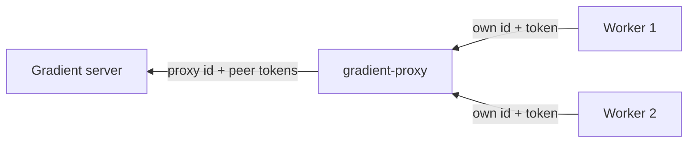

# Federation

`gradient-proxy` joins a pool of workers to a Gradient server as one worker. The proxy speaks this protocol on both legs: an authority to its own workers, a worker to its upstream server.

`gradient-proxy` lives in its own repository with its own NixOS module and `GRADIENT_PROXY_*` configuration. A full Gradient server never connects to another server.

## Upstream Leg

The proxy is a normal worker session: `InitConnection`, `AuthChallenge`, `AuthResponse`, `InitAck`, as on the [connection page](connection.md). The upstream projects register the proxy's ID like any worker.

| Aspect | Behavior |
|---|---|
| Capabilities | A fixed set, `GRADIENT_PROXY_UPSTREAM_CAPABILITIES` (default `fetch,eval,build`) |
| Hardware | `gradient-pool::aggregate()` over the downstream workers, sent as `WorkerCapabilities` and `WorkerMetrics` |
| Aggregation | Capabilities OR'd, architectures and features unioned, slots, CPUs and RAM summed, fastest core score |
| Peer tokens | `GRADIENT_PROXY_UPSTREAM_PEERS_FILE` |

## Downstream Leg

The proxy authorizes its own workers from its small Postgres database.

- Each authorized worker is a row: ID, name, argon2 token hash and allowed capabilities.
- `AuthChallenge` names only the worker's own ID; the negotiated capabilities are the worker's offer AND the allowed set, `federate` always off.
- Revoking a row closes the worker's live session.
- Every worker behind the proxy serves every peer the upstream authorized.

## Job Relay

| Step | Proxy behavior |
|---|---|
| Offers | Mirrors the upstream offer book and fans candidates out to capable workers |
| Scores | Relays the best score per candidate, changes only, once per second |
| `RequestJob` | A worker's poll becomes an upstream poll; the best capable waiting worker gets the `AssignJob`, otherwise the proxy declines |
| Reports | Routed by `job_id`; queries get a fresh `query_id`; reports for jobs a worker does not own are dropped |
| Worker lost | Disconnect or 120 s heartbeat timeout reports `JobFailed` (transient) upstream |
| Upstream lost | Sends `AbortJob` to workers, answers open queries with errors, closes worker sessions with `Draining` |

## NAR Cache

- Worker pulls are served from the proxy's store first: local (`/var/lib/gradient-proxy/nars`) or S3.
- With S3, NARs above the small-NAR threshold (1 MiB) go out as presigned URLs; smaller ones are relayed.
- Relayed bytes from upstream are written to a partial file and committed only when size and hash match.
- Transfers over upstream presigned URLs bypass the proxy and are not cached.
- The proxy exposes no cache to its upstream.

## Access Control

| Level | Controlled by |
|---|---|
| Server -> proxy | Per project: the proxy's `worker_registration` rows, tokens and `enable_fetch` / `enable_eval` / `enable_build` |
| Proxy -> worker | Per worker: `authorized_peers` rows with token hash and allowed capabilities |

The `federate` capability, `proto.federate` on the server and `capabilities.federate` on the worker, is negotiated in the handshake, but no code acts on the flag yet.
