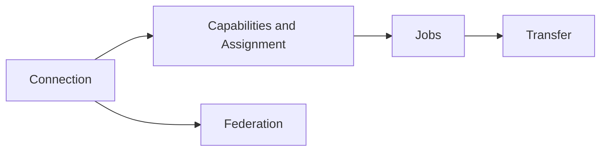

# Proto

The protocol between server and workers: one WebSocket at `/proto` with binary frames from the `Proto` derive. Sessions pass through version agreement, handshake, authorization, capabilities, then the job loop.

-   :material-handshake: **[Connection](connection.md)**

    Handshake, authorization, server restarts, graceful shutdown and cache sessions.

-   :material-clipboard-list: **[Capabilities and Assignment](capabilities-and-dispatch.md)**

    Worker capabilities, job offers and pull-based assignment.

-   :material-hammer-wrench: **[Jobs](jobs.md)**

    Flake and build jobs, progress reports, failure kinds and aborts.

-   :material-swap-horizontal: **[Transfer](transfer.md)**

    NAR uploads and downloads, logs, download progress and credentials.

-   :material-email-outline: **[Messages](messages.md)**

    Every message on `/proto` with its fields and lane.

-   :material-server-network: **[Federation](federation.md)**

    `gradient-proxy`: a pool of workers joined to a server as one worker.

## Related

- [Scheduler](../scheduler/index.md): the logic choosing a worker's next job
- [Add a Remote Worker](../../guides/remote-worker.md): the setup side
