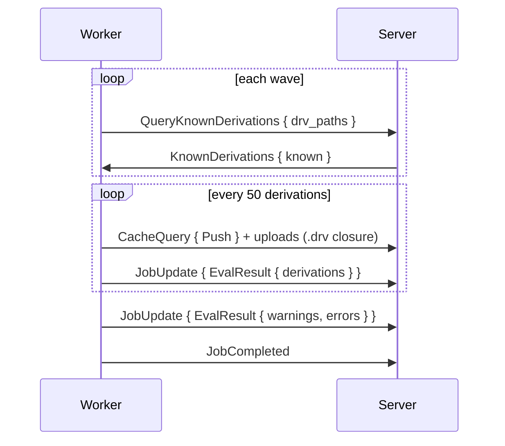

# Jobs

The two job kinds, how their progress is reported, and what happens when a job fails, is aborted or loses its worker. Every job arrives as `AssignJob { job_id, dispatch, job }`; every report echoes `dispatch`.

## Flake Jobs

A flake job fetches and evaluates a flake. The server fixes the steps when the job is queued:

| Situation | Steps |
|---|---|
| An idle evaluation-only worker exists | `[FetchFlake]`, then a follow-up job `[EvaluateFlake, EvaluateDerivations]` on the fetched source |
| Otherwise | All three steps in one job |

| Field | Meaning |
|---|---|
| `steps` | `FetchFlake`, `EvaluateFlake`, `EvaluateDerivations` |
| `source` | `Repository { url, commit }`, or `Cached { store_path }` for a fetched source or a `gradient build` upload |
| `wildcards` | Attribute patterns to evaluate |
| `timeout_secs` | Optional limit |
| `input_overrides` | Flake input overrides of the task |
| `input_update` | Set for a [flake update](../../guides/flake-updates.md) run |

**Fetch:**

1. Clone the repository, apply overrides (unknown inputs are dropped with a warning).
2. `nix flake prefetch` of the source alone when every locked input's `<narHash>-source` path is already in the store; otherwise `nix flake archive`, falling back to `nix flake prefetch` per input. A failed source is fatal.
3. Upload every fetched path with a `Push` cache query, then report `FetchResult { flake_source }`.

**Evaluate:** the worker walks the derivations breadth-first in waves of up to 64.

- `known` lists the derivations already walked completely; the worker skips their subtrees. A **Full rewalk** gets an empty list.
- Each batch uploads the `.drv` closure before its `EvalResult`: builds start while the walk goes on.
- The walk never waits on an upload; batches queued behind one upload go out as one closure, each still reported after it.
- A batch queries and uploads only the part of its closure no earlier batch of the same evaluation covered.
- The server ingests each batch and promotes ready builds to `Queued` right away.
- The evaluation turns `Building` on `JobCompleted`; evaluation errors become error messages that fail the evaluation at the end.

## Build Jobs

A build job carries exactly one `BuildSpec`: one shared build (anchor).

| `kind` | When | Runs |
|---|---|---|
| `Build` | Default | Prefetch inputs, then the Nix daemon builds the derivation |
| `Substitute` | The outputs exist in an upstream cache | Fetches the outputs without a Nix store |
| `Download` | A `builtin:fetchurl` fixed-output derivation | Downloads the file without a Nix store |

`Substitute` and `Download` jobs run on any worker (system `builtin`). The spec also carries `drv_path`, `outputs`, `is_fixed_output`, `timeout_secs` and `max_silent_secs`.

1. Report `Building`, before anything that can fail.
2. Skip everything when all outputs are already in the local store.
3. **Prefetch:** read the `.drv`, drop inputs the store holds, pull the rest over [transfer](transfer.md).
4. Build through the daemon, streaming the log as `LogChunk`.
5. Report `BuildOutput` with outputs, `hydra-build-products` and metrics.
6. Upload the outputs, then `JobCompleted`.

## Reports

| `JobUpdate` kind | Effect on the server |
|---|---|
| `Fetching`, `EvaluatingFlake`, `EvaluatingDerivations` | Evaluation status |
| `FetchResult { flake_source }` | Stores the fetched source |
| `EvalResult` | Ingests a batch of derivations |
| `EvalStats` | Evaluation metrics |
| `InputUpdateResult`, `InputUpdateExpansion` | Flake update candidate lock and bumped inputs |
| `Building { build_id }` | Build turns `Building`; an already aborted build gets `AbortJob` instead |
| `BuildOutput` | Output sizes, build products, metrics, the `substituted` flag |
| `Compressing` | No change |

`JobCompleted` and `JobFailed` carry the phase timeline shown on the [Job Board](../../ui/job-board.md#job-inspection). Reports from a stale `dispatch` are dropped.

## Failures

| `BuildFailureKind` | Result |
|---|---|
| `Transient` | Retried up to `build.maxAttempts` (3), backoff `build.retryBackoffSecs` (30 s) doubling |
| `Permanent` | Failed; dependents turn `DependencyFailed` |
| `Timeout` | Timed out; dependents turn `DependencyFailed` |
| `SubstituteUnavailable` | Re-queued; built normally after `build.substituteMissEscalationThreshold` (2) misses |
| `InputsUnavailable` | Self-heal, see below |
| `CorruptEvalCache` | The evaluation cache blob is purged, the evaluation re-queued |
| `Aborted` | Aborted by the server; no cascade |

- **InputsUnavailable:** an input the cache listed is gone (uncached, `404`/`410` on the URL, or `NarUnavailable`). The server deletes the stale cache row and object, resets the producing build, and retries; after `build.inputsUnavailableMaxLoops` (3) loops the build fails permanently.
- **DependencyFailed** spreads upward over the dependency graph from `Permanent` and `Timeout` failures, across evaluations.
- **Eval job outage:** an eval job that failed `Transient` (the server connection dropped, an object PUT or a `CacheQuery` stopped answering) re-queues its evaluation, up to `build.maxAttempts` (3) runs.
- An evaluation ends `Completed`, or `Failed` when any build failed, was aborted or dependency-failed, or an error message exists.

## Abort and Lost Workers

- **Abort** (API or a newer evaluation): the evaluation turns `Aborted`, `AbortJob` goes to its jobs, pending jobs are removed. The worker stops the daemon build at once and answers `JobFailed { Aborted }`. Aborts unconfirmed after 5 min are reaped.
- **Lost worker:** open dispatches close as abandoned, building builds return to `Queued`, a running evaluation goes to `Waiting` and is re-queued; the evaluation fails after 10 lost dispatches.
