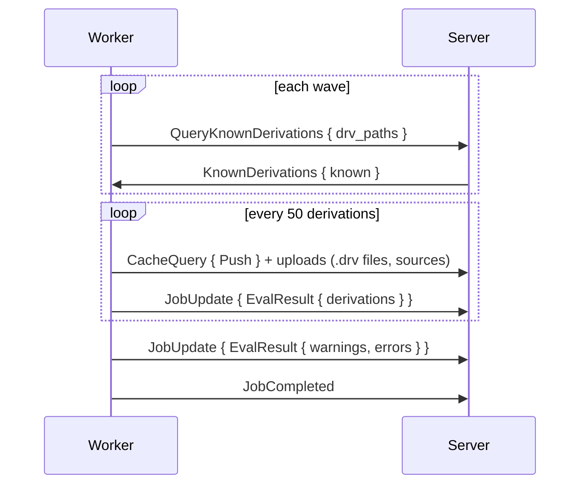

# Jobs

The two job kinds, their progress reports, and the handling of jobs that fail, abort or lose their worker. Jobs arrive as `AssignJob { job_id, assignment_id, job, cluster }` messages. Every report must echo the `assignment_id` field. The server will set `cluster` only for a [cluster member](../scheduler/clusters.md).

## Flake Jobs

Flake jobs fetch and evaluate a flake. The server will fix the steps at queue time.

| Situation | Steps |
|---|---|
| An idle evaluation-only worker is available | `[FetchFlake]`, then a follow-up job `[EvaluateFlake, EvaluateDerivations]` on the fetched source |
| Otherwise | All three steps in one job |

| Field | Meaning |
|---|---|
| `steps` | `FetchFlake`, `EvaluateFlake`, `EvaluateDerivations` |
| `source` | `Repository { url, commit }`, or `Cached { store_path }` for a fetched source or a `gradient build` upload |
| `wildcards` | Attribute patterns to evaluate |
| `timeout_secs` | Optional limit |
| `input_overrides` | Flake input overrides of the task |
| `input_update` | Set for a [flake update](../../guides/flake-updates.md) |

**Fetch:**

1. Clone the repository, apply overrides (dropping unknown inputs with a warning).
2. Serialise the tree at the pinned commit as a NAR, without a nix process. Add the NAR to the store as `<narHash>-source`, the same path `nix flake prefetch` would produce for the tree.
3. Fetch every locked input missing from the store with `builtins.fetchTree` in an eval worker. Workers fetch one input at a time per domain (such as `github.com`) and different domains in parallel. A failed input is skipped with a warning.
4. Upload the source and every input path with a `Push` cache query, then report `FetchResult { flake_source }`.

**Evaluate:** Workers walk the derivations breadth-first in waves of up to 256.

- Derivations in `known` were already walked completely, and the worker will skip their subtrees.
- A **Full rewalk** will get an empty list.
- Each batch will upload its `.drv` files and their input sources before its `EvalResult` message. Builds can start while the walk is still going on.
- An input's `.drv` will go with the batch walking that input.
- The walk will continue during a batch upload, up to 64 batches ahead.
- The uploads of consecutive batches overlap. Each `EvalResult` will follow its own batch's uploads, in walk order.
- The worker will neither query nor upload a path again once an earlier batch of the same evaluation pushed that path.
- The server will record each batch and move every build that can start to `Queued` right away.
- The evaluation will turn `Building` on the `JobCompleted` message.
- Evaluation errors become error messages, failing the evaluation at the end.

## Build Jobs

Build jobs carry exactly one `BuildSpec`, meaning one shared build (`derivation_build`).

| `kind` | When | Action |
|---|---|---|
| `Build` | Default | Prefetching inputs, then building the derivation with the Nix daemon |
| `Substitute` | The outputs exist in an upstream cache | Fetching the outputs without a Nix store |
| `Download` | A `builtin:fetchurl` fixed-output derivation | Downloading the file without a Nix store |

`Substitute` and `Download` jobs can start on any worker (system `builtin`). Build jobs also get `drv_path`, `outputs`, `is_fixed_output`, `timeout_secs` and `max_silent_secs` from the spec.

1. Report `Building`, before anything that can fail.
2. Skip everything when all outputs are already in the local store.
3. **Prefetch:** read the `.drv`, drop inputs already in the store, pull the rest over the [transfer](transfer.md) protocol.
4. Build through the daemon, streaming the log as `LogChunk` messages.
5. Report `BuildOutput` with outputs, `hydra-build-products` and metrics.
6. Upload the outputs, then `JobCompleted`.

## Reports

| `JobUpdate` kind | Effect on the server |
|---|---|
| `Fetching`, `EvaluatingFlake`, `EvaluatingDerivations` | Evaluation status |
| `FetchResult { flake_source }` | Storing the fetched source |
| `EvalResult` | Recording a batch of derivations |
| `EvalStats` | Evaluation metrics |
| `InputUpdateResult`, `InputUpdateExpansion` | Flake update candidate lock and bumped inputs |
| `Building { build_id }` | Build turning `Building`. An already aborted build is getting `AbortJob` instead |
| `BuildOutput` | Output sizes, build products, metrics, the `substituted` flag |
| `Stage(Prefetch / Build / Upload)` | Live stage of the job in the worker pool, for the [estimated time](../../reference/scheduler-policies.md#estimated-time). Sent to servers on protocol 28 and later |
| `Compressing` | No change. Workers no longer send it |

An `EvalProgress` message will carry one download row per flake input while fetching and the live thunk count while evaluating. The eval worker will download the inputs itself, with one download in flight per second-level domain.

`JobCompleted` and `JobFailed` carry the phase timeline shown on the [Job Board](../../ui/job-board.md#job-inspection). A server before protocol 28 will receive `NarPush` in place of the `UploadWait` phase. Build metrics also hold the number of concurrent builds on the worker, the cores of the build and the worker's CPU score. The server will drop reports from a stale `assignment_id`.

## Failures

| `BuildFailureKind` | Result |
|---|---|
| `Transient` | Retried up to `build.maxAttempts` (3), backoff `build.retryBackoffSecs` (30 s) doubling |
| `Permanent` | Failed. Builds needing the failed build turn `DependencyFailed` |
| `Timeout` | Timed out. Builds needing the timed-out build turn `DependencyFailed` |
| `SubstituteUnavailable` | Re-queued. Built normally after `build.substituteMissEscalationThreshold` (2) misses |
| `InputsUnavailable` | Self-heal, see below |
| `CorruptEvalCache` | Purging the evaluation cache blob and re-queuing the evaluation |
| `Aborted` | Aborted by the server. No cascade |

- **InputsUnavailable:** An input listed by the cache was not found (uncached, `404`/`410` on the URL, or `NarUnavailable`). The server will delete the stale cache row and object. The server will also reset the producing build and retry. The build will fail permanently after `build.inputsUnavailableMaxLoops` (3) loops.
- **DependencyFailed** can spread upward over the dependency graph from `Permanent` and `Timeout` failures, across evaluations.
- **Eval Job Outage:** An eval job failing `Transient` will re-queue its evaluation, up to `build.maxAttempts` (3) attempts. Typical causes are a dropped server connection or an object PUT or `CacheQuery` without an answer.
- An evaluation will end `Completed`, or `Failed` when any build failed, was aborted or dependency-failed, or an error message is present.

## Cluster Members

A [cluster member](../scheduler/clusters.md) will arrive as `AssignJob` with `cluster = { attempt, role, index, hold_secs }`.

| Event | Worker |
|---|---|
| `AssignJob` with `cluster` | Holding the slot without running the job, then accepting. Rejecting a second member of the same attempt |
| `StartCluster { attempt, roster }` | Running the held member. The member's signal route is opening with the roster |
| `ClusterSignal` from the server | Delivered to the running member of that attempt. Dropped once the member finished |
| `ClusterSignal` to the server | Sent by the member. `to = None` is reaching every other member |
| `AbortCluster { attempt }` | Dropping a held member unreported and aborting a running one (`JobFailed { Aborted }`) |
| No `StartCluster` within `hold_secs` | Releasing the slot and reporting `JobFailed { Aborted }` with `cluster start timed out` |
| Local drain | Releasing every held member the same way, with `worker draining` |

- A held member will count against `eval.maxConcurrent` / `build.maxConcurrent` like a running job.
- The server will set `hold_secs` to its prepare timeout plus a 10 s margin.

## Abort and Lost Workers

- **Abort** (API or a newer evaluation): The evaluation will turn `Aborted`, and `AbortJob` will go to its jobs. The server will remove pending jobs. The worker will stop the daemon build at once and answer `JobFailed { Aborted }`. The server will reap aborts unconfirmed after 5 min.
- **Lost Worker:** Open assignments close as abandoned. Any build in `Building` will return to `Queued`. A running evaluation will go to `Waiting` and back into the queue. The evaluation will fail after 10 lost assignments.
