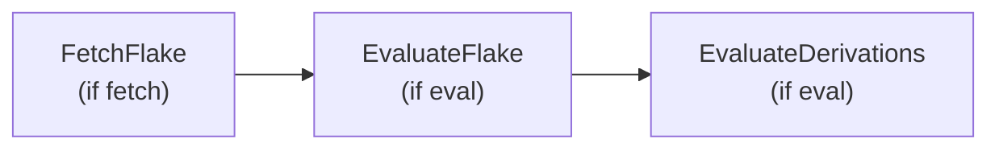
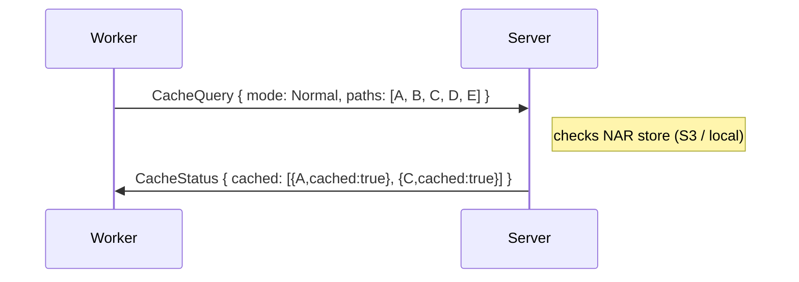
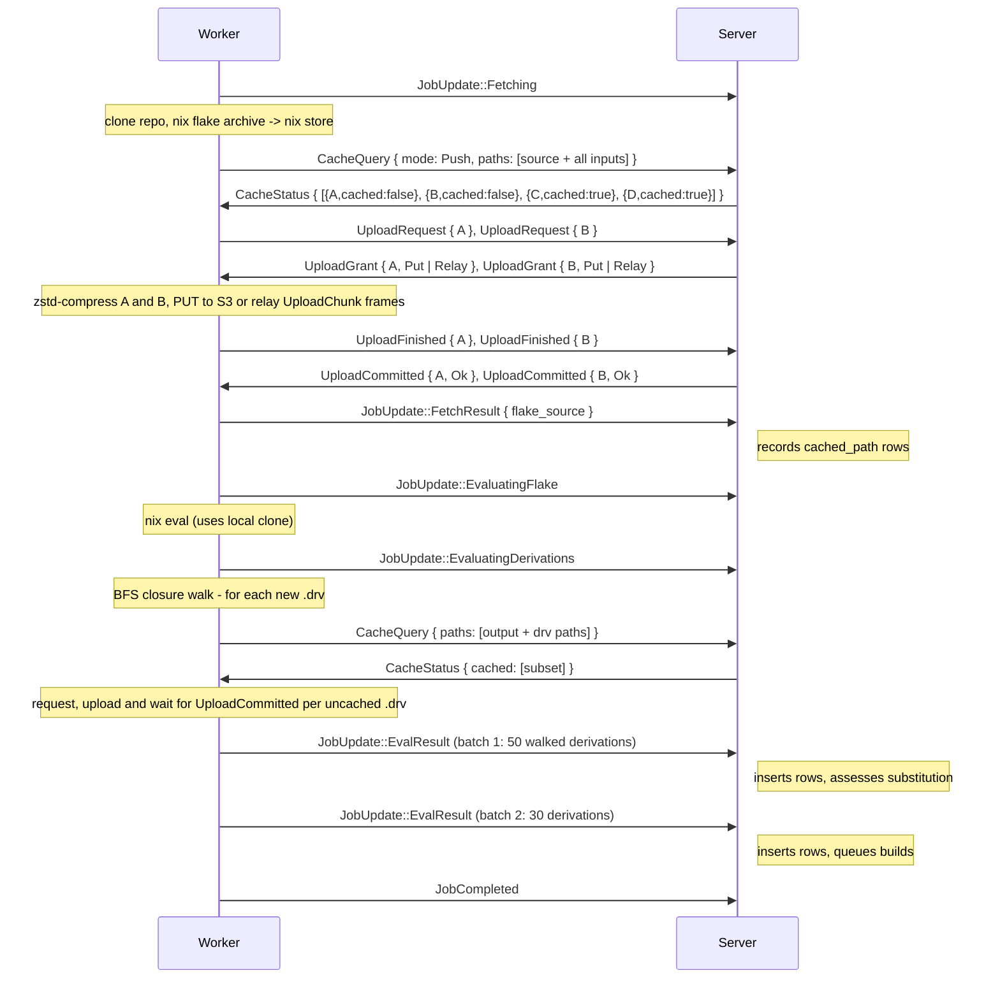
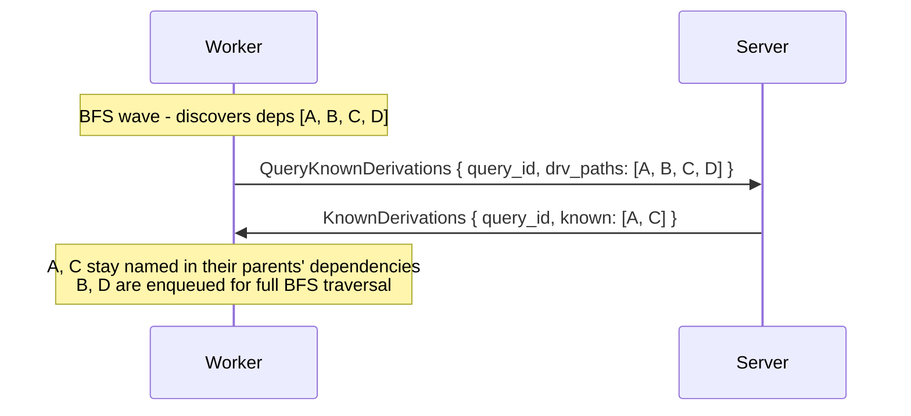
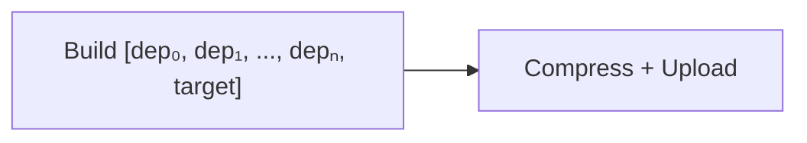
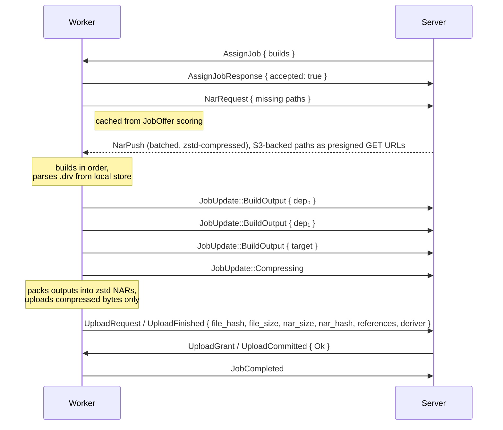

# Jobs

The job model (flake and build jobs), progress updates, build artefacts, and the failure paths: missing inputs, dependency failures and aborts.

## Job Model

Each job is a sequence of **steps** executed in order. If any step fails, the remaining steps are skipped and the job is reported as failed.

### FlakeJob

Requires negotiated capability: `fetch` and/or `eval`. The server includes only the steps the worker's capabilities allow. A fetch-only worker gets just `FetchFlake`; an eval-only worker gets `EvaluateFlake` + `EvaluateDerivations` (server or other worker must have already fetched); a worker with both gets the full chain.



| Step | Requires | Input (from server) | Output (from worker) |
|------|----------|---------------------|----------------------|
| **FetchFlake** | `fetch` + `source: Repository` | `source.url` + `source.commit`, SSH credential | For each fetched path (source + flake inputs): zstd-compressed NAR uploaded through the [upload admission](#upload-admission) handshake, whose `UploadFinished` carries the full metadata (`file_hash`, `file_size`, `nar_size`, `nar_hash`, `references`). Closing `FetchResult { flake_source: Option<String> }` reports the archived flake source store path - the server passes it to a subsequent eval-only job as `FlakeSource::Cached { store_path }`. |
| **EvaluateFlake** | `eval` | `wildcards` (attribute patterns), `timeout` (seconds) | `attrs: Vec<String>` - discovered attribute paths |
| **EvaluateDerivations** | `eval` | (uses attrs from previous step) | `derivations: Vec<DiscoveredDerivation>` - the walked derivations' paths, outputs, dependency names, required features; each produced `.drv` is also uploaded (compressed) and acknowledged before the batch is reported |

```rust
FlakeJob {
    steps: Vec<FlakeStep>,               // [FetchFlake, EvaluateFlake, EvaluateDerivations] - subset per worker capability
    source: FlakeSource,                 // where to get the flake source (see below)
    wildcards: Vec<String>,              // attribute patterns for EvaluateFlake (e.g. ["packages.*.*"])
}

enum FlakeSource {
    /// Clone the repo at `commit` via git. Valid only when `FetchFlake` is
    /// in `steps` and the worker has the `fetch` capability; otherwise the
    /// server rejects the job.
    Repository { url: String, commit: String },
    /// Use a store path that's already in the cache as the flake source.
    /// Valid when `FetchFlake` is NOT in `steps` - an eval-only worker
    /// can't clone a repo (no SSH key is delivered without the `fetch`
    /// capability) but can still evaluate an already-archived source.
    Cached { store_path: String },
}
```

When `FetchFlake` and `EvaluateFlake`/`EvaluateDerivations` are in the **same `FlakeJob`**, the worker reuses the local clone from the fetch step for evaluation. The repository is cloned exactly once; subsequent eval steps reference the source as `path:/nix/store/xxx` - a pure, content-addressed reference. On fallback (temp checkout), `git+file://...?rev=` is used to keep Nix in pure evaluation mode.

When the steps are in **separate jobs** - typical for a mix of fetch-only and eval-only workers - the scheduler dispatches FetchFlake as its own job to a `fetch`-capable worker (source = `Repository`), and later dispatches the Evaluate steps as another job with source = `Cached { store_path }` pointing at the NAR the fetch worker archived into the cache. The eval worker never touches a remote URL and never needs an SSH key.

#### FetchFlake

Fetch runs on a worker that has the `fetch` capability. The fetch step performs up to four things:

 1. **Clone** the repository at the specified commit using libgit2 (handles SSH keys, `git://`, `https://`).
 2. **Archive** the flake source and all locked transitive inputs into the local Nix store by running `nix flake archive --json`. This goes through the nix daemon (subprocess) so network fetching and store-write access work correctly. Returns the nix store source path (e.g. `/nix/store/xxx-source`) and all input store paths.
 3. **Compress and push every uncached NAR** - the worker sends `CacheQuery { mode: Push }` for every fetched path. For each uncached path it requests an upload, **zstd-compresses the NAR locally** once granted, uploads it via presigned S3 PUT (S3-backed) or relayed `UploadChunk` frames (local stores) and reports the full metadata (`file_hash`, `file_size`, `nar_size`, `nar_hash`, `references`, `deriver`) in `UploadFinished`. A failed upload fails the evaluation. **NARs are never transmitted uncompressed.**
 4. **Report `FetchResult`** carrying only the archived flake source store path (not the full input list - the server already has every `cached_path` row from the acknowledged uploads). The server hands this path to any subsequent eval-only job via `FlakeSource::Cached { store_path }`.

`nix flake archive` is all-or-nothing: one unfetchable input (e.g. a private `git+ssh` input the project has no key for) fails the whole command even though the eval targets never reference it. Since Nix evaluation is lazy, the archive is only cache population, so on that failure the worker falls back to **best-effort per-input prefetch**: it runs `nix flake prefetch --json` for the flake source (a hard error if even that fails) and then for each locked input from `flake.lock` independently, pushing the successes and turning per-input failures into `Warning` `EvalMessage`s (plus one leading warning naming the archive error). `flake_source` still carries the cached source path, so an eval-only follow-up can proceed against exactly the inputs its targets need.

```rust
FetchResult {
    /// Nix store path of the archived flake source (e.g.
    /// `/nix/store/xxx-source`). `Some` when the source landed in the
    /// cache - either `nix flake archive` succeeded or the per-input
    /// prefetch fallback fetched at least the source; only `None` when
    /// the fetch failed outright (no `FlakeSource::Cached` follow-up).
    flake_source: Option<String>,
}
```

##### Flake input overrides

`FlakeJob.input_overrides` is a per-input list applied during `FetchFlake`. Each entry carries `input_name` plus an `url` that is either `Some(<flake-ref>)` (replace URL) or `None` (force-update keeping the task's flake-declared URL - the worker reconstructs the original ref from `nodes.<input>.original` in `flake.lock`).

The worker assembles the archive command as:

```text
nix flake archive [--override-input <name> <ref>]... --json <flake-ref>
```

Empty `input_overrides` ⇒ argv matches the pre-change baseline byte-for-byte.

Before the archive runs, the worker reads `flake.lock`, builds the set of names declared in `nodes.root.inputs`, and drops any override whose `input_name` is not declared. Each dropped override emits one `EvalMessage` with `level = Warning`, `source = "fetch"`, and message `"flake input '<name>' does not exist in this task's flake - override skipped"`. The archive proceeds with the surviving overrides.

```rust
pub struct FlakeInputOverride {
    pub input_name: String,
    pub url: Option<String>,   // None = keep_url (force-update from flake's declared URL)
}
```

#### EvaluateDerivations - drv caching

Every `.drv` file discovered during `EvaluateDerivations` is a cacheable store path that substituters ask for by `<drv-hash>.narinfo`. The eval worker therefore:

 1. Runs `CacheQuery { mode: Push, paths: <new drv paths in wave> }` alongside each `EvalResult` batch.
 2. For uncached drvs, reads the `.drv` file from the local store, packs it into a NAR, **zstd-compresses it**, and uploads it through the upload handshake (presigned S3 PUT or relayed `UploadChunk` frames). A failed upload fails the evaluation.

The server records the drv's `cached_path` row when it commits the upload's `UploadFinished`. The server never re-packs or re-hashes - it trusts the NAR metadata the worker reports.


```rust
DiscoveredDerivation {
    attr: String,                       // e.g. "packages.x86_64-linux.hello"
    drv_path: String,                   // /nix/store/xxx.drv
    outputs: Vec<DerivationOutput>,     // [{name: "out", path: "/nix/store/..."}]
    dependencies: Vec<String>,          // drv paths this depends on
    architecture: String,               // Nix system string, e.g. "x86_64-linux", "builtin"
    required_features: Vec<String>,     // Nix system features needed to build (e.g. "kvm")
}
```

Only derivations the worker actually walked are reported; a dependency the server already knows stays named in its parent's `dependencies` and is never sent as a record of its own. Whether a derivation needs building is the server's call: it marks an anchor `Substituted` (7) when its own cache already holds every output whole.

The `architecture` field is a free-form Nix system string (e.g. `"x86_64-linux"`, `"aarch64-linux"`, `"builtin"`). `"builtin"` means the derivation uses `builtin:fetchurl` or similar - it can run on any worker regardless of architecture.

#### Cache Query

`CacheQuery` is used throughout the job lifecycle to check cache state and obtain transfer URLs. The `mode` field controls what the server returns:

| Mode | Use case | Server returns |
|------|----------|----------------|
| `Normal` | Is this path already in the cache? | Only cached paths (`cached: true`). A local hit answers presence alone, with no URL and no import metadata; an upstream hit carries that upstream's NAR URL and the narinfo fields behind it, since that is all the server has to offer for it. |
| `Pull` | Build: fetch required store paths | The queried paths the cache can serve, each with full import metadata (`nar_hash`, `references`, `signatures`, `deriver`, `ca`) and a presigned S3 GET URL for a confirmed object over `smallNarBytes`, else `url: None`: the worker pulls over `NarRequest` and the server answers from its hot RAM cache, its staged file or storage. A path the reply omits is one the server has nothing to offer for; the worker hard-fails on it before importing a dependent with an unsatisfiable reference. |
| `Push` | Fetch: upload new inputs | **All** queried paths. Cached paths carry only `path` + `cached: true`. Uncached paths carry only `path` + `cached: false`; how each is transferred is decided per path when the worker requests its upload. No other metadata, no upstream lookup. |

Only a query with `external: true` may be answered from an upstream, and it names exactly one path. Every other query answers from our cache alone: a build's inputs are here or it fails `InputsUnavailable`, and putting them here is a Substitute's job.

```rust
// Worker -> Server
CacheQuery {
    job_id: String,
    query_id: String,                   // echoed in CacheStatus / CacheError
    paths: Vec<String>,                 // store paths to query
    mode: QueryMode,                    // default: Normal
    nar_sizes: Vec<Option<u64>>,        // Push: uncompressed NAR size per path, None when unknown
    external: bool,                     // may the server consult its upstreams? then exactly one path
}

enum QueryMode {
    Normal,       // return only cached paths - a local hit is presence only, an upstream hit carries its URL
    Pull,         // return cached paths with full import metadata + presigned GET URL
    Push,         // return all paths with path + cached; uncached also gets presigned PUT URL (S3)
}

// Server -> Worker
CacheStatus {
    job_id: String,
    cached: Vec<CachedPath>,
}

CachedPath {
    path: String,                       // /nix/store/xxx-name
    cached: bool,                       // true = path is in the Gradient cache
    // - Pull-mode-only fields (None/empty in Normal and Push) -
    file_size: Option<u64>,             // compressed NAR size on disk (bytes)
    nar_size: Option<u64>,              // uncompressed NAR size (bytes)
    url: Option<String>,                // presigned S3 GET URL; None = use NarRequest
    multipart: Option<PresignedMultipart>, // Push only: upload_id, part_size, part_urls
    nar_hash: Option<String>,           // sha256:<nix32> of the uncompressed NAR
    file_hash: Option<String>,          // sha256:<nix32> of the compressed NAR (verbatim relay)
    references: Vec<String>,            // full /nix/store/... runtime references
    signatures: Vec<String>,            // narinfo wire format `<key-name>:<base64>`
    deriver: Option<String>,            // full /nix/store/*.drv that produced this path
    ca: Option<String>,                 // content-address (e.g. fixed:r:sha256:...)
}
```

**Field population by mode:**

- `Normal` - `path`, `cached` only (and `cached` is always `true`, since uncached paths are omitted).
- `Pull` + `cached: true` - every field populated from `cached_path` / `cached_path_signature`; `url` is a presigned S3 GET for S3-backed stores or `None` for local (use `NarRequest`). Upstream hits populate the same fields from the sig-verified upstream narinfo.
- `Pull` + omitted - the reply is authoritative over what was asked, so a queried path it does not answer with something serveable is one the server cannot satisfy. The worker diffs the reply against the set it queried and fails `InputsUnavailable` on the difference, rather than treating an unanswered reference as already-present-locally and failing opaquely deep inside `add_to_store_nar` when a dependent path is imported. This covers a path the server drops before it reads a row (a hash component that is not 32 characters) as well as one it simply has nothing for.
- `Push` + `cached: true` - only `path` + `cached`; worker skips the path.
- `Push` + `cached: false` - `path` and `cached` only; the transfer is granted per path by [upload admission](#upload-admission). A NAR over 1 GiB (`MULTIPART_NAR_BYTES`) on S3 is granted a `Multipart` target: the server opens an S3 multipart upload and presigns one `UploadPart` URL per part, sized to cover zstd's worst case within S3's 10 000-part cap, since a single PUT is capped at 5 GiB. The worker streams parts straight to S3 (two in flight, retried on 5xx/429) and returns their ETags in `UploadFinished`. No upstream lookup in Push mode.
- A Push query whose `nar_sizes` length differs from `paths` is answered with `CacheError`.
- Without `external: true` no mode reaches an upstream at all; `Pull` then answers from our rows alone, and the paths it leaves out are the ones we cannot serve.
- `external: true` - one path; the reply may carry an upstream `url`, `nar_hash`, `references`, `deriver` and `ca` when no row of ours serves it. A query that names any other number of paths is answered with `CacheError`.

**"Cached" requires fully-stored bytes.** A `cached_path` row only counts as `cached: true` when its `file_hash IS NOT NULL` (`is_fully_cached()`). Placeholder rows for in-flight or aborted uploads are excluded from `CacheStatus` so the worker never receives "yes, fetch via `NarRequest`" for a path the server can't actually serve.

**Off-loop dispatch.** Both ends process a connection's frames serially, so a slow handler would head-of-line-block every other message on that connection. `CacheQuery` is a request/response RPC with a worker-side deadline (`CACHE_QUERY_TIMEOUT`, 75 s), so the order-independent handlers run off the dispatch loop: the server spawns `CacheQuery` (which probes upstream narinfo inline only when `external`), `QueryKnownDerivations`, and `WorkerMetrics`; Replies travel the cloneable writer, so out-of-order completion is safe. The server's `CACHE_QUERY_BUDGET` (45 s) covers the whole `CacheQuery` answer, including resolving the job's project, which comes from the session's own job map and falls back to the scheduler only for a job the session does not hold. Job lifecycle reports (`JobUpdate`, `JobCompleted`, `JobFailed`) are order-sensitive and wait on the graph actor, so the server queues them per session (64 deep) and applies them in arrival order on one task; the read loop keeps serving RPCs and NAR frames while the graph is behind, and a session drains its queue before the worker is unregistered. Handlers that apply in more than 5 s log `job event applied slowly`. Other order-sensitive handlers (NAR push stream chunks, log appends) stay inline; NAR frames are never queued.

**Pipelined chunks.** A worker keeps up to `CACHE_QUERY_WINDOW` (4) chunks of a `CacheQuery` or `QueryKnownDerivations` in flight and concatenates the answers in request order; replies correlate by `query_id`, so completion order is free. One chunk at a time was the pre-`query_id` rule from when both peers could wedge mid-write; the per-chunk bound, not serialisation, is what keeps the socket drainable.

**Indeterminate is not absent (`CacheError`).** A DB error while answering a `CacheQuery` must never be reported as `cached: false` - a fully-cached input would then be taken as a missing one and the build would fail terminally (`InputsUnavailable`), failing the whole eval. So the local-cache lookups propagate their error rather than swallowing it into an empty result, and the handler replies `CacheError { job_id, message }` instead of a `CacheStatus`. The worker resolves that as a transport failure and retries the prefetch transiently. The same `CacheError` is sent if the handler exceeds its server-side budget (`CACHE_QUERY_BUDGET`, 45 s): the reads are index-backed and the upstream probe is itself bounded, so no query of any size legitimately runs that long - exceeding it means the server is pathologically slow and a retry is the right answer, rather than letting the worker burn its full deadline.

**Dedicated cache-query pool.** The `CacheQuery` read path runs on its own DB connection pool (`cache_db`, `GRADIENT_DATABASE_CACHE_MAX_CONNECTIONS`), separate from the scheduler/worker pool. A large eval puts one `CacheQuery` per in-flight build through the server concurrently; on a shared pool that storm exhausted connections (8 s acquire timeout), which both surfaced as the swallowed-error false-miss above and stalled the scheduler's own dispatch queries. Isolating the pool keeps a cache-query flood from starving dispatch - a saturated cache pool then only slows cache queries, which degrade to retryable `CacheError`s.

#### NAR transfer failure signals

A served NAR comes from the hot RAM cache, from a staged file awaiting upload, or from storage, in that order; a storage read at or under `smallNarBytes` fills the cache once for every concurrent request of the same hash.

`NarRequest` is a request the server may not be able to satisfy. The worker gives up on a transfer after 10 minutes without a new chunk, however long it has been running; to spare it that wait the server emits one of:

| Message | When | Worker action |
|---------|------|---------------|
| `NarUnavailable { job_id, store_path, reason }` | Sent **before** any `NarPush` chunk when the lookup fails (path not in `nar_storage`, malformed store path, storage backend error). No chunks will follow. | Resolve the waiter for `(job_id, store_path)` with `TransferFailure::Unavailable` immediately, which the prefetch reports as `InputsUnavailable` for that path. |
| `NarAbort { job_id, store_path, reason }` | Sent **during** a transfer when the server can no longer continue (WebSocket write failed mid-stream). No further chunks follow for this path on this transfer. | Discard any partial buffer for `(job_id, store_path)` and resolve the waiter with `Err(reason)`. |

Both are routed through the worker's `NarReceiver::fail` and surface as a build error instead of a hung task.

**`Normal` mode - is this path already in the cache?**



The server checks its local NAR store first. For paths not found locally it serves the upstream availability already persisted on `derivation_output.external_url` at eval time, and only then fetches `.narinfo` live from the upstream external caches configured for the project (the project's `project_cache` rows, their `cache`, and each cache's `cache_upstream` entries). Found upstream paths are returned with `cached: true` and `url: Some(absolute_nar_url)`.

An entry with `cached: true` is serveable regardless of `url`. In `Normal` mode a `url` only ever names an upstream - a local hit answers presence alone - and the worker downloads that NAR directly from the URL. Whatever the upstream's compression, the payload is decompressed, verified against the upstream `nar_hash`, and recompressed at our level before it enters our cache: the metadata the server stores is this side's, never the upstream's word for it.

### Cache population

The worker is the sole producer of compressed NARs. The server never packs or compresses - it only stores the bytes delivered over relayed `UploadChunk` frames or a presigned S3 PUT, and records the metadata the worker reports.

The flow for getting any store path (fetched flake input, evaluated `.drv`, or build output) into the cache:

 1. **Worker produces** the path locally (fetch, eval, or build).
 2. **Worker zstd-compresses** the NAR. The compressed stream is the only form in which a NAR is ever transmitted or stored.
 3. **Worker asks for an upload slot** with `UploadRequest` (object and NAR size) and waits for the `UploadGrant`; nothing is compressed or sent before it. It then moves the bytes the way the grant says (relayed `UploadChunk` frames on a file backend, a presigned PUT or multipart parts on S3) and sends `UploadFinished` carrying `file_hash`, `file_size`, `nar_size`, `nar_hash`, `references`, `deriver` (the full `.drv` path, when the daemon knows one) and `ca`.
 4. **Server commits on `UploadFinished`** while the upload still holds its permit: a relayed NAR is checked against the reported size and hash and moved into the store, a presigned one is completed (multipart) and verified with a HEAD, and only then does the graph actor record the `cached_path` row with `confirmed = true` and learn the output's runtime edges. The worker is told the result in `UploadCommitted` (`Ok`, `Retry` or `Rejected`) after the permit is released. No `cached_path` row ever claims bytes that are not stored, and the server never re-packs, re-compresses or re-hashes a presigned upload beyond `nar.verifyDigest`.
 5. **Signing** happens on arrival. `mark_nar_stored` inserts one `cached_path_signature` row per project-cache with `signature = NULL`, then wakes the signature sweep (`state.sign_signal`). The sweep (`cache::cacher::sign_sweep`) finds NULL rows, reads `nar_hash` / `nar_size` / `references` from `cached_path`, computes the narinfo fingerprint, and fills in the signature - reusing one signer per cache per pass, and re-arming itself while a full batch remains. The periodic tick is now an hourly fallback (`GRADIENT_CACHE_SIGN_SWEEP_INTERVAL_SECS`, default 3600) covering subscription placeholders and the `cache_derivation` backfill. Paths whose every producing task has `sign_cache = false` are skipped, except the reserved `build-request` task, which is always signed so `gradient build` outputs stay substitutable. New project ↔ cache subscriptions also enqueue NULL rows for every existing `cached_path` the project owns, back-filled by the same sweep.

The server does **not** use `ensure_path` or GC roots. All cached content lives in the NAR store (S3 or local files), not in the server's Nix store.

### Upload admission

Every NAR and eval-cache blob a worker (or a REST client) stores is admitted by one server-wide budget before any byte moves:

| Message | Direction | Lane | Meaning |
|---|---|---|---|
| `UploadRequest { job_id, request_id, object, size }` | worker to server | control | Ask for a slot; `object` is `Nar { store_path }` or `EvalCache { fingerprint }` |
| `UploadGrant { request_id, target }` | server to worker | control | `Skip` (already stored), `Relay { resume_offset }`, `Put { url }` or `Multipart(..)` |
| `UploadChunk { request_id, data, offset, is_final }` | worker to server | bulk | Relayed bytes, contiguous from the resume offset |
| `UploadFinished { request_id, metadata }` | worker to server | control | The transfer is done; a relayed upload commits once its final chunk has also arrived, since the control lane can overtake it |
| `UploadCommitted { request_id, outcome }` | server to worker | control | `Ok`, `Retry { reason }` or `Rejected { reason }` |
| `UploadCancel { request_id }` | worker to server | control | The job was aborted or the transfer failed |

- **Budget:** `upload.concurrency` uploads and `upload.bytesBudget` bytes at once. Requests are granted round-robin across sessions and FIFO within one; a request that does not fit waits and nothing behind it is granted first. A NAR larger than the whole budget runs alone once nothing else is in flight.
- **Dedup:** a request for an object that is already being uploaded waits on that upload; a commit answers the waiter `Skip`, a failure grants it the next turn.
- **Transport:** S3 is presigned only (`Put`, or `Multipart` above 1 GiB); the file backend is relay only, staged under `<baseDir>/nar-partial` and moved into the store on commit.
- **Leases:** a relay grant expires after `upload.leaseIdleSecs` without a chunk, a presigned grant with its URL; an expired grant frees its permit and is answered `Retry`.
- **Worker side:** `nar.maxConcurrentUploads` bounds the requests a worker keeps open. `Retry` is requested again up to three times, `Rejected` fails the job, and `JobCompleted` is sent only after every upload of the job was acknowledged `Ok` or `Skip`. It rides the bulk lane so it cannot overtake the job's last `LogChunk`s.
- **REST uploads** take a permit of their own and answer `503` with `Retry-After` after `upload.restWaitSecs`.
- **Metrics:** `gradient_upload_in_flight`, `gradient_upload_bytes_in_flight`, `gradient_upload_queue_depth{worker}`, `gradient_upload_granted_total`, `gradient_upload_wait_seconds_total`.

### Incremental Evaluation

During `EvaluateDerivations`, the worker walks the derivation closure (BFS). Rather than waiting for the full walk to finish, the worker sends **`EvalResult` updates incrementally** in batches as it discovers derivations:



#### BFS Subtree Pruning

Before enqueuing each wave of input-derivation paths, the worker sends `QueryKnownDerivations` with all newly-discovered `.drv` paths in that wave. The server returns the subset it has recorded to the leaves: `walked AND unwalked_inputs = 0`. The worker:

 1. Pre-marks all new dep paths as visited (prevents double-enqueuing).
 2. Enqueues **unknown** paths for further BFS traversal.
 3. For **known** paths, nothing: the path stays in its parent's `dependencies`, and the server records a stub row, the edge and this evaluation's `build_job` from that name. The subtree is never walked twice.

This avoids redundantly re-walking the entire closure of large packages (e.g. stdenv) that were already fully recorded in a previous evaluation of the same project. The server answers `KnownDerivations` from the graph actor, after every evaluation batch queued before the query, so a subtree is never reported known while its edges are still unwritten. The second bit is what makes the answer safe against a walk that was abandoned mid-way: the parents that walk wrote read incomplete until their own inputs are recorded, so this walk descends into the stubs it left rather than pruning above them.



The server processes each batch immediately:

 1. Upsert `derivation` rows: a stub for every dependency the batch names, the full record for every derivation it walked (`walked = true`), then `derivation_output`, `derivation_dependency` and `derivation_input_source` rows for the walked ones, each `ON CONFLICT DO NOTHING` on its natural key.
 2. Insert `derivation_build` anchors and this evaluation's `build_job` rows for every named derivation. An anchor whose outputs are whole in the gradient cache is `Substituted`; one an upstream serves is `substitutable`; the rest are `Created`.
 3. Create **entry points** for root derivations (those with a non-empty `attr`).
 4. The dispatch tick promotes `Created` anchors whose derivation is walked and whose dependencies are satisfied, and offers them to workers.

This means builds can start **while evaluation is still in progress**, significantly reducing end-to-end latency for large closures.

### BuildJob

Requires negotiated capability: `build`.

A `BuildJob` carries the **full dependency chain** in topological order - the worker executes them sequentially without round-tripping to the server for each dependency. Dependencies already present in the worker's store are skipped.



```rust
BuildJob {
    // Ordered list of derivations to build (dependencies first, target last).
    builds: Vec<BuildSpec>,
}

BuildSpec {
    build_id: Uuid,                     // DB build row ID
    drv_path: String,                   // /nix/store/xxx.drv
    kind: BuildSpecKind,                // how the outputs are produced
    is_fixed_output: bool,              // content-addressed derivation
    outputs: Vec<DerivationOutput>,     // this derivation's own (name, path), on every kind
    timeout_secs: Option<u64>,          // wall-clock limit; None = no limit
    max_silent_secs: Option<u64>,       // silent limit; None = no limit
}
```

| Kind | What the worker does | Where it runs |
|------|----------------------|---------------|
| `Build` | Prefetch the inputs, run the builder through the daemon. | A worker of the derivation's architecture. |
| `Substitute` | Fetch each output's NAR from an upstream cache and repack it. No nix store, no dependency, nothing below an output. | Any worker. |
| `Download` | Execute `builtin:fetchurl` directly: fetch the URL, verify the fixed output hash, pack the result as a one-file NAR. No nix store, no dependency. | Any worker. |

Every kind asks the local store first. An output already on disk is already
realised: it is packed from there and reported as substituted, and no upstream
or URL is contacted for it. A `Build` whose every output is on disk never
reaches the daemon; one with only some of them builds as usual, since the
builder produces them together. The ask is best-effort, because a worker without
nix is exactly what the fetching kinds are for - a store that cannot answer is
read as "not here", and every path is fetched as before.

Every kind ends in the same push: the outputs it produced, and only those.

The worker always zstd-compresses before upload - that's invariant.

| Step | Requires | Input (from server) | Output (from worker) |
|------|----------|---------------------|----------------------|
| **Build** | `build` | `builds` + `required_paths` - full chain with pre-computed closure | Per-build `BuildOutput` via `JobUpdate` |
| **Compress + Upload** | `build` | (implicit) | the worker sends `CacheQuery { mode: Push }` for the outputs the job produced, and only those, and uploads each uncached one through the upload handshake: presigned S3 PUT (straight to object storage) or relayed `UploadChunk` frames (local stores). A `Rejected` upload, or one still asked to retry after three attempts, fails the build transiently so the server re-queues it; on S3 the server never relays the bytes. |

**NAR transfer flow:**



The `required_paths` were already sent in `JobCandidate` during the offer phase. The worker cached the missing set while scoring, so `NarRequest` is immediate after `AssignJob` - no second store query needed.

The server pre-computes `required_paths` from the evaluation's `derivation_dependency` and `derivation_output` tables - no `.drv` parsing on either side for dependency resolution. The worker parses each `.drv` file locally to construct a `BasicDerivation` and drives the build through harmonia's `BuildDerivation` RPC against the local nix-daemon. The daemon's log stream is consumed in parallel and forwarded to the server via `LogChunk` frames so the build log is captured live.

If any derivation in the chain fails, the worker skips the rest and reports `JobFailed` - the server cascades `DependencyFailed` to downstream builds.

A `BuildOutput` update records each build's outputs but does **not** make the build terminal: the worker pushes the output NARs (`Compressing`, then one acknowledged upload per output) only after the whole job's build loop, and sends `JobCompleted` once every upload was acknowledged. The server therefore moves a build to its terminal success status (`Completed`, or `Substituted` when the daemon found the outputs already valid and ran no build) only on `JobCompleted`, after the bytes are in the cache. If it flipped to a terminal state on `BuildOutput`, a dependent could be dispatched (the dispatch gate treats `Completed`/`Substituted` as input-available) and prefetch the not-yet-uploaded output, failing `InputsUnavailable` - the regression incremental mid-eval dispatch (#392/#399) turned into a frequent eval failure. The "already valid" hint rides on the `BuildOutput`'s `substituted` flag, is persisted on `build.substituted`, and is read back at completion to pick `Substituted` vs `Completed`.

---

## Job Updates

Workers send `JobUpdate` messages to report progress. The server maps these directly to `EvaluationStatus` and `BuildStatus` in the database, which drives the frontend UI.

### Phase timeline

`JobUpdate` is the live signal: it says what the worker is doing right now. The
timeline is the record of what it did, sent once at the end on `JobCompleted` or
`JobFailed`. The two are independent; a failed job still reports the partial
timeline it managed to record.

```rust
struct JobPhaseSpan {
    phase: JobPhase,
    start_ms: u64,      // offset from the moment the worker accepted the job
    end_ms: u64,
    parent: Option<u32>, // index of the enclosing span in the same Vec
    paths: u32,          // store paths the phase moved, 0 when not path-shaped
    bytes: u64,          // bytes the phase moved, 0 when it moves none
}
```

Spans nest: `parent` indexes the enclosing span in the same vector, so a NAR
push sits underneath the compress phase that opened it. Offsets are always
milliseconds from job acceptance, never from the enclosing span.

| Phase | Recorded around |
| --- | --- |
| `fetch` | the whole `FetchFlake` step |
| `push_inputs` | uploading the archived flake's paths to the cache |
| `eval_flake` | the `EvaluateFlake` step |
| `eval_derivations` | the `EvaluateDerivations` step |
| `eval_cache_pull` | waiting for the shared eval-cache blob |
| `eval_cache_push` | handing the eval-cache blob back |
| `known_derivations_wait` | waiting on `QueryKnownDerivations` |
| `drv_closure_push` | pushing a batch's `.drv` runtime closure |
| `prefetch` | importing a build's cache-resident inputs |
| `substitute_fetch` | downloading one upstream NAR per output of a Substitute |
| `download` | executing one `builtin:fetchurl` |
| `build` | one derivation build |
| `compress` | the push every job kind ends in: the outputs it produced, and only those |
| `nar_push` | one output NAR upload, nested under `compress` |
| `cache_query_wait` | waiting for a `CacheStatus` or `CacheError` reply |

The server writes one `dispatched_job_phase` row per span, derives the eval
phase columns of `evaluation_metric` from them, and rolls each into
`metric_rollup` as `phase.<kind>.<phase>.ms`.

```rust
enum JobUpdateKind {
    // FlakeJob phases -> EvaluationStatus
    Fetching,                                           // -> Fetching
    FetchResult {                                       // fetch completed - report archived flake source
        flake_source: Option<String>,                    // Some = store path the archived flake lives at;
                                                         // None  = worker fell back to a tmp git checkout (no eval-only follow-up possible)
    },
    EvaluatingFlake,                                    // -> EvaluatingFlake
    EvaluatingDerivations,                              // -> EvaluatingDerivation
    EvalResult {                                        // incremental batch (can be sent multiple times)
        derivations: Vec<DiscoveredDerivation>,
        warnings: Vec<String>,                          // Nix evaluation warnings (captured from stderr, e.g. deprecations)
        errors: Vec<String>,                            // hard per-attr resolution failures; non-empty -> evaluation marked Failed
    },

    // BuildJob phases -> BuildStatus
    Building { build_id: Uuid },                        // -> Building (per derivation in chain)
    BuildOutput { build_id: Uuid, outputs: Vec<BuildOutput>, metrics: Option<BuildMetrics> }, // per-build result + per-build resource usage
    Compressing,                                        // packing outputs into zstd NARs (no DB status change)
}

struct BuildOutput {
    name: String,                       // output name: "out", "dev", "doc", etc.
    store_path: String,                 // /nix/store/xxx-name
    hash: String,                       // <base64>-<package>
    nar_size: Option<i64>,              // NAR bytes (from query_pathinfo)
    nar_hash: Option<String>,           // NAR hash SRI (sha256-<base64>)
    products: Vec<BuildProduct>,        // parsed from <output>/nix-support/hydra-build-products (empty when file absent)
}

struct BuildProduct {
    file_type: String,                  // Hydra product type (e.g. "file", "doc", "report")
    name: String,                       // basename of `path`
    path: String,                       // absolute store path to the product (e.g. /nix/store/xxx-name/image.iso)
    size: Option<u64>,                  // product file size in bytes, if stat succeeded
}

// Carried per build on JobUpdate::BuildOutput. A multi-build job yields one
// BuildOutput (and thus one metrics record) per build.
struct BuildMetrics {
    peak_ram_mb: Option<u64>,           // peak resident set, from cgroup memory.peak
    cpu_time_ms: Option<u64>,           // total CPU time, from cgroup cpu.stat usage_usec
    avg_cpu_pct: Option<f32>,           // cpu_time_ms / (build_time_ms * cpu_count) * 100
    disk_read_bytes: Option<u64>,       // from cgroup io.stat rbytes
    disk_write_bytes: Option<u64>,      // from cgroup io.stat wbytes
    oom_killed: bool,                   // cgroup memory.events oom_kill > 0
    build_time_ms: Option<u64>,         // wall-clock build duration; always set
    peak_network_mbps: Option<f32>,     // host network peak during the build window (not cgroup-attributed)
}
```

The worker captures `BuildMetrics` best-effort from each build's cgroup (requires Nix's experimental `use-cgroups` feature) and attaches them to that build's `BuildOutput` update. `build_time_ms` is always reported; when the cgroup cannot be located or read, the cgroup-derived fields degrade to `None`. `peak_network_mbps` is sampled host-wide during the build window (cgroup v2 carries no per-build network counter), so it is exact only when the build is the host's sole network consumer. The server records one `derivation_metric` row per build from these metrics and persists the worker-measured `build_time_ms` onto the build. A multi-build job therefore yields one metrics record per build. `metrics` is `None` for external-cached builds and when capture is disabled; in that case no metric row is written and the wall-clock build-time fallback applies.

**Mapping to database status:**

| `JobUpdateKind` | DB Entity | Status set |
|-----------------|-----------|------------|
| `Fetching` | `evaluation` | `Fetching` (8) |
| `FetchResult` | `evaluation` | Stays `Fetching`; server records `flake_source` as the evaluation's source store path (used later to dispatch eval-only jobs with `FlakeSource::Cached`). `cached_path` rows for the archived NARs were already written when their uploads were acknowledged. |
| `EvaluatingFlake` | `evaluation` | `EvaluatingFlake` (1) |
| `EvaluatingDerivations` | `evaluation` | `EvaluatingDerivation` (2) |
| `EvalResult` | `evaluation` + `derivation` + `derivation_build` + `build_job` + `entry_point` + `evaluation_message` | Inserts rows per batch: stubs for the dependencies the batch names, full records for the derivations it walked, then anchors and this evaluation's `build_job` rows. An anchor whose outputs the cache already holds whole is `Substituted` (7); the rest are `Created` (0) for the dispatch tick to promote. Creates `entry_point` rows for root derivations (non-empty `attr`). First `EvalResult` sets eval to `Building` (3). Warnings stored as `evaluation_message` rows with level `Warning`. Errors stored as `evaluation_message` rows with level `Error`; if `derivations` is empty and `errors` is non-empty, evaluation is immediately marked `Failed`. |
| `Building` | `derivation_build` | `Building` (2) - per derivation in chain |
| `BuildOutput` | `derivation_build` + `derivation_output` | `Completed` (3); updates output hash/size/path |
| `Compressing` | - | No status change; informational - packing outputs into zstd NARs |

`JobCompleted` sets the final terminal status. `JobFailed` sets `Failed` and cascades `DependencyFailed` to downstream builds.

---

## Build Artefacts

After a successful build, the worker reads `<output>/nix-support/hydra-build-products` (when present), parses each line into a `BuildProduct { file_type, name, path, size }`, and ships the list on `BuildOutput.products`. The server persists them as `build_product` rows (FK -> `derivation_output`, one row per product). The listing endpoint (`GET /api/v1/builds/{id}/downloads`) reads directly from this table - no NAR access. The single-file download endpoint (`GET /api/v1/builds/{id}/download/{filename}`) resolves the requested basename against `build_product.name`, then streams the file out of the output's NAR via `core::storage::nar_extract`.

Outputs with no `hydra-build-products` file send `products: []` and have no `build_product` rows.

A declared product whose file is missing arrives with `size: None`. The server stores no `build_product` row for it and records a `Warning` evaluation message (source `builder`) on every active evaluation referencing the derivation. The build and the evaluation still complete.

---

## Missing-input self-heal (`InputsUnavailable`)

A build's prefetch can find that a transitive input output is marked done/`Substituted` yet its NAR is absent from the cache (e.g. it was never fully uploaded, or was GC'd). The worker detects this three ways: the server's `CacheQuery` reports the path `Uncached`, a presigned S3 download returns 404/410 (the DB row claims the object but the bucket lost it, which the server cannot see because it only signs the URL), or a requested NAR comes back `NarUnavailable` - the query said the path was serveable and the transfer then found no object. The third is kept apart from `NarAbort`, which shares the same waiter: an abort is a transport failure worth another attempt, while an unavailable NAR fails in milliseconds and cannot succeed until its producer is rebuilt, so reporting it as a transient error spent the whole attempt budget in seconds and left the server no `missing_paths` to heal. Either way the worker reports `JobFailed { kind: InputsUnavailable, missing_paths }` listing those paths. The server purges each path's stale cache artifact: it deletes the `cached_path` row (its `cached_path_signature` rows cascade; the `derivation_output` FK is `ON DELETE SET NULL`) and clears the output's `is_cached` / `cached_path`, leaving the derivation graph intact. The failing build is terminal for this evaluation; nothing is re-queued in place. Because the output is now uncached as if it had never been built, the next evaluation reschedules and rebuilds it from scratch and succeeds. A missing path with no producing derivation (a lost source or fixed-output input) cannot be rebuilt from the graph and is logged.

Preventively, `expand_substituted_closure` (`gradient-scheduler/src/eval.rs`) only marks a closure dep `Substituted` when its own `derivation_output` rows are all `is_cached = true`; a dep reached via the substitution invariant but not actually cached is inserted `Created + substitutable = true` instead, so the worker substitute-attempts it and the `SubstituteUnavailable` miss path re-queues and escalates it to a real build rather than trusting a NAR that is not there.

## DependencyFailed Cascade

When a build fails (`JobFailed` or `AbortJob`), the server walks reverse `derivation_dependency` edges within the same evaluation and marks all dependent builds as `DependencyFailed` (6). This is a server-side graph walk - workers are not notified about cascaded failures.

The evaluation's final status is determined by aggregating all build statuses:

 - All `Completed` or `Substituted` -> `Evaluation::Completed`
 - Any `Failed` -> `Evaluation::Failed`
 - Any `Aborted` or `DependencyFailed` (and none in-progress) -> `Evaluation::Aborted`

---

## Abort

Either side can abort a job:

**Server-initiated:** `AbortJob { job_id, reason }` -> worker stops current step, cleans up, responds `JobFailed { kind: Aborted }` with the abort reason. The abort is its own `BuildFailureKind`: a `Permanent` build failure is stored as `build_attempt.reason = BuilderNonzero`, which the requeue predicate reads as a reproducible builder exit and excludes from every future thaw, so an aborted derivation could never be rebuilt. `Aborted` is recorded as `AttemptOutcome::Aborted` with no reason, leaves the anchor on the requeueable `Aborted` status, and cascades no `DependencyFailed`. The server sends `AbortJob` when an evaluation is aborted via the API (`POST /evals/{id}` with `method: "abort"`). The request marks the evaluation `Aborted`, sends `AbortJob` for its eval job and drops its pending jobs before it returns; the anchors only this evaluation needed are aborted by the graph actor afterwards, and their builds get `AbortJob` once that write lands.

A flake job stops the moment `AbortJob` arrives, even inside a long nix evaluation: the job future is dropped, which kills its eval subprocesses. A job whose worker has not confirmed an abort within 5 minutes is dropped from the scheduler and its `dispatched_job` row is closed as `Abandoned`, so a stuck worker cannot hold the slot until it disconnects.

**Worker-initiated:** worker sends `JobFailed` at any time.

**Disconnect:** server marks all in-progress jobs for the disconnected worker as `Failed`. Downstream builds get `DependencyFailed`.

Build jobs finish the current atomic operation (e.g. a single chunk) before aborting, but must not start new steps.
