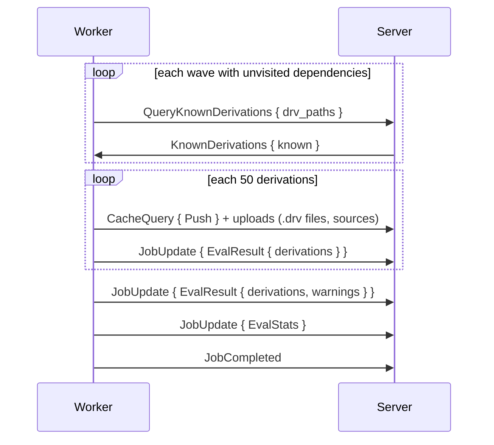
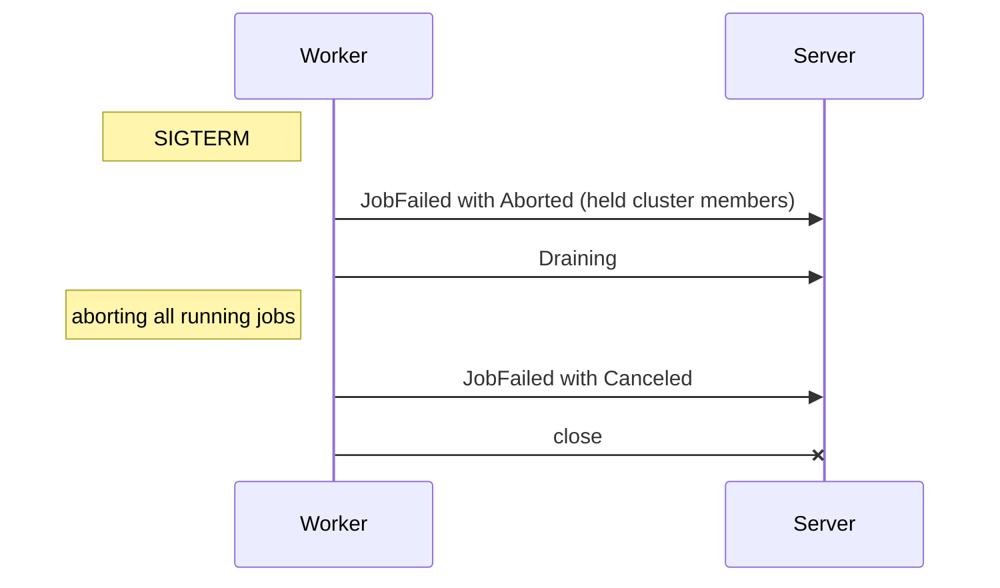

# Jobs

Workers handle two job kinds: flake jobs and build jobs. The sections below list their messages and reports, and the handling of failed, aborted and lost jobs.

- Jobs arrive as `AssignJob { job_id, assignment_id, job, cluster }` messages.
- Echo the `assignment_id` in `JobUpdate`, `JobCompleted`, `JobFailed`, `BuildProgress` and `EvalProgress`. Stale `assignment_id` values make the server drop the report.
- Workers accept a re-sent `AssignJob` for a job already running. Later reports of the job then echo the new `assignment_id`.
- Only [cluster members](../scheduler/clusters.md) get a `cluster` field.
- Reports of a session go into a queue of 64 events, off the session's read loop. Reports apply in arrival order.

## Flake Jobs

Flake jobs fetch and evaluate a flake. The server can pick the steps at queue time.

| Situation | Steps |
|---|---|
| An idle evaluation-only worker is available, and the evaluation is no cluster member | `[FetchFlake]`, then a follow-up job `[EvaluateFlake, EvaluateDerivations]` on the `Cached` source |
| Otherwise | All three steps in a combined job |

| Field | Meaning |
|---|---|
| `steps` | `FetchFlake`, `EvaluateFlake`, `EvaluateDerivations` |
| `source` | `Repository { url, commit }`, or `Cached { store_path }` for a follow-up job or a `gradient build` upload |
| `wildcards` | Attribute patterns to evaluate |
| `timeout_secs` | Optional limit, sent as `None` by the server today |
| `input_overrides` | Flake input overrides of the task |
| `input_update` | Set for a [flake update](../../guides/flake-updates.md) |

### Fetch

1. Clone the repository. Skip the clone for a `Cached` source.
2. Run the flake update generator for a job with `input_update`.
3. Serialise the tree at the pinned commit as a NAR, without a nix process. Add the NAR to the store as `<narHash>-source`, the path of `nix flake prefetch` for the same tree.
4. Leave out inputs with an override. Overrides apply at evaluation. Override names without a matching input end up as `EvalMessage` warnings.
5. Pull missing locked inputs from the Gradient cache. Fetch the rest with `builtins.fetchTree` in an eval worker.
    - Inputs of the same second-level domain (such as `github.com`) download in sequence. Different domains download in parallel.
    - Failed inputs drop out with a warning.
6. Report `FetchResult { flake_source }`.
7. Upload the source and the inputs with a `Push` cache query. Upload and evaluation steps of the same job run side by side.

- Upload failures fail the whole flake job.
- Fetch-only jobs send `JobCompleted` after the upload, with `EvalProgress` resent meanwhile.
- The server can then queue the follow-up job. Evaluations without a `flake_source` fail instead.

### Evaluate

| Step | Worker action |
|---|---|
| `EvaluateFlake` | Status `EvaluatingFlake` only, no work |
| `EvaluateDerivations` | Eval cache pull, attribute discovery, closure walk, eval cache push |

- **Eval Cache:** Workers pull the evaluation cache before discovery and push the cache after a walk with derivations. Empty or schemaless caches stay local.
- **Attribute Failures:** Workers send them as `EvalMessage { level: Error, source: "nix-eval:<attr>" }` before the last `EvalResult`.
- **Import From Derivation:** Workers send `ImportRequest { drv_paths }` during discovery and wait for `ImportResult`.
- **Walk:** Workers walk an entry point as soon as discovery returned it.
- **Waves:** Waves hold up to 256 of the most recently found derivations. Leaf derivations then come early in the walk, and their builds can start mid-evaluation.

- Derivations in `known` have complete closures in the graph. Workers skip their subtrees.
- Workers treat a failed `QueryKnownDerivations` as an empty `known`. **Full rewalks** get an empty `known` too.
- Batches upload their `.drv` files and input sources before their `EvalResult` message. Builds can start during the walk.
- Input `.drv` files travel with the batch walking the input.
- Walk and batch uploads run side by side. Uploads of consecutive batches overlap.
- `EvalResult` messages follow their own batch uploads, in walk order.
- Workers query and upload each path no more than once per evaluation, apart from the input upload of the fetch step.
- The server can store each batch in the graph and move each startable build to `Queued` right away.
- Consecutive `EvalResult` batches of a job, already waiting in the session queue, reach the graph writer together. Limits of the merge: 5000 derivations, and no other event in between.
- Evaluations in `EvaluatingFlake` or `EvaluatingDerivation` turn `Building` on `JobCompleted`.
- `EvalResult` errors (no derivation matched, a failed listing) become error messages. Error messages fail the evaluation at the end.

## Build Jobs

Build jobs hold exactly 1 `BuildSpec`, meaning a shared build (`derivation_build`).

| `kind` | When | Action |
|---|---|---|
| `Build` | Default | Prefetching inputs, then building the derivation with the Nix daemon |
| `Substitute` | The outputs are available in an upstream cache | Fetching the outputs without a Nix store |
| `Download` | A fixed-output derivation of the `builtin` system | Downloading the file without a Nix store |

- `Substitute` and `Download` jobs can start on any worker (system `builtin`).
- Build jobs also get `drv_path`, `outputs`, `is_fixed_output`, `timeout_secs` and `max_silent_secs` from the spec.
- Default limits: `build.defaultTimeoutSecs` (14400) and `build.defaultMaxSilentSecs` (3600).

1. Check for an abort, then report `Building` before anything that can fail.
2. Skip prefetch and build with all outputs already in the local store. Report `BuildOutput { substituted: true }` and upload the outputs anyway.
3. **Prefetch:** Read the `.drv`, drop inputs already in the store, and pull the rest over the [transfer](transfer.md) protocol.
4. Build through the daemon. Stream the log as `LogChunk` messages.
5. Report `BuildOutput` with outputs, `hydra-build-products` and metrics.
6. Upload the outputs, then send `JobCompleted`. Upload errors fail the job as `Transient`.

## Reports

| `JobUpdate` kind | Effect on the server |
|---|---|
| `Fetching`, `EvaluatingFlake`, `EvaluatingDerivations` | Evaluation status |
| `FetchResult { flake_source }` | Storing the fetched source in `evaluation.flake_source` |
| `EvalResult` | Storing a batch of derivations in the graph |
| `EvalStats` | Evaluation metrics |
| `InputUpdateResult` | Flake update candidate lock and bumped inputs |
| `InputUpdateExpansion` | Input names matching a glob in a `discover_only` pass. A new evaluation per name |
| `Building { build_id }` | Build turning `Building`. Already aborted builds get `AbortJob` instead |
| `BuildOutput` | Output sizes, build products, metrics, the `substituted` flag |
| `Stage(Prefetch / Build / Upload)` | Live stage of the job in the worker pool, for the [estimated time](../../reference/scheduler-policies.md#estimated-time). `Prefetch` and `Build` for the `Build` kind only |
| `Compressing` | No change. Workers no longer send it |

- `EvalProgress` messages hold a download row per flake input while fetching, and the live thunk count while evaluating.
- Download rows appear only with a missing input. Eval workers download the inputs themselves, up to 1 download per second-level domain.
- `JobCompleted` and `JobFailed` hold the phase timeline shown on the [Job Board](../../ui/job-board.md#job-inspection).
- Build metrics also hold the number of concurrent builds on the worker, the cores of the build and the worker's CPU score.

## Failures

| `BuildFailureKind` | Result |
|---|---|
| `Transient` | Retried up to `build.maxAttempts` (3), backoff `build.retryBackoffSecs` (30 s) doubling. Builds available in a cache take the substitution miss path after the last attempt |
| `Permanent` | Failed. Builds needing the failed build turn `DependencyFailed` |
| `Timeout` | Timed out. Builds needing the timed-out build turn `DependencyFailed` |
| `SubstituteUnavailable` | Re-queued. Built normally after `build.substituteMissEscalationThreshold` (2) misses |
| `InputsUnavailable` | Self-heal, see below |
| `CorruptEvalCache` | Purging the evaluation cache blob and re-queuing the evaluation. A repeat without a blob left: evaluation `Failed`. For builds: `Permanent` |
| `Aborted` | Aborted by the server. No cascade |
| `Canceled` | Stopped by the worker. Re-queued without using an attempt, see [Worker Stop](#worker-stop) |

- **InputsUnavailable:** An input listed by the cache was missing. Causes are an uncached path, `404`/`410` on the URL, `NarUnavailable` or a NAR hash mismatch.
    - The server can delete the stale cache row and object, reset the producing build and retry.
    - Inputs still present but without a producer stay in place.
    - Builds fail permanently after `build.inputsUnavailableMaxLoops` (3) loops. `InputsUnavailable` failures also use up attempts. Both limits default to 3, and attempts run out first.
- **DependencyFailed** can spread upward over the dependency graph from `Permanent` and `Timeout` failures, across evaluations.
- **Eval Job Outage:** Eval jobs failing `Transient` re-queue their evaluation, up to `build.maxAttempts` (3) attempts. Abandoned dispatches stay out of this count.
    - Typical causes are a dropped server connection, or an object PUT or `CacheQuery` without an answer.
- Evaluations end `Completed`, or `Failed` with a build in `Failed`, `Aborted` or `DependencyFailed`, or with an error message present.

## Cluster Members

[Cluster members](../scheduler/clusters.md) arrive as `AssignJob` with `cluster = { attempt, role, index, hold_secs }`.

| Event | Worker |
|---|---|
| `AssignJob` with `cluster` | Holding the slot without running the job, then accepting. Rejecting a second member of the same attempt |
| `StartCluster { attempt, roster }` | Running the held member. The member's signal route opens with the roster |
| `ClusterSignal` from the server | Delivered to the inbox of the running member of that attempt. Dropped once the member finished. No executor reads the inbox yet |
| `ClusterSignal` to the server | Wire and server routing only. No executor sends signals yet. `to = None` reaches all other started members |
| `AbortCluster { attempt }` | Dropping a held member unreported and aborting a running member (`JobFailed { Aborted }`) |
| `AbortJob` for a held member | Releasing the slot with `JobFailed { Aborted }` and `aborted by server` |
| No `StartCluster` within `hold_secs` | Releasing the slot and reporting `JobFailed { Aborted }` with `cluster start timed out`. Checks happen on the 10 s heartbeat, up to 10 s late |
| Worker stop | Releasing all held members the same way, with `worker draining` |

- Held members count against `eval.maxConcurrent` / `build.maxConcurrent` like running jobs.
- `hold_secs`: the server's `scheduler.clusterPrepareTimeoutSecs` (30 s) plus a 10 s margin.

## Abort and Lost Workers

- **API Abort:** Evaluation status `Aborted`. Pending jobs of the evaluation leave the queue.
    - `AbortJob` messages go to the evaluation job and to running builds wanted by no other live evaluation.
    - Only live evaluations wanting a build decide, not the evaluation that dispatched the build.
- **Newer Evaluation:** Tasks with `hard_abort` concurrency abort the older evaluation like the API. Tasks with `soft_abort` cancel only its eval job.
- **Unbuildable Evaluation:** Evaluations without a worker for their systems end `Aborted` the same way.
- Workers stop the daemon build at once and answer `JobFailed { Aborted }`.
- Assignments of an unconfirmed abort close as abandoned after 5 min.
- **Lost Worker:** Open assignments close as abandoned.
    - Back to `Queued` for each build in `Building`, with its running attempt closed as `Aborted` with the reason `WorkerLost`.
    - Builds with 10 lost workers in a row end `FailedPermanent`. An attempt closed any other way will start the row again. A requeue after an ended cluster attempt is no lost worker.
    - Running evaluations go to `Waiting` and back into the queue.
    - Evaluations with 10 eval dispatches fail on the next lost worker. Dispatches of all outcomes count, fetch-only and canceled jobs too.

## Worker Stop

- Workers release held cluster members first, then send `Draining` and abort all running jobs.
- Aborted jobs report `JobFailed { Canceled }` with their phase timeline. Failures during a stop all report as `Canceled`.
- Workers wait up to 5 s for these reports.
- Jobs without a report within the 5 s re-queue with the closed session, as for a lost worker.
- Canceled builds return to `Queued`. Their attempts close as `Aborted` and stay out of `build.maxAttempts` and the substitution miss count.
- Canceled eval jobs return their evaluation straight to `Queued`.
- Their assignments close as abandoned. These stay out of `build.maxAttempts`, but still count toward the 10 eval dispatches above.
