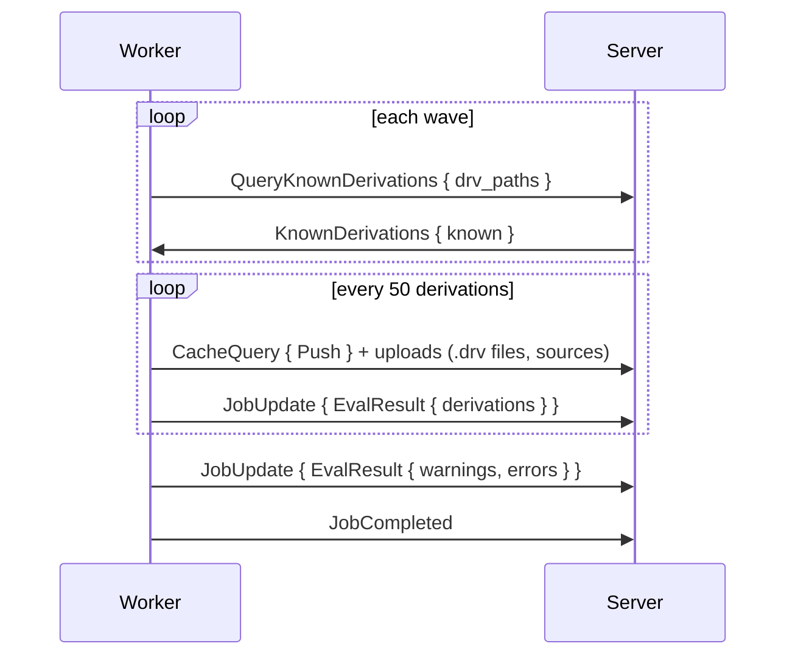

# Jobs

The two job kinds, their progress reports, and the handling of jobs that fail, abort or lose their worker. Every job is arriving as `AssignJob { job_id, assignment_id, job, cluster }`. Every report is echoing `assignment_id`. The server is setting `cluster` only for a [cluster member](../scheduler/clusters.md).

## Flake Jobs

A flake job is fetching and evaluating a flake. The server is fixing the steps at queue time.

| Situation | Steps |
|---|---|
| An idle evaluation-only worker is available | `[FetchFlake]`, then a follow-up job `[EvaluateFlake, EvaluateDerivations]` on the fetched source |
| Otherwise | All three steps in one job |

| Field | Meaning |
|---|---|
| `steps` | `FetchFlake`, `EvaluateFlake`, `EvaluateDerivations` |
| `source` | `Repository { url, commit }`, or `Cached { store_path }` for a fetched source or a `gradient build` upload |
| `wildcards` | Attribute patterns to evaluate |
| `timeout_secs` | Optional limit |
| `input_overrides` | Flake input overrides of the task |
| `input_update` | Set for a [flake update](../../guides/flake-updates.md) |

**Fetch:**

1. Clone the repository, apply overrides (dropping unknown inputs with a warning).
2. Serialise the tree at the pinned commit as a NAR, without a nix process. Add the NAR to the store as `<narHash>-source`, the same path `nix flake prefetch` is producing for the tree. The fetch is done when every locked input's `<narHash>-source` path is already in the store. `nix flake archive` is fetching the inputs in every other case, falling back to `nix flake prefetch` per input.
3. Upload every fetched path with a `Push` cache query, then report `FetchResult { flake_source }`.

**Evaluate:** The worker is walking the derivations breadth-first in waves of up to 256.

- `known` is listing the derivations already walked completely. The worker is skipping their subtrees.
- A **Full rewalk** is getting an empty list.
- Each batch is uploading its `.drv` files and their input sources before its `EvalResult`. Builds start while the walk is still going on.
- An input's `.drv` is going with the batch walking that input.
- The walk is continuing during a batch upload, up to 64 batches ahead.
- The uploads of consecutive batches overlap. Each `EvalResult` is following its own batch's uploads, in walk order.
- The worker is neither querying nor uploading a path again once an earlier batch of the same evaluation pushed that path.
- The server is recording each batch and promoting builds that can start to `Queued` right away.
- The evaluation is turning `Building` on `JobCompleted`.
- Evaluation errors become error messages, failing the evaluation at the end.

## Build Jobs

A build job is carrying exactly one `BuildSpec`: one shared build (`derivation_build`).

| `kind` | When | Action |
|---|---|---|
| `Build` | Default | Prefetching inputs, then building the derivation with the Nix daemon |
| `Substitute` | The outputs exist in an upstream cache | Fetching the outputs without a Nix store |
| `Download` | A `builtin:fetchurl` fixed-output derivation | Downloading the file without a Nix store |

`Substitute` and `Download` jobs can start on any worker (system `builtin`). The spec is also carrying `drv_path`, `outputs`, `is_fixed_output`, `timeout_secs` and `max_silent_secs`.

1. Report `Building`, before anything that can fail.
2. Skip everything when all outputs are already in the local store.
3. **Prefetch:** read the `.drv`, drop inputs already in the store, pull the rest over [transfer](transfer.md).
4. Build through the daemon, streaming the log as `LogChunk`.
5. Report `BuildOutput` with outputs, `hydra-build-products` and metrics.
6. Upload the outputs, then `JobCompleted`.

## Reports

| `JobUpdate` kind | Effect on the server |
|---|---|
| `Fetching`, `EvaluatingFlake`, `EvaluatingDerivations` | Evaluation status |
| `FetchResult { flake_source }` | Storing the fetched source |
| `EvalResult` | Recording a batch of derivations |
| `EvalStats` | Evaluation metrics |
| `InputUpdateResult`, `InputUpdateExpansion` | Flake update candidate lock and bumped inputs |
| `Building { build_id }` | Build turning `Building`. An already aborted build is getting `AbortJob` instead |
| `BuildOutput` | Output sizes, build products, metrics, the `substituted` flag |
| `Compressing` | No change |

`EvalProgress` is carrying one download row per flake input while fetching and the live thunk count while evaluating. The eval worker is downloading the inputs itself, with one download in flight per second-level domain.

`JobCompleted` and `JobFailed` carry the phase timeline shown on the [Job Board](../../ui/job-board.md#job-inspection). The server is dropping reports from a stale `assignment_id`.

## Failures

| `BuildFailureKind` | Result |
|---|---|
| `Transient` | Retried up to `build.maxAttempts` (3), backoff `build.retryBackoffSecs` (30 s) doubling |
| `Permanent` | Failed. Builds needing the failed build turn `DependencyFailed` |
| `Timeout` | Timed out. Builds needing the timed-out build turn `DependencyFailed` |
| `SubstituteUnavailable` | Re-queued. Built normally after `build.substituteMissEscalationThreshold` (2) misses |
| `InputsUnavailable` | Self-heal, see below |
| `CorruptEvalCache` | Purging the evaluation cache blob and re-queuing the evaluation |
| `Aborted` | Aborted by the server. No cascade |

- **InputsUnavailable:** An input listed by the cache is missing (uncached, `404`/`410` on the URL, or `NarUnavailable`). The server is deleting the stale cache row and object. The server is also resetting the producing build and retrying. The build is failing permanently after `build.inputsUnavailableMaxLoops` (3) loops.
- **DependencyFailed** is spreading upward over the dependency graph from `Permanent` and `Timeout` failures, across evaluations.
- **Eval Job Outage:** An eval job failing `Transient` is re-queuing its evaluation, up to `build.maxAttempts` (3) attempts. Typical causes are a dropped server connection or an object PUT or `CacheQuery` without an answer.
- An evaluation is ending `Completed`, or `Failed` when any build failed, was aborted or dependency-failed, or an error message is present.

## Cluster Members

A [cluster member](../scheduler/clusters.md) is arriving as `AssignJob` with `cluster = { attempt, role, index, hold_secs }`.

| Event | Worker |
|---|---|
| `AssignJob` with `cluster` | Holding the slot without running the job, then accepting. Rejecting a second member of the same attempt |
| `StartCluster { attempt, roster }` | Running the held member. The member's signal route is opening with the roster |
| `ClusterSignal` from the server | Delivered to the running member of that attempt. Dropped once the member finished |
| `ClusterSignal` to the server | Sent by the member. `to = None` is reaching every other member |
| `AbortCluster { attempt }` | Dropping a held member unreported and aborting a running one (`JobFailed { Aborted }`) |
| No `StartCluster` within `hold_secs` | Releasing the slot and reporting `JobFailed { Aborted }` with `cluster start timed out` |
| Local drain | Releasing every held member the same way, with `worker draining` |

- A held member is counting against `eval.maxConcurrent` / `build.maxConcurrent` like a running job.
- The server is setting `hold_secs` to its prepare timeout plus a 10 s margin.

## Abort and Lost Workers

- **Abort** (API or a newer evaluation): The evaluation is turning `Aborted`, and `AbortJob` is going to its jobs. The server is removing pending jobs. The worker is stopping the daemon build at once and answering `JobFailed { Aborted }`. The server is reaping aborts unconfirmed after 5 min.
- **Lost Worker:** Open assignments close as abandoned. Building builds return to `Queued`. A running evaluation is going to `Waiting` and back into the queue. The evaluation is failing after 10 lost assignments.
