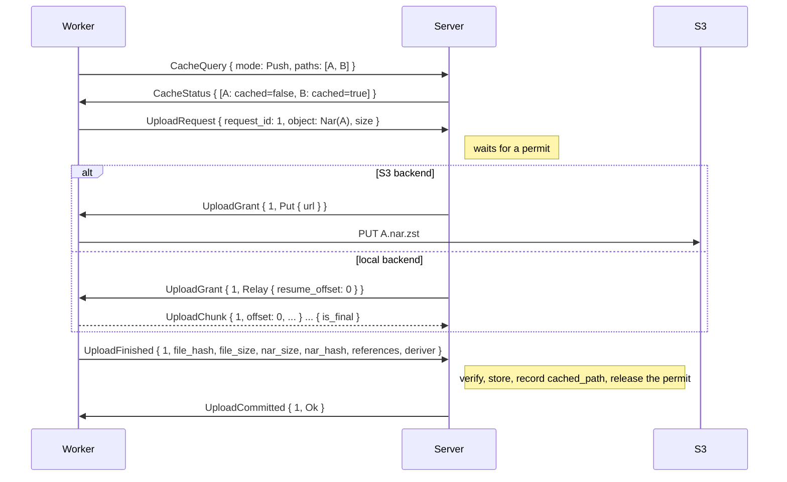
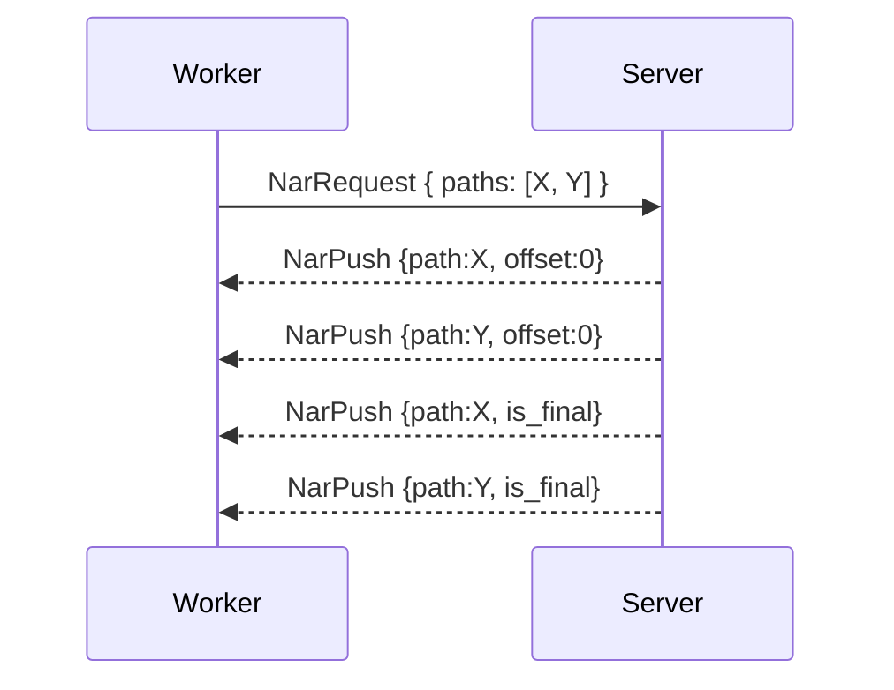

# Transfer

How NARs, logs, download progress and credentials move between worker and server.

## NAR Transfer

Downloads use two transports, chosen by the server from its `NarStore` and advertised per path in `CacheQuery { mode: Pull }` replies (`CachedPath.url`); the server sends all NARs a job asks for at once, avoiding per-path round trips. Uploads use exactly one transport per backend, granted per path: presigned on S3, relayed on local storage.

Worker-side, every NAR upload goes through `nar::upload_nar(uploads, job_id, store_path, source)`, which takes one of the connection's `UploadClient` slots, requests the upload and moves the bytes the grant names. `NarSource::Path` packs a store path on the fly, and `NarSource::Raw` holds an uncompressed NAR already in memory, compressed and hashed after the grant. `Relay` sends 512 KiB `UploadChunk` frames (`BULK_CHUNK_SIZE`) from the grant's `resume_offset`, `Put` sends one presigned HTTP PUT, and `Multipart` sends presigned S3 parts. `Relay` and `Multipart` share one packer that compresses the path into fixed-size parts, so neither holds the whole NAR in memory. A transfer that fails sends `UploadCancel`, so the server frees the permit at once. Server-side, the grant table lives in `handler/upload/` and serving in `handler/nar_serve.rs`. The relayed commit checks the length and SHA-256 of the staged file against `file_size` and `file_hash`, and the presigned commit HEADs the object and compares sizes before any `cached_path` metadata is recorded, so a failed or truncated PUT can never mint a zombie cache entry.

A job starts all of its uploads at once and the worker's `nar.maxConcurrentUploads` slots bound how many are open; the server's budget decides how many transfer. A NAR above 8 MiB is compressed with a multithreaded zstd encoder bounded to four threads, smaller ones single-threaded. Pulled chunks are staged by a per-transfer task on the worker; the importer decompresses straight from the staged file, so the compressed NAR never sits in memory.

A relay grant opens the upload's `.partial` under `<baseDir>/nar-partial`; each `UploadChunk` must continue it contiguously and stay within the zstd bound of the requested size, or the upload is `Rejected` and the chunk is not written. The writer hashes as it goes, and `UploadFinished` finishes it and renames the file into `nars/`, so a relayed NAR is written to the server's disk once. Reads from local storage go through tokio in 512 KiB chunks rather than `object_store`'s 8 KiB stream.

### Worker -> Server (upload)

The worker first sends `CacheQuery { mode: Push }` to learn which paths the server lacks; the reply names every queried path with `cached: true` or `cached: false` and nothing else, and Push mode **does not** query upstream caches. Each missing path then goes through the upload handshake:



### Server -> Worker (download, BuildJob)

The worker drives NAR requests - it knows what it needs to build, checks its local store, and asks the server for only the missing paths:

```rust
// Worker -> Server: I need these paths to proceed
NarRequest { job_id: Uuid, paths: Vec<String> }
```

The server responds with batched `NarPush` frames. On S3-backed stores there is no server relay at all: the `CacheQuery { mode: Pull }` reply already carried a presigned GET URL per path, and the worker downloads directly. Either way the server never needs to know the worker's store state.



**Source selection in federated setups:** when multiple peers hold a requested NAR, the server prefers direct workers over federation proxies (fewer network hops), minimizing relay latency and bandwidth. If S3 is configured and the NAR is cached there, S3 is always preferred (direct HTTP, no relay).

---

NARs are always **zstd-compressed** on the wire and in storage (`*.nar.zst`). Workers decompress before importing into their local Nix store and compress before uploading any path - source, evaluated `.drv`, or build output. The server treats the compressed bytes as opaque: it never decompresses, re-packs, or re-compresses them.

---

## Log Streaming

Workers send `LogChunk` messages during step execution. The server appends them to `LogStorage` (file or S3-backed, same as current build logs).

```rust
LogChunk { job_id: Uuid, task_index: u32, data: Vec<u8> }
```

Fire-and-forget - no acknowledgement. WebSocket flow control provides backpressure if the server falls behind.

When the server receives `JobCompleted` or `JobFailed`, it **finalizes** the log (uploads to S3 if configured). Workers do not need to wait for finalization.

## Download Progress

A Substitute or Download build produces no log; its worker reports the bytes fetched instead.

```rust
BuildProgress { job_id: Uuid, dispatch: Uuid, build_id: Uuid, downloaded: u64, total: Option<u64> }
```

- Sent every `BUILD_PROGRESS_INTERVAL` (5 s) in which bytes arrived, plus once when the fetch ends; a stalled fetch sends nothing. Fire-and-forget.
- `downloaded` counts compressed bytes over every output of the build; a retried transfer does not count twice.
- `total` is the sum of the upstream `FileSize`s for a Substitute, the `Content-Length` for a Download, and `None` when any is unknown.
- The server handles it on the control lane, never in the job-event queue. It keeps the latest value per `derivation_build` in memory (`AppState::download_progress`, forgotten 15 s after the last report) and broadcasts `BoardEvent::BuildProgress`. Nothing is written to the database.

---

## Credential Distribution

The server sends credentials to workers before steps that need them:

| Credential | Used by | Contents |
|------------|---------|----------|
| `SshKey` | `FetchFlake` step on a `fetch`-capable worker | Project's SSH private key for cloning private repos. Sent at most once per job, **only if the negotiated `fetch` capability is true for the target worker** (otherwise the worker can't run `FetchFlake` anyway). |

Credentials are encrypted in transit (TLS). Workers MUST:

 - Keep credentials in memory only - never write to disk
 - Zeroize memory on drop
 - Discard credentials when the job completes or the connection closes (they are not reused across jobs)
