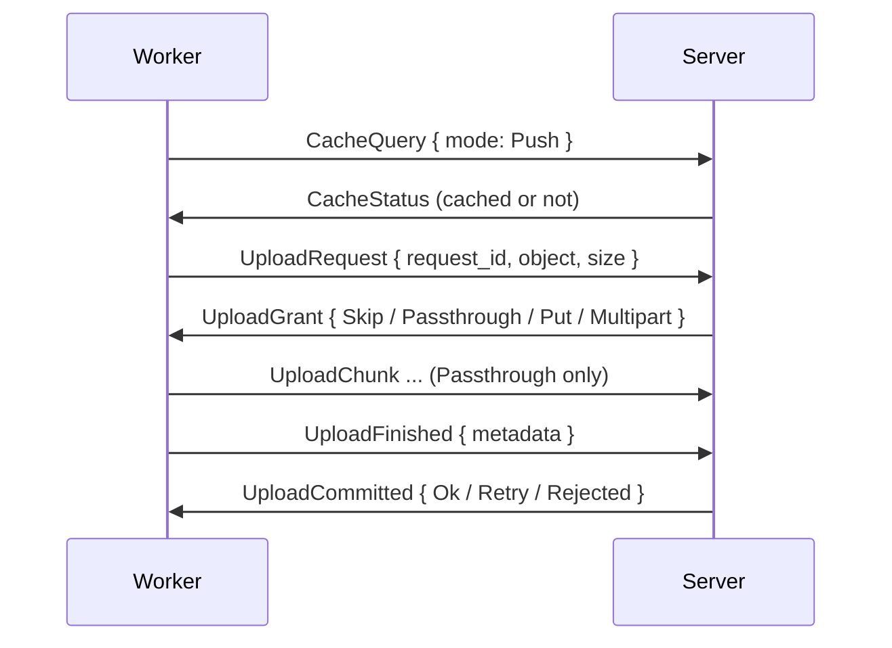

# Transfer

NARs, logs, download progress and credentials moving between worker and server. The worker is always compressing NARs with zstd. The server is never re-compressing.

## Upload

| Grant | When | Transfer |
|---|---|---|
| `Skip` | The object arrived meanwhile, or the server does not want the evaluation cache blob | Nothing |
| `Passthrough { resume_offset }` | Local NAR storage | 512 KiB `UploadChunk` frames into `<baseDir>/nar-partial`, resuming after a break |
| `Put { url }` | S3, NAR up to 1 GiB | One presigned PUT, valid 1 h |
| `Multipart` | S3, NAR over 1 GiB | Presigned parts of at least 64 MiB |

- **Admission** is server-wide and fair across sessions.
    - The limits are `upload.concurrency` (16) large uploads and `upload.bytesBudget` (8 GiB) at once.
    - A small upload (at most 1 MiB of NAR, `SMALL_UPLOAD_BYTES`) is getting a window of its own, `SMALL_UPLOADS_IN_FLIGHT` (128).
    - The cost of a small upload is its two round trips. Each `EvalResult` batch of an evaluation is waiting on the push of its own `.drv` files.
    - A small upload is going ahead of larger ones in its session. The server is serving a session with a waiting small upload first.
    - A permit is returning once the object is in storage, ahead of the graph record.
    - Requests for the same object coalesce. Followers get `Skip` once the first upload is in storage.
- **Worker Side:** `worker.nar.maxConcurrentUploads` (16) slots for large uploads and 128 for small ones.
    - One job is holding at most half of the large slots.
    - A slot is busy from the request until sending `UploadFinished`, not through the commit.
    - The graph writer is receiving commits in bursts and batching them.
    - The worker is retrying a `Retry` up to 3 times. `Rejected` is failing the upload.
    - Both rules also hold for an answer arriving before the grant.
    - A failed transfer or an abandoned request is sending `UploadCancel`.
- **Commit:** The server is checking a passthrough upload by length and SHA-256, then moving the upload into the NAR store. The commit of a presigned upload is completing the multipart and checking the object size. The full digest check is happening only with `nar.verifyDigest`.
- **Leases:** A passthrough upload is expiring after `upload.leaseIdleSecs` (300 s) without progress. A failed job or closed session is releasing its uploads.
- **Evaluation cache blobs** use the same handshake with `UploadObject::EvalCache`.

## Download for a Build

The worker is prefetching every input missing from the local store ahead of the build.

1. `CacheQuery { mode: Pull }` for the missing paths. An uncached path is failing the build as `InputsUnavailable`.
2. Paths with a presigned `url` download directly, 8 in parallel, with 4 attempts. A download is failing after 30 s without a byte, never on total length.
3. The rest go through `NarRequest`. The server is answering each path with `NarStreamHeader`, then 512 KiB `NarPush` frames, or with `NarUnavailable` / `NarAbort`.
4. A broken stream is resuming with `NarRequestResume { received_bytes, stream_token }` from `<baseDir>/nar-partial`.
5. The worker is importing the NARs into the Nix store in dependency order.

| Condition | Served As |
|---|---|
| S3 store, confirmed NAR above `nar.smallBytes` (1 MiB) | Presigned GET URL |
| Anything else | Stream over `/proto`, at most `nar.maxConcurrentServes` (8) paths per connection |

- Small NARs come from an in-memory hot cache, `nar.hotCacheBytes` (512 MiB).
- `NarUnavailable` is also removing the stale cache row on the server.
- A storage error or timeout is answering with `NarAbort` and leaving the row and object in place.
- Substitute builds may get an upstream URL through a single-path `Pull` query with `external`.

## Logs

- `LogChunk { job_id, task_index, data }` is streaming build output on the bulk lane, without acknowledgement.
- The server is appending each chunk to the open attempt of the build at `task_index`.
- The server is dropping chunks for evaluations or finished attempts.
- The worker is limiting each build's log to `worker.log.burstBytesPerMin` (8 MiB) and `worker.log.sustainedBytesPerHour` (64 MiB).
- The worker is then stopping the forward and adding a truncation note.
- A build already in the store is forwarding its stored Nix log with `worker.log.fetchFromStore` (on by default).
- The log is ending up as zstd chunks of `log.chunkBytes` (256 KiB) with a chunk index after the build.

## Download Progress

- `BuildProgress { downloaded, total }` is reporting the bytes of a running substitute or `builtin:fetchurl` download, every 5 s in which bytes arrived, plus once at the end.
- `total` is `None` when a size is unknown.
- Retried transfers never count twice.
- The server is keeping the value in memory for 15 s and showing the value on the build.
- The server is also publishing `BuildProgress` events to the live endpoints.
- The server is keeping `EvalProgress` the same way for 60 s, shown only while the evaluation is fetching or evaluating.
- The server is publishing `EvalProgress` as `evaluation.activity` events to the evaluation and task live endpoints.

## Credentials

- The only credential is the project's SSH key, for cloning private repositories and inputs.
- The server is decrypting the key and sending `Credential { SshKey }` right before `AssignJob`.
- The credential is going only to a flake job with a fetch step on a `fetch`-capable worker.
- A project without a key is getting no credential.
- The worker is keeping the key in locked memory, zeroed on drop.
- The worker is clearing the key at job completion.

## Memory

- A `Put` upload and a presigned download each hold the whole compressed NAR in memory, up to 1 GiB.
- Passthrough and multipart uploads from a store path stream through a packer and never hold the whole NAR.
