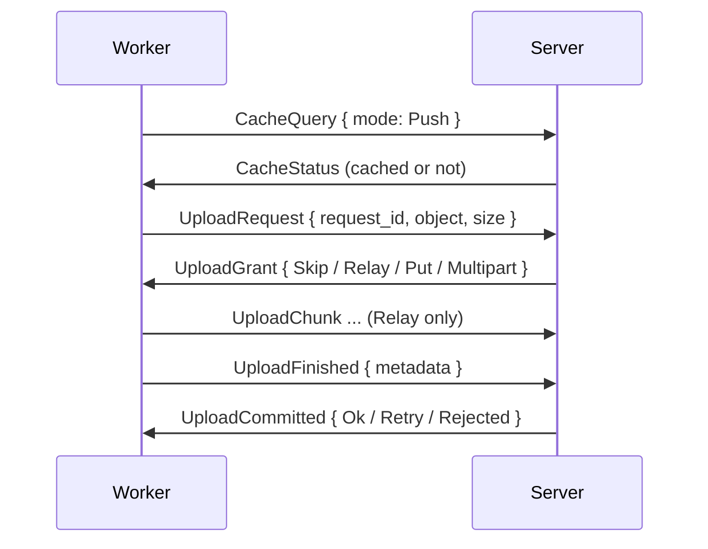

# Transfer

How NARs, logs, download progress and credentials move between worker and server. NARs are always zstd-compressed by the worker; the server never re-compresses.

## Upload

| Grant | When | Transfer |
|---|---|---|
| `Skip` | The object arrived meanwhile, or the server does not want the evaluation cache blob | Nothing |
| `Relay { resume_offset }` | Local NAR storage | 512 KiB `UploadChunk` frames into `<baseDir>/nar-partial`, resuming after a break |
| `Put { url }` | S3, NAR up to 1 GiB | One presigned PUT, valid 1 h |
| `Multipart` | S3, NAR over 1 GiB | Presigned parts of at least 64 MiB |

- **Admission** is server-wide and fair across sessions: `upload.concurrency` (16) uploads and `upload.bytesBudget` (8 GiB) at once. Requests for the same object coalesce; followers get `Skip` once the first commits.
- **Worker side:** `nar.maxConcurrentUploads` (8) slots; `Retry` is retried up to 3 times, `Rejected` fails the upload, a failed transfer sends `UploadCancel`.
- **Commit:** a relay is checked by length and SHA-256, then moved into the NAR store. A presigned upload completes the multipart and checks the object size; the full digest only with `nar.verifyDigest`.
- **Leases:** a relay expires after `upload.leaseIdleSecs` (300 s) without progress. A failed job or closed session releases its uploads.
- **Evaluation cache blobs** use the same handshake with `UploadObject::EvalCache`.

## Download for a Build

The worker prefetches every input the local store lacks before the build starts.

1. `CacheQuery { mode: Pull }` for the missing paths. An uncached path fails the build as `InputsUnavailable`.
2. Paths with a presigned `url` download directly: 8 in parallel, 4 attempts, 600 s timeout.
3. The rest go through `NarRequest`: the server answers each path with `NarStreamHeader`, then 512 KiB `NarPush` frames, or `NarUnavailable` / `NarAbort`.
4. A broken stream resumes with `NarRequestResume { received_bytes, stream_token }` from `<baseDir>/nar-partial`.
5. The worker imports the NARs into the Nix store in dependency order.

| Server serves | As |
|---|---|
| S3 store, confirmed NAR above `nar.smallBytes` (1 MiB) | Presigned GET URL |
| Anything else | Stream over `/proto`, at most `nar.maxConcurrentServes` (8) paths per connection |

- Small NARs come from an in-memory hot cache, `nar.hotCacheBytes` (512 MiB).
- `NarUnavailable` also removes the stale cache row on the server.
- Substitute builds may get an upstream URL through a single-path `Pull` query with `external`.

## Logs

- `LogChunk { job_id, task_index, data }` streams build output on the bulk lane, without acknowledgement.
- The server appends each chunk to the open attempt of the build at `task_index`; chunks for evaluations or finished attempts are dropped.
- The worker limits each build's log to `log.burstBytesPerMin` (8 MiB) and `log.sustainedBytesPerHour` (64 MiB), then stops forwarding and adds a truncation note.
- With `log.fetchFromStore` (on by default), a build already in the store forwards its stored Nix log.
- At the end of the build, the log is split into zstd chunks of `log.chunkBytes` (256 KiB) with a chunk index.

## Download Progress

- `BuildProgress { downloaded, total }` reports the bytes of a running substitute or `builtin:fetchurl` download, every 5 s in which bytes arrived, plus once at the end.
- `total` is `None` when a size is unknown; retried transfers never count twice.
- The server keeps the value in memory for 15 s, shows the value on the build, and publishes `BuildProgress` events to the live endpoints.

## Credentials

- The only credential is the project's SSH key, for cloning private repositories and inputs.
- The server decrypts the key and sends `Credential { SshKey }` right before `AssignJob`, only for a flake job with a fetch step on a `fetch`-capable worker, and only when the project has a key.
- The worker keeps the key in locked memory, zeroed on drop, and clears the key when a job completes.

## Memory

- A `Put` upload and a presigned download each hold the whole compressed NAR in memory, up to 1 GiB.
- Relayed and multipart uploads from a store path stream through a packer and never hold the whole NAR.
