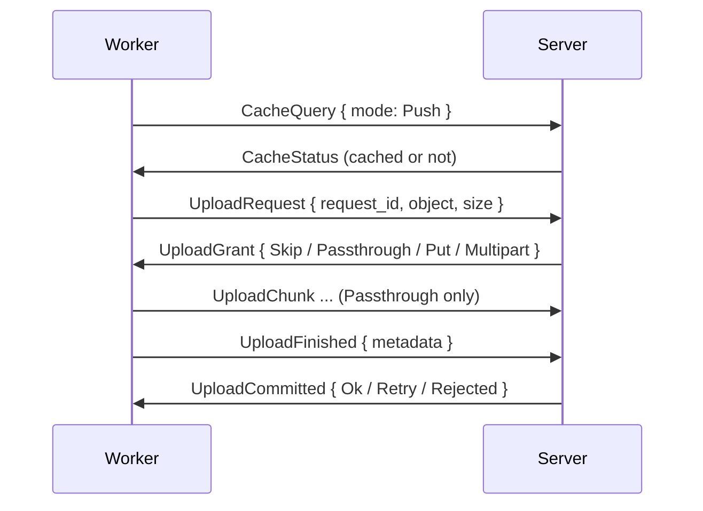

# Transfer

NARs, logs, build progress and credentials moving between worker and server. Workers always compress NARs with zstd. The server will never re-compress them.

## Upload

| Grant | When | Transfer |
|---|---|---|
| `Skip` | The path is already stored, or the server does not want the evaluation cache blob | Nothing |
| `Passthrough { resume_offset }` | Local NAR storage | `UploadChunk` frames of `worker.nar.chunkBytes` into `<baseDir>/nar-partial`, resuming after a break |
| `Put { url }` | S3, NAR up to 1 GiB | One presigned PUT, valid 1 h |
| `Multipart` | S3, NAR over 1 GiB | Presigned parts of at least 64 MiB |

- **Admission** is server-wide and fair across sessions.
    - The limits are `upload.concurrency` (8) large uploads and `upload.bytesBudget` (8 GiB) at once.
    - Small uploads (at most 1 MiB of NAR, `SMALL_UPLOAD_BYTES`) get a window of their own, `SMALL_UPLOADS_IN_FLIGHT` (128).
    - The cost of a small upload is its two round trips. Each `EvalResult` batch of an evaluation will wait on the push of its own `.drv` files.
    - Small uploads go ahead of larger ones in their session. The server will turn first to sessions with a waiting small upload.
    - Count and bytes of a permit come back after the object landed in storage, ahead of the graph record.
    - Requests for a path coalesce across workers, REST and SSH. Followers get `Skip` after the graph recorded the first upload.
    - Followers take over the path after a failed first upload.
- **Worker Side:** `worker.nar.maxConcurrentUploads` (16) slots for large uploads and 128 for small ones.
    - One job can hold at most half of the large slots.
    - A slot is busy from the request until sending `UploadFinished`, not through the commit.
    - The graph writer will receive commits in bursts and batch them.
    - The worker will retry a `Retry` up to 3 times. A `Rejected` answer will fail the upload.
    - Both rules also hold for an answer arriving before the grant.
    - A failed transfer or an abandoned request will send an `UploadCancel` message.
- **Commit:** The server will check a passthrough upload by length and SHA-256, then move the upload into the NAR store.
    - The commit of a presigned upload will complete the multipart and check the object size.
    - The full digest check will happen only with `nar.verifyDigest` set.
- **Leases:** A passthrough upload will expire after `upload.leaseIdleSecs` (300 s) without progress. A failed job or closed session will release its uploads.
- **Evaluation cache blobs** use the same handshake with `UploadObject::EvalCache`.

## Download for a Build

Workers prefetch every input missing from the local store ahead of the build.

1. `CacheQuery { mode: Pull }` for the missing paths. An uncached path will fail the build with the failure kind `InputsUnavailable` set.
2. Paths with a presigned `url` download directly, 8 in parallel, with 4 attempts. A download will fail after 30 s without a byte, never on total length.
3. The rest go through `NarRequest`. The server will answer each path with `NarStreamHeader`, then `NarPush` frames of `nar.chunkBytes`, or with a `NarUnavailable` / `NarAbort` message.
4. A broken stream will resume with `NarRequestResume { received_bytes, stream_token }` from the `<baseDir>/nar-partial` directory.
5. Workers import the NARs into the Nix store in dependency order.

| Condition | Delivered As |
|---|---|
| S3 store, confirmed NAR above `nar.smallBytes` (1 MiB) | Presigned GET URL |
| Anything else | Stream over `/proto`, at most `nar.maxConcurrentServes` (8) paths per connection and `nar.maxConcurrentDownloads` (16) across all connections |

- Small NARs come from an in-memory hot cache, `nar.hotCacheBytes` (512 MiB).
- A `NarUnavailable` answer will also remove the stale cache row on the server.
- A storage error or timeout will answer with `NarAbort` and leave the row and object in place.
- A substitute build may get an upstream URL through a single-path `Pull` query with `external` set.

## Logs

- The `LogChunk { job_id, task_index, data }` messages stream build output on the bulk lane, without acknowledgement.
- The server will append each chunk to the open attempt of the build at `task_index`.
- The server will drop chunks for evaluations or finished attempts.
- The worker will limit each build's log to `worker.log.burstBytesPerMin` (8 MiB) and `worker.log.sustainedBytesPerHour` (64 MiB).
- The worker will then stop the forward and add a truncation note.
- A build already in the store can forward its stored Nix log with `worker.log.fetchFromStore` (on by default).
- The log will end up as zstd chunks of `log.chunkBytes` (256 KiB) with a chunk index after the build.

## Build Progress

- The `BuildProgress` message will report the transfers of one build in three phases, each with bytes and paths done and total.

| Phase | Transfer | Bytes |
|---|---|---|
| `Prefetch` | Missing inputs pulled from the Gradient cache before the build | Compressed NAR files, totals growing with each closure round |
| `Download` | A substitute or `builtin:fetchurl` download | Compressed NAR file or the downloaded file |
| `Upload` | The build's own uncached outputs at the end of the job | NAR bytes read from the store |

- Workers report at most once a second on a change, plus once at the end of a phase.
- `bytes_total` is `None` when one size is unknown.
- `paths_total` is `None` while a prefetch is still discovering paths. The last report of a phase will always carry the total.
- Retried or failed transfers count only once.
- The server will keep the latest value per build for 15 s in memory.
- The build response will show the value only while the build has the `Building` status.
- The build will stay `Building` until its job finished the upload.
- The server will also publish `BuildProgress` events to the live endpoints.
- Eval workers report fetch rows or live thunks through `EvalProgress` at most once a second on a change.
- An unchanged value is sent again once 30 s have passed.
- The server will keep `EvalProgress` values the same way for 60 s, shown only during the fetch and evaluation steps.
- The server will publish `EvalProgress` as `evaluation.activity` events to the evaluation and task live endpoints.

## Credentials

- The only credential is the project's SSH key, for cloning private repositories and inputs.
- The server will decrypt the key and send `Credential { SshKey }` right before the `AssignJob` message.
- The credential will go only to a flake job with a fetch step on a `fetch`-capable worker.
- Projects without a key get no credential.
- Workers keep the key in locked memory, zeroed on drop.
- Workers clear the key at job completion.

## Memory

- A `Put` upload and a presigned download each hold the whole compressed NAR of up to 1 GiB in memory.
- Passthrough and multipart uploads from a store path stream through a packer and never hold the whole NAR.
