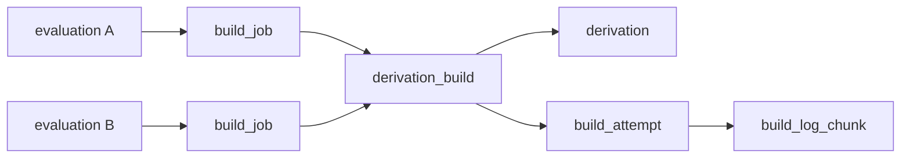

# Build Anchors

A derivation is built once, globally. Its build state lives on one `derivation_build` row (the build *anchor*); every write to anchors and the graph around them goes through one actor, `graph` (`backend/gradient-graph`).

## Tables

| Table | Key | Role |
|---|---|---|
| `derivation` | UNIQUE `(hash, name)` | The global graph node; `walked` and `unwalked_inputs` record whether the subtree is known |
| `derivation_build` | UNIQUE `derivation` | The anchor: `status`, `attempt`, `substitutable`, `probed`, `fetchable`, `demanded`, `unready_deps`, `missing_runtime_deps`, limits |
| `build_job` | `evaluation`, `derivation_build` | Links one evaluation to an anchor; carries the dispatch `score` |
| `build_attempt` | `derivation_build`, `dispatched_job` | One execution: `outcome`, `reason`, timings, `build_context` |
| `build_log_chunk` | `build_attempt` | The attempt's log |

| Foreign key | On delete | Effect |
|---|---|---|
| `derivation_build.derivation` | `CASCADE` | The anchor lives as long as the derivation |
| `build_job.evaluation` | `CASCADE` | Evaluation GC drops its links |
| `build_attempt.build_job` | `SET NULL` | An attempt and its log outlive the driving evaluation |
| `build_attempt.derivation_build` | `CASCADE` | Attempts go with the anchor |

## Sharing

- Two evaluations (same or different projects) needing one derivation share its anchor. No leader, follower or link row exists; sharing is the global graph itself.
- New anchors are inserted `ON CONFLICT (derivation) DO NOTHING`: an anchor from an earlier evaluation stays untouched (`BatchWriter::resolve_anchors`, `ingest.rs`).
- The first dispatch builds; every other evaluation sees the result once the anchor reaches `Completed` or `Substituted` (`BuildStatus::TERMINAL_SUCCESS`).
- A `Completed` anchor reused later keeps its attempts and logs until the derivation is garbage collected.

## Graph Actor

`GraphActor` (`gradient-graph/src/actor.rs`) is a root child of the supervision tree, stopped after every sibling. Callers use the `Graph` handle (`lib.rs`); one message is one transaction, except that queued `Ingest` and `CommitNar` messages share one.

| `GraphMsg` | Writes |
|---|---|
| `Ingest` | One worker batch: derivations, stubs, edges, outputs, input sources, anchors, `build_job` rows, features, messages, entry points, readiness and demand |
| `UpstreamHits` | Probe results: narinfo on `derivation_output`, the runtime edges the narinfo names, `substitutable`, the demand moved |
| `UpstreamProbed` | `probed = true` on answered anchors, and the demand a miss opens below them |
| `CommitNar` | The `cached_path` row, its references, `cached_path_signature` placeholders, the backed outputs |
| `Transition` | Evaluation and anchor state: stream completed, eval failed, build started/output/completed/failed, dispatched, orphaned, ready, reconcile, abort, prioritize |
| `Requeue` | `FailedTransient` anchors whose backoff elapsed, back to `Queued` |
| `Demote` | `MissingNar`, operator `Path` invalidation, one cache dropping its `CacheClaim` |
| `Gc` | Bounded deletes of derivations, stale paths and evaluations, re-checked against rows that became live since the scan |

Every other message flushes the queue first: a write after a batch or a commit sees it.

`Graph::known_derivations` is not a message: it reads which `drv_hashes` have a recorded subtree (`walked` and `unwalked_inputs = 0`) from the pool, so a walk's next wave does not wait out its previous batch's ingest. A recorded subtree only gains its record, so a read that misses a queued write prunes less, never wrongly.

## Batching

- Queued ingest batches share one transaction with a savepoint each (`ingest_one`); one that fails for its content fails only its caller.
- Queued NAR commits run set-based under one savepoint (`nar::commit_batch`): one statement per step for the whole batch instead of a dozen per NAR, since a commit's cost is round trips. If the batch fails, its NARs commit one by one (`commit_one`), each under its own savepoint, so a bad one fails only its uploader.
- A flush runs on the next mailbox turn, or at once when the queue reaches `INGEST_ROW_BUDGET` (5000 derivations) or `NAR_COMMIT_BUDGET` (32 commits). A flush stops taking NAR commits after `NAR_FLUSH_TIME` (100 ms) and leaves the rest to the next mailbox turn, since it holds every commit's anchor locks to its end.
- The worker's wire has no acknowledgement to retry on. A failed batch fails its evaluation (`fail_evaluation`) instead of leaving a hole.
- `IngestBatch.truly_substituted` is the one fact from outside the graph: derivations already whole in our cache, established by the scheduler and keyed by drv path. Their new anchors start `Substituted`. Ids are assigned inside the transaction.
- Upstream availability is not part of a batch; the probe answers through `UpstreamHits` for demanded anchors. A batch writes `substitutable = false` on new anchors only.
- Post-commit (`ingest::after_commit`): entry point statuses, per-task evaluation GC, probe requests, the `evaluation::Progress` event.

## Timeouts and Retries

| Constant | Value | Meaning |
|---|---|---|
| `CALL_TIMEOUT` | 30 s | Wait for the actor to exist after a restart |
| `GRAPH_TX_BUDGET` | 120 s | Per transaction; past this the transaction rolls back and the caller gets `graph transaction exceeded 120s`. Also set as the transaction's `statement_timeout`: the rollback waits for the running statement, so only Postgres can end it |
| `GRAPH_TX_ATTEMPTS` | 3 | Runs of a transaction aborted with SQLSTATE `40P01` or `40001` |

- A caller waits for its reply without a deadline. The actor runs a message whose caller gave up, so a caller-side timeout would report a write that still lands as failed. A worker session behind a backlog blocks its reader as backpressure.
- A deadlock inside one batch fails the whole flush (`escalate_retryable`), and `transact` retries the flush.
- Board events and probe requests an aborted attempt already sent are sent again by the retry.
- `Transition::Reconcile` (`gradient_db::reconcile_build_graph`) and cache demotion run inside the actor. The consistency sweep (`consistency_sweep_pass`, `gradient-scheduler`) runs outside and is not retried; its next run picks the work up.
- No state is held between messages: a restart loses only batches still queued, and their callers get an error.

## Concurrent Walks

- Two walks of overlapping graphs converge on one `derivation` row per `(hash, name)`: `WALKED_UPSERT` and `STUB_INSERT` use `ON CONFLICT (hash, name)`.
- Edges (`derivation_dependency`) are inserted `ON CONFLICT DO NOTHING`; two walks of one node record the same set.
- `accepts_batches` takes batches only while the evaluation is `Fetching`, `EvaluatingFlake` or `EvaluatingDerivation`. Other batches are dropped as stale (`IngestReport.skipped`).
- Two walks of one evaluation differ by the dispatch id minted at assignment. The worker echoes the id on every report; a report for a dispatch the session did not hand out is dropped (`gradient-proto/src/handler/dispatch.rs`, `owned`).

## Substitutable Flag

- Set only by `flip_substitutable` (`UpstreamHits`), only on anchors not in `TERMINAL_SUCCESS`.
- One project's probe can add a substitution for another project's walk.
- Cleared by `exhaust_substitution` (`transition.rs`) once substitute misses escalate: the anchor returns to `Created` as an ordinary build.
- Cleared by `CLEAR_SUBSTITUTABLE_TRUST` (`gradient-db/src/cache_storage.rs`) for an output proven unfetchable.

## Counter Locking

Counters stay correct without the actor's serialisation; a second writer can share them (`gradient-db/src/anchor_guard.rs`).

- Advisory keys: namespace `ANCHOR_LOCK_NAMESPACE` (643), key `hashtext(derivation id)`, taken sorted in one pass before any row lock.
- A seed of `unready_deps` or `missing_runtime_deps` holds its dependencies' keys shared.
- A flip of wholeness or `fetchable` holds the anchor's key exclusively before the ripple reads the edges into the anchor.
- The second of a seed and a concurrent flip waits for the first to commit, then reads its rows.
- Shared keys never wait on each other: a dependency every `.drv` references (`source-stdenv.sh`) queues nothing.
- `demanded` is the exception: `recompute_demand` locks only its roots. The sweep's `recount_demanded` corrects drift; a lost update leaves an anchor `Skipped` until the next sweep.

## Related

- [Jobs](../proto/jobs.md) - build job reports that drive `Transition`
- [Architecture](../architecture.md)
