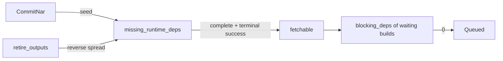

<!--
SPDX-FileCopyrightText: 2026 Wavelens GmbH <info@wavelens.io>
SPDX-License-Identifier: AGPL-3.0-only
-->

# Cache Closure

The cache must hold one invariant. Every output delivered from the cache must come with its complete runtime closure in the cache. Counters per shared build carry the invariant through the graph. All start conditions read the counter. A self-heal can repair whatever a failed build proved wrong.

## Complete Closure

Runtime dependencies are living in `derivation_dependency` next to build dependencies (`EdgeKind::Runtime` = 1, `Both` = 2). The predicates are in `gradient-db/src/graph/predicates.rs`.

| Term | Definition |
|---|---|
| Present (`present_predicate`) | Output rows exist for the shared build, each with a `cached_path` row carrying a set `file_hash` |
| `missing_runtime_deps` | Runtime dependencies of the shared build without a complete closure |
| Complete closure (`shared_build_complete_predicate`) | Present and `missing_runtime_deps = 0` |
| `fetchable` (`fetchable_predicate`) | Terminal success and complete closure. An upstream copy does not count |
| `.drv` present (`drv_present_predicate`) | The build's own `.drv` NAR with a backed `cached_path` row. Presence only, not a complete closure |

- **Build start condition:** `blocking_deps = 0` and `.drv` present. `blocking_deps` is the count of direct dependencies without a set `fetchable` flag. The `fetchable` flags of the dependencies already cover their own closures, and the condition is free of recursion.
- **Passthrough start condition:** shared builds available in a cache can start without either term. Their jobs carry no `required_paths` (`gradient-scheduler/src/loops/build.rs`).
- **Push:** jobs upload only their own outputs. Everything below them already had a complete closure before assignment. The invariant can hold without the worker pushing a closure.

## NAR Commit

`commit` (`gradient-graph/src/nar.rs`) must run inside the graph writer's transaction for every `CommitNar`. A pooled handle is not accepted.

1. Upsert the `cached_path` row under `FOR NO KEY UPDATE`. Read `was_backed` under that lock. No later statement can recover this endpoint.
2. Overwrite `references` with the line the worker reported, in order. `references_for_hash` can rebuild the narinfo `References:` line and the signature fingerprint verbatim from that line.
3. Insert a runtime dependency for each path in `references` (add-only), then update `wanted` for the producers.
4. `seed_runtime_deps` (`gradient-db/src/graph/runtime_can_start.rs`): an absolute recount of the producers. Paths without an earlier NAR become `freshly_present`. Re-pushes of a backed path get only a recount.
5. Spread the newly complete closures to the shared builds needing them at runtime. `ripple_shared_builds_complete` can count down their missing dependencies level by level in one call of `ripple_missing_runtime_deps`, a SQL function. Then `became_fetchable` must set `fetchable` and move the `blocking_deps` counter.
6. Apply `ripple_shared_builds_incomplete`, then `lost_fetchability`, to shared builds left incomplete by a new dependency on a missing path.
7. Write a `cached_path_signature` row per target cache. Sign each row with the cache's key. The row is unsigned without a key or when all producing tasks keep the path private. Mark matching `derivation_output` rows cached.

- **Transitions only:** the spread may start only from rows with a state change reported by the seed. Spreading from a state would drive a counter below zero. A negative counter can never read `= 0` again.
- **Deadlocks:** the graph writer can retry a transaction failing with `40P01`, `40001` or `25P02` up to `GRAPH_TX_ATTEMPTS` (3) times (`gradient-graph/src/writer.rs`).

## Retire

`retire_outputs` (`gradient-db/src/graph/runtime_can_start.rs`) is the one path deleting `cached_path` rows.

1. Lock the hashes `FOR NO KEY UPDATE` in one hash-ordered statement, with the producers' advisory keys exclusive.
2. Read the producers with a complete closure (`complete_among`) before the delete can destroy that endpoint.
3. Delete the rows, cascading to `cached_path_signature`. Clear `is_cached` on the outputs.
4. `ripple_shared_builds_incomplete` from the shared builds that had a complete closure.
5. Apply `lost_fetchability` over producers and every build left incomplete. Reset only the producers of deleted paths to `Created`.

| Caller | Trigger |
|---|---|
| `demote_cached_output` (`gradient-db/src/caches/demotion.rs`) | Self-heal, operator invalidation, a cache dropping its last claim, a NAR missing from storage |
| `GcRequest::Paths` (`gradient-graph/src/gc.rs`) | Stale-path eviction and zombie purge |

- **One cache's claim:** `Demotion::CacheClaim` can drop only the `cached_path_signature` row of that cache. The retire can follow only after the last signing cache is gone.
- **Graph writer only:** all callers run inside the graph writer. The GC scans take place on the pool and hand the deletes to the graph writer.
- **Lock order:** `cached_path` rows (by hash), then `derivation_build` rows (by `derivation`), with advisory keys ahead of rows. `demote_cached_output` must write the cache availability flag (`cache_available`) before the retire. The function must take both lock passes first. Details are in [Shared Builds](shared-builds.md#counter-locking).

## Consistency Check

`graph_consistency_report` (`gradient-db/src/graph/consistency.rs`) is the only backstop for a lost move.

- `recount_missing_runtime_deps`: an absolute, table-wide recount of `missing_runtime_deps` (also the column's backfill).
- `repair_fetchable` and `repair_can_start`: rewrite `fetchable` and `blocking_deps` over the start-condition scope (pending shared builds and the rows they wait on).
- `recount_walk_completeness` and `recount_wanted` recount the walk bit and the needs-build mark table-wide. `settle_skipped` must then settle the queue against that mark.

## Self-Heal

A build failing with `InputsUnavailable` must name its missing paths. `repair_missing_inputs` (`gradient-graph/src/self_heal.rs`) can handle each case in the table.

| Case | Action |
|---|---|
| Missing path with a producer | `demote_cached_output`: retire the row, delete the object, clear `cache_available`. Builds needing the path are blocking again until the producer can push again |
| Producer without a `build_job` (orphan) | Also `demote_parents_of` and `unwalk_derivations`. The next evaluation will walk the referencing paths again and schedule the orphan |
| No producer (`.drv` or source) | Purged only when the object is really gone. `demote_parents_of` will then demote the outputs referencing the path. Their rebuild will push the path again |
| No producer and nothing referencing the path (absent orphan) | `demote_output_only_cached_deps`: demote the failed build's cached dependencies without `external_url`, forcing a re-walk |

- **Corrupt NAR:** the worker must check every fetched input against its `nar_size` and `nar_hash` (`verify_nar`, `gradient-worker/src/proto/nar_daemon_import.rs`). A mismatch is a `CorruptCachedNar`, classified `InputsUnavailable` in prefetch and Substitute alike. The same self-heal can rebuild the producer with consistent metadata.
- **Requeue:** `requeue_failed_shared_builds` can thaw demoted producers in a terminal failure at once.
- **Circuit breaker:** the build will fail without the self-heal after `build.inputsUnavailableMaxLoops` (`GRADIENT_BUILD_INPUTS_UNAVAILABLE_MAX_LOOPS`, default 3) prior `InputsUnavailable` attempts (`inputs_unavailable_attempt_count`).
- **Failure text:** all failures store the worker's error, capped, on `build_attempt.failure_message`.

## Garbage Collection

The `cache-maintenance` pass (`gradient-cache/src/schedule.rs`) can start every `gc.intervalSecs` (3600 s). The keep-set is the closure of every `entry_point` and `build_job` derivation over `derivation_dependency` (`reachable_derivations_cte`), not the rows with a `build_job` of their own.

| Pass | Reclaimed | Bound |
|---|---|---|
| Evaluation GC | Evaluations beyond the task's `keep_evaluations` newest terminal ones | Waiting during an active evaluation of the task, unless wedged longer than `gc.wedgedEvalHours` (24) |
| Derivation GC | `derivation` rows outside the keep-set, their attempt logs | Created before `gc.orphanDerivationHours` (24) |
| Stale-path eviction | `cached_path` rows outside `live_cached_paths_cte`, then their objects | Last fetch (or commit) older than `max(gc.narTtlHours, gc.narUploadGraceHours)` (336 h) |
| Zombie purge | Confirmed rows with the object missing from storage | Storage probe per row. A probe error will preserve the row |
| Orphan NAR files | Objects without any referencing row | Older than `gc.narUploadGraceHours` (24 h) |

- **Re-check:** the graph writer must re-check each chunk against roots created since the scan (`scanned_at`). The writer can delete only rows that stayed dead. Object removal is limited to rows the graph writer reported as retired.
- **Live paths:** outputs of the keep-set's runtime closure, plus the `.drv` NAR and `inputSrcs` of every reachable derivation.
- **Fetch time:** `cached_path_signature.last_fetched_at` and `fetch_count` move on every NAR download (`gradient-web/src/endpoints/caches/nar.rs`).

## Access

| Endpoint | Rule |
|---|---|
| `GET /builds/{build}`, `/log`, `/graph`, `/closure`, `/downloads` | Public project, a member of the build's project, or a member of any project with a `build_job` for the same derivation (`BuildAccessContext::load`, `gradient-web/src/endpoints/builds/mod.rs`) |
| `GET /builds/{build}/download/{filename}` | The same rule, or a download token for the derivation |
| Narinfo, NAR, `ls` and `serve` on `/cache/{cache}` | A signed `cached_path_signature` row for that cache and a `file_hash` on the path (`cache_serves_path`, `gradient-web/src/endpoints/caches/helpers.rs`) |
| `GET /cache/{cache}/log/{drv}` | Own log only when the cache can hand out an output of the derivation by the same rule (`cache_served_derivation`). Otherwise the upstream caches (`caches/build_log.rs`) |

## Related

- [Shared Builds](shared-builds.md)
- [Upstream Substitution](upstream-substitution.md)
- [Waiting and Recovery](waiting-and-recovery.md)
- [Jobs](../proto/jobs.md#failures)
