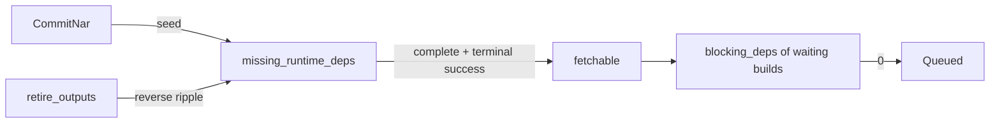

# Cache Closure

The cache holds one invariant: an output served from the cache has its complete runtime closure in the cache too. A counter per shared build carries the invariant through the graph. Every start condition reads the counter; a self-heal repairs what a failed build proves wrong.

## Complete Closure

Runtime dependencies live in `derivation_dependency` next to build dependencies (`EdgeKind::Runtime` = 1, `Both` = 2). The predicates are in `gradient-db/src/graph/predicates.rs`.

| Term | Definition |
|---|---|
| Present (`present_predicate`) | The shared build has output rows, and every output has a `cached_path` row with `file_hash` set |
| `missing_runtime_deps` | Runtime dependencies of the shared build without a complete closure |
| Complete closure (`shared_build_complete_predicate`) | Present and `missing_runtime_deps = 0` |
| `fetchable` (`fetchable_predicate`) | Terminal success and complete closure; an upstream copy does not count |
| `.drv` present (`drv_present_predicate`) | The build's own `.drv` NAR has a backed `cached_path` row; presence only, not a complete closure |

- **Build start condition:** `blocking_deps = 0` counts direct dependencies that are not `fetchable`, and `.drv` present. A dependency's own closure is summarised in its `fetchable`; the condition recurses over nothing.
- **Passthrough start condition:** a shared build available in a cache starts without either term. Its job carries no `required_paths` (`gradient-scheduler/src/loops/build.rs`).
- **Push:** a job uploads only its own outputs. Everything below them already had a complete closure before assignment, and the invariant holds without the worker pushing a closure.

## NAR Commit

`commit` (`gradient-graph/src/nar.rs`) is running inside the graph writer's transaction for every `CommitNar`; a pooled handle is rejected.

1. Upsert the `cached_path` row under `FOR NO KEY UPDATE`. `was_backed` is read under that lock: the one endpoint no later statement can recover.
2. Overwrite `references` with the line the worker reported, in order. The narinfo `References:` line and the signature fingerprint are rebuilt from that line verbatim (`references_for_hash`).
3. Insert the runtime dependencies the references name (add-only), then update `wanted` for the producers.
4. `seed_runtime_deps` (`gradient-db/src/graph/runtime_can_start.rs`): an absolute recount of the producers. A path without a NAR before is `freshly_present`; a re-push of a backed path is only recounted.
5. Shared builds whose closure became complete: `ripple_shared_builds_complete` counts down the builds that need them at runtime, level by level in one call of the SQL function `ripple_missing_runtime_deps`, then `became_fetchable` flips `fetchable` and moves `blocking_deps`.
6. Shared builds whose closure a new dependency on a missing path left incomplete: `ripple_shared_builds_incomplete`, then `lost_fetchability`.
7. Write a `cached_path_signature` row per target cache, signed with the cache's key (unsigned when the key is missing or every producing task keeps the path private), and mark matching `derivation_output` rows cached.

- **Transitions only:** a ripple starts from rows the seed reports as flipped. Rippling from a state drives a counter below zero, and a negative counter never reads `= 0` again.
- **Deadlocks:** the graph writer retries a transaction that fails with `40P01` or `40001` up to `GRAPH_TX_ATTEMPTS` (3) times (`gradient-graph/src/writer.rs`).

## Retire

`retire_outputs` (`gradient-db/src/graph/runtime_can_start.rs`) is the one path that deletes `cached_path` rows.

1. Lock the hashes `FOR NO KEY UPDATE` in one hash-ordered statement, with the producers' advisory keys exclusive.
2. Read which producers have a complete closure (`complete_among`) before the delete destroys that endpoint.
3. Delete the rows (`cached_path_signature` cascades), clear `is_cached` on the outputs.
4. `ripple_shared_builds_incomplete` from the shared builds that had a complete closure.
5. `lost_fetchability` over producers and every build left incomplete; reset only the producers of deleted paths to `Created`.

| Caller | Trigger |
|---|---|
| `demote_cached_output` (`gradient-db/src/caches/demotion.rs`) | Self-heal, operator invalidation, a cache dropping its last claim, a NAR missing from storage |
| `GcRequest::Paths` (`gradient-graph/src/gc.rs`) | Stale-path eviction and zombie purge |

- **One cache's claim:** `Demotion::CacheClaim` drops only that cache's `cached_path_signature` row; the retire follows once no cache signs the path.
- **Graph writer only:** every caller is running inside the graph writer; the GC passes scan on the pool and hand the deletes to the graph writer.
- **Lock order:** `cached_path` rows (by hash), then `derivation_build` rows (by `derivation`), with advisory keys ahead of rows. `demote_cached_output` writes the cache availability flag (`cache_available`) before the retire and takes both lock passes first. Details in [Shared Builds](shared-builds.md#counter-locking).

## Consistency Check

`graph_consistency_report` (`gradient-db/src/graph/consistency.rs`) is the only backstop for a lost move.

- `recount_missing_runtime_deps`: an absolute, table-wide recount of `missing_runtime_deps` (also the column's backfill).
- `repair_fetchable` and `repair_can_start`: rewrite `fetchable` and `blocking_deps` over the start-condition scope (pending shared builds and the rows they wait on).
- `recount_walk_completeness` and `recount_wanted` recount the walk bit and the needs-build mark table-wide, then `settle_skipped` settles the queue against that mark.

## Self-Heal

A build that fails `InputsUnavailable` names its missing paths. `repair_missing_inputs` (`gradient-graph/src/self_heal.rs`) handles each:

| Case | Action |
|---|---|
| Missing path with a producer | `demote_cached_output`: retire the row, delete the object, clear `cache_available`; builds that need the path block again until the producer re-pushes |
| Producer without a `build_job` (orphan) | Also `demote_parents_of` and `unwalk_derivations`: the next evaluation walks the referencing paths again and schedules the orphan |
| No producer (`.drv` or source) | Purged only when the object is really gone, then `demote_parents_of` demotes the outputs that reference the path, whose rebuild re-pushes the path |
| No producer and nothing referencing the path (absent orphan) | `demote_output_only_cached_deps`: demote the failed build's cached dependencies without `external_url`, forcing a re-walk |

- **Corrupt NAR:** the worker checks every fetched input against its `nar_size` and `nar_hash` (`verify_nar`, `gradient-worker/src/proto/nar_daemon_import.rs`). A mismatch is `CorruptCachedNar`, classified `InputsUnavailable` in prefetch and Substitute alike; the same self-heal rebuilds the producer with consistent metadata.
- **Requeue:** demoted producers in a terminal failure are thawed at once (`requeue_failed_shared_builds`).
- **Circuit breaker:** after `build.inputsUnavailableMaxLoops` (`GRADIENT_BUILD_INPUTS_UNAVAILABLE_MAX_LOOPS`, default 3) prior `InputsUnavailable` attempts (`inputs_unavailable_attempt_count`), the build fails without the self-heal.
- **Failure text:** every failure stores the worker's error, capped, on `build_attempt.failure_message`.

## Garbage Collection

The `cache-maintenance` pass (`gradient-cache/src/cacher/mod.rs`) is running every `gc.intervalSecs` (3600 s). The keep-set is the closure of every `entry_point` and `build_job` derivation over `derivation_dependency` (`reachable_derivations_cte`), not the rows with a `build_job` of their own.

| Pass | Reclaims | Bound |
|---|---|---|
| Evaluation GC | Evaluations beyond the task's `keep_evaluations` newest terminal ones | Waits while the task has an active evaluation, unless wedged longer than `gc.wedgedEvalHours` (24) |
| Derivation GC | `derivation` rows outside the keep-set, their attempt logs | Created before `gc.orphanDerivationHours` (24) |
| Stale-path eviction | `cached_path` rows outside `live_cached_paths_cte`, then their objects | Last fetch (or commit) older than `max(gc.narTtlHours, gc.narUploadGraceHours)` (336 h) |
| Zombie purge | Confirmed rows whose object storage no longer holds | Storage probe per row; a probe error preserves |
| Orphan NAR files | Objects no row references | Older than `gc.narUploadGraceHours` (24 h) |

- **Re-check:** the graph writer re-checks each chunk against roots created since the scan (`scanned_at`) and deletes only what stayed dead. Objects are removed only for what the graph writer reports as retired.
- **Live paths:** outputs of the keep-set's runtime closure, plus the `.drv` NAR and `inputSrcs` of every reachable derivation.
- **Fetch time:** `cached_path_signature.last_fetched_at` and `fetch_count` move on every NAR download (`gradient-web/src/endpoints/caches/nar.rs`).

## Access

| Endpoint | Rule |
|---|---|
| `GET /builds/{build}`, `/log`, `/graph`, `/closure`, `/downloads` | Public project, a member of the build's project, or a member of any project with a `build_job` for the same derivation (`BuildAccessContext::load`, `gradient-web/src/endpoints/builds/mod.rs`) |
| `GET /builds/{build}/download/{filename}` | The same rule, or a download token for the derivation |
| Narinfo, NAR, `ls` and `serve` on `/cache/{cache}` | The path needs a signed `cached_path_signature` row for that cache and a `file_hash` (`cache_serves_path`, `gradient-web/src/endpoints/caches/helpers.rs`) |
| `GET /cache/{cache}/log/{drv}` | Own log only when the cache serves an output of the derivation by the same rule (`cache_served_derivation`), else the upstream caches (`caches/build_log.rs`) |

## Related

- [Shared Builds](shared-builds.md)
- [Upstream Substitution](upstream-substitution.md)
- [Waiting and Recovery](waiting-and-recovery.md)
- [Jobs](../proto/jobs.md#failures)
