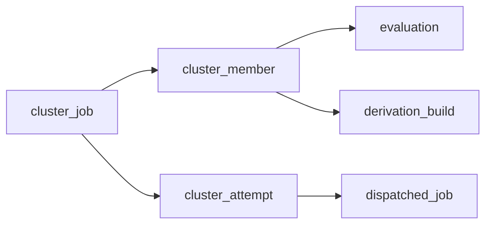

# Cluster Jobs

A cluster job groups existing jobs (evaluations, builds) that start together on distinct workers, all or nothing. Members stay ordinary jobs with a cluster reference; each try of the group is a cluster *attempt*.

## Tables

| Table | Key | Role |
|---|---|---|
| `cluster_job` | `id` | The group: `status` (`Queued`, `Running`, `Completed`, `Failed`, `Aborted`), `same_zone`, `attempts`, `retry_budget` |
| `cluster_member` | `cluster_job` | One member job: exactly one of `evaluation` or `derivation_build` (the anchor), plus `role`, `primary`, `pin` |
| `cluster_attempt` | `cluster_job` | One try: `created_at`, `started_at` (unset until every member accepted), `finished_at`, `outcome` (`Succeeded`, `Failed`, `PrepareFailed`, `Aborted`) |
| `dispatched_job` | `cluster_attempt` | A member's dispatch row; `NULL` for a single dispatch |

| Constraint | Effect |
|---|---|
| `CHECK (num_nonnulls(evaluation, derivation_build) = 1)` | A member names one job, never both or neither |
| `idx-cluster_member-evaluation`, `idx-cluster_member-derivation_build` (unique, partial) | A job belongs to at most one cluster |
| `idx-cluster_attempt-open` (unique on `cluster_job WHERE finished_at IS NULL`) | At most one open attempt per cluster |
| `dispatched_job.cluster_attempt` `ON DELETE SET NULL` | Member rows outlive their attempt as plain telemetry |

## Claim

`claim_cluster` (`backend/gradient-db/src/cluster.rs`) runs in one transaction:

1. Insert the `cluster_attempt` row, gated on `cluster_job.status = Queued`. `ON CONFLICT` on `idx-cluster_attempt-open` inserts nothing.
2. Claim each member with the single-dispatch claim statement (`claim_dispatch`): its own job key (`eval:<evaluation>`, `build:<anchor>`), its own gate, and `cluster_attempt` set.
3. The first statement that inserts nothing rolls the whole transaction back and returns `false`.

- `idx-cluster_attempt-open` arbitrates between server instances claiming one cluster, as `idx-dispatched_job-open-job` does for a single job.
- A member already open as a single dispatch loses its claim, and the attempt rolls back with it.

## Close

`close_cluster_attempt` closes an attempt with its outcome only while it is open. The same transaction closes every open member row of the attempt as `Abandoned`.

- A second close (a prepare timeout racing a member failure) returns `false` and touches nothing.

## Tracking

| Stage | Where a member is | Rule |
|---|---|---|
| Ready | Cluster book, under its own key | The eval and build dispatch passes look up each batch's memberships in one query (`cluster_membership`). Members of a `Queued` cluster join the book; members of any other cluster wait for it; non-members queue as before. |
| Waiting | Cluster book | A cluster is ready once every member arrived. A member key in the book counts as tracked. A member leaving readiness (resync prune, evaluation cancel) unreadies its cluster until the feed brings it back. |
| Offered | Job offers | Workers score members under their own key; single dispatch (`take_best_of_kind`) never sees them. |
| Running | Active jobs, marked with its attempt | A reject, a revoked peer or a disconnect never requeues a member as a single job. |

- A member evaluation always evaluates in one job, never as a split fetch-only job whose follow-up would run outside the cluster.
- An empty answer to `RequestJob` records an idle slot `(worker, kind)`. An assignment, a full worker or a disconnect clears it; entries older than 25 s (two worker heartbeats) are ignored. Idle slots are the planner's only view of free capacity.

## Placement

The `cluster-dispatch` pass runs every 5 s and whenever a `RequestJob` goes unanswered. It first expires overdue prepares, then places every ready cluster, prioritized clusters first, then the oldest.

- A worker is a seat for a member when it has an idle slot of the member's kind, can run the job (capabilities, project access) and matches the member's `pin`.
- Every member sits on its own worker (bipartite matching).
- With `same_zone`, all members sit in one zone; workers without a zone form one zone of their own.
- Among zones that seat every member, the lowest summed missing NAR size wins.
- A worker seated for one cluster is not offered to the next cluster of the same pass.
- A cluster without a full placement keeps waiting; single dispatch is unaffected.

## Prepare and Start

1. The scheduler takes the cluster and its seats in one step, refusing if a seat's worker went busy since the snapshot.
2. `claim_cluster` writes the attempt and every member's `dispatched_job` row; build members get their `Dispatched` transition.
3. Each seat's session sends `AssignJob` with `cluster` (`attempt`, `role`, `index`, `hold_secs`). The worker holds the job without running it.
4. Once every member accepted, `start_cluster_attempt` marks the attempt started and the cluster `Running`, and every member receives `StartCluster` with the roster.

| Event | Result |
|---|---|
| Every member accepts | `StartCluster` to every member |
| A member rejects | Attempt closed `PrepareFailed`, `AbortCluster` to every member, cluster waits again after 30 s |
| `scheduler.clusterPrepareTimeoutSecs` passes without every acceptance | Same as a reject |
| A held member reports `JobFailed` before the start (hold expired, drain, `AbortJob`) | Same as a reject; the report never reaches the build or evaluation |
| The claim is lost | Nothing written; the members go back to the dispatch passes, which re-read their cluster |

- A failed prepare does not consume the cluster's retry budget.
- `hold_secs` is `clusterPrepareTimeoutSecs` plus 10 s: a worker that never hears `StartCluster` releases the slot on its own.

## Signals

- `ClusterSignal` is relayed only within a started attempt and only from one of its members; anything else is dropped.
- `to` names one member by role and index; without it, every other member receives the signal.

## Related

- [Build Anchors](build-anchors.md)
- [Waiting and Recovery](waiting-and-recovery.md)
