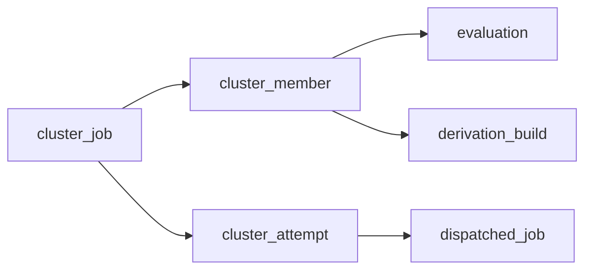

# Cluster Jobs

A cluster job is grouping existing jobs (evaluations, builds) for a joint start on distinct workers, all or nothing. Members remain ordinary jobs with a cluster reference. Each try of the group is a cluster *attempt*.

## Tables

| Table | Links to | Role |
|---|---|---|
| `cluster_job` | - | The group: `status` (`Queued`, `Running`, `Completed`, `Failed`, `Aborted`), `same_zone`, `attempts`, `retry_budget` |
| `cluster_member` | `cluster_job` | One member job: exactly one of `evaluation` or `derivation_build` (the shared build), plus `role`, `primary`, `pin` |
| `cluster_attempt` | `cluster_job` | One try: `created_at`, `started_at` (unset until every member accepted), `finished_at`, `outcome` (`Succeeded`, `Failed`, `PrepareFailed`, `Aborted`) |
| `dispatched_job` | `cluster_attempt` | A member's assignment row. `NULL` for a single assignment |

| Constraint | Effect |
|---|---|
| `CHECK (num_nonnulls(evaluation, derivation_build) = 1)` | A member is naming one job, never both or neither |
| `idx-cluster_member-evaluation`, `idx-cluster_member-derivation_build` (unique, partial) | At most one cluster per job |
| `idx-cluster_attempt-open` (unique on `cluster_job WHERE finished_at IS NULL`) | At most one open attempt per cluster |
| `dispatched_job.cluster_attempt` `ON DELETE SET NULL` | Member rows outlive their attempt as plain telemetry |
| `cluster_member`, `cluster_attempt` `ON DELETE CASCADE` | The hourly retention pass is deleting a finished cluster job past [`retentionDays`](../../reference/configuration.md#general). Deletion is immediate once evaluation garbage collection removed the members. The pass is never deleting an active cluster job |

## Claim

`claim_cluster` (`backend/gradient-db/src/scheduling/cluster/claim.rs`) is executing every step in one transaction.

1. Insert the `cluster_attempt` row, gated on `cluster_job.status = Queued`. `ON CONFLICT` on `idx-cluster_attempt-open` is inserting nothing.
2. Claim each member with the single-assignment claim statement (`claim_assignment`): its own job key (`eval:<evaluation>`, `build:<shared_build>`), its own start condition, and `cluster_attempt` set.
3. The first statement inserting nothing is rolling the whole transaction back. `claim_cluster` is then returning `false`.

- `idx-cluster_attempt-open` is arbitrating between server instances claiming one cluster. `idx-dispatched_job-open-job` is doing the same for a single job.
- A member already open as a single assignment is losing its claim, and the whole attempt is rolling back.

## Close

`close_cluster_attempt` is closing an attempt with its outcome only while the attempt is open. The same transaction is marking every open member row of the attempt `Abandoned`.

- A second close (a prepare timeout racing a member failure) is returning `false` without touching anything.

## Tracking

| Stage | Where a member is | Rule |
|---|---|---|
| Can start | Cluster book, under its own key | The eval and build assignment passes look up each batch's memberships in one query (`cluster_membership`). Members of a `Queued` cluster join the book. Members of any other cluster wait for that cluster. Non-members queue as before. |
| Waiting | Cluster book | A cluster can start once every member arrived. A member key in the book is considered tracked. A member unable to start any more (resync prune, evaluation cancel) is holding its cluster back until the feed is bringing the member back. |
| Offered | Job offers | Workers score members under their own key. Single assignment (`take_best_of_kind`) is never seeing them. |
| Running | Active jobs, marked with its attempt | A reject, a revoked peer or a disconnect can never requeue a member as a single job. |

- A member evaluation is always evaluating in one job, never as a split fetch-only job. The follow-up of a split job would start outside the cluster.
- An empty answer to `RequestJob` is recording an idle slot `(worker, kind)`. An assignment, a full worker or a disconnect is clearing the slot. The planner is ignoring entries older than 25 s (two worker heartbeats). Idle slots are the planner's only view of free capacity.

## Placement

The `cluster-dispatch` pass is running every 5 s and whenever a `RequestJob` is going unanswered. The pass is first expiring overdue prepares. Placement is then following for every cluster able to start, prioritized clusters first, then the oldest.

- A worker is a seat for a member when holding an idle slot of the member's kind and matching the member's `pin`. The worker must also be able to take the job (capabilities, project access).
- Every member is sitting on its own worker (bipartite matching).
- All members sit in one zone under `same_zone`. Workers without a zone form one zone of their own.
- The winning zone is the one with the lowest summed missing NAR size among zones seating every member.
- The pass is not offering a worker seated for one cluster to the next cluster.
- A cluster without a full placement is still waiting. Single assignment is unaffected.

## Prepare and Start

1. The scheduler is taking the cluster and its seats in one step. The scheduler is refusing the step when a seat's worker went busy since the snapshot.
2. `claim_cluster` is writing the attempt and every member's `dispatched_job` row. Build members get their `Assigned` transition.
3. Each seat's session is sending `AssignJob` with `cluster` (`attempt`, `role`, `index`, `hold_secs`). The worker is holding the job without starting the job.
4. `start_cluster_attempt` is marking the attempt started and the cluster `Running` once every member accepted. Every member is then receiving `StartCluster` with the roster.

| Event | Result |
|---|---|
| Every member accepted | `StartCluster` to every member |
| A member rejected | Attempt closed `PrepareFailed`, `AbortCluster` to every member, cluster waiting again after 30 s |
| `scheduler.clusterPrepareTimeoutSecs` passed without every acceptance | Same as a reject |
| A held member reporting `JobFailed` before the start (hold expired, drain, `AbortJob`) | Same as a reject. The report is never reaching the build or evaluation |
| The claim is lost | Nothing written. The members go back to the assignment passes, and those passes re-read their cluster |

- A failed prepare does not consume the cluster's retry budget.
- `hold_secs` is `clusterPrepareTimeoutSecs` plus 10 s. A worker never hearing `StartCluster` is releasing the slot on its own.

## Signals

- The server is forwarding a `ClusterSignal` only within a started attempt and only from one of its members. The server is dropping anything else.
- `to` is naming one member by role and index. Every other member is receiving the signal when `to` is absent.

## Recovery

A member's `JobCompleted` or `JobFailed` is releasing its job. The report is holding back the build or evaluation transition until the attempt is decided. The first deciding report is resolving the attempt. That verdict is then settling every member.

| Verdict | When | Attempt | Cluster | Members |
|---|---|---|---|---|
| Complete | Every member succeeded, or the primary succeeded | `Succeeded` | `Completed` | Reported members settle. Still-running ones end `Aborted` |
| Retry | A member failed or was lost, budget left, every member can still start | `Failed` | `Queued` | Every member job going back to the assignment passes |
| Fail | Same as Retry without budget, or a member can no longer start | `Failed` | `Failed` | Members settle with their own outcome. Requeueing failure kinds become `Permanent`. Survivors end `Aborted` |
| Abort | An evaluation abort reached a member | `Aborted` | `Aborted` | Survivors end `Aborted` |

- Reports arriving during the resolution of the attempt settle by the decided verdict.
- Members count as tracked while their attempt is open. `abandoned-dispatch-sweep` and the evaluation watchdog skip them.
- `cluster_job.retry_budget` is bounding retries, not the per-evaluation assignment budget.
- A member lost with its worker, or reaped after an unconfirmed abort, is reporting into the same verdict.

## Aging Reservations

A cluster able to start may find no simultaneously idle workers for `scheduler.clusterReserveAfterSecs` (600 s). Such a cluster is then reserving a placement instead of waiting for idle workers to line up by chance.

- Target: the planner's match over every connected eligible worker, idle workers seated first.
- Seats: a reserved worker is keeping its running jobs but getting no new single job of the reserved kind.
- Commit: the reservation is committing like an ordinary placement once every seat is idle.
- One at a time: only one cluster is holding a reservation. Other clusters plan over the unreserved idle workers.
- Release: after `scheduler.clusterReserveTimeoutSecs` (1800 s), on a seat's worker disconnecting, or on the cluster leaving the queue. The next planning pass is reserving again.

## Related

- [Shared Builds](shared-builds.md)
- [Waiting and Recovery](waiting-and-recovery.md)
- [Workers: Zones](../../concepts/workers.md#zones)
- [Jobs: Cluster Members](../proto/jobs.md#cluster-members)
- `nix/tests/gradient/cluster/`: the `gradient-cluster` VM test
