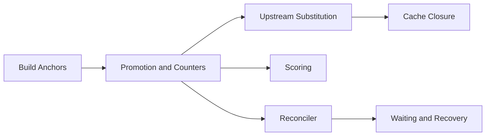

# Scheduler

How an evaluated derivation becomes a finished, cached build. Every derivation is built once globally (the build *anchor*); the pages follow an anchor from creation to dispatch.

-   :material-anchor: **[Build Anchors](build-anchors.md)**

    One `derivation_build` row per derivation, and the `graph` actor that owns every write.

-   :material-counter: **[Promotion and Counters](promotion-and-counters.md)**

    How an anchor moves from `Created` to `Queued`, and the counters every gate reads.

-   :material-cloud-download: **[Upstream Substitution](upstream-substitution.md)**

    Probing upstream caches and fetching outputs instead of building them.

-   :material-shield-check: **[Cache Closure](cache-closure.md)**

    The whole-closure invariant, its runtime counter and the self-heal after a failed build.

-   :material-sync: **[Reconciler](reconciler.md)**

    Heals for state no event reaches, and the emitter every anchor move fans out through.

-   :material-timer-sand: **[Waiting and Recovery](waiting-and-recovery.md)**

    Split flake jobs, parked evaluations, re-offered jobs and startup recovery.

-   :material-scale-balance: **[Scoring](scoring.md)**

    How the policy ranks pending jobs for the requesting worker.

-   :material-server-network: **[Cluster Jobs](clusters.md)**

    Jobs claimed together on distinct workers, all or nothing.

## Related

- [Scheduler Policies](../../reference/scheduler-policies.md): the rules and their magnitudes
- [Capabilities and Dispatch](../proto/capabilities-and-dispatch.md): the worker side of assignment
