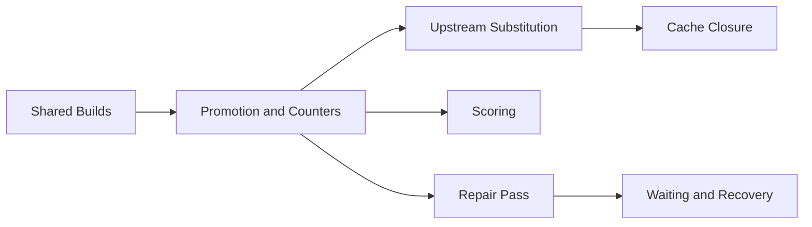

# Scheduler

The path from an evaluated derivation to a finished, cached build. Every derivation is built once globally, as one *shared build*. The pages are following a shared build from creation to assignment.

-   :material-source-branch: **[Shared Builds](shared-builds.md)**

    One `derivation_build` row per derivation, and the graph writer owning every write.

-   :material-counter: **[Promotion and Counters](promotion-and-counters.md)**

    A shared build moving from `Created` to `Queued`, and the counters behind every start condition.

-   :material-cloud-download: **[Upstream Substitution](upstream-substitution.md)**

    Probing upstream caches and fetching outputs instead of building them.

-   :material-shield-check: **[Cache Closure](cache-closure.md)**

    The complete-closure invariant, its runtime counter and the self-heal after a failed build.

-   :material-sync: **[Repair Pass](repair-pass.md)**

    Heals for state beyond the reach of any event, and the emitter fanning out every shared build move.

-   :material-timer-sand: **[Waiting and Recovery](waiting-and-recovery.md)**

    Split flake jobs, parked evaluations, re-offered jobs and startup recovery.

-   :material-scale-balance: **[Scoring](scoring.md)**

    Policy ranking of pending jobs for the requesting worker.

-   :material-server-network: **[Cluster Jobs](clusters.md)**

    Jobs claimed together on distinct workers, all or nothing.

## Related

- [Scheduler Policies](../../reference/scheduler-policies.md): the rules and their magnitudes
- [Capabilities and Assignment](../proto/capabilities-and-dispatch.md): the worker side of assignment
