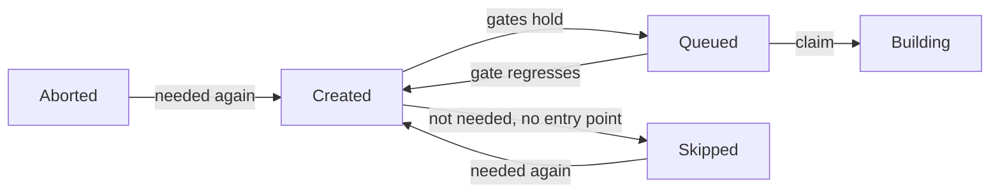

# Promotion and Counters

How a shared build (`derivation_build`) moves from `Created` to `Queued`, and how an evaluation knows it still waits. Every gate reads maintained columns; the event that changes a fact moves the column, and the consistency check is the only backstop.

## Start Condition Columns

All on `derivation_build`, moved by transitions and never derived by a per-row walk.

| Column | Meaning | Moved by |
|---|---|---|
| `missing_runtime_deps` | Runtime dependencies (`kind IN (1, 2)`) leading to a shared build without a complete closure | `runtime_can_start`: seeded when a NAR lands, rippled up and down by the SQL function `ripple_missing_runtime_deps` |
| `fetchable` | Terminal success (`Completed`, `Substituted`) with a complete closure | `can_start::became_fetchable`, `can_start::lost_fetchability` |
| `blocking_deps` | Direct dependencies (every edge in `derivation_dependency`) that are not `fetchable` | One-hop ripple from the shared builds a `fetchable` flip returned |
| `wanted` | Some open entry point still needs the shared build | `can_start::update_need` |

- **Complete closure** (`graph_sql::shared_build_complete_predicate`): every output has a NAR in the cache and `missing_runtime_deps = 0`. The `EXISTS` over `derivation_output` stops a shared build with no output rows from reading complete.
- An upstream copy never counts as `fetchable`. A build that needs a shared build available in an upstream cache waits for its passthrough; builds pull every input from the Gradient cache.
- A flip writes the flag with a `RETURNING` of exactly the changed rows, and only those ripple. A ripple from a state instead of a transition drives a counter below zero, where `= 0` never holds again.
- Flip and ripple share one transaction under `can_start::lock_shared_builds` (`derivation`-ordered `FOR NO KEY UPDATE`), which returns the `SharedBuildLock` proof both functions require.
- A complete closure is transitive and ripples level by level; `blocking_deps` moves one hop and stops: reaching zero queues the waiting build and never makes that build `fetchable`.
- A transitive ripple is one SQL function call (current bodies in `m20261001_000001_plain_concept_names.rs`): every level is counted, locked in order and moved inside the function. A chain of 163 levels costs one round trip instead of three per level. Unit tests in `graph/runtime_can_start.rs` and `graph/walk_completeness.rs` hold the function bodies to the module predicates; a predicate change needs a migration.

## Promotion Gates

`graph_sql::gates_predicate` is the one definition; `graph_sql::promotable_predicate` adds `status = Created`.

| Gate | Build | Passthrough (`cache_available`) |
|---|---|---|
| `derivation.walked` | Required | Required |
| A `build_job` names the derivation | Required | Required |
| `wanted` | Required | Required |
| `probed` (upstream probe answered) | Required | - |
| `blocking_deps = 0` | Required | - |
| Own `.drv` NAR in the cache (`drv_present_predicate`) | Required | - |

Events that promote the shared builds they touched (`can_start::promote`, gate embedded, candidate list is only a bound):

- An imported batch: `seed_blocking_deps` then `promote` over the batch, plus whatever the batch's needs-build update gained.
- A dependency turning `fetchable`: `became_fetchable` promotes each build that needs the dependency and reached zero.
- A `.drv` NAR arriving: `gradient-graph/src/nar.rs` promotes the `.drv` owners.
- Any newly needed build, through `update_and_settle_need` (see [Skipped and Thaw](#skipped-and-thaw)).
- Stream completion and the graph-stuck heal: `can_start::promote_closure` over the evaluation's closure (see the [repair pass](repair-pass.md)).

## Queued Invariant

- The assigner reads the status and never re-derives the gates. `Queued` therefore claims the gates held.
- Every writer of `Queued` embeds `promotable_predicate`, or settles its rows with `can_start::unpromote_ungated` in the same call.
- `unpromote_ungated` moves only `Queued` rows with no open assignment; a `Building` shared build is left to finish.
- `lost_fetchability` raises `blocking_deps` on the builds that need the flipped ones and demotes the `Queued` ones with no open assignment to `Created` in the same statement (`RIPPLE_UP`), then updates the needs-build marks from the flipped shared builds.
- `assignment_record::claim_assignment` inserts the assignment row only while the shared build is still `Queued` with the expected `cache_available`; a regressed job is dropped instead of handed out.
- `can_start::repair_can_start` is the consistency check's backstop for a lost move.

## Needs Build

A shared build is **open** (`graph_sql::open_predicate`) when not `fetchable` and not in `BuildStatus::TERMINAL_FAILURE`. Builders, `Skipped`, `Aborted`, and a `Completed` shared build with a missing dependency in its closure are all open.

- `graph_sql::open_closure_cte_body` is the one walk behind the needs-build mark and naming: seeds step over runtime dependencies; a **builder** (`builder_predicate`: walked, probed, not available in a cache, in `BUILDER_STATUSES`) also steps over build dependencies.
- The walk reaches open shared builds only: a `fetchable` or failed shared build ends the walk.
- A passthrough is reached but never stepped through on a build dependency. The input closure of a passthrough output is never built.
- The needs-build mark is a column: the mark flows down from the entry points while the can-start counters flow up from the leaves, and a one-hop predicate cannot carry the downward direction.
- `update_need` walks the region below the given roots (roots included) in one statement, then `WRITE_NEED` writes the answer as a bound `unnest` array: a recursive CTE carries no usable row estimate, and a membership subquery degrades to a sequential scan.
- The write returns each changed row with its new value: gained and lost sets for the caller.

Callers of `update_need`, each followed by `settle_need`:

- The transition-effects emitter (`status/effects.rs`) for every transition that crosses `BUILDER_STATUSES` in either direction.
- Events that change the needs-build mark at an unchanged status, through `update_and_settle_need`: batch import (new builder, new entry point, adopted runtime dependencies, upstream hit, probe answer), `demote_cached_output`, `lost_fetchability`, an exhausted substitution, new runtime dependencies from a NAR, the per-task evaluation GC and every adoption.

## Skipped and Thaw

`can_start::settle_need` applies a needs-build move in a fixed order:

| Side | Steps |
|---|---|
| Gained | `thaw_wanted` (`Skipped`/`Aborted` -> `Created`, `attempt = 0`), then `promote` |
| Lost | `unpromote_ungated`, then `skip_unwanted` (`Created`, not needed, no `entry_point` -> `Skipped`) |

- `Skipped` is settled work: no gate acts on a skipped build and no evaluation waits for one.
- A thaw goes to `Created`, never to `Queued`; the following promote reads the gates.
- `Aborted` thaws the same way: an abort is no verdict.
- `update_need` and `settle_need` are crate-private; other crates call `update_and_settle_need`: every needs-build move skips and thaws inline. The consistency check's `settle_skipped` is the table-wide backstop and reports `skipped_moves`.

## Evaluation Verdict

- `graph_sql::blocks_evaluation`: the status is in `NEED_BUILD_STATUSES` and the shared build is `wanted`, or the status is `Queued`/`Building` (the assigner hands those out regardless).
- A pending shared build nothing needs never blocks: nothing will ever promote such a build.
- Once nothing blocks, `check_evaluation_done` writes `Failed` when any named shared build is in `BuildStatus::REQUEUEABLE` (includes `Aborted`) or an error message exists, `Completed` otherwise.
- Losing the needs-build mark moves no status; the emitter finalizes the evaluations naming the shared builds that lost the mark.

## Evaluation Counters

Five columns on `evaluation`, over the shared builds its `build_job` rows name:

| Column | Counts |
|---|---|
| `named_shared_builds` | Every named shared build |
| `active_shared_builds` | `blocks_evaluation` |
| `failed_shared_builds` | `BuildStatus::REQUEUEABLE` |
| `queued_shared_builds` | `Queued` |
| `building_shared_builds` | `Building` |

- **Triggers** (current bodies in `m20261001_000001_plain_concept_names.rs`): `evaluation_shared_build_moved` (per row, `AFTER UPDATE OF status, wanted`), `evaluation_shared_build_named` / `evaluation_shared_build_unnamed` (per statement on `build_job` insert/delete). Raw SQL and ORM writes are covered alike.
- Triggers append signed rows to `evaluation_shared_build_delta`, for live evaluations only, and take no lock.
- **Membership:** the SQL function `evaluation_shared_build_counts(status, wanted)`. A unit test in `evaluations/counters.rs` holds its body to `graph/predicates.rs`; a predicate change needs a migration.
- **Fold:** `fold_shared_build_deltas` is running at the start of every waiting-state pass, one `DELETE ... RETURNING` under advisory lock `640`; an instance that finds the lock taken skips.
- **Read:** `eval_counters` returns folded columns plus unfolded deltas.
- **Counters answer only "not yet":** a naming and a transition in flight together can miss each other. A zero is confirmed by `reachability::eval_blocked`; a contradicted value is recounted (`recount_evaluations`, under the fold lock).
- The consistency check recounts every in-flight evaluation and reports `eval_counter_drift`.

## Naming and Adoption

- A batch names what it walked plus the direct inputs; the walk prunes on `walked AND unwalked_inputs = 0`. The interior of a pruned subtree is named only by the evaluation that walked the subtree.
- Deleting that evaluation cascades those names away. `reachability::adopt_pending_closures` is running the open-closure walk from every `build_job` of a live evaluation and inserts the missing `(evaluation, derivation)` rows (`ON CONFLICT DO NOTHING`).
- Callers: the per-task GC (`settle_after_delete`, only when a cascaded name belonged to an open shared build), the [repair pass](repair-pass.md) (`adopt_pending_closure` for one evaluation), and the consistency check when `pending_orphan_frontier` finds an unnamed open shared build one edge below a named one.

## Walk Completeness

- `derivation.walked`: the derivation's own record is in (outputs, every edge, input sources). Unknown inputs are inserted as stubs in the same transaction; a stub is never promoted or handed out.
- `derivation.unwalked_inputs`: direct build inputs (`kind IN (0, 2)`) whose subtree is not recorded. Seeded at import, rippled as inputs complete by the SQL function `ripple_unwalked_inputs`, recounted by the consistency check (`walk_drift`).
- Events that clear `walked`: the orphan derivation GC (derivations surviving a deleted dependency they need, followed by `unpromote_ungated`), the missing-input self-heal and the demote path (`can_start::unwalk_derivations`).

## Dependency Failure

- `promotion::cascade_dependency_failed` marks every `Created`/`Queued`/`FailedTransient` build that needs the failed one `DependencyFailed` on a fresh terminal-failure transition.
- `promotion::repair_dependency_failed` repeats the walk within one evaluation's closure at stream completion and on the graph-stuck heal. Catches builds thawed after their dependency failed.
- Neither walk enters a shared build available in a cache (`graph_sql::non_passthrough_predicate`).

## Consistency Check

`consistency::graph_consistency_report` recounts in dependency order:

| Step | Reports |
|---|---|
| `unwalked_inputs` | `walk_drift` |
| `missing_runtime_deps` | `runtime_drift` |
| `fetchable` (`repair_fetchable`) | `counter_drift` (with `blocking_deps`) |
| `wanted` (`recount_wanted`) | `need_drift` |
| `settle_skipped` | `skipped_moves` |
| `blocking_deps` + queue (`repair_can_start`) | `counter_drift`, `unpromoted_startable` |
| Adoption | `adopted` |
| Evaluation counters | `eval_counter_drift`, `wedged_building_evals` |
