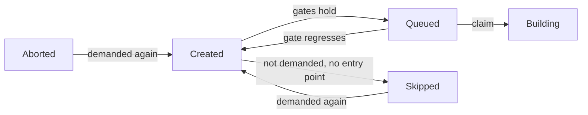

# Promotion and Counters

How a build (anchor) moves from `Created` to `Queued`, and how an evaluation knows it still waits. Every gate reads maintained columns; the event that changes a fact moves the column, and the consistency sweep is the only backstop.

## Readiness Columns

All on `derivation_build`, moved by transitions and never derived by a per-row walk.

| Column | Meaning | Moved by |
|---|---|---|
| `missing_runtime_deps` | Runtime edges (`kind IN (1, 2)`) leading to an anchor that is not whole | `runtime_readiness`: seeded when a NAR lands, rippled up and down level by level |
| `fetchable` | Terminal success (`Completed`, `Substituted`) and whole | `readiness::became_fetchable`, `readiness::lost_fetchability` |
| `unready_deps` | Direct dependencies (every edge in `derivation_dependency`) that are not `fetchable` | One-hop ripple from the anchors a `fetchable` flip returned |
| `demanded` | Some open entry point still wants the anchor | `readiness::recompute_demand` |

- **Whole** (`graph_sql::anchor_whole_predicate`): every output has a NAR in the cache and `missing_runtime_deps = 0`. The `EXISTS` over `derivation_output` stops an anchor with no output rows from reading whole.
- An upstream copy never counts as `fetchable`. A dependent of an unrelayed substitutable anchor waits for the relay; builds pull every input from the Gradient cache.
- A flip writes the flag with a `RETURNING` of exactly the changed rows, and only those ripple. A ripple from a state instead of a transition drives a counter below zero, where `= 0` never holds again.
- Flip and ripple share one transaction under `readiness::lock_anchors` (`derivation`-ordered `FOR NO KEY UPDATE`), which returns the `AnchorLock` proof both functions require.
- Wholeness is transitive and ripples level by level; `unready_deps` moves one hop and stops, since reaching zero queues a dependent and never makes the dependent `fetchable`.

## Promotion Gates

`graph_sql::gates_predicate` is the one definition; `graph_sql::promotable_predicate` adds `status = Created`.

| Gate | Build | Relay (`substitutable`) |
|---|---|---|
| `derivation.walked` | Required | Required |
| A `build_job` names the derivation | Required | Required |
| `demanded` | Required | Required |
| `probed` (upstream probe answered) | Required | - |
| `unready_deps = 0` | Required | - |
| Own `.drv` NAR in the cache (`drv_present_predicate`) | Required | - |

Events that promote the anchors they touched (`readiness::promote`, gate embedded, candidate list is only a bound):

- An ingest batch: `seed_unready_deps` then `promote` over the batch, plus whatever the batch's demand recompute gained.
- A dependency turning `fetchable`: `became_fetchable` promotes the dependents that reached zero.
- A `.drv` NAR arriving: `gradient-graph/src/nar.rs` promotes the `.drv` owners.
- Any demand gain, through `recompute_and_settle_demand` (see Skipped and Thaw).
- Stream completion and the graph-stuck heal: `readiness::promote_closure` over the evaluation's closure (see the reconciler).

## Queued Invariant

- Dispatch reads the status and never re-derives the gates. `Queued` therefore claims the gates held.
- Every writer of `Queued` embeds `promotable_predicate`, or settles its rows with `readiness::unpromote_ungated` in the same call.
- `unpromote_ungated` moves only `Queued` rows with no open dispatch; a `Building` anchor is left to finish.
- `lost_fetchability` raises the dependents' `unready_deps` and demotes `Queued` ones with no open dispatch to `Created` in the same statement (`RIPPLE_UP`), then recomputes demand from the flipped anchors.
- `dispatch_record::claim_dispatch` inserts the dispatch row only while the anchor is still `Queued` with the expected `substitutable`; a regressed job is dropped instead of dispatched.
- `readiness::repair_readiness` is the sweep's backstop for a lost move.

## Demand

An anchor is **open** (`graph_sql::open_predicate`) when not `fetchable` and not in `BuildStatus::TERMINAL_FAILURE`. Builders, `Skipped`, `Aborted`, and a `Completed` anchor with a hole in its closure are all open.

- `graph_sql::open_closure_cte_body` is the one walk behind demand and naming: seeds step over runtime edges; a **builder** (`builder_predicate`: walked, probed, not substitutable, in `BUILDER_STATUSES`) also steps over build edges.
- The walk reaches open anchors only: a `fetchable` or failed anchor ends the walk.
- A relay is reached but never stepped through on a build edge. The input closure of a relayed output is never built.
- Demand is a column: demand flows down from the entry points while readiness flows up from the leaves, and a one-hop predicate cannot carry the downward direction.
- `recompute_demand` walks the region below the given roots (roots included) in one statement, then `WRITE_DEMAND` writes the answer as a bound `unnest` array: a recursive CTE carries no usable row estimate, and a membership subquery degrades to a sequential scan.
- The write returns each changed row with its new value: gained and lost sets for the caller.

Callers of `recompute_demand`, each followed by `settle_demand`:

- The transition-effects emitter (`status/effects.rs`) for every transition that crosses `BUILDER_STATUSES` in either direction.
- Events that change demand at an unchanged status, through `recompute_and_settle_demand`: ingest (new builder, new entry point, adopted runtime edges, upstream hit, probe answer), `demote_cached_output`, `lost_fetchability`, an exhausted substitution, new runtime edges from a NAR, the per-task evaluation GC and every adoption.

## Skipped and Thaw

`readiness::settle_demand` applies a demand move in a fixed order:

| Side | Steps |
|---|---|
| Gained | `thaw_demanded` (`Skipped`/`Aborted` -> `Created`, `attempt = 0`), then `promote` |
| Lost | `unpromote_ungated`, then `skip_undemanded` (`Created`, not demanded, no `entry_point` -> `Skipped`) |

- `Skipped` is settled work: no gate acts on it and no evaluation waits for it.
- A thaw goes to `Created`, never to `Queued`; the following promote reads the gates.
- `Aborted` thaws the same way: an abort is no verdict.
- `recompute_demand` and `settle_demand` are crate-private; other crates call `recompute_and_settle_demand`: every demand move skips and thaws inline. The sweep's `settle_skipped` is the table-wide backstop and reports `skipped_moves`.

## Evaluation Verdict

- `graph_sql::blocks_evaluation`: the status is in `DEMANDABLE_STATUSES` and the anchor is `demanded`, or the status is `Queued`/`Building` (the dispatcher hands those out regardless).
- An undemanded pending anchor never blocks: nothing will ever promote the anchor.
- Once nothing blocks, `check_evaluation_done` writes `Failed` when any named anchor is in `BuildStatus::REQUEUEABLE` (includes `Aborted`) or an error message exists, `Completed` otherwise.
- A demand loss moves no status; the emitter finalizes the evaluations naming what lost demand.

## Evaluation Counters

Five columns on `evaluation`, over the anchors its `build_job` rows name:

| Column | Counts |
|---|---|
| `named_anchors` | Every named anchor |
| `active_anchors` | `blocks_evaluation` |
| `failed_anchors` | `BuildStatus::REQUEUEABLE` |
| `queued_anchors` | `Queued` |
| `building_anchors` | `Building` |

- **Triggers** (`m20260923_000002_evaluation_anchor_counters.rs`): `evaluation_anchor_moved` (per row, `AFTER UPDATE OF status, demanded`), `evaluation_anchor_named` / `evaluation_anchor_unnamed` (per statement on `build_job` insert/delete). Raw SQL and ORM writes are covered alike.
- Triggers append signed rows to `evaluation_anchor_delta`, for live evaluations only, and take no lock.
- **Membership:** the SQL function `evaluation_anchor_counts(status, demanded)`. A unit test in `eval_counters.rs` holds its body to `graph_sql`; a predicate change needs a migration.
- **Fold:** `fold_anchor_deltas` runs at the start of every waiting-state pass, one `DELETE ... RETURNING` under advisory lock `640`; an instance that finds the lock taken skips.
- **Read:** `eval_counters` returns folded columns plus unfolded deltas.
- **Counters answer only "not yet":** a naming and a transition in flight together can miss each other. A zero is confirmed by `reachability::eval_blocked`; a contradicted value is recounted (`recount_evaluations`, under the fold lock).
- The consistency sweep recounts every in-flight evaluation and reports `eval_counter_drift`.

## Naming and Adoption

- A batch names what it walked plus the direct inputs; the walk prunes on `walked AND unwalked_inputs = 0`. The interior of a pruned subtree is named only by the evaluation that walked the subtree.
- Deleting that evaluation cascades those names away. `reachability::adopt_pending_closures` runs the open-closure walk from every `build_job` of a live evaluation and inserts the missing `(evaluation, derivation)` rows (`ON CONFLICT DO NOTHING`).
- Callers: the per-task GC (`settle_after_delete`, only when a cascaded name belonged to an open anchor), the graph reconciler (`adopt_pending_closure` for one evaluation), and the sweep when `pending_orphan_frontier` finds an unnamed open anchor one edge below a named one.

## Walk Completeness

- `derivation.walked`: the derivation's own record is in (outputs, every edge, input sources). Unknown inputs are inserted as stubs in the same transaction; a stub is never promoted or dispatched.
- `derivation.unwalked_inputs`: direct build inputs (`kind IN (0, 2)`) whose subtree is not recorded. Seeded at ingest, rippled as inputs complete, recounted by the sweep (`walk_drift`).
- Events that clear `walked`: the orphan derivation GC (dependents surviving a deleted dependency, followed by `unpromote_ungated`), the missing-input self-heal and the demote path (`readiness::unwalk_derivations`).

## Dependency Failure

- `promotion::cascade_dependency_failed` marks every `Created`/`Queued`/`FailedTransient` dependent `DependencyFailed` on a fresh terminal-failure transition.
- `promotion::reconcile_dependency_failed` repeats the walk within one evaluation's closure at stream completion and on the graph-stuck heal. Catches dependents thawed after their dependency failed.
- Neither walk enters a substitutable anchor (`graph_sql::unrelayed_predicate`).

## Consistency Sweep

`consistency::graph_consistency_report` recounts in dependency order:

| Step | Reports |
|---|---|
| `unwalked_inputs` | `walk_drift` |
| `missing_runtime_deps` | `runtime_drift` |
| `fetchable` (`repair_fetchable`) | `counter_drift` (with `unready_deps`) |
| `demanded` (`recount_demanded`) | `demand_drift` |
| `settle_skipped` | `skipped_moves` |
| `unready_deps` + queue (`repair_readiness`) | `counter_drift`, `unpromoted_ready` |
| Adoption | `adopted` |
| Evaluation counters | `eval_counter_drift`, `wedged_building_evals` |
