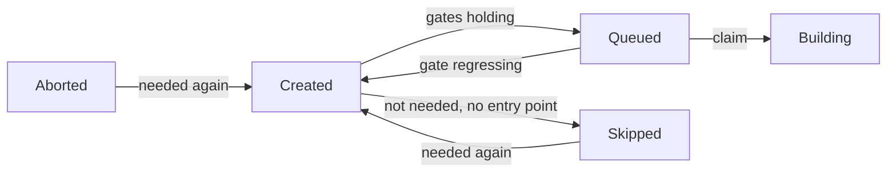

# Promotion and Counters

The path of a shared build (`derivation_build`) from `Created` to `Queued`, and the counters telling an evaluation to keep waiting. Every gate is reading maintained columns. The event changing a fact is moving the column. The consistency check is the only backstop.

## Start Condition Columns

All on `derivation_build`, moved by transitions and never derived by a per-row walk.

| Column | Meaning | Moved by |
|---|---|---|
| `missing_runtime_deps` | Runtime dependencies (`kind IN (1, 2)`) leading to a shared build without a complete closure | `runtime_can_start`: seeded on a NAR landing, rippled up and down by the SQL function `ripple_missing_runtime_deps` |
| `fetchable` | Terminal success (`Completed`, `Substituted`) with a complete closure | `can_start::became_fetchable`, `can_start::lost_fetchability` |
| `blocking_deps` | Direct dependencies (every edge in `derivation_dependency`) that are not `fetchable` | One-hop ripple from the shared builds a `fetchable` flip returned |
| `wanted` | Shared build still wanted by some open entry point | `can_start::update_need` |

- **Complete closure** (`graph_sql::shared_build_complete_predicate`): every output with a NAR in the cache, and `missing_runtime_deps = 0`. The `EXISTS` over `derivation_output` is keeping a shared build without output rows from reading complete.
- An upstream copy can never count as `fetchable`. A build needing a shared build available in an upstream cache is waiting for its passthrough. Builds pull every input from the Gradient cache.
- A flip is writing the flag with a `RETURNING` of exactly the changed rows, and only those ripple. A ripple from a state instead of a transition would drive a counter below zero. `= 0` can never hold again for such a counter.
- Flip and ripple share one transaction under `can_start::lock_shared_builds` (`derivation`-ordered `FOR NO KEY UPDATE`). The lock is returning the `SharedBuildLock` proof required by both functions.
- A complete closure is transitive and rippling level by level. `blocking_deps` is moving one hop and stopping. Reaching zero is queueing the waiting build and never making that build `fetchable`.
- A transitive ripple is one SQL function call (current bodies in `m20261001_000001_plain_concept_names.rs`). The function is counting, locking in order and moving every level internally. A chain of 163 levels is costing one round trip instead of three per level. Unit tests in `graph/runtime_can_start.rs` and `graph/walk_completeness.rs` hold the function bodies to the module predicates. A predicate change is requiring a migration.

## Promotion Gates

`graph_sql::gates_predicate` is the one definition. `graph_sql::promotable_predicate` is adding `status = Created`.

| Gate | Build | Passthrough (`cache_available`) |
|---|---|---|
| `derivation.walked` | Required | Required |
| A `build_job` naming the derivation | Required | Required |
| `wanted` | Required | Required |
| `probed` (upstream probe answered) | Required | - |
| `blocking_deps = 0` | Required | - |
| Own `.drv` NAR in the cache (`drv_present_predicate`) | Required | - |

### Promoting Events

Each event is promoting the shared builds touched by that event through `can_start::promote`. The gate is embedded, and the candidate list is only a bound.

- An imported batch: `seed_blocking_deps` then `promote` over the batch, plus whatever the batch's needs-build update gained.
- A dependency turning `fetchable`: `became_fetchable` is promoting each build that is needing the dependency and reached zero.
- A `.drv` NAR arriving: `gradient-graph/src/nar.rs` is promoting the `.drv` owners.
- Any newly needed build, through `update_and_settle_need` (see [Skipped and Thaw](#skipped-and-thaw)).
- Stream completion and the graph-stuck heal: `can_start::promote_closure` over the evaluation's closure (see the [repair pass](repair-pass.md)).

## Queued Invariant

- The assigner is reading the status and never re-deriving the gates. `Queued` is therefore claiming the gates held.
- Every writer of `Queued` is embedding `promotable_predicate` or settling its rows with `can_start::unpromote_ungated` in the same call.
- `unpromote_ungated` is moving only `Queued` rows without an open assignment. A `Building` shared build can finish undisturbed.
- `lost_fetchability` is raising `blocking_deps` on the builds needing the flipped ones. The same statement (`RIPPLE_UP`) is demoting the `Queued` ones without an open assignment to `Created`. The function is then updating the needs-build marks from the flipped shared builds.
- `assignment_record::claim_assignment` is inserting the assignment row only while the shared build is still `Queued` with the expected `cache_available`. The claim is dropping a regressed job instead of handing the job out.
- `can_start::repair_can_start` is the consistency check's backstop for a lost move.

## Needs Build

A shared build is **open** (`graph_sql::open_predicate`) when not `fetchable` and not in `BuildStatus::TERMINAL_FAILURE`. Builders, `Skipped`, `Aborted`, and a `Completed` shared build with a missing dependency in its closure are all open.

- `graph_sql::open_closure_cte_body` is the one walk behind the needs-build mark and naming. Seeds step over runtime dependencies. A **builder** (`builder_predicate`: walked, probed, not available in a cache, in `BUILDER_STATUSES`) is also stepping over build dependencies.
- The walk is reaching open shared builds only. A `fetchable` or failed shared build is ending the walk.
- The walk is reaching a passthrough but never stepping through the passthrough on a build dependency. No job is ever building the input closure of a passthrough output.
- The needs-build mark is a column. The mark is flowing down from the entry points, while the can-start counters flow up from the leaves. A one-hop predicate cannot carry the downward direction.
- `update_need` is walking the region below the given roots (roots included) in one statement. `WRITE_NEED` is then writing the answer as a bound `unnest` array. A recursive CTE is carrying no usable row estimate. A membership subquery is degrading to a sequential scan.
- The write is returning each changed row with its new value, as gained and lost sets for the caller.

### Callers of `update_need`

`settle_need` is following each call.

- **Status transitions:** the transition-effects emitter (`status/effects.rs`) for every transition crossing `BUILDER_STATUSES` in either direction.
- **Unchanged status:** events moving the needs-build mark without a status change, through `update_and_settle_need`.
    - Batch import (new builder, new entry point, adopted runtime dependencies, upstream hit, probe answer)
    - `demote_cached_output` and `lost_fetchability`
    - An exhausted substitution
    - New runtime dependencies from a NAR
    - The per-task evaluation GC and every adoption

## Skipped and Thaw

`can_start::settle_need` is applying a needs-build move in a fixed order.

| Side | Steps |
|---|---|
| Gained | `thaw_wanted` (`Skipped`/`Aborted` -> `Created`, `attempt = 0`), then `promote` |
| Lost | `unpromote_ungated`, then `skip_unwanted` (`Created`, not needed, no `entry_point` -> `Skipped`) |

- `Skipped` is settled work. No gate is acting on a skipped build, and no evaluation is waiting for one.
- A thaw is going to `Created`, never to `Queued`. The following promote is reading the gates.
- `Aborted` is thawing the same way. An abort is no verdict.
- `update_need` and `settle_need` are crate-private. Other crates call `update_and_settle_need`, and every needs-build move is skipping and thawing inline. The consistency check's `settle_skipped` is the table-wide backstop, reporting `skipped_moves`.

## Evaluation Verdict

- `graph_sql::blocks_evaluation`: the status is in `NEED_BUILD_STATUSES` and the shared build is `wanted`, or the status is `Queued`/`Building` (the assigner is handing those out regardless).
- A pending shared build wanted by nothing is never blocking. Nothing will ever promote such a build.
- `check_evaluation_done` is writing a verdict once nothing is blocking. The verdict is `Failed` when any named shared build is in `BuildStatus::REQUEUEABLE` (`Aborted` included) or an error message is present. The verdict is `Completed` otherwise.
- Losing the needs-build mark is moving no status. The emitter is finalizing the evaluations naming the shared builds that lost the mark.

## Evaluation Counters

Five columns on `evaluation`, over the shared builds named by its `build_job` rows.

| Column | Counts |
|---|---|
| `named_shared_builds` | Every named shared build |
| `active_shared_builds` | `blocks_evaluation` |
| `failed_shared_builds` | `BuildStatus::REQUEUEABLE` |
| `queued_shared_builds` | `Queued` |
| `building_shared_builds` | `Building` |

- **Triggers** (current bodies in `m20261001_000001_plain_concept_names.rs`): `evaluation_shared_build_moved` (per row, `AFTER UPDATE OF status, wanted`), `evaluation_shared_build_named` / `evaluation_shared_build_unnamed` (per statement on `build_job` insert/delete). The triggers cover raw SQL and ORM writes alike.
- Triggers append signed rows to `evaluation_shared_build_delta`, for live evaluations only, and take no lock.
- **Membership:** the SQL function `evaluation_shared_build_counts(status, wanted)`. A unit test in `evaluations/counters.rs` is holding its body to `graph/predicates.rs`. A predicate change is requiring a migration.
- **Fold:** `fold_shared_build_deltas` is running at the start of every waiting-state pass, one `DELETE ... RETURNING` under advisory lock `640`. An instance finding the lock taken is skipping the fold. The fold is also skipping every evaluation row held by another transaction (`SKIP LOCKED`), and those deltas wait for the next pass. The fold is never waiting on an evaluation row and cannot deadlock with the graph writer.
- **Read:** `eval_counters` is returning folded columns plus unfolded deltas.
- **Counters answer only "not yet":** a naming and a transition in flight together can miss each other. `reachability::eval_blocked` is confirming a zero. `recount_evaluations` is recounting a contradicted value under the fold lock. The recount is skipping an evaluation held by another transaction, like the fold. The next contradicting read is recounting that evaluation.
- The consistency check is recounting every in-flight evaluation and reporting `eval_counter_drift`.

## Naming and Adoption

- A batch is naming every walked derivation plus the direct inputs. The walk is pruning on `walked AND unwalked_inputs = 0`. Only the evaluation that walked a pruned subtree is naming its interior.
- Deleting that evaluation is cascading those names away. `reachability::adopt_pending_closures` is running the open-closure walk from every `build_job` of a live evaluation. The function is inserting the missing `(evaluation, derivation)` rows (`ON CONFLICT DO NOTHING`).
- Callers: the per-task GC, the [repair pass](repair-pass.md) and the consistency check. The GC is calling through `settle_after_delete`, only when a cascaded name belonged to an open shared build. The repair pass is calling `adopt_pending_closure` for one evaluation. The consistency check is calling once `pending_orphan_frontier` is finding an unnamed open shared build one edge below a named one.

## Walk Completeness

- `derivation.walked`: the derivation's own record is present (outputs, every edge, input sources). The same transaction is inserting unknown inputs as stubs. A stub is never promoted or handed out.
- `derivation.unwalked_inputs`: direct build inputs (`kind IN (0, 2)`) whose subtree is not recorded. Seeded at import, rippled as inputs complete by the SQL function `ripple_unwalked_inputs`, recounted by the consistency check (`walk_drift`).
- Events clearing `walked`: the orphan derivation GC (derivations surviving a deleted dependency they need, followed by `unpromote_ungated`), the missing-input self-heal and the demote path (`can_start::unwalk_derivations`).

## Dependency Failure

- `promotion::cascade_dependency_failed` is marking every `Created`/`Queued`/`FailedTransient` build needing the failed one as `DependencyFailed`. The mark is following a fresh terminal-failure transition.
- `promotion::repair_dependency_failed` is repeating the walk within one evaluation's closure at stream completion and on the graph-stuck heal. The repeat is catching builds thawed after their dependency failed.
- Neither walk is entering a shared build available in a cache (`graph_sql::non_passthrough_predicate`).

## Consistency Check

`consistency::graph_consistency_report` is recounting in dependency order.

| Step | Reports |
|---|---|
| `unwalked_inputs` | `walk_drift` |
| `missing_runtime_deps` | `runtime_drift` |
| `fetchable` (`repair_fetchable`) | `counter_drift` (with `blocking_deps`) |
| `wanted` (`recount_wanted`) | `need_drift` |
| `settle_skipped` | `skipped_moves` |
| `blocking_deps` + queue (`repair_can_start`) | `counter_drift`, `unpromoted_startable` |
| Adoption | `adopted` |
| Evaluation counters | `eval_counter_drift`, `wedged_building_evals` |
