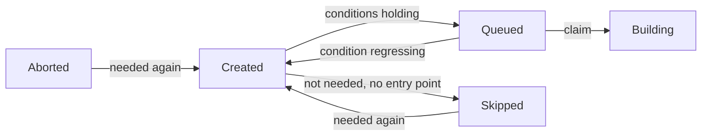

# Queueing and Counters

The path of a shared build (`derivation_build`) from `Created` to `Queued`, and the counters telling an evaluation to keep waiting. All queue conditions read maintained columns. The event changing a fact must also move the column. The consistency check is the only backstop.

## Start Condition Columns

All on `derivation_build`, moved by transitions and never derived by a per-row walk.

| Column | Meaning | Moved by |
|---|---|---|
| `missing_runtime_deps` | Runtime dependencies (`kind IN (1, 2)`) leading to a shared build without a complete closure | `runtime_can_start`: seeded on a NAR landing, spread up and down through the SQL function `ripple_missing_runtime_deps` |
| `fetchable` | Terminal success (`Completed`, `Substituted`) with a complete closure | `can_start::became_fetchable`, `can_start::lost_fetchability` |
| `blocking_deps` | Direct dependencies (every edge in `derivation_dependency`) that are not `fetchable` | One-hop spread from the shared builds a `fetchable` change returned |
| `wanted` | Shared build still wanted by some open entry point of a live evaluation | `can_start::update_need` |

- **Complete closure** (`graph_sql::shared_build_complete_predicate`): every output with a NAR in the cache, and `missing_runtime_deps = 0`. The `EXISTS` over `derivation_output` must keep a shared build without output rows from reading complete.
- An upstream copy is never `fetchable`. A build needing a shared build available in an upstream cache must wait for its passthrough. Every build must pull its inputs from the Gradient cache.
- A flag change must write the flag with a `RETURNING` of exactly the changed rows, and only those rows spread further. A spread from a state instead of a transition would drive a counter below zero. `= 0` can never hold again for such a counter.
- The flag change and the spread share one transaction under `can_start::lock_shared_builds` (`derivation`-ordered `FOR NO KEY UPDATE`). The lock must return the `SharedBuildLock` proof that both functions require.
- Complete closures are transitive and spread level by level. `blocking_deps` can move only one hop and then stop. Reaching zero will queue the waiting build and never make that build `fetchable`.
- A transitive spread is one SQL function call (current bodies in `m20261001_000001_plain_concept_names.rs`). The function can count, lock in order and move every level internally. A chain of 163 levels will cost one round trip instead of three per level. The function bodies must match the module predicates, checked through unit tests in `graph/runtime_can_start.rs` and `graph/walk_completeness.rs`. A predicate change will require a migration.

## Queue Conditions

`graph_sql::gates_predicate` is the one definition. `graph_sql::promotable_predicate` can add `status = Created` on top.

| Condition | Build | Passthrough (`cache_available`) |
|---|---|---|
| `derivation.walked` | Required | Required |
| A `build_job` naming the derivation | Required | Required |
| `wanted` | Required | Required |
| `probed` (upstream probe answered) | Required | - |
| `blocking_deps = 0` | Required | - |
| Own `.drv` NAR in the cache (`drv_present_predicate`) | Required | - |

### Queueing Events

Each event must queue its touched shared builds through `can_start::promote`. The queue condition is embedded, and the candidate list is only a bound.

- An imported batch: `seed_blocking_deps` then `promote` over the batch, plus whatever the needs-build update of the batch gained.
- A dependency turning `fetchable`: `became_fetchable` can queue each build needing the dependency, once its counter reached zero.
- A `.drv` NAR arriving: `gradient-graph/src/nar.rs` can queue the `.drv` owners.
- Any newly needed build, through `update_and_settle_need` (see [Skipped and Thaw](#skipped-and-thaw)).
- Stream completion and the graph-stuck heal: `can_start::promote_closure` over the evaluation's closure (see the [repair pass](repair-pass.md)).

## Queued Invariant

- The assigner can read only the status and never re-derive the queue conditions. `Queued` therefore must mean the conditions held.
- All writers of `Queued` embed `promotable_predicate` or settle their rows with `can_start::unpromote_ungated` in the same call.
- `unpromote_ungated` can move only `Queued` rows without an open assignment. A `Building` shared build can finish undisturbed.
- `lost_fetchability` must raise `blocking_deps` on the builds needing the changed ones. The same statement (`RIPPLE_UP`) will demote the `Queued` ones without an open assignment to `Created` status. The function must then update the needs-build marks from the changed shared builds.
- `assignment_record::claim_assignment` can insert the assignment row only while the shared build is still `Queued` with the expected `cache_available` value. The claim will drop a regressed job instead of handing the job out.
- `can_start::repair_can_start` is the consistency check's backstop for a lost move.

## Needs Build

A shared build is **open** (`graph_sql::open_predicate`) when not `fetchable` and not in `BuildStatus::TERMINAL_FAILURE` status. Builders, `Skipped`, `Aborted`, and a `Completed` shared build with a missing dependency in its closure are all open.

- `graph_sql::open_closure_cte_body` is the one walk behind the needs-build mark and naming. Seeds step over runtime dependencies. A **builder** (`builder_predicate`: walked, probed, not available in a cache, in `BUILDER_STATUSES`) can also step over build dependencies.
- The walk can reach only shared builds that are open. A `fetchable` or failed shared build will end the walk.
- The walk can reach a passthrough but never step through the passthrough on a build dependency. No job will ever build the input closure of a passthrough output.
- The needs-build mark is a column. The mark must flow down from the entry points, while the can-start counters flow up from the leaves. A one-hop predicate cannot carry the downward direction.
- `update_need` must walk the region below the given roots (roots included) in one statement. `WRITE_NEED` must then write the answer as a bound `unnest` array. Recursive CTEs carry no usable row estimate. A membership subquery would degrade to a sequential scan.
- The write must return each changed row with its new value, as gained and lost sets for the caller.

### Callers of `update_need`

A `settle_need` call must follow each call.

- **Status transitions:** the transition-effects emitter (`status/effects.rs`) for every transition crossing `BUILDER_STATUSES` in either direction.
- **Unchanged status:** `update_and_settle_need`, for events moving the needs-build mark without a status change.
    - Batch import (new builder, new entry point, adopted runtime dependencies, upstream hit, probe answer)
    - `demote_cached_output` and `lost_fetchability`
    - An exhausted substitution
    - New runtime dependencies from a NAR
    - The per-task evaluation GC and every adoption

## Skipped and Thaw

`can_start::settle_need` must apply a needs-build move in a fixed order.

| Side | Steps |
|---|---|
| Gained | `thaw_wanted` (`Skipped`/`Aborted` -> `Created`, `attempt = 0`), then `promote` |
| Lost | `unpromote_ungated`, then `skip_unwanted` (`Created`, not needed, no `entry_point` -> `Skipped`) |

- `Skipped` is settled work. Queue conditions have no effect on a skipped build, and no evaluation will wait for one.
- A thaw can lead to `Created`, never to `Queued`. The following `promote` call must read the queue conditions.
- An `Aborted` shared build can thaw the same way. An abort is no verdict.
- Entry points of a `Completed`, `Failed` or `Aborted` evaluation want nothing. An aborted evaluation would otherwise keep its own builds wanted, and the next check would thaw them.
- `status::release_evaluation_need` will update the need below the entry points of an aborted evaluation, inside the abort transition.
- `update_need` and `settle_need` are crate-private. Other crates call `update_and_settle_need`, and every needs-build move can skip and thaw inline. The consistency check's `settle_skipped` is the table-wide backstop, reporting `skipped_moves`.

## Evaluation Verdict

- `graph_sql::blocks_evaluation`: the status is in `NEED_BUILD_STATUSES` and the shared build is `wanted`, or the status is `Queued`/`Building` (the assigner will hand those out regardless).
- A pending shared build wanted by nothing will never block. Nothing will ever queue such a build.
- `Aborted` is not in `NEED_BUILD_STATUSES`. No evaluation can wait for an aborted shared build, and a later need can still thaw the build.
- `check_evaluation_done` can write a verdict once no blocking shared build is left. The verdict is `Failed` when any named shared build is in `BuildStatus::REQUEUEABLE` (`Aborted` included) or an error message is present. The verdict is `Completed` otherwise.
- Losing the needs-build mark will move no status. The emitter must finalize the evaluations naming the shared builds that lost the mark.

## Evaluation Counters

Five columns on `evaluation`, over the shared builds named by its `build_job` rows.

| Column | Counts |
|---|---|
| `named_shared_builds` | Every named shared build |
| `active_shared_builds` | `blocks_evaluation` |
| `failed_shared_builds` | `BuildStatus::REQUEUEABLE` |
| `queued_shared_builds` | `Queued` |
| `building_shared_builds` | `Building` |

- **Triggers** (current bodies in `m20261001_000001_plain_concept_names.rs`): `evaluation_shared_build_moved` (per row, `AFTER UPDATE OF status, wanted`), `evaluation_shared_build_named` / `evaluation_shared_build_unnamed` (per statement on `build_job` insert/delete). The triggers cover raw SQL and ORM changes alike.
- Triggers append signed rows to `evaluation_shared_build_delta`, for live evaluations only, and take no lock.
- **Membership:** the SQL function `evaluation_shared_build_counts(status, wanted)` (current body in `m20261009_000000_build_job_aborted.rs`). Its body must match `graph/predicates.rs`, checked through a unit test in `evaluations/counters.rs`. A predicate change will require a migration.
- **Fold:** `fold_shared_build_deltas` can start at the beginning of every waiting-state pass. Each fold is one `DELETE ... RETURNING` under advisory lock `640`, and an instance finding the lock taken will skip the fold. The fold will also skip every evaluation row held by another transaction (`SKIP LOCKED`), and those deltas wait for the next pass. The fold will never wait on an evaluation row and cannot deadlock with the graph writer.
- **Read:** `eval_counters` must return folded columns plus unfolded deltas.
- **Counters answer only "not yet":** a naming and a transition in flight together can miss each other. `reachability::eval_blocked` must confirm a zero. `recount_evaluations` can recount a contradicted value under the fold lock. The recount will skip an evaluation held by another transaction, like the fold. The next contradicting read will recount that evaluation.
- The consistency check can recount every in-flight evaluation and report `eval_counter_drift` for drift.

## Naming and Adoption

- A batch must name every walked derivation plus the direct inputs. The walk will stop descending at `walked AND unwalked_inputs = 0`. Only the evaluation that walked a cut-off subtree will name its interior.
- Deleting that evaluation will cascade those names away. `reachability::adopt_pending_closures` can start the open-closure walk from every `build_job` of a live evaluation. The function must insert the missing `(evaluation, derivation)` rows (`ON CONFLICT DO NOTHING`).
- Callers: the per-task GC, the [repair pass](repair-pass.md) and the consistency check. The GC can call through `settle_after_delete`, only when a cascaded name belonged to an open shared build. The repair pass can call `adopt_pending_closure` for one evaluation. The consistency check will call once `pending_orphan_frontier` can find an unnamed open shared build one edge below a named one.

## Walk Completeness

- `derivation.walked`: the derivation's own record is present (outputs, every edge, input sources). The same transaction must insert unknown inputs as stubs. A stub is never queued or handed out.
- `derivation.unwalked_inputs`: direct build inputs (`kind IN (0, 2)`) whose subtree is not recorded. Seeded at import, spread as inputs complete through the SQL function `ripple_unwalked_inputs`, recounted in the consistency check (`walk_drift`).
- Events clearing `walked` are the missing-input self-heal and the demote path (`can_start::unwalk_derivations`). The orphan derivation GC will clear `walked` too, for derivations surviving a deleted dependency they need, followed by `unpromote_ungated` afterwards.

## Dependency Failure

- `cascade_dependency_failed` can mark all `Created`/`Queued`/`FailedTransient` derivations wanting a failed build as `DependencyFailed`. Fresh terminal-failure transitions trigger the mark.
- `repair_dependency_failed` can repeat the walk within the closure of an evaluation, at stream completion and on the graph-stuck heal. The repeat can catch a shared build thawed after its dependency failed.
- The repeat can also start from each shared build the evaluation aborted (`build_job.aborted`). Derivations wanting an aborted build end `DependencyFailed`.
- Neither walk can enter a shared build available in a cache (`graph_sql::non_passthrough_predicate`).

## Build Abort and Retry

`POST /builds/{id}/abort` and `POST /builds/{id}/retry` act on a build of an evaluation, inside the graph writer (`status::evaluation_build`).

| Action | Allowed Status | Effect |
|---|---|---|
| Abort | `Created`, `Queued`, `Building` | `build_job.aborted` set, shared build to `Aborted`, dependents in the closure to `DependencyFailed`, `AbortJob` to the worker |
| Retry | `FailedPermanent`, `FailedTimeout`, `Aborted`, `DependencyFailed` | failed builds back to `Created` with their `build_job.aborted` cleared, dependents failed through them back to `Created` (`RETRY_BUILD_CLOSURE`), dependency-failure walk repeated, closure queued |

- Aborts need a running evaluation.
- Aborts refuse a shared build that other live evaluations still name.
- A retry of a `DependencyFailed` build can also retry each failed dependency below the build. The walk can only pass `DependencyFailed` dependencies.
- A retry can reopen a `Failed` or `Aborted` evaluation past its evaluation phase. The evaluation moved back to `Building` (`REOPEN_EVALUATION`) and can finish again.
- Newer or still active evaluations of the same task keep the evaluation closed.
- Retries wait until the worker confirmed the earlier abort. Late abort reports can move a retried build back to `Aborted`.
- The `Eval` and `Unstick` thaws of the [repair pass](repair-pass.md) skip the aborted build and everything above the build in the closure.
- Retry thaws skip the deterministic-failure block. The user asked for the rebuild.

## Consistency Check

Recounts of `consistency::graph_consistency_report` follow dependency order.

| Step | Reports |
|---|---|
| `unwalked_inputs` | `walk_drift` |
| `missing_runtime_deps` | `runtime_drift` |
| `fetchable` (`repair_fetchable`) | `counter_drift` (with `blocking_deps`) |
| `wanted` (`recount_wanted`) | `need_drift` |
| `settle_skipped` | `skipped_moves` |
| `blocking_deps` + queue (`repair_can_start`) | `counter_drift`, `unpromoted_startable` |
| Adoption | `adopted` |
| Evaluation counters | `eval_counter_drift`, `wedged_building_evals` |
