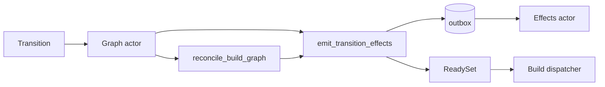

# Reconciler

The heals for graph state no event reaches, and the one emitter every anchor move fans out through. Both run inside the graph actor; background passes in the scheduler re-drive what a lost message left behind.

## Reconcile Scopes

`gradient_db::reconcile_build_graph(ctx, scope)` (`backend/gradient-db/src/reconcile.rs`) runs as `Transition::Reconcile` in the graph actor: a reconcile never interleaves with an ingest. Both scopes name an evaluation; every statement is bounded to that evaluation's dependency closure.

| Scope | Sent by | Thaw |
|---|---|---|
| `Eval(id)` | `EvalStreamCompleted`; a `restart_failed` evaluation that starts `Building` (`POST .../evaluate`) | Every `REQUEUEABLE` anchor in the closure, a reproducible builder exit included |
| `Unstick(id)` | A `Building` evaluation judged graph-stuck (`waiting_state::attempt_graph_unstick`), and the `graph-stuck-reheal` pass | Same, minus the `deterministic_build_failure` subtree |

- A failure is valid for the evaluation that recorded the failure: a fresh evaluation rebuilds the anchor once, an unstick of the same evaluation leaves the anchor alone.
- `restart_failed` never walks; `inherit_names` copies the previous evaluation's `build_job` rows and the `Eval` heal runs on them.
- No tick runs a reconcile and no step iterates to a fixpoint.

## Reconcile Steps

Each step logs and continues on error; a failing heal never blocks the rest.

| # | Function | Effect |
|---|---|---|
| 1 | `promotion::requeue_failed_closure` | Resets `FailedPermanent`, `Aborted`, `DependencyFailed`, `FailedTimeout` anchors to `Created`, `attempt = 0` |
| 2 | `promotion::reconcile_cached_anchors_for_eval`, then `readiness::advance_fetchable` | Anchors whose outputs are all in the cache turn `Completed`; their dependents' counters advance |
| 3 | `promotion::reconcile_dependency_failed` | Fails every non-terminal anchor reachable from a failure that stays |
| 4 | `reachability::adopt_pending_closure` | Inserts `build_job` rows for open anchors the evaluation reaches and nobody names; recomputes demand; bumps `graph_version` |
| 5 | `readiness::promote_closure` | Promotes the closure to `Queued` |

- Cache presence is the ground truth for "built" in step 2.
- Every step feeds its `TransitionChange`s to `emit_transition_effects`.

## Transition Effects

Both mutation models report `(derivation, from, to)` moves to `emit_transition_effects` (`backend/gradient-db/src/status/effects.rs`): the single-row path `update_derivation_build_status` and the bulk sweeps (promotion, cascades, reconciles, abort, GC). No anchor moves without its consequences.

| Effect | Condition |
|---|---|
| `ReadySet::record` | Anchor entered or left `Queued` |
| `bump_graph_version` | Once per emit, for every evaluation with a `build_job` on a moved anchor (`from != to`) |
| Board `build::StatusChanged` | Every `build_job` of a moved anchor |
| `build::Reported` event, written as an `Event` outbox row | Entry-point `build_job` moving to `Queued`, `Building` or a terminal status |
| `cache::Changed` | Any move into `Completed` or `Substituted` |
| `check_evaluation_done` | Every evaluation of an anchor that turned terminal |
| `LogFinalize` outbox row | Latest attempt of every anchor that really finished |
| Demand recompute, queue settle, upstream probe request | Anchor crossed the `BUILDER_STATUSES` boundary; regated anchors are announced in a second round |

- Outbox rows are written in the transaction that moved the anchor. The `gradient-effects` actor expands `Event` rows into forge, action and webhook deliveries and runs them with retries.
- Moves inside a graph transaction are staged on the `ReadySet` and published after the commit: the dispatcher reads on its own connection.
- `collapse_transitions` reduces two moves of one anchor in one transaction to the net move.

## Task Page Histogram

`evaluation.graph_version` invalidates the per-entry-point status histogram (`backend/gradient-db/src/dep_counts.rs`).

| Bumped by | Scope |
|---|---|
| `emit_transition_effects` | Evaluations of every moved anchor |
| Ingest batch | Its own evaluation, plus every evaluation holding a derivation whose edge set grew |
| Adoption (reconcile, consistency sweep, evaluation GC) | The adopting evaluations |
| Startup recovery | Evaluations of re-queued and aborted anchors (recovery has no emitter) |

- `task_board::entry_point_dep_counts` walks one page of entry points; rows land in `entry_point_dep_count` with `entry_point.dep_counts_version` and `dep_counts_computed_at`.
- A read recomputes an entry point only when the version moved and the rows are older than `DEP_COUNTS_REFRESH_SECS` (120 s).
- Rows older than `DEP_COUNTS_MAX_AGE_SECS` (600 s) recompute regardless; this heals a bump the emitter logged and swallowed.

## Consistency Sweep

`graph_consistency_report` (`backend/gradient-db/src/consistency.rs`) runs every `metrics.graphConsistencyIntervalSecs` (300 s, `GRADIENT_METRICS_GRAPH_CONSISTENCY_INTERVAL_SECS`). The counters are moved, never derived: this sweep is their only backstop. Each step runs before the one that reads its column.

| # | Step | Report field |
|---|---|---|
| 1 | Recount `unwalked_inputs` | `walk_drift` |
| 2 | Recount `missing_runtime_deps`, table-wide | `runtime_drift` |
| 3 | Recount `fetchable` over the repair scope | `counter_drift` |
| 4 | Recount `demanded`, table-wide | `demand_drift` |
| 5 | `settle_skipped`: settle undemanded anchors to `Skipped`, thaw demanded ones | `skipped_moves` |
| 6 | Recount `unready_deps` over the repair scope, then un-promote and promote | `counter_drift`, `unpromoted_ready` |
| 7 | Adopt pending anchors a live evaluation reaches and nobody names | `adopted` |
| 8 | Count unbacked outputs of terminal-success producers (read-only) | `unbacked_trusted_outputs` |
| 9 | Recount evaluation anchor counters | `eval_counter_drift` |
| 10 | Count `Building` evaluations with `active_anchors = 0` (read-only) | `wedged_building_evals` |

- **Repair scope:** pending anchors, their direct dependencies, `fetchable` rows with `missing_runtime_deps > 0`, and terminal-success rows without `fetchable`. Its size is logged as `scope` on every pass.
- Each chunk of 3 and 6 is its own transaction: `lock_anchors` (ordered `FOR UPDATE`) first, then the recount. A cancelled sweep loses one chunk.
- A recount reads one snapshot and ripples nothing: a chain of drifted rows converges one level per interval.
- Drift counts are rows already repaired; a warning naming only those is a successful self-repair.
- Interval `0` disables the sweep and the `graph-stuck-reheal` pass.

## Watchdogs

Scheduler passes in `backend/gradient-scheduler/src/dispatch/background.rs`. A job the scheduler tracker still holds is never touched.

| Pass | Every | Finds | Action |
|---|---|---|---|
| `eval-completion-watchdog` | 60 s | Evaluation in `EvaluatingFlake`/`EvaluatingDerivation` whose newest eval dispatch closed `Completed`/`Failed`, unwritten for 900 s | Re-sends `EvalStreamCompleted` or `EvalFailed` |
| `stranded-build-sweep` | 60 s | `Building` anchor whose newest attempt's dispatch closed `Abandoned`, unwritten for 900 s | Sends `OrphanedBuilds` (moves only rows still `Building`) |
| `abandoned-dispatch-sweep` | 60 s | Open `dispatched_job` row older than 1800 s | Closes the row `Abandoned`; first reaps aborts unconfirmed after 300 s |
| `graph-stuck-reheal` | Sweep interval | `Waiting` evaluations with reason `GraphStuck` | Sends `Reconcile { Unstick }` |

- The 900 s grace sits above the graph actor's `RPC_TIMEOUT` (600 s): a slow transition never looks lost.
- Both re-sent transitions are idempotent.

## Dispatch Record Closers

A `dispatched_job` row is the proof a job is out; `claim_dispatch` inserts the row and `idx-dispatched_job-open-job` admits one open row per job key (`build:<anchor>`, `eval:<evaluation>`).

| Closer | Outcome |
|---|---|
| Worker's terminal report, matched on the dispatch ID | `Completed` / `Failed` |
| Claim whose `Dispatched` transition fails or exceeds its budget (`assignment.rs`) | `Abandoned` |
| Worker rejects the assignment (`withdraw_dispatch`) | `Abandoned` |
| Worker disconnect (`requeue_orphaned_jobs`) | `Abandoned` |
| Worker registration: rows dispatched before this process started | `Abandoned` |
| Startup recovery (`abandon_all_open_dispatches`) | `Abandoned` |
| Overdue abort reap, `abandoned-dispatch-sweep` | `Abandoned` |

- `Abandoned` is not `Failed`: the build may have succeeded before contact was lost, and a failure would skew the board's rates and history-based scoring.

## Missing Inputs

A build failing `InputsUnavailable` runs `self_heal::reconcile_missing_inputs` (`backend/gradient-graph/src/self_heal.rs`) per missing path:

1. `demote_cached_output`: clears `is_cached` and `external_url`, clears `substitutable`, retires the `cached_path` row, deletes the NAR.
2. A producerless path (`.drv`, source) is kept while its NAR still exists; the rebuildable output referrers are demoted instead (`demote_referrers_of`).
3. An unreachable producer: referrers are demoted and un-walked; with no referrer, the failing build's output-only-cached direct deps are demoted (`demote_output_only_cached_deps`).
4. Terminal-failed producers re-queue on the spot (`requeue_failed_anchors`).

- The failed build itself retries in-eval as `FailedTransient` with the transient backoff; the raised `unready_deps` holds the build out of the queue until the input is back.
- After `build.inputsUnavailableMaxLoops` (3) prior `InputsUnavailable` attempts the self-heal is skipped and the build fails `Permanent`.

## Cache Deletions

`runtime_readiness::retire_outputs` is the one way a `cached_path` row goes, in the deleting transaction:

- Locks the `cached_path` rows in hash order, then the anchors: a concurrent signature insert is waited out before the DELETE opens its snapshot.
- Raises `missing_runtime_deps` of every anchor that trusted the rows; the ripple takes wholeness and `fetchable` from their referrers.
- Resets to `Created` only producers whose artifact is actually gone; a referrer that only lost wholeness keeps its terminal status.
- Un-promotes the owners of a retired `.drv`.

| Caller | Path |
|---|---|
| Stale-path eviction, zombie purge | `GcRequest::Paths` -> `retire_stale_paths` in the graph actor |
| Missing inputs, path invalidation | `demote_cached_output` |

An unbacked terminal-success output is prevented, not repaired: a failed NAR commit answers `Retry` and fails the build, `JobCompleted` waits for every `UploadCommitted`, substitution requires every output whole, and every retire resets the producers of what the retire deleted. A non-zero `unbacked_trusted_outputs` is a bug report.

## Garbage Collection

| Pass | Reclaims |
|---|---|
| Evaluation GC (`gc_task_evaluations`, per task, keeps `keep_evaluations`) | Old evaluations; live evaluations adopt pending anchors first (`adopt_pending_closures`) |
| Derivation GC (`run_derivation_gc`) | Derivations outside the dependency closure of every `entry_point` and `build_job`, after `GRADIENT_GC_ORPHAN_DERIVATION_HOURS` (24); attempt logs removed by hand |
| Stale-path eviction (`evict_stale_cached_paths`) | Unreachable paths unfetched for `gc.narTtlHours` (336) |
| Orphan NAR files | Stored NARs no row keeps, probed in batches of 5000, older than `gc.narUploadGraceHours` (24) |

- `.drv` and input-source NARs of any anchored derivation are kept regardless of status: nothing but an evaluation re-pushes them.
- An active evaluation blocks its task's GC, unless its current phase is older than `gc.wedgedEvalHours` (24); the age comes from the phase stamps, not `updated_at`.
- Derivation GC re-checks roots created since its scan inside the graph actor; surviving dependents of a deleted derivation are un-walked.
