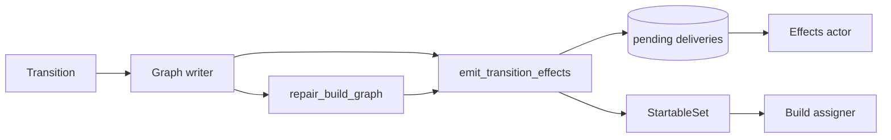

<!--
SPDX-FileCopyrightText: 2026 Wavelens GmbH <info@wavelens.io>
SPDX-License-Identifier: AGPL-3.0-only
-->

# Repair Pass

The repair pass can heal graph state beyond the reach of any event. One emitter must carry the consequences of every status move of a shared build. Both live inside the graph writer. Background loops in the scheduler re-drive whatever a lost message left behind.

## Repair Scopes

`gradient_db::graph::repair::repair_build_graph(ctx, scope)` (`backend/gradient-db/src/graph/repair.rs`) must run as `Transition::Repair` in the graph writer. A repair pass can never interleave with a batch import. Both scopes name an evaluation. Every statement is bounded to that evaluation's dependency closure.

| Scope | Sent by | Thaw |
|---|---|---|
| `Eval(id)` | `EvalStreamCompleted`, or a `restart_failed` evaluation starting `Building` (`POST .../evaluate`) | Every `REQUEUEABLE` shared build in the closure, a reproducible builder exit included |
| `Unstick(id)` | A `Building` evaluation judged graph-stuck (`waiting_state::attempt_graph_unstick`), and the `graph-stuck-reheal` pass | Same, minus the `deterministic_build_failure` subtree |

- A failure is valid for the evaluation that recorded the failure. A fresh evaluation will rebuild the shared build once. An unstick of the same evaluation will leave the shared build alone.
- `restart_failed` will never walk. `inherit_names` must copy the `build_job` rows of the previous evaluation, and the `Eval` heal will operate on those rows.
- No tick will start a repair pass, and no step will iterate to a fixpoint.

## Repair Steps

All steps share the graph writer's transaction. The first failed step will end the pass and fail the transition. The graph writer can roll back and retry a deadlock or serialization failure.

| # | Function | Effect |
|---|---|---|
| 1 | `promotion::requeue_failed_closure` | Resetting `FailedPermanent`, `Aborted`, `DependencyFailed`, `FailedTimeout` shared builds to `Created`, `attempt = 0` |
| 2 | `promotion::repair_cached_shared_builds_for_eval`, then `can_start::advance_fetchable` | Shared builds with every output in the cache turn `Completed`. The counters of the builds needing them advance |
| 3 | `promotion::repair_dependency_failed` | Failing every non-terminal shared build reachable from a lasting failure |
| 4 | `reachability::adopt_pending_closure` | Inserting `build_job` rows for open shared builds reachable by the evaluation and named by nobody. Updating and settling the needs-build marks. Bumping `graph_version` |
| 5 | `can_start::promote_closure` | Moving the closure to `Queued` |

- Cache presence is the ground truth for "built" in step 2.
- All steps feed their `TransitionChange` values to `emit_transition_effects`.

## Transition Effects

Both mutation models report `(derivation, from, to)` moves to `emit_transition_effects` (`backend/gradient-db/src/status/effects.rs`). The models are the single-row path `update_derivation_build_status` and the bulk passes (queueing, cascades, repairs, abort, GC). No shared build can move without its consequences.

| Effect | Condition |
|---|---|
| `StartableSet::record` | Shared build entered or left `Queued` |
| `bump_graph_version` | Once per emit, for every evaluation with a `build_job` on a moved shared build (`from != to`) |
| Board `build::StatusChanged` | Every `build_job` of a moved shared build |
| `build::Reported` event, written as an `Event` pending-delivery row | Entry-point `build_job` moving to `Queued`, `Building` or a terminal status |
| `cache::Changed` | Any move into `Completed` or `Substituted` |
| `check_evaluation_done` | Every evaluation of a shared build that turned terminal |
| `LogFinalize` pending-delivery row | Latest attempt of every shared build that really finished |
| Needs-build update, queue settle, upstream probe request | Shared build crossed the `BUILDER_STATUSES` boundary. A second round will announce shared builds with re-checked queue conditions |

- The transaction moving the shared build must also write the pending-delivery rows (`pending_delivery`). The `gradient-effects` actor can expand `Event` rows into Git host, action and webhook deliveries. The actor will send those deliveries with retries.
- The `StartableSet` must stage moves inside a graph transaction and publish them after the commit. The assigner can read on its own connection.
- `collapse_transitions` can reduce two moves of one shared build in one transaction to the net move.

## Task Page Histogram

`evaluation.graph_version` can invalidate the per-entry-point status histogram (`backend/gradient-db/src/task_board/dep_counts.rs`).

| Bumped by | Scope |
|---|---|
| `emit_transition_effects` | Evaluations of every moved shared build |
| Imported batch | Its own evaluation, plus every evaluation holding a derivation whose edge set grew |
| Adoption (repair pass, consistency check, evaluation GC) | The adopting evaluations |
| Startup recovery | Evaluations of re-queued and aborted shared builds (no emitter in recovery) |

- `task_board::entry_point_dep_counts` can walk one page of entry points. Rows land in `entry_point_dep_count` with the `dep_counts_computed_at` timestamp and the `entry_point.dep_counts_version` value.
- A read will refresh an entry point only when the version moved and the rows are older than `DEP_COUNTS_REFRESH_SECS` (120 s).
- Rows older than `DEP_COUNTS_MAX_AGE_SECS` (600 s) refresh regardless. The forced refresh can heal a bump the emitter logged and swallowed.

## Consistency Check

`graph_consistency_report` (`backend/gradient-db/src/graph/consistency.rs`) can start every `metrics.graphConsistencyIntervalSecs` (300 s, `GRADIENT_METRICS_GRAPH_CONSISTENCY_INTERVAL_SECS`). Events move the counters, and no other code can derive them. This check is their only backstop. Each step must complete before the step reading its column.

| # | Step | Report field |
|---|---|---|
| 1 | Recount `unwalked_inputs` | `walk_drift` |
| 2 | Recount `missing_runtime_deps`, table-wide | `runtime_drift` |
| 3 | Correct `fetchable` over the repair scope, moving each parent's `blocking_deps` along | `counter_drift` |
| 4 | Recount `wanted`, table-wide | `need_drift` |
| 5 | `settle_skipped`: settle shared builds wanted by no evaluation to `Skipped`, thaw needed ones | `skipped_moves` |
| 6 | Recount `blocking_deps` over the repair scope, then un-queue and queue | `counter_drift`, `unpromoted_startable` |
| 7 | Adopt pending shared builds reachable by a live evaluation and named by nobody | `adopted` |
| 8 | Count unbacked outputs of terminal-success producers (read-only) | `unbacked_trusted_outputs` |
| 9 | Recount evaluation shared-build counters | `eval_counter_drift` |
| 10 | Count `Building` evaluations with `active_shared_builds = 0` (read-only) | `wedged_building_evals` |

- **Repair scope:** pending shared builds, their direct dependencies, `fetchable` rows with `missing_runtime_deps > 0`, and terminal-success rows without a set `fetchable` flag. Every pass must log the scope size under the `scope` field.
- Each chunk of 3 and 6 is its own transaction, with `lock_shared_builds` (ordered `FOR NO KEY UPDATE`) first and the recount second. A cancelled check can lose one chunk.
- A recount can read one snapshot and spread nothing. A chain of drifted rows will converge one level per interval.
- Drift counts are rows already repaired. A warning naming only those rows is a successful self-repair.
- Interval `0` will disable the check and the `graph-stuck-reheal` pass.

## Watchdogs

The watchdogs are scheduler loops in `backend/gradient-scheduler/src/loops/background.rs`. No pass will touch a job still held by the scheduler tracker.

| Pass | Every | Target | Action |
|---|---|---|---|
| `eval-completion-watchdog` | 60 s | Evaluation in `EvaluatingFlake`/`EvaluatingDerivation` whose newest eval assignment closed `Completed`/`Failed`, unwritten for 900 s | Re-sending `EvalStreamCompleted` or `EvalFailed` |
| `stranded-build-sweep` | 60 s | `Building` shared build whose newest attempt's assignment closed `Abandoned`, unwritten for 900 s | Sending `OrphanedBuilds` (moving only rows still `Building`) |
| `abandoned-dispatch-sweep` | 60 s | Open `dispatched_job` row older than 1800 s | Reaping aborts unconfirmed after 300 s first, then closing the row `Abandoned` |
| `graph-stuck-reheal` | Consistency check interval | `Waiting` evaluations with reason `GraphStuck` | Sending `Repair { Unstick }` |

- The 900 s grace must cover a transition still queued in the graph writer. A re-send racing that transition is harmless.
- Both re-sent transitions are idempotent.

## Assignment Record Closers

A `dispatched_job` row is the proof of a job being out. `claim_assignment` must insert the row. `idx-dispatched_job-open-job` can admit one open row per job key (`build:<shared_build>`, `eval:<evaluation>`).

| Closer | Outcome |
|---|---|
| Worker's terminal report, matched on the assignment ID | `Completed` / `Failed` |
| Claim with an `Assigned` transition failing or exceeding its budget (`assignment.rs`) | `Abandoned` |
| Worker rejecting the assignment (`withdraw_assignment`) | `Abandoned` |
| Worker disconnect (`requeue_orphaned_jobs`) | `Abandoned` |
| Worker registration: rows assigned before this process started | `Abandoned` |
| Startup recovery (`abandon_all_open_assignments`) | `Abandoned` |
| Overdue abort reap, `abandoned-dispatch-sweep` | `Abandoned` |

- `Abandoned` is not `Failed`. The build may have succeeded before contact was lost. A failure would skew the board's rates and history-based scoring.

## Missing Inputs

A build failing `InputsUnavailable` must call `self_heal::repair_missing_inputs` (`backend/gradient-graph/src/self_heal.rs`) per missing path.

1. `demote_cached_output`: clearing `is_cached` and `external_url`, clearing `cache_available`, retiring the `cached_path` row, deleting the NAR.
2. A producerless path (`.drv`, source) will stay while its NAR is still present. `demote_parents_of` will demote the rebuildable outputs referencing the path instead.
3. An unreachable producer: the outputs referencing the path get demoted and un-walked. `demote_output_only_cached_deps` will demote the output-only-cached direct deps of the failing build when no such output is present.
4. Terminal-failed producers re-queue on the spot (`requeue_failed_shared_builds`).

- The failed build itself will retry in-eval as `FailedTransient` with the transient backoff. The raised `blocking_deps` counter will hold the build out of the queue until the input is back.
- The self-heal is skipped after `build.inputsUnavailableMaxLoops` (3) prior `InputsUnavailable` attempts. The build will then fail with `Permanent` status.

## Cache Deletions

`runtime_can_start::retire_outputs` is the one way to delete a `cached_path` row, running in the deleting transaction.

- Locking the `cached_path` rows in hash order, then the shared builds. The lock must wait out a concurrent signature insert before the DELETE can open its snapshot.
- Raising `missing_runtime_deps` of every shared build that trusted the rows. The spread will take the complete closure and `fetchable` from the builds referencing those rows.
- Resetting to `Created` only producers whose artifact is actually gone. A referencing build that only lost its complete closure will keep its terminal status.
- Un-queueing the owners of a retired `.drv` file.

| Caller | Path |
|---|---|
| Stale-path eviction, zombie purge | `GcRequest::Paths` -> `retire_stale_paths` in the graph writer |
| Missing inputs, path invalidation | `demote_cached_output` |

Gradient must prevent an unbacked terminal-success output instead of repairing one. A failed NAR commit will answer `Retry` and fail the build. `JobCompleted` must wait for every `UploadCommitted` message. A substitution can succeed only with a complete closure for every output. Every retire will reset the producers of the deleted paths. A non-zero `unbacked_trusted_outputs` is a bug report.

## Garbage Collection

| Pass | Reclaimed |
|---|---|
| Evaluation GC (`gc_task_evaluations`, per task, keeping `keep_evaluations`) | Old evaluations. Live evaluations adopt pending shared builds first (`adopt_pending_closures`) |
| Derivation GC (`collect_orphan_derivations`) | Derivations outside the dependency closure of every `entry_point` and `build_job`, after `gc.orphanDerivationHours` (24). The same pass will delete their attempt logs from log storage |
| Stale-path eviction (`evict_expired_cached_paths`) | Unreachable paths unfetched for `gc.narTtlHours` (336) |
| Orphan NAR files | Stored NARs kept by no row, probed in batches of 5000, older than `gc.narUploadGraceHours` (24) |

- GC will keep `.drv` and input-source NARs of any derivation with a shared build regardless of status. Nothing but an evaluation can re-push them.
- An active evaluation will block the GC of its task, unless the current phase is older than `gc.wedgedEvalHours` (24). The phase stamps provide the age, not `updated_at`.
- Derivation GC must re-check roots created since its scan inside the graph writer. Surviving derivations needing a deleted derivation get un-walked.
