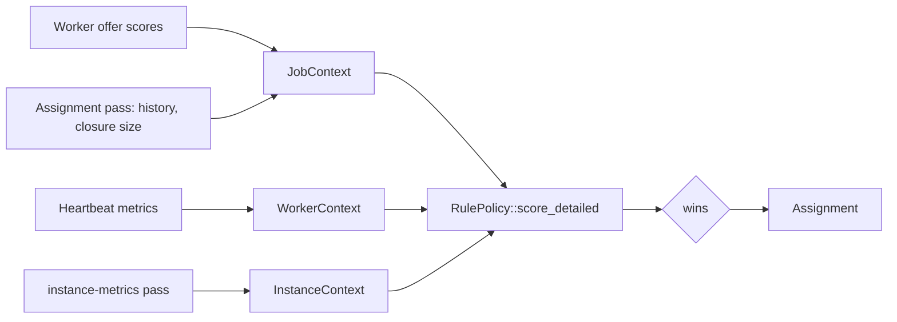

# Scoring

The scheduler can rank every eligible pending job for the requesting worker with a `ScoringPolicy` implementation. The scheduler will then assign the top candidate. The scoring code is in the `backend/gradient-pool/src/score` module. The scheduler in `backend/gradient-scheduler` must fill the inputs. The rule list and magnitudes are in [Scheduler Policies](../../reference/scheduler-policies.md).

## Traits

| Item | File | Role |
|---|---|---|
| `ScoringPolicy` | `policy.rs` | `name`, `score`, `score_detailed`, `uses_history`, `uses_project_work_share` |
| `RulePolicy` | `policy.rs` | Named `Vec<Box<dyn ScoreRule>>`. `score` can sum the rules. `score_detailed` can also collect per-rule scores and vetoes |
| `ScoreRule` | `rule.rs` | `name` (persisted key), `score`, `veto`, `uses_project_work_share`, `description` |
| `ScoreBreakdown` | `breakdown.rs` | `rules`, `total`, `vetoes`, stored in `dispatched_job.score_breakdown` |
| Weights | `weights.rs` | Every rule magnitude and `ASSIGN_FLOOR` in one file |

- `policy_by_name` can map `scheduler.scoringPolicy` to a `RulePolicy` value. An unknown name will log a warning and fall back to the `resource-aware` policy.
- Policies are declarative tables (`simple_table`, `resource_aware_table`) of `spec(enabled, rule)` rows. `FairShareRule` is present with `enabled = false` there.
- `uses_project_work_share` is derived from the enabled rules. `uses_history` is a constructor flag of `RulePolicy::new`.

## Contexts

| Context | Fields | Filled by |
|---|---|---|
| `JobContext` | `ScoredJob` (kind, architecture, `prefer_local_build`, `is_fixed_output`, `pname`, closure size, history), `missing_count`, `missing_nar_size`, `outputs_present`, `dependency_count`, `queued_at`, `ready_at`, `project_work_share`, `prioritized`, `rescore_count`, `now` | `JobTracker::score_candidates` in `gradient-scheduler/src/jobs.rs` |
| `WorkerContext` | `architectures`, `system_features`, `fetch`, `metrics` | `worker_context_of` from the worker's `WorkerCaps` |
| `WorkerMetricsView` | `cpu_count`, `cpu_core_score`, `ram_total_mb`, `ram_free_mb`, `cpu_usage_pct`, `disk_speed_mbps`, `network_speed_mbps` | `WorkerCapabilities` (static) and the 10 s `WorkerMetrics` heartbeat (live) |
| `InstanceContext` | 13 `Windowed` averages, `active_builds`, `pending_builds`, `total_workers`, `idle_workers`, `cpu_core_score_mean` | `instance_metrics_pass`, see below |

- `missing_count`, `missing_nar_size` and `outputs_present` are per worker. The worker must score each offered candidate against its store and send a `CandidateScore` (see [Offers](../proto/capabilities-and-dispatch.md#offers)). The values are `None` until that worker reported.
- `dependency_count` is the number of direct input derivations (`derivation_dependency` rows), not the number of builds needing the derivation.
- `ready_at` is the moment the dependencies finished. `WaitTimeRule` will measure from that moment, not from the `queued_at` time.
- `rescore_count` will grow by one per 5 s assignment timer tick (`BumpRescore`). Reactive kicks leave the count unchanged.
- The caller must pass `now` in. Rules never read the wall clock.
- `JobContext::build_history` will return an empty prediction when `outputs_present` is set. A worker holding every output will build nothing.

## History and Closure Size

`ScoredJob` can hold only owned values. Scoring itself will compute nothing. `load_sizes_and_histories` in `loops/build.rs` can materialize both on the pending job, only when `policy.uses_history()` is true.

| Value | Source |
|---|---|
| Closure size | `derivation.closure_size`, else one batched `transitive_closure_sizes` walk. The graph writer will persist computed sizes |
| Build history | `history::predict`: latest 20 `derivation_metric` rows with the same `history_name` (`pname`, else `name`) and architecture, within [`retentionDays`](../../reference/configuration.md#general). One query per distinct pair |
| Evaluation history | `compute_eval_history`: per-task p95 of `evaluation_metric.peak_rss_mb` over 24 h |

- Only real builds can write a `derivation_metric` row. A substituted output will write none.
- A failed build will write a row only after an out-of-memory kill.

`HistoryPrediction` must carry the p95 peak RAM, mean CPU time, mean build time, mean disk bytes, OOM rate and a `samples` count. A value will stay `None` when no build in the window measured it. Rules add nothing for a `None` value.

## Instance Windows

`instance_metrics_pass` can start every `metrics.instanceIntervalSecs` (30 s) and publish the snapshot through an `ArcSwap` value.

| Source table | Windows |
|---|---|
| `derivation_metric` | `peak_ram_mb`, `cpu_time_ms`, `avg_cpu_pct`, `disk_bytes`, `network_mbps`, `build_time_ms`, `closure_size`, `oom_rate`, `completed` |
| `dispatched_job` (builds with `ready_at`) | `wait_secs`, `nar_size_mb`, `missing_paths`, `dependency_cnt` |

- Each `Windowed` value can hold 5 min, 1 h and 24 h averages. `None` will stand for no samples. A measured zero will stay zero.
- Rules read `w1h_or(fallback)` or `w24h_or(fallback)` for instance-relative thresholds.
- A failed query will leave its windows empty. The in-memory counts always survive.

## Assignment Floor and Vetoes

- The scheduler can sort candidates by `total` value, and the smaller job id will break ties.
- The scheduler will assign the first candidate passing `wins` as its check. A passing candidate is unvetoed, with `total >= ASSIGN_FLOOR` (0.0). A vetoed higher candidate will stay pending. The worker will idle this round without a passing candidate.
- A veto is a hold independent of the sum. Large bonuses cannot outvote the veto. `RescoreWaitRule` is the only vetoing rule. The rule will score 0 and hold a build while `missing_nar_size` is `None` and `rescore_count < 4` holds.
- Every decision, rejected candidates included, will go into a 200-entry ring for the [Job Board](../../ui/job-board.md#job-inspection).

## Worker Speed Signals

| Signal | Measured in | Formula |
|---|---|---|
| `network_speed_mbps` | Passthrough NAR upload (`nar.rs`), NAR receive (`nar_recv.rs`), presigned PUT (`object_put.rs`) and presigned download (`download_one_presigned`) | bits / elapsed seconds / 10^6 |
| `disk_speed_mbps` | `build_metrics.rs` after each build | cgroup `disk_read_bytes + disk_write_bytes` in MiB / build seconds |
| `cpu_core_score` | Startup micro-benchmark, or `GRADIENT_WORKER_SYSTEM_CPU_CORE_SCORE` | Static, sent with `WorkerCapabilities` |

- Network and disk are EWMAs (`alpha = 0.3`) in `gradient-worker-client/src/throughput.rs`, `None` until the first sample.
- `cpu_core_score_mean` is the mean over connected workers with a non-zero score.

## Adding a Rule

1. Add the magnitudes to `weights.rs`.
2. Implement `ScoreRule` in `rules/<area>.rs` with a stable `name` and a `description`. Override `veto` for a hold, and `uses_project_work_share` when reading the share.
3. Re-export the rule in `rules/mod.rs` and add a `spec(true, ...)` row to a policy table in the `policy.rs` file.
4. New policies need a `policy_by_name` arm and the enum value in the `nix/modules/gradient.nix` file. Set `uses_history = true` when a rule must read history.
5. Unit tests sit next to the rule in `#[cfg(test)] mod tests`.

`rule_catalog` (`GET /board/scoring/rules`) can list every rule of the `resource-aware` table, disabled ones included. The board can use the list to explain any rule named in a recorded breakdown.

## Related

- [Scheduler Policies](../../reference/scheduler-policies.md): every rule and its magnitude
- [Capabilities and Assignment](../proto/capabilities-and-dispatch.md): offers, candidate scores and assignment
