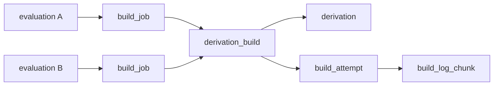

# Shared Builds

A derivation is built once, globally. Its build state is living on one `derivation_build` row, the *shared build*. Every evaluation of that derivation is pointing at this row. Every write to shared builds and the surrounding graph is going through one graph writer (`backend/gradient-graph`).

## Tables

| Table | Key | Role |
|---|---|---|
| `derivation` | UNIQUE `(hash, name)` | The global graph node. `walked` and `unwalked_inputs` record whether the subtree is known |
| `derivation_build` | UNIQUE `derivation` | The shared build: `status`, `attempt`, `cache_available`, `probed`, `fetchable`, `wanted`, `blocking_deps`, `missing_runtime_deps`, limits |
| `build_job` | `evaluation`, `derivation_build` | Link from one evaluation to a shared build, carrying the assignment `score` |
| `build_attempt` | `derivation_build`, `dispatched_job` | One execution: `outcome`, `reason`, timings, `build_context` |
| `build_log_chunk` | `build_attempt` | The attempt's log |

| Foreign key | On delete | Effect |
|---|---|---|
| `derivation_build.derivation` | `CASCADE` | The shared build is living as long as the derivation |
| `build_job.evaluation` | `CASCADE` | Evaluation GC is dropping its links |
| `build_attempt.build_job` | `SET NULL` | An attempt and its log outlive the driving evaluation |
| `build_attempt.derivation_build` | `CASCADE` | Attempts go with the shared build |

## Sharing

- Two evaluations (same or different projects) needing one derivation share its build. There is no leader, follower or link row. Sharing is the global graph itself.
- `BatchWriter::resolve_shared_builds` (`record.rs`) is inserting new shared builds `ON CONFLICT (derivation) DO NOTHING`. A shared build from an earlier evaluation is staying untouched.
- The first assignment is building. Every other evaluation is seeing the result once the shared build is `Completed` or `Substituted` (`BuildStatus::TERMINAL_SUCCESS`).
- A `Completed` shared build reused later is keeping its attempts and logs until garbage collection of the derivation.

## Graph Writer

The graph writer, `GraphWriter` (`gradient-graph/src/writer.rs`), is a root child of the supervision tree, stopped after every sibling. Callers use the `Graph` handle (`lib.rs`). One message is one transaction. Queued `Record` and `CommitNar` messages are the exception and share one.

| `GraphMsg` | Written |
|---|---|
| `Record` | One worker batch: derivations, stubs, edges, outputs, input sources, shared builds, `build_job` rows, features, messages, entry points, the can-start counters and the needs-build marks |
| `UpstreamHits` | Probe results: narinfo on `derivation_output`, the runtime dependencies named in the narinfo, `cache_available`, the needs-build marks moved |
| `UpstreamProbed` | `probed = true` on answered shared builds, and the needs-build marks set below them by a miss |
| `CommitNar` | The `cached_path` row, its references, signed `cached_path_signature` rows, the backed outputs |
| `Transition` | Evaluation and shared build state: stream completed, eval failed, build started/output/completed/failed, assigned, orphaned, can start, repair, abort, prioritize |
| `Requeue` | `FailedTransient` shared builds whose backoff elapsed, back to `Queued` |
| `Demote` | `MissingNar`, operator `Path` invalidation, one cache dropping its `CacheClaim` |
| `Gc` | Bounded deletes of derivations, stale paths and evaluations, re-checked against rows that became live since the scan |

Every other message is flushing the queue first. A write after a batch or a commit is seeing that batch or commit.

`Graph::known_derivations` is not a message. The call is reading from the pool which `drv_hashes` hold a recorded subtree (`walked` and `unwalked_inputs = 0`). A walk's next wave can then start before its previous batch is recorded. A recorded subtree is only ever gaining its record. A read missing a queued write is pruning less, never wrongly.

## Batching

- Queued batches to record share one transaction with a savepoint each (`record_one`). A batch failing for its content is failing only its caller.
- Queued NAR commits are executing set-based under one savepoint (`nar::commit_batch`). Each step is one statement for the whole batch instead of a dozen per NAR. A commit's cost is round trips. A failed batch is committing its NARs one by one (`commit_one`), each under its own savepoint. A bad NAR is failing only its uploader.
- A flush is taking place on the next mailbox turn. The flush is immediate once the queue is at `RECORD_ROW_BUDGET` (5000 derivations) or `NAR_COMMIT_BUDGET` (128 commits). A flush is no longer taking NAR commits after `NAR_FLUSH_TIME` (100 ms) and is leaving the rest to the next mailbox turn. The flush is holding the shared build locks of every commit until its end.
- The worker's wire is without an acknowledgement to retry on. A failed batch is failing its evaluation (`fail_evaluation`) instead of leaving the graph incomplete.
- `RecordBatch.truly_substituted` is the one fact from outside the graph. The field is listing per drv path the derivations with a complete closure already in our cache, as established by the scheduler. Their new shared builds start `Substituted`. The transaction is assigning the ids itself.
- Upstream availability is not part of a batch. The probe is answering through `UpstreamHits` for shared builds needing a build. A batch is writing `cache_available = false` on new shared builds only.
- Post-commit (`record::after_commit`): entry point statuses, per-task evaluation GC, probe requests, the `evaluation::Progress` event.

## Timeouts and Retries

| Constant | Value | Meaning |
|---|---|---|
| `CALL_TIMEOUT` | 30 s | Wait for the graph writer to exist after a restart |
| `GRAPH_TX_BUDGET` | 120 s | Per transaction. The transaction is rolling back past this budget, and the caller is getting `graph transaction exceeded 120s`. Also set as the transaction's `statement_timeout`. The rollback is waiting for the running statement, and only Postgres can end that statement |
| `GRAPH_TX_ATTEMPTS` | 3 | Attempts of a transaction aborted with SQLSTATE `40P01`, `40001` or `25P02` |

- A caller is waiting for its reply without a deadline. The graph writer is still applying a message whose caller gave up. A caller-side timeout would report a still-landing write as failed. A worker session behind a backlog is blocking its reader as backpressure.
- A deadlock inside one batch is failing the whole flush (`escalate_retryable`), and `transact` is retrying the flush.
- Status updates and their effects return every database error to `transact`. A `SELECT 1` probe before `COMMIT` is turning a transaction aborted by a merely logged error into `25P02`. Postgres would otherwise answer that `COMMIT` with a silent rollback.
- The retry is re-sending board events and probe requests already sent by an aborted attempt.
- `Transition::Repair` (`gradient_db::graph::repair::repair_build_graph`) and cache demotion take place inside the graph writer. The consistency check (`consistency_check_pass`, `gradient-scheduler`) is outside, without retries. Its next pass is picking the work up.
- The graph writer is holding no state between messages. A restart is losing only batches still queued, and their callers get an error.

## Concurrent Walks

- Two walks of overlapping graphs converge on one `derivation` row per `(hash, name)`. `WALKED_UPSERT` and `STUB_INSERT` use `ON CONFLICT (hash, name)`.
- Edge inserts (`derivation_dependency`) are using `ON CONFLICT DO NOTHING`. Two walks of one node record the same set.
- `accepts_batches` is taking batches only while the evaluation is `Fetching`, `EvaluatingFlake` or `EvaluatingDerivation`. Other batches get dropped as stale (`RecordReport.skipped`).
- Two walks of one evaluation differ by the assignment id minted at hand-out. The worker is echoing the id on every report. The session is dropping a report for an assignment not handed out by that session (`gradient-proto/src/handler/inbound.rs`, `owned`).

## Cache Availability Flag

`cache_available` is marking a shared build with outputs available in an upstream cache.

- Set only by the `FLIP_CACHE_AVAILABLE` statement (`UpstreamHits`, `record.rs`), only on shared builds not in `TERMINAL_SUCCESS`.
- One project's probe can add a substitution for another project's walk.
- Cleared by `exhaust_substitution` (`transition.rs`) once substitute misses escalate. The shared build is returning to `Created` as an ordinary build.
- Cleared by `CLEAR_CACHE_AVAILABLE_TRUST` (`gradient-db/src/caches/demotion.rs`) for an output proven unfetchable.

## Counter Locking

Counters stay correct without the graph writer's serialisation. A second writer can share them (`gradient-db/src/graph/shared_build_guard.rs`).

- Advisory keys: namespace `SHARED_BUILD_LOCK_NAMESPACE` (643), key `hashtext(derivation id)`, taken sorted in one pass before any row lock.
- A seed of `blocking_deps` or `missing_runtime_deps` is holding the keys of its dependencies shared.
- A flip of the complete-closure state or `fetchable` is holding the shared build's key exclusively. The hold is in place before the ripple is reading the edges into the shared build.
- The second of a seed and a concurrent flip is waiting for the first to commit, then reading its rows.
- Shared keys never wait on each other. A dependency referenced by every `.drv` (`source-stdenv.sh`) is queueing nothing.
- `wanted` is the exception. `update_need` is locking only its roots. The consistency check's `recount_wanted` is correcting drift. A lost update is leaving a shared build `Skipped` until the next check.

## Related

- [Jobs](../proto/jobs.md) - build job reports that drive `Transition`
- [Architecture](../architecture.md)
