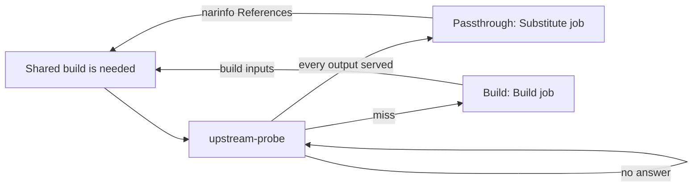

# Upstream Substitution

A build with outputs already served by an upstream cache is fetched, not built. The `upstream-probe` loop is asking upstream caches only about [shared builds](shared-builds.md) wanted by another build or an evaluation. The answer is deciding between a passthrough (fetched from upstream, `cache_available`) and a real build.

## Probe Loop

`gradient-scheduler/src/probe.rs`, a supervised periodic child outside the [graph writer](shared-builds.md#graph-writer). Probing is HTTP. A round trip inside a graph transaction would hold the single graph writer.

| Constant | Value | Role |
|---|---|---|
| `PROBE_TICK` | 1 s | Pass interval |
| `PROBE_BUDGET` | 120 s | Supervision budget of one pass |
| `PROBE_DESCENT` | 60 s | A pass is no longer descending after this. The rest is waiting for the next tick |
| `PROBE_MEMORY` | 300 s | No repeat question for an answered shared build within this window |
| `PROBE_BATCH` | 256 | Outputs per request round, and rows per recovery check |
| `PROBE_SWEEP` | 60 s | Recovery check interval, only on an idle tick |

- **Requests:** an in-memory channel (`ProbeRequests`). Batch recording is feeding the channel with every shared build the batch walked, plus the needs-build marks the batch moved. The transition emitter (`gradient-db/src/status/effects.rs`) and the graph writer after `UpstreamHits` / `UpstreamProbed` feed the channel too.
- **Descent:** each round's answer is moving the needs-build marks and handing the next level straight back. One pass is following the closure down instead of one level per tick.
- **Recovery check:** walked shared builds needing a build, with `probed = false`. The check is covering a process stopped between a commit and the channel send.

## One Round

`plan_probes` is building the round. `probe_round` is applying the round.

1. Drop shared builds wanted by nothing (`wanted = false`).
2. Drop shared builds without `derivation_output` rows (unwalked stubs). A stub is staying unanswered until the batch walking the stub is sending the stub again.
3. Skip outputs already cached anywhere (`is_cached` or `external_url`).
4. Group the rest by an evaluation naming the shared build (`build_job`). The evaluation's project is picking the upstream caches.
5. `probe_outputs` (`gradient-scheduler/src/eval.rs`) is asking for each output's `<hash>.narinfo` and flushing `upstream_metric`.
6. Hits go to `GraphMsg::UpstreamHits`. Every shared build of step 2 is then going to `GraphMsg::UpstreamProbed`, hit or miss, unless one of its outputs got [no answer](#no-answer).

A shared build with `probed = false` is not yet a real build. Nothing below the shared build is getting built or handed out until the answer is in. A build queued on "no answer yet" cannot be recalled once a worker is holding the job.

### No Answer

A miss is final only after every upstream cache answered with `404` or an unsigned narinfo. A timeout, an error status, a tripped breaker or an unreadable upstream list is no answer.

- The shared build is now keeping `probed = false` and is not buildable yet.
- The recovery check is now asking again within `PROBE_SWEEP`.
- The server is now logging a warning per silent upstream cache and round.
- The evaluation is now showing that warning once per upstream cache, with source `upstream-probe`.
- An admin can deactivate a silent upstream cache. The next round is then asking only the remaining upstream caches.

## Applying a Hit

Steps of `apply_upstream_hits` in `gradient-graph/src/record.rs`.

- **Persist:** `external_url`, `nar_hash`, `file_hash`, `file_size`, `references_list`, `deriver`, plus `nar_size` and `ca` when unset, on every `derivation_output` sharing the hash and not already cached.
- **Runtime dependencies:** the narinfo `References:` line is recording runtime dependencies on the referenced producers.
- **Passthrough:** `cache_available = true` only when every output of the shared build is served. The flip is skipping a terminal-success shared build. A failed one is flipping into a passthrough.
- **Needs build:** updated for touched shared builds and those newly available in a cache. The newly needed set is returning to the probe.

`mark_probed` is setting `probed = true` (`MARK_PROBED`) and updating the needs-build marks. A miss is leaving the shared build a real build. That build is now needing its build inputs.

## Upstream Selection

`gradient-core/src/upstream.rs`, shared by the probe and the worker cache query.

| Rule | Detail |
|---|---|
| Candidates | `cache_upstream` rows with `kind = Http`, a URL, neither upstream nor project subscription `WriteOnly` (`upstream_endpoints_for_project`) |
| Trust | A hit is requiring a `Sig` verifying against the upstream's `public_key` and a `StorePath` matching the asked hash (`verified_narinfo`). An upstream without a key can never hit |
| Order | Hit rate, then average latency over the last 60 min of `upstream_metric`. Unmeasured upstream caches last |
| At most 4 upstream caches | Asked in parallel. The lowest-latency hit is winning |
| More than 4 | Asked in order. The first hit is winning |
| Timeout | 2 s per narinfo request. 30 s for a `upstream_query` semaphore permit |
| Concurrency | `GRADIENT_CACHE_UPSTREAM_QUERY_CONCURRENCY` (default 32), server-wide |

**Breaker:** 3 consecutive errors (transport failure, or a status other than 2xx and 404) trip an upstream for 60 s. Requests pass again after the cooldown. One more error is re-tripping the breaker. A 404 is a miss, not an error, and is resetting the count. The breakers are process-wide and shared with the cache narinfo endpoint.

**HTTP/1.1 pin:** requests offer HTTP/2. Some upstream caches negotiate HTTP/2 and then reset streams mid-body. A proxied NAR is then breaking after its `200`, and Nix is reporting `HTTP error 200 (curl error: Stream error in the HTTP/2 framing layer)`. The first HTTP/2 error from an upstream is pinning that upstream to HTTP/1.1 (`gradient-util/src/http1_fallback.rs`, `http1_pins` in `gradient-core/src/upstream.rs`).

- The client is re-sending the failed request over HTTP/1.1.
- A body cut short is resuming over HTTP/1.1 with `Range: bytes=<sent>-`. The client is splicing in only a `206` with a `Content-Range` starting at that offset. Anything else is ending the body with the original error.
- The pin is applying process-wide at once and persisting in `cache_upstream.http1_only`. Every later request to that upstream, after restarts too, is using HTTP/1.1. The API is returning the flag read-only, and the upstream list is showing an `HTTP/1.1` badge.
- `POST /caches/{cache}/upstreams/{id}/test` (`probe_protocol` in `gradient-core/src/upstream_source.rs`) is fetching `nix-cache-info` over HTTP/1.1 only and HTTP/2 only, each with its own single-protocol ALPN. The test is leaving the pin untouched. A small `nix-cache-info` passing over HTTP/2 is proving nothing about resets inside large NAR bodies.

## Substitute Jobs

`decide_build_spec_kind` (`gradient-scheduler/src/assign_mode.rs`) is reading the flag and nothing else.

| Shared build | Kind | Worker |
|---|---|---|
| `cache_available` | `Substitute` | Any |
| `builtin` system, fixed-output | `Download` | Any, no Nix store |
| Everything else, `builtin:buildenv` included | `Build` | Matching system |

The `BuildSpec` is carrying the `(name, store_path)` pairs. The worker is never reading the `.drv` (`gradient-worker/src/executor/substitute.rs`).

1. Skip outputs the Gradient cache is already holding.
2. Locate each remaining output with `CacheQuery { external: true }` (one path per query). The server is answering from the persisted `external_url`, else by probing `Http` upstream caches, else `GradientProto` upstream caches.
3. Download with the redirect-following client. A body length differing from the declared `file_size` is a missing output.
4. Detect compression from the magic bytes, with the URL extension as fallback.
5. Check the NAR against `nar_hash`, then push the bytes like any other output.

The job is fetching nothing below the outputs. The referenced paths are shared builds of their own, marked as needed by the server. Build jobs keep `use_substitutes = false` in the daemon.

## Failures and the Miss Budget

| Worker error | Kind | Server |
|---|---|---|
| No upstream serving an output | `SubstituteUnavailable` | Penalty-free requeue to `Queued` |
| Upstream NAR missing, wrong size or not matching `nar_hash` (`CorruptCachedNar`) | `InputsUnavailable` | Self-heal repair pass, retry |
| Anything else, hash mismatch included | `Transient` | Retry |

### Escalation to a Build

- A passthrough with exhausted `InputsUnavailable` / `Transient` retries is entering the same budget instead of `FailedPermanent`.
- `exhaust_substitution` is acting at `build.substituteMissEscalationThreshold` (default 2) misses within one evaluation. The function is clearing `cache_available`, the upstream columns of the outputs and `attempt`. The function is also setting the shared build `Created`.
- The shared build is then building through the ordinary gates.

## Cache Endpoints

`gradient-web/src/endpoints/caches/`. Every endpoint is asking only the cache's own upstream caches the workers would substitute from (`kind = Http`, a URL, not `WriteOnly`, per `substitution_sources` in `gradient-core/src/upstream_source.rs`). Every endpoint is also skipping tripped upstream caches and feeding the shared breakers. NAR and log fetches follow redirects.

| Endpoint | Upstream behaviour |
|---|---|
| `narinfo.rs` | The endpoint is asking every such upstream with a `public_key` in parallel for a narinfo missing from the cache. The `Sig` must verify against `public_key`, and the `StorePath` must match the asked hash. The endpoint is rewriting `URL:` to `nar/upstream/<id>/...` and appending the cache's own `Sig` next to the upstream's |
| `nar.rs` (`upstream_nar`) | Trying the named upstream first, then every other one. The NAR path is content-addressed, and an upstream row may have been deleted |
| `build_log.rs` | `/log/<drv>` is serving the local log (`X-Cache: HIT`), else the first non-empty upstream log (`X-Cache: MISS`) |

## Build Log Substitution

`gradient-scheduler/src/log_substitution.rs`. The scheduler is fetching the upstream's build log after `BuildCompleted` on a `cache_available` shared build.

- **Source:** `<upstream>/log/<drv basename>` from the project's candidates (`upstream_endpoints_for_project`, best first), through `fetch_upstream_log`, the same fetch as in the cache log endpoint.
- **Limits:** the first non-empty body is winning. 10 s timeout, capped at 16 MiB with a `[truncated]` marker.
- **Target:** appended to the latest `build_attempt` log, only while that log is still empty.
- **Errors:** logged and ignored.

## Related

- [Shared Builds](shared-builds.md)
- [Jobs](../proto/jobs.md)
