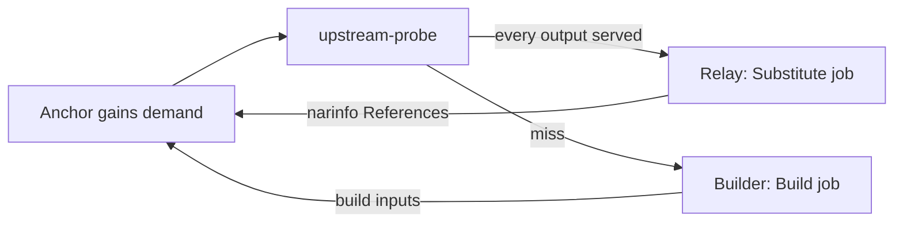

# Upstream Substitution

A build whose outputs an upstream cache already serves is fetched, not built. The `upstream-probe` loop asks upstreams only for anchors something demands, and the answer decides whether the anchor is a relay (`substitutable`) or a builder.

## Probe Loop

`gradient-scheduler/src/probe.rs`, a supervised periodic child outside the graph actor. Probing is HTTP; a round trip inside a graph transaction would hold the single graph writer.

| Constant | Value | Role |
|---|---|---|
| `PROBE_TICK` | 1 s | Pass interval |
| `PROBE_BUDGET` | 120 s | Supervision budget of one pass |
| `PROBE_DESCENT` | 60 s | A pass stops descending after this; the rest waits for the next tick |
| `PROBE_MEMORY` | 300 s | An answered anchor is not asked again within this window |
| `PROBE_BATCH` | 256 | Outputs per request round, and rows per recovery sweep |
| `PROBE_SWEEP` | 60 s | Recovery sweep interval, only on an idle tick |

- **Requests:** an in-memory channel (`ProbeRequests`) fed by the batch ingest (every anchor the batch walked, plus demand it moved), the transition emitter (`gradient-db/src/status/effects.rs`) and the graph actor after `UpstreamHits` / `UpstreamProbed`.
- **Descent:** each round's answer moves demand and hands the next level straight back; one pass follows the closure down instead of one level per tick.
- **Recovery sweep:** demanded, walked anchors with `probed = false`. Covers a process that stopped between a commit and the channel send.

## One Round

`plan_probes` builds the round; `probe_round` applies the round.

1. Drop anchors without `demanded = true`.
2. Drop anchors without `derivation_output` rows (unwalked stubs). A stub stays unanswered until the batch that walks the stub sends the stub again.
3. Skip outputs already cached anywhere (`is_cached` or `external_url`).
4. Group the rest by an evaluation naming the anchor (`build_job`); the evaluation's project picks the upstreams.
5. `probe_outputs` (`gradient-scheduler/src/eval.rs`) asks each output's `<hash>.narinfo` and flushes `upstream_metric`.
6. Hits go to `GraphMsg::UpstreamHits`, then every anchor of step 2 goes to `GraphMsg::UpstreamProbed`, hit or miss.

An anchor with `probed = false` is not a builder. Nothing below the anchor is demanded or dispatched until the answer lands; a build queued on "no answer yet" cannot be recalled once a worker holds the job.

## Applying a Hit

`apply_upstream_hits` in `gradient-graph/src/ingest.rs`:

- **Persist:** `external_url`, `nar_hash`, `file_hash`, `file_size`, `references_list`, `deriver`, plus `nar_size` and `ca` when unset, on every `derivation_output` sharing the hash and not already cached.
- **Runtime edges:** the narinfo `References:` line writes runtime edges to the referenced producers.
- **Relay:** `substitutable = true` only when every output of the anchor is served. A terminal-success anchor is never flipped. A failed anchor is flipped and becomes a relay.
- **Demand:** recomputed for touched and newly substitutable anchors; the gained set returns to the probe.

`mark_probed` sets `probed = true` (`MARK_PROBED`) and recomputes demand. A miss leaves the anchor a builder, which now demands its build inputs.

## Upstream Selection

`gradient-core/src/upstream.rs`, shared by the probe and the worker cache query.

| Rule | Detail |
|---|---|
| Candidates | `cache_upstream` rows with `kind = Http`, a URL, neither upstream nor project subscription `WriteOnly` (`upstream_endpoints_for_project`) |
| Order | Hit rate, then average latency over the last 60 min of `upstream_metric`; unmeasured upstreams last |
| At most 4 upstreams | Asked in parallel; the lowest-latency hit wins |
| More than 4 | Asked in order; the first hit wins |
| Timeout | 2 s per narinfo request; 30 s for a `upstream_query` semaphore permit |
| Concurrency | `GRADIENT_CACHE_UPSTREAM_QUERY_CONCURRENCY` (default 32), server-wide |

**Breaker:** 3 consecutive errors (transport failure, or a status other than 2xx and 404) trip an upstream for 60 s. After the cooldown requests pass again; one more error re-trips. A 404 is a miss, not an error, and resets the count. The breakers are process-wide and shared with the cache narinfo endpoint.

## Substitute Jobs

`decide_build_spec_kind` (`gradient-scheduler/src/dispatch_mode.rs`) reads the flag and nothing else:

| Anchor | Kind | Worker |
|---|---|---|
| `substitutable` | `Substitute` | Any |
| `builtin` system, fixed-output | `Download` | Any, no Nix store |
| Everything else, `builtin:buildenv` included | `Build` | Matching system |

The `BuildSpec` carries the `(name, store_path)` pairs; the worker never reads the `.drv` (`gradient-worker/src/executor/substitute.rs`):

1. Skip outputs the Gradient cache already holds.
2. Locate each remaining output with `CacheQuery { external: true }` (one path per query). The server answers from the persisted `external_url`, else probes `Http` upstreams, else `GradientProto` upstreams.
3. Download with the redirect-following client; a body whose length differs from the declared `file_size` counts as missing.
4. Detect compression from the magic bytes, with the URL extension as fallback.
5. Check the NAR against `nar_hash`, then push the bytes like any other output.

Nothing below the outputs is fetched: the referenced paths are anchors of their own, demanded by the server. Build jobs keep `use_substitutes = false` in the daemon.

## Failures and the Miss Budget

| Worker error | Kind | Server |
|---|---|---|
| No upstream serves an output | `SubstituteUnavailable` | Penalty-free requeue to `Queued` |
| Upstream NAR missing, wrong size or not matching `nar_hash` (`CorruptCachedNar`) | `InputsUnavailable` | Self-heal reconcile, retry |
| Anything else, hash mismatch included | `Transient` | Retry |

A relay whose `InputsUnavailable` / `Transient` retries run out enters the same budget instead of `FailedPermanent`. At `substituteMissEscalationThreshold` (`GRADIENT_BUILD_SUBSTITUTE_MISS_ESCALATION_THRESHOLD`, default 2) misses within one evaluation, `exhaust_substitution` clears `substitutable`, the upstream columns of the outputs, and `attempt`, and sets the anchor `Created`. The anchor then builds through the ordinary gates.

## Cache Endpoints

`gradient-web/src/endpoints/caches/`. Every endpoint asks only the cache's own upstreams that the workers would substitute from (`kind = Http`, a URL, not `WriteOnly`; `substitution_sources` in `gradient-core/src/upstream_source.rs`), skips tripped upstreams and feeds the shared breakers. NAR and log fetches follow redirects.

| Endpoint | Upstream behaviour |
|---|---|
| `narinfo.rs` | A narinfo the cache lacks is asked from every such upstream with a `public_key` in parallel. The `Sig` must verify against `public_key`. `URL:` is rewritten to `nar/upstream/<id>/...`, and the cache's own `Sig` is appended next to the upstream's |
| `nar.rs` (`upstream_nar`) | Tries the named upstream first, then every other one; the NAR path is content-addressed and an upstream row may have been deleted |
| `build_log.rs` | `/log/<drv>` serves the local log (`X-Cache: HIT`), else the first non-empty upstream log (`X-Cache: MISS`) |

## Build Log Substitution

`gradient-scheduler/src/log_substitution.rs`. After `BuildCompleted` on a `substitutable` anchor, the scheduler fetches `<upstream>/log/<drv basename>` from the project's candidates (`upstream_endpoints_for_project`, best first) through `fetch_upstream_log`, the same fetch the cache log endpoint uses. The first non-empty body (10 s timeout, capped at 16 MiB with a `[truncated]` marker) is appended to the latest `build_attempt` log, only when that log is still empty. Every failure is logged and ignored.

## Related

- [Build Anchors](build-anchors.md)
- [Jobs](../proto/jobs.md)
