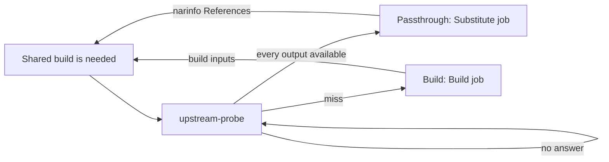

<!--
SPDX-FileCopyrightText: 2026 Wavelens GmbH <info@wavelens.io>
SPDX-License-Identifier: AGPL-3.0-only
-->

# Upstream Substitution

A build with outputs already available in an upstream cache is fetched, not built. The `upstream-probe` loop will ask upstream caches only about [shared builds](shared-builds.md) wanted by another build or an evaluation. The answer must decide between a passthrough (fetched from upstream, `cache_available`) and a real build.

## Probe Loop

`gradient-scheduler/src/probe.rs`, a supervised periodic child outside the [graph writer](shared-builds.md#graph-writer). Probing is HTTP. A round trip inside a graph transaction would hold the single graph writer.

| Constant | Value | Role |
|---|---|---|
| `PROBE_TICK` | 1 s | Pass interval |
| `PROBE_BUDGET` | 120 s | Supervision budget of one pass |
| `PROBE_DESCENT` | 60 s | A pass will stop descending after this. The rest must wait for the next tick |
| `PROBE_MEMORY` | 300 s | No repeat question for an answered shared build within this window |
| `PROBE_BATCH` | 256 | Outputs per request round, and rows per recovery check |
| `PROBE_SWEEP` | 60 s | Recovery check interval, only on an idle tick |

- **Requests:** an in-memory channel (`ProbeRequests`). Batch recording must feed the channel with every shared build the batch walked, plus the needs-build marks the batch moved. The transition emitter (`gradient-db/src/status/effects.rs`) and the graph writer after `UpstreamHits` / `UpstreamProbed` feed the channel too.
- **Descent:** the answer of each round will move the needs-build marks and hand the next level straight back. One pass can follow the closure down instead of one level per tick.
- **Recovery check:** every walked shared build needing a build, with `probed = false` set. The check must cover a process stopped between a commit and the channel send.

## One Round

`plan_probes` can build the round. `probe_round` can apply the round.

1. Drop shared builds wanted by nothing (`wanted = false`).
2. Drop each shared build without `derivation_output` rows (unwalked stubs). A stub will stay unanswered until the batch walking the stub can send the stub again.
3. Skip outputs already cached anywhere (`is_cached` or `external_url`).
4. Group the rest by an evaluation naming the shared build (`build_job`). The project of the evaluation will pick the upstream caches.
5. `probe_outputs` (`gradient-scheduler/src/eval.rs`) must ask for the `<hash>.narinfo` of each output and flush `upstream_metric` afterwards.
6. Hits go to `GraphMsg::UpstreamHits` as a message. All shared builds of step 2 then go to `GraphMsg::UpstreamProbed`, hit or miss, unless one of their outputs got [no answer](#no-answer).

A shared build with `probed = false` is not yet a real build. Nothing below the shared build can get built or handed out until the answer is in. A build queued on "no answer yet" cannot be recalled once a worker took the job.

### No Answer

A miss is final only after every upstream cache answered with `404` or an unsigned narinfo. A timeout, an error status, a tripped breaker or an unreadable upstream list is no answer.

- The shared build will keep `probed = false` and is not buildable yet.
- The recovery check will ask again within one `PROBE_SWEEP` interval.
- The server will log a warning per silent upstream cache and round.
- The evaluation will show that warning once per upstream cache, with `upstream-probe` as its source.
- An admin can deactivate a silent upstream cache. The next round will then ask only the remaining upstream caches.

## Applying a Hit

The steps of `apply_upstream_hits` in `gradient-graph/src/record.rs` are the following.

- **Persist:** `external_url`, `nar_hash`, `file_hash`, `file_size`, `references_list`, `deriver`, plus `nar_size` and `ca` when unset. The target is every `derivation_output` row sharing the hash and not already cached.
- **Runtime dependencies:** the narinfo `References:` line must record runtime dependencies on the referenced producers.
- **Passthrough:** `cache_available = true` only when every output of the shared build is available upstream. The flag change will skip a terminal-success shared build. A failed one will turn into a passthrough.
- **Needs build:** updated for touched shared builds and those newly available in a cache. The newly needed set will go back to the probe.

`mark_probed` must set `probed = true` (`MARK_PROBED`) and update the needs-build marks. A miss will leave the shared build a real build. From then on that build will need its build inputs.

## Upstream Selection

`gradient-core/src/upstream.rs`, shared by the probe and the worker cache query.

| Rule | Detail |
|---|---|
| Candidates | `cache_upstream` rows with `kind = Http`, a URL, neither upstream nor project subscription `WriteOnly` (`upstream_endpoints_for_project`) |
| Trust | A hit must carry a `Sig` verifying against the upstream's `public_key` and a `StorePath` matching the asked hash (`verified_narinfo`). An upstream without a key can never hit |
| Order | Hit rate, then average latency over the last 60 min of `upstream_metric`. Unmeasured upstream caches last |
| At most 4 upstream caches | Asked in parallel. The lowest-latency hit will win |
| More than 4 | Asked in order. The first hit will win |
| Timeout | 2 s per narinfo request. 30 s for a `upstream_query` semaphore permit |
| Concurrency | `GRADIENT_CACHE_UPSTREAM_QUERY_CONCURRENCY` (default 32), server-wide |

**Breaker:** 3 consecutive errors (transport failure, or a status other than 2xx and 404) trip an upstream for 60 s. Requests pass again after the cooldown. One more error will trip the breaker again. A 404 is a miss, not an error, and will reset the count. The breakers are process-wide and shared with the cache narinfo endpoint.

**HTTP/1.1 pin:** requests offer HTTP/2. Some upstream caches negotiate HTTP/2 and then reset streams mid-body. A proxied NAR will then break after its `200`. Nix will report `HTTP error 200 (curl error: Stream error in the HTTP/2 framing layer)`. The first HTTP/2 error from an upstream will pin that upstream to HTTP/1.1 (`gradient-util/src/http1_fallback.rs`, `http1_pins` in `gradient-core/src/upstream.rs`).

- The client will re-send the failed request over HTTP/1.1.
- A body cut short will resume over HTTP/1.1 with a `Range: bytes=<sent>-` header. The client can splice in only a `206` with a `Content-Range` starting at that offset. Anything else will end the body with the original error.
- The pin will apply process-wide at once and persist in the `cache_upstream.http1_only` column. All later requests to that upstream, also after a restart, use HTTP/1.1. The API will return the flag read-only. The upstream list will show an `HTTP/1.1` badge.
- `POST /caches/{cache}/upstreams/{id}/test` (`probe_protocol` in `gradient-core/src/upstream_source.rs`) can fetch `nix-cache-info` twice. One request must use HTTP/1.1 only and one HTTP/2 only, each with its own single-protocol ALPN. The test will leave the pin untouched. A small `nix-cache-info` passing over HTTP/2 can prove nothing about resets inside large NAR bodies.

## Substitute Jobs

`decide_build_spec_kind` (`gradient-scheduler/src/assign_mode.rs`) can read only the flag and nothing else.

| Shared build | Kind | Worker |
|---|---|---|
| `cache_available` | `Substitute` | Any |
| `builtin` system, fixed-output | `Download` | Any, no Nix store |
| Everything else, `builtin:buildenv` included | `Build` | Matching system |

The `BuildSpec` must carry the `(name, store_path)` pairs. The worker will never read the `.drv` file (`gradient-worker/src/executor/substitute.rs`).

1. Skip outputs the Gradient cache is already holding.
2. Locate each remaining output with `CacheQuery { external: true }` (one path per query). The server can answer from the persisted `external_url`, else from probing `Http` upstream caches, else from `GradientProto` upstream caches.
3. Download with the redirect-following client. A body length differing from the declared `file_size` must still match `nar_hash` after decompression. Any other body is a missing output.
4. Detect compression from the magic bytes, with the URL extension as fallback.
5. Check the NAR against `nar_hash`, then push the bytes like any other output.

The job will fetch nothing below the outputs. The referenced paths are shared builds of their own, marked as needed by the server. Build jobs keep `use_substitutes = false` in the daemon.

## Failures and the Miss Budget

| Worker error | Kind | Server |
|---|---|---|
| No upstream holding an output | `SubstituteUnavailable` | Penalty-free requeue to `Queued` |
| Upstream NAR missing, wrong size or not matching `nar_hash` (`CorruptCachedNar`) | `InputsUnavailable` | Self-heal repair pass, retry |
| Anything else, hash mismatch included | `Transient` | Retry |

### Escalation to a Build

- A passthrough with exhausted `InputsUnavailable` / `Transient` retries will enter the same budget instead of `FailedPermanent` status.
- `exhaust_substitution` will act after `build.substituteMissEscalationThreshold` (default 2) missed substitutions within one evaluation. The function must clear `cache_available`, the upstream columns of the outputs and `attempt` too. The function must also set the shared build to `Created` status.
- The shared build will then build through the ordinary queue conditions.

## Cache Endpoints

The code is in the `gradient-web/src/endpoints/caches/` directory. All endpoints ask only the upstream caches of their cache that workers would substitute from (`kind = Http`, a URL, not `WriteOnly`, per `substitution_sources` in `gradient-core/src/upstream_source.rs`). All endpoints also skip tripped upstream caches and feed the shared breakers. Redirects are followed for NAR and log downloads.

| Endpoint | Upstream behaviour |
|---|---|
| `narinfo.rs` | The endpoint will ask every such upstream with a `public_key` in parallel for a narinfo missing from the cache. The `Sig` must verify against `public_key`, and the `StorePath` must match the asked hash. The endpoint will rewrite `URL:` to `nar/upstream/<id>/...` and append the cache's own `Sig` next to the upstream's |
| `nar.rs` (`upstream_nar`) | Trying the named upstream first, then every other one. The NAR path is content-addressed, and an upstream row may have been deleted |
| `build_log.rs` | `/log/<drv>` will answer with the local log (`X-Cache: HIT`), else the first non-empty upstream log (`X-Cache: MISS`) |

## Build Log Substitution

The code is in the `gradient-scheduler/src/log_substitution.rs` file. The scheduler will fetch the build log of the upstream after `BuildCompleted` on a `cache_available` shared build.

- **Source:** `<upstream>/log/<drv basename>` from the project's candidates (`upstream_endpoints_for_project`, best first), through `fetch_upstream_log`, the same fetch as in the cache log endpoint.
- **Limits:** the first non-empty body will win. 10 s timeout, capped at 16 MiB with a `[truncated]` marker.
- **Target:** appended to the latest `build_attempt` log, only while that log is still empty.
- **Errors:** logged and ignored.

## Related

- [Shared Builds](shared-builds.md)
- [Jobs](../proto/jobs.md)
