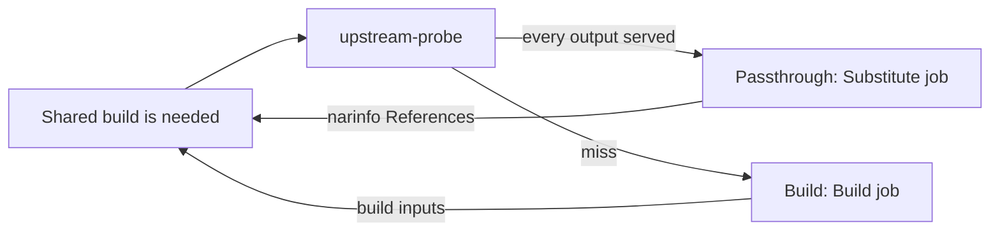

# Upstream Substitution

A build whose outputs an upstream cache already serves is fetched, not built. The `upstream-probe` loop asks upstream caches only about [shared builds](shared-builds.md) another build or an evaluation needs, and the answer decides whether the shared build is a passthrough (fetched from upstream, `cache_available`) or a real build.

## Probe Loop

`gradient-scheduler/src/probe.rs`, a supervised periodic child outside the [graph writer](shared-builds.md#graph-writer). Probing is HTTP; a round trip inside a graph transaction would hold the single graph writer.

| Constant | Value | Role |
|---|---|---|
| `PROBE_TICK` | 1 s | Pass interval |
| `PROBE_BUDGET` | 120 s | Supervision budget of one pass |
| `PROBE_DESCENT` | 60 s | A pass stops descending after this; the rest waits for the next tick |
| `PROBE_MEMORY` | 300 s | An answered shared build is not asked about again within this window |
| `PROBE_BATCH` | 256 | Outputs per request round, and rows per recovery check |
| `PROBE_SWEEP` | 60 s | Recovery check interval, only on an idle tick |

- **Requests:** an in-memory channel (`ProbeRequests`) fed when a batch is recorded (every shared build the batch walked, plus the needs-build marks the batch moved), the transition emitter (`gradient-db/src/status/effects.rs`) and the graph writer after `UpstreamHits` / `UpstreamProbed`.
- **Descent:** each round's answer moves the needs-build marks and hands the next level straight back; one pass follows the closure down instead of one level per tick.
- **Recovery check:** walked shared builds that need building, with `probed = false`. Covers a process that stopped between a commit and the channel send.

## One Round

`plan_probes` builds the round; `probe_round` applies the round.

1. Drop shared builds nothing wants (`wanted = false`).
2. Drop shared builds without `derivation_output` rows (unwalked stubs). A stub stays unanswered until the batch that walks the stub sends the stub again.
3. Skip outputs already cached anywhere (`is_cached` or `external_url`).
4. Group the rest by an evaluation naming the shared build (`build_job`); the evaluation's project picks the upstream caches.
5. `probe_outputs` (`gradient-scheduler/src/eval.rs`) asks each output's `<hash>.narinfo` and flushes `upstream_metric`.
6. Hits go to `GraphMsg::UpstreamHits`, then every shared build of step 2 goes to `GraphMsg::UpstreamProbed`, hit or miss.

A shared build with `probed = false` is not yet a real build. Nothing below the shared build needs building or is handed out until the answer lands; a build queued on "no answer yet" cannot be recalled once a worker holds the job.

## Applying a Hit

`apply_upstream_hits` in `gradient-graph/src/record.rs`:

- **Persist:** `external_url`, `nar_hash`, `file_hash`, `file_size`, `references_list`, `deriver`, plus `nar_size` and `ca` when unset, on every `derivation_output` sharing the hash and not already cached.
- **Runtime dependencies:** the narinfo `References:` line records runtime dependencies on the referenced producers.
- **Passthrough:** `cache_available = true` only when every output of the shared build is served. A terminal-success shared build is never flipped. A failed one is flipped and becomes a passthrough.
- **Needs build:** updated for touched shared builds and those newly available in a cache; the newly needed set returns to the probe.

`mark_probed` sets `probed = true` (`MARK_PROBED`) and updates the needs-build marks. A miss leaves the shared build a real build, which now needs its build inputs.

## Upstream Selection

`gradient-core/src/upstream.rs`, shared by the probe and the worker cache query.

| Rule | Detail |
|---|---|
| Candidates | `cache_upstream` rows with `kind = Http`, a URL, neither upstream nor project subscription `WriteOnly` (`upstream_endpoints_for_project`) |
| Trust | A hit needs a `Sig` that verifies against the upstream's `public_key` and a `StorePath` matching the asked hash (`verified_narinfo`); an upstream without a key never hits |
| Order | Hit rate, then average latency over the last 60 min of `upstream_metric`; unmeasured upstream caches last |
| At most 4 upstream caches | Asked in parallel; the lowest-latency hit wins |
| More than 4 | Asked in order; the first hit wins |
| Timeout | 2 s per narinfo request; 30 s for a `upstream_query` semaphore permit |
| Concurrency | `GRADIENT_CACHE_UPSTREAM_QUERY_CONCURRENCY` (default 32), server-wide |

**Breaker:** 3 consecutive errors (transport failure, or a status other than 2xx and 404) trip an upstream for 60 s. After the cooldown requests pass again; one more error re-trips. A 404 is a miss, not an error, and resets the count. The breakers are process-wide and shared with the cache narinfo endpoint.

**HTTP/1.1 pin:** requests offer HTTP/2. Some upstreams negotiate HTTP/2 and then reset streams mid-body; a proxied NAR then breaks after its `200`, and Nix reports `HTTP error 200 (curl error: Stream error in the HTTP/2 framing layer)`. The first HTTP/2 error from an upstream pins it to HTTP/1.1 (`gradient-util/src/http1_fallback.rs`, `http1_pins` in `gradient-core/src/upstream.rs`):

- The failed request is sent again over HTTP/1.1.
- A body cut short resumes over HTTP/1.1 with `Range: bytes=<sent>-`. Only a `206` whose `Content-Range` starts at that offset is spliced in; anything else ends the body with the original error.
- The pin applies process-wide at once and is stored in `cache_upstream.http1_only`. Every later request to that upstream, after restarts too, uses HTTP/1.1. The API returns the flag read-only, and the upstream list shows an `HTTP/1.1` badge.

## Substitute Jobs

`decide_build_spec_kind` (`gradient-scheduler/src/assign_mode.rs`) reads the flag and nothing else:

| Shared build | Kind | Worker |
|---|---|---|
| `cache_available` | `Substitute` | Any |
| `builtin` system, fixed-output | `Download` | Any, no Nix store |
| Everything else, `builtin:buildenv` included | `Build` | Matching system |

The `BuildSpec` carries the `(name, store_path)` pairs; the worker never reads the `.drv` (`gradient-worker/src/executor/substitute.rs`):

1. Skip outputs the Gradient cache already holds.
2. Locate each remaining output with `CacheQuery { external: true }` (one path per query). The server answers from the persisted `external_url`, else probes `Http` upstream caches, else `GradientProto` upstream caches.
3. Download with the redirect-following client; a body whose length differs from the declared `file_size` counts as missing.
4. Detect compression from the magic bytes, with the URL extension as fallback.
5. Check the NAR against `nar_hash`, then push the bytes like any other output.

Nothing below the outputs is fetched: the referenced paths are shared builds of their own, marked as needed by the server. Build jobs keep `use_substitutes = false` in the daemon.

## Failures and the Miss Budget

| Worker error | Kind | Server |
|---|---|---|
| No upstream serves an output | `SubstituteUnavailable` | Penalty-free requeue to `Queued` |
| Upstream NAR missing, wrong size or not matching `nar_hash` (`CorruptCachedNar`) | `InputsUnavailable` | Self-heal repair pass, retry |
| Anything else, hash mismatch included | `Transient` | Retry |

**Escalation to a build:**

- A passthrough whose `InputsUnavailable` / `Transient` retries run out enters the same budget instead of `FailedPermanent`.
- At `build.substituteMissEscalationThreshold` (default 2) misses within one evaluation, `exhaust_substitution` clears `cache_available`, the upstream columns of the outputs and `attempt`, and sets the shared build `Created`.
- The shared build then builds through the ordinary gates.

## Cache Endpoints

`gradient-web/src/endpoints/caches/`. Every endpoint asks only the cache's own upstream caches that the workers would substitute from (`kind = Http`, a URL, not `WriteOnly`; `substitution_sources` in `gradient-core/src/upstream_source.rs`), skips tripped upstream caches and feeds the shared breakers. NAR and log fetches follow redirects.

| Endpoint | Upstream behaviour |
|---|---|
| `narinfo.rs` | A narinfo the cache lacks is asked from every such upstream with a `public_key` in parallel. The `Sig` must verify against `public_key`, and the `StorePath` must match the asked hash. `URL:` is rewritten to `nar/upstream/<id>/...`, and the cache's own `Sig` is appended next to the upstream's |
| `nar.rs` (`upstream_nar`) | Tries the named upstream first, then every other one; the NAR path is content-addressed and an upstream row may have been deleted |
| `build_log.rs` | `/log/<drv>` serves the local log (`X-Cache: HIT`), else the first non-empty upstream log (`X-Cache: MISS`) |

## Build Log Substitution

`gradient-scheduler/src/log_substitution.rs`. After `BuildCompleted` on a `cache_available` shared build, the scheduler fetches the upstream's build log.

- **Source:** `<upstream>/log/<drv basename>` from the project's candidates (`upstream_endpoints_for_project`, best first), through `fetch_upstream_log`, the same fetch the cache log endpoint uses.
- **Limits:** the first non-empty body wins; 10 s timeout, capped at 16 MiB with a `[truncated]` marker.
- **Target:** appended to the latest `build_attempt` log, only while that log is still empty.
- **Errors:** logged and ignored.

## Related

- [Shared Builds](shared-builds.md)
- [Jobs](../proto/jobs.md)
