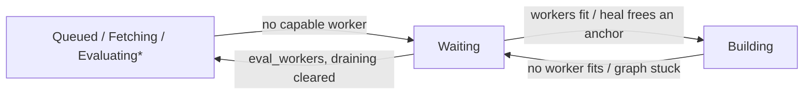

# Waiting and Recovery

How the scheduler splits a flake job across workers, parks an evaluation that cannot progress, re-offers a returned job, and cleans up after a server restart.

## Fetch and Eval Split

`dispatch_queued_evals` (`gradient-scheduler/src/dispatch/eval.rs`) asks the pool once per pass for an idle evaluation-only worker (`WorkerPool::has_idle_eval_only_worker`: active, `eval` without `fetch`, no assigned job).

| Pool at dispatch | Job steps |
|---|---|
| An idle evaluation-only worker exists | `[FetchFlake]`, then a follow-up `[EvaluateFlake, EvaluateDerivations]` |
| Otherwise | `[FetchFlake, EvaluateFlake, EvaluateDerivations]` in one job |

- **Decision per pass:** one idle worker splits every evaluation queued in that pass.
- **Source:** a repository evaluation carries `FlakeSource::Repository`; a `/nix/store/...` source (`gradient build` upload) carries `FlakeSource::Cached` and still runs `FetchFlake` to resolve inputs with the project SSH key (`flake_job_for_eval_source`).
- **Routing:** `WorkerCaps::can_eval` (`gradient-pool/src/worker_caps.rs`) requires `fetch` for a `FetchFlake` step and `eval` for an evaluation step.
- **Follow-up:** on `JobCompleted` of a fetch-only job (`is_fetch_only`), `handle_job_completed` (`job_handlers/build_status.rs`) reads `evaluation.flake_source` and enqueues `PendingEvalJob::cached_followup` under the same `eval:{id}` key: `FlakeSource::Cached` plus the source as a required path. A missing `flake_source` fails the evaluation permanently.
- **Worker side:** the evaluating worker substitutes the source from the cache and evaluates `path:<store path>` (`gradient-worker/src/executor/eval.rs`).
- **Steering:** `ReserveFetchWorkersRule` (`gradient-pool/src/score/rules/builtin.rs`) scores a fetch-capable worker `-300 * (1 - idle / total)` for a job without `FetchFlake`. The penalty fades as workers go idle; the job is never refused. See [Scoring](scoring.md).

## Waiting Reasons

`reconcile_waiting_state` (`gradient-scheduler/src/waiting_state.rs`) runs at the end of every build dispatch pass (5 s tick or kick) over every in-flight evaluation. The reason lands in `evaluation.waiting_reason` only when its JSON changes.

| `WaitingReason` | Parked from | Unparked | Owner |
|---|---|---|---|
| `eval_workers { capability, connected_workers }` | `Fetching` without a `fetch` worker; `Queued`, `EvaluatingFlake`, `EvaluatingDerivation` without an `eval` worker | To `Queued` once the capability connects | Reconciler |
| `workers { unmet, connected_workers, available_architectures }` | `Building` when no worker fits any blocking anchor's `(architecture, required_features)` | To `Building` once one fits; `Aborted` after 300 s on the same `unmet` set unless the task sets `wait_for_workers` | Reconciler |
| `graph_stuck { pending_anchors }` | `Building` when every blocking anchor fits a worker but none can dispatch | To `Building` when the heal frees an anchor | Reconciler |
| `draining` | Every in-flight evaluation while the instance drains | To `Queued` when draining ends or at startup (`unpark_draining_evals`) | Reconciler |
| `approval`, `no_cache`, `cache_storage_full` | Trigger gates | Webhook and cache hooks (`gradient-ci/src/unpark.rs`) | Never touched by the reconciler |

- **Pre-build parks** ignore builds the evaluation already batched: a stall mid-walk still parks.
- **Blocking anchors** are the named anchors in a demandable status that `blocks_evaluation` keeps; an anchor nothing demands is left out.
- **Counters first:** `phase_from_counters` decides without reading an anchor. `named = 0` hands the evaluation to the pre-build rules, `active = 0` finalizes the evaluation through `check_evaluation_done`, `building > 0` keeps `Building`.
- **Unbuildable abort:** `unbuildable` (`gradient-scheduler/src/unbuildable.rs`) hands a `workers` park with a non-empty `unmet` set back to the scheduler once it is older than 300 s and its task has `wait_for_workers = false`. `abort_unbuildable_evaluation` marks it `Aborted`, records a warning naming each missing architecture and feature set, and aborts its anchors. The grace keeps a server restart or worker redeploy from aborting work before the pool reconnects.
- **Anchor read:** otherwise `BuildabilityChecker` reads the blocking anchors. `AssessmentMemo` reuses the verdict for up to 60 s while the counters and the pool fingerprint stay equal. An empty read recounts the drifted counters and finalizes.

## Graph-Stuck Heal

A `workers` verdict with an empty `unmet` set turns into the heal: `attempt_graph_unstick` sends `Transition::Reconcile { scope: ReconcileScope::Unstick }` to the graph actor, then re-assesses without the memo. `reconcile_build_graph` (`gradient-db/src/reconcile.rs`) runs, and the first failed step fails the transition:

1. `requeue_failed_closure`: thaws failed anchors in the closure to `Created`; `Unstick` leaves a deterministic build failure and its subtree alone.
2. `reconcile_cached_anchors_for_eval`: completes anchors whose outputs are all in the cache, then `advance_fetchable` for their dependents.
3. `reconcile_dependency_failed`: fails dependents of a failure that stays.
4. `adopt_pending_closure`: names orphaned pending anchors for the evaluation, then recomputes their demand.
5. `promote_closure`: promotes whatever the gates now pass.

| Driver | When |
|---|---|
| Reconciler | On entry to `graph_stuck` and whenever `pending_anchors` changes (`unstick_due`) |
| `graph-stuck-reheal` pass | Every `metrics.graphConsistencyIntervalSecs` (300 s) for each `graph_stuck` evaluation |
| Counters | Promote the set the moment its gates open |

- **Lost `.drv`:** `recover_drv_stuck_evals` checks evaluations `graph_stuck` for over 120 s. When a demanded, walked, unsubstitutable anchor with all dependencies ready lacks its `.drv` NAR, `trigger_drv_recovery` starts a `DrvRecovery` evaluation of the same commit. A `DrvRecovery` evaluation stuck the same way fails.

## Re-Offering Returned Jobs

Offers are deltas: the server sends a worker only candidates missing from its `sent_candidates`. The worker scores every candidate it is offered. Each offer resets the set to the candidates the worker can currently see, and a claimed, finished or aborted job drops out of it. A job returned to the pool has its sent flag cleared.

| Event | Mechanism |
|---|---|
| Enqueue | `SchedulerMsg::Enqueue` calls `remove_sent_candidate` for every worker, also for the cached follow-up that reuses `eval:{id}` |
| Reject | `SchedulerMsg::Rejected` returns the job to pending and clears its sent flag |
| Dispatch pass | `SchedulerMsg::ReOffer` bumps the offer generation while any job is pending; sessions then pull the delta |

## Startup Recovery

`recover_interrupted_work` (`gradient-db/src/recovery.rs`) runs once at server start (`gradient-web/src/lib.rs`), before `unpark_draining_evals`.

1. **Dispatches:** every open `dispatched_job` row closes as `Abandoned`. Both dispatch selections refuse a job with an open row; without this step re-queued work waits for its worker to reconnect or the 1800 s abandoned-dispatch sweep.
2. **Attempts:** `Running` build attempts turn `Aborted`.
3. **Anchors:** every `Building` anchor turns `Queued`; `unpromote_ungated` pulls those whose gates no longer pass back to `Created`.
4. **Evaluations:** every status in `EvaluationStatus::ACTIVE` except `Queued` and `Waiting` turns `Aborted` with `finished_at`. `Building` is included: nothing else drives its remaining builds.
5. **Their anchors:** `Created`, `Queued` and `Building` anchors of those evaluations turn `Aborted`, unless a non-terminal evaluation also names them.
6. **Tasks:** each affected task gets `force_evaluation`. The fresh evaluation thaws the aborted anchors through `ReconcileScope::Eval` once its stream completes.
7. **Clusters:** every open [cluster attempt](clusters.md) closes (`PrepareFailed` when unstarted, `Aborted` otherwise). A `Running` cluster goes back to `Queued`, or to `Aborted` when a member evaluation or anchor can no longer run.

- `Queued` evaluations return through the eval dispatcher; `Waiting` ones through the reconciler.
- The live effects of `update_evaluation_status` do not run; the rows are consistent on their own.
