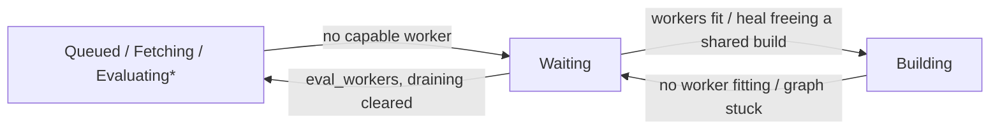

# Waiting and Recovery

The scheduler splitting a flake job across workers, parking an evaluation without progress, re-offering a returned job and cleaning up after a server restart.

## Fetch and Eval Split

`assign_queued_evals` (`gradient-scheduler/src/loops/eval.rs`) can ask the pool once per pass for an idle evaluation-only worker (`WorkerPool::has_idle_eval_only_worker`: active, `eval` without `fetch`, no assigned job).

| Pool at assignment | Job steps |
|---|---|
| An idle evaluation-only worker present | `[FetchFlake]`, then a follow-up `[EvaluateFlake, EvaluateDerivations]` |
| Otherwise | `[FetchFlake, EvaluateFlake, EvaluateDerivations]` in one job |

- **Decision per pass:** one idle worker will split every evaluation queued in that pass.
- **Source:** a repository evaluation must carry `FlakeSource::Repository` as source. A `/nix/store/...` source (`gradient build` upload) must carry `FlakeSource::Cached` as source. That source will still run `FetchFlake` to resolve inputs with the project SSH key (`flake_job_for_eval_source`).
- **Routing:** `WorkerCaps::can_eval` (`gradient-pool/src/worker_caps.rs`) will require `fetch` for a `FetchFlake` step and `eval` for an evaluation step.
- **Follow-up:** `handle_job_completed` (`job_handlers/build_status.rs`) will react to `JobCompleted` of a fetch-only job (`is_fetch_only`). The handler must read `evaluation.flake_source` and enqueue `PendingEvalJob::cached_followup` under the same `eval:{id}` key. The follow-up will carry `FlakeSource::Cached` plus the source as a required path. A missing `flake_source` will fail the evaluation permanently.
- **Worker side:** the evaluating worker will substitute the source from the cache and evaluate `path:<store path>` (`gradient-worker/src/executor/eval.rs`).
- **Steering:** `ReserveFetchWorkersRule` (`gradient-pool/src/score/rules/builtin.rs`) will score a fetch-capable worker `-300 * (1 - idle / total)` for a job without `FetchFlake`. The penalty will fade as workers go idle. The rule will never refuse the job. See [Scoring](scoring.md).

## Waiting Reasons

The waiting pass, `refresh_waiting_state` (`gradient-scheduler/src/waiting_state.rs`), can start at the end of every build assignment pass (5 s tick or kick) over every in-flight evaluation. The pass will write the reason into `evaluation.waiting_reason` only on a change of its JSON.

| `WaitingReason` | Parked from | Unparked | Owner |
|---|---|---|---|
| `eval_workers { capability, connected_workers }` | `Fetching` without a `fetch` worker. `Queued`, `EvaluatingFlake`, `EvaluatingDerivation` without an `eval` worker | To `Queued` once the capability is connected | Waiting pass |
| `workers { unmet, connected_workers, available_architectures }` | `Building` with no worker fitting the `(architecture, required_features)` of any blocking shared build | To `Building` once one can fit. `Aborted` after 300 s on the same `unmet` set, unless `wait_for_workers` is set on the task | Waiting pass |
| `graph_stuck { pending_shared_builds }` | `Building` with a fitting worker for every blocking shared build, yet none can be handed out | To `Building` once the heal can free a shared build | Waiting pass |
| `draining` | Every in-flight evaluation during an instance drain | To `Queued` at the end of draining or at startup (`unpark_draining_evals`) | Waiting pass |
| `approval`, `no_cache`, `cache_storage_full` | Trigger conditions | Webhook and cache hooks (`gradient-ci/src/unpark.rs`) | Never touched by the waiting pass |

- **Pre-build parks** skip each shared build the evaluation already batched. A stall mid-walk will still park.
- **Blocking builds** are the named shared builds kept by `blocks_evaluation`, in a status that can still be wanted. A shared build wanted by nothing is left out.
- **Counters first:** `phase_from_counters` can decide without reading a shared build. `named = 0` will hand the evaluation to the pre-build rules. `active = 0` will finalize the evaluation through `check_evaluation_done`. `building > 0` will keep the `Building` status.
- **Unbuildable abort:** `unbuildable` (`gradient-scheduler/src/unbuildable.rs`) can hand a `workers` park with a non-empty `unmet` set back to the scheduler. The hand-back will take place once the park is older than 300 s. The task must also have `wait_for_workers = false` set. `abort_unbuildable_evaluation` will mark the evaluation `Aborted` and abort its shared builds. The function will also record a warning naming each missing architecture and feature set. The grace must keep a server restart or worker redeploy from aborting work before the pool is back.
- **Shared build read:** `BuildabilityChecker` will otherwise read every blocking shared build. `AssessmentMemo` can reuse the verdict for up to 60 s while the counters and the pool fingerprint stay equal. An empty read will recount the drifted counters and finalize.

## Graph-Stuck Heal

A `workers` verdict with an empty `unmet` set will turn into the heal. `attempt_graph_unstick` must send `Transition::Repair { scope: RepairScope::Unstick }` to the [graph writer](shared-builds.md#graph-writer). The function will then re-assess without the memo. The [repair pass](repair-pass.md) `repair_build_graph` (`gradient-db/src/graph/repair.rs`) will run the steps below. The first failed step will fail the transition.

1. `requeue_failed_closure`: thawing failed shared builds in the closure to `Created`. `Unstick` will leave a deterministic build failure and its subtree alone.
2. `repair_cached_shared_builds_for_eval`: completing shared builds with every output in the cache, then `advance_fetchable` for the builds needing them.
3. `repair_dependency_failed`: failing the builds needing a build with a lasting failure.
4. `adopt_pending_closure`: naming orphaned pending shared builds for the evaluation, then updating their needs-build marks.
5. `promote_closure`: queueing every build now passing the queue conditions.

| Driver | When |
|---|---|
| Waiting pass | On entry to `graph_stuck` and on every change of `pending_shared_builds` (`unstick_due`) |
| `graph-stuck-reheal` pass | Every `metrics.graphConsistencyIntervalSecs` (300 s) for each `graph_stuck` evaluation |
| Counters | Queueing the set the moment its queue conditions hold |

- **Lost `.drv`:** `recover_drv_stuck_evals` will check evaluations in `graph_stuck` for over 120 s. Its target is a walked shared build needing a build and not available in a cache. That build must have every dependency done and no `.drv` NAR. `trigger_drv_recovery` will start a `DrvRecovery` evaluation of the same commit for such a build. A `DrvRecovery` evaluation stuck the same way will fail.

## Re-Offering Returned Jobs

Offers are deltas. The server will send a worker only candidates missing from its `sent_candidates` set. The worker must score every offered candidate. Each offer will reset the set to the candidates currently visible to the worker. A claimed, finished or aborted job will drop out of the set. Returning a job to the pool will clear its sent flag.

| Event | Mechanism |
|---|---|
| Enqueue | `SchedulerMsg::Enqueue` calling `remove_sent_candidate` for every worker, also for the cached follow-up reusing `eval:{id}` |
| Reject | `SchedulerMsg::Rejected` returning the job to pending and clearing its sent flag |
| Assignment pass | `SchedulerMsg::ReOffer` bumping the offer generation while any job is pending. Sessions then pull the delta |

## Startup Recovery

`recover_interrupted_work` (`gradient-db/src/maintenance/recovery.rs`) will run once at server start (`gradient-web/src/lib.rs`), before `unpark_draining_evals` starts.

1. **Assignments:** all open `dispatched_job` rows close as `Abandoned` rows. Both assignment selections refuse a job with an open row. Re-queued work would otherwise wait for its worker to reconnect or for the 1800 s check for abandoned assignments.
2. **Attempts:** `Running` build attempts turn `Aborted`.
3. **Shared builds:** every `Building` shared build must turn `Queued` first. `unpromote_ungated` will move those with failing queue conditions back to `Created` status.
4. **Evaluations:** `Fetching`, `EvaluatingFlake` and `EvaluatingDerivation` evaluations turn `Queued`, with a phase event each. Their eval job was on a worker. `Building` evaluations keep their status and their re-queued builds.
5. **Clusters:** all open [cluster attempts](clusters.md) close (`PrepareFailed` when unstarted, `Aborted` otherwise). A `Running` cluster will go back to `Queued`, or to `Aborted` when a member evaluation or shared build can no longer finish.

- `Queued` evaluations return through the eval assignment pass. `Waiting` ones through the waiting pass.
- Recovery will skip the live effects of `update_evaluation_status` calls. The rows are consistent on their own.
