# Proto

Gradient workers connect to the server over a persistent WebSocket at `/proto`. All messages are binary frames serialized with [rkyv](https://rkyv.org/). WebSocket framing handles message boundaries — no additional length-prefix is needed.

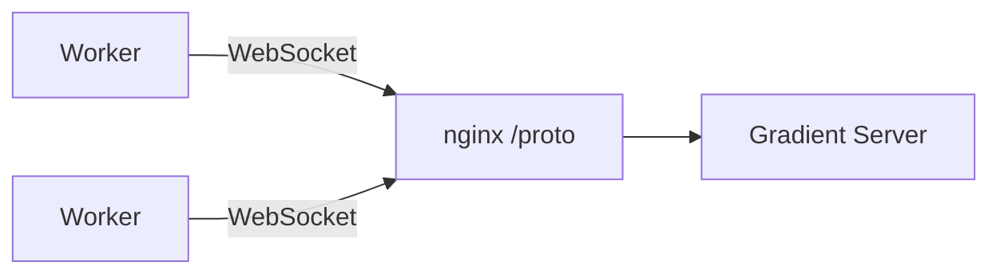

Connection lifecycle: **handshake → auth challenge → capabilities → pull-based job loop**.

---

## Handshake

The first message on every connection is `InitConnection`. The server responds with either an `AuthChallenge` (listing peers that have registered this worker) or `Reject`.

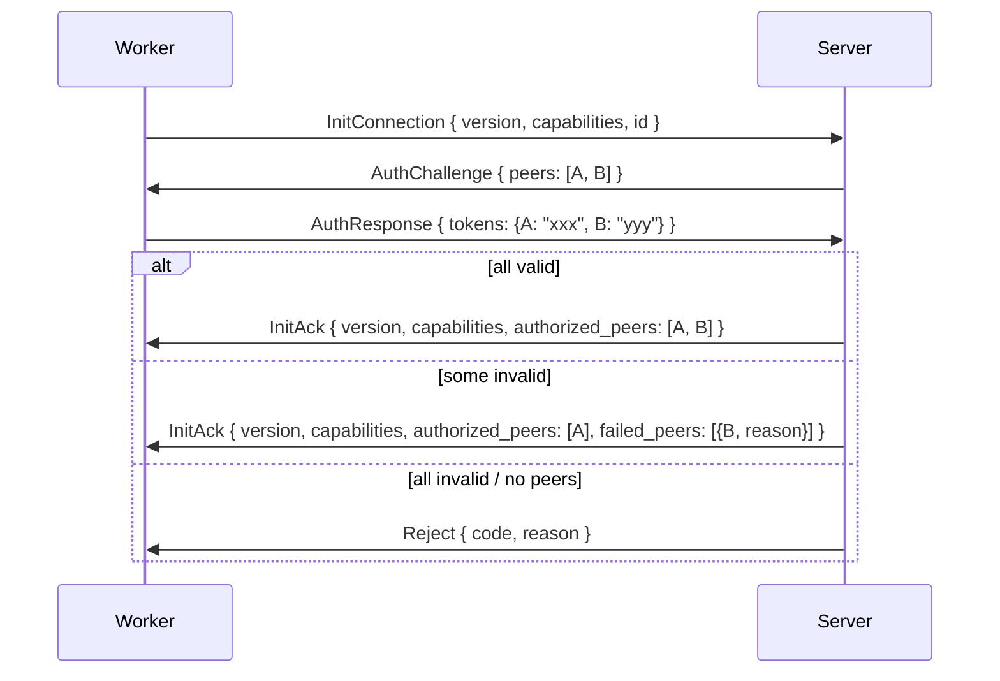

The worker can also reject after receiving `InitAck`:

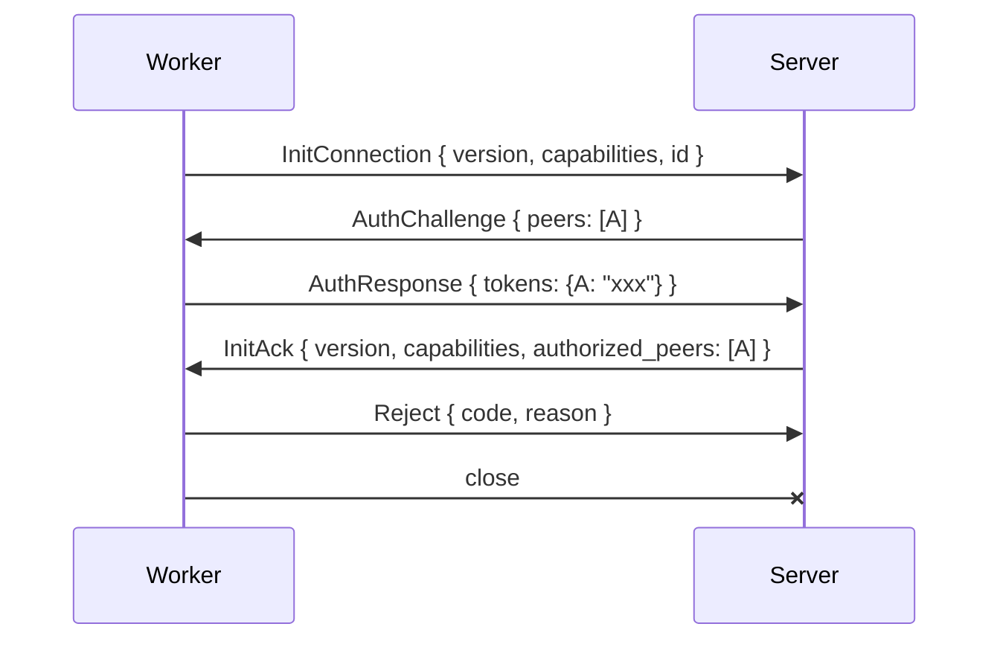

**Rejection reasons:**

 - Server rejects when no peers have registered this worker ID (unknown worker)
 - Server rejects a unknown peer (not authorized) when `federate` is not enabled on the server
 - Server rejects a worker whose capabilities are all disabled after negotiation (nothing useful to do)
 - Server rejects a duplicate connection (same worker ID already connected)
 - Server rejects when all peer tokens fail validation
 - Worker rejects a server it does not trust (e.g. unknown server identity, policy mismatch)

### Peer Identity

Each peer (worker or server) has a persistent `id: Uuid` generated on first start and stored locally (e.g. `/var/lib/gradient-worker/worker-id`). The peer sends it in `InitConnection`:

```rust
InitConnection {
    version: u16,
    capabilities: GradientCapabilities,
    id: Uuid,
}
```

The `worker-id` enables:
 - **Reconnect matching** — on reconnect after server restart, the server matches the peer to its previous session and reassigns orphaned jobs immediately instead of waiting for the grace period.
 - **Duplicate detection** — the server rejects a second connection with the same `worker-id`. One WebSocket connection per worker per server instance.
 - **Admin visibility** — the server tracks connected peers by ID for the frontend UI (list workers, their capabilities, assigned jobs, status).
 - **Logging** — all log lines and job assignments reference the peer ID for debugging.

### Negotiation

**Version:** the server accepts any `client_version == PROTO_VERSION`. If the client sends a other version, the server responds with `Reject { code: 400 }`.

**Capabilities:** each `GradientCapabilities` field is AND-ed — a capability is active only if both sides support it. Two fields are server-authoritative:

| Capability | Who controls |                        Description                           |
|------------|--------------|--------------------------------------------------------------|
| `core`     | Server only  | Always `true` on the server, always `false` on workers       |
| `federate` | AND          | Relay work and NAR traffic between peers                     |
| `fetch`    | AND          | Prefetch flake inputs and clone repositories                 |
| `eval`     | AND          | Run Nix flake evaluations                                    |
| `build`    | AND          | Execute Nix store builds                                     |
| `cache`    | Server only  | Server serves as a binary cache (`GRADIENT_SERVE_CACHE`)     |

---

## Authorization

Authorization uses a challenge-response flow based on **peers**. A peer is any entity on the server that can register a worker — an **org**, a **cache**, or a **proxy**. The worker doesn't know or care what type of peer it's authenticating against — it just holds `peer_id → token` pairs.

Mutual consent: the peer registers the worker ID (peer consents), the worker holds the peer's token (worker consents).

### Setup (before connection)

 1. A peer (org admin, cache owner, or proxy) registers a worker ID → server generates a token for that `(peer, worker_id)` pair
 2. The peer gives the token to the worker operator
 3. Worker operator adds `peer_id → token` to worker config

```yaml
# worker config
id: "w-550e8400-e29b-41d4-a716-446655440000"
peers:
  peer-alpha: "tok_abc123"    # could be an org, cache, or proxy
  peer-beta:  "tok_def456"    # worker doesn't know or care which type
```

### Auth challenge flow

At connection time, the server looks up which peers have registered this worker ID and challenges for their tokens:

```rust
// Server → Worker: which peers have registered you
AuthChallenge {
    peers: Vec<Uuid>,          // peer IDs that registered this worker
}

// Worker → Server: here are my tokens for those peers
AuthResponse {
    tokens: HashMap<Uuid, String>,  // peer_id → token (only for peers the worker has tokens for)
}
```

The server validates each token independently. The worker is authorized for every peer whose token is valid. If some tokens fail, the connection continues with the successful peers — only a total failure causes `Reject`.

What authorization means depends on the peer type:
 - **Org** — worker receives jobs from that org's projects
 - **Cache** — worker can serve/pull from that cache
 - **Proxy** — worker is part of the proxy's pool

### Reauth

Tokens can be added or rotated without reconnecting. At any point during the connection, either side can initiate reauth:

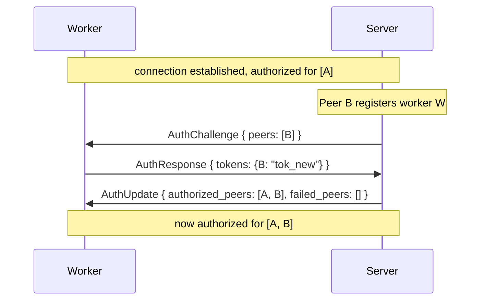

Worker-initiated reauth (e.g. operator added a new peer token to config):

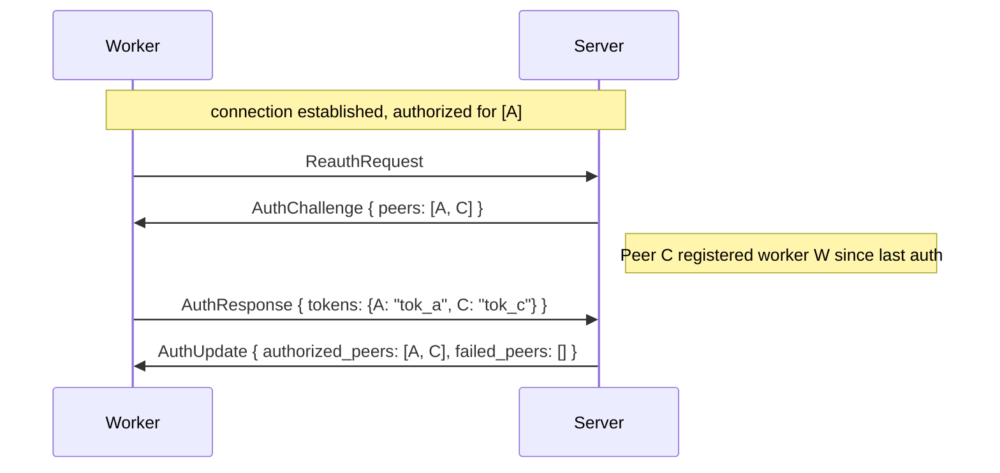

If a token fails during reauth, the worker keeps its existing authorizations for that peer (if any) — reauth never revokes already-granted access unless the server explicitly sends a revocation.

### Connection uniqueness

The server allows only **one WebSocket connection per worker ID per instance**. If a worker reconnects while its old connection is still open (e.g. network split), the server closes the old connection and accepts the new one.

### Key management

- Peers (org admins, cache owners, proxy operators) create worker tokens via the web API, scoped to a specific worker ID
- Workers store tokens in config file or environment (`GRADIENT_WORKER_PEERS="peer_id:token,peer_id:token"`)
- Keys can be rotated via reauth — no reconnect needed

### Admin visibility

The `GET /api/v1/workers` endpoint shows all connected workers and their status. Access is controlled by:

 - **Superuser users** — users with the `superuser` flag set on their account can always access the endpoint
 - **`GRADIENT_GLOBAL_STATS_PUBLIC=true`** — when set, the workers/stats endpoints are publicly visible without authentication

---

## Capability Advertisement

After a successful handshake, workers with the `build` capability negotiated send `WorkerCapabilities`. Workers without `build` (e.g. eval-only workers) never send this message.

```rust
WorkerCapabilities {
    architectures: Vec<String>,         // Nix system strings, e.g. ["x86_64-linux", "aarch64-linux"]
    system_features: Vec<String>,       // Nix system features, e.g. ["kvm", "big-parallel"]
    max_concurrent_builds: u32,         // how many parallel builds this worker accepts
}
```

Architectures are free-form strings (e.g. `"x86_64-linux"`, `"aarch64-linux"`) — not an enum. Custom or unusual platforms (e.g. `"riscv64-linux"`) can be advertised without any code changes.

The reference worker (`gradient-worker`) auto-detects its host system at startup and uses that as the default `architectures` value (`std::env::consts::ARCH` + OS, with `macos` mapped to `darwin`). Both fields are overridable via env vars / CLI flags so a host with binfmt-emulated architectures or a custom-configured daemon can advertise extras:

```text
GRADIENT_WORKER_ARCHITECTURES=x86_64-linux,aarch64-linux,builtin
GRADIENT_WORKER_SYSTEM_FEATURES=kvm,big-parallel,nixos-test
```

When `GRADIENT_WORKER_ARCHITECTURES` is **set**, it replaces the auto-detected default entirely (so e.g. setting it on an aarch64 host without including `aarch64-linux` will refuse all native builds — list every system you want to accept). `GRADIENT_WORKER_SYSTEM_FEATURES` is empty by default; it should mirror the daemon's `system-features` line in `nix.conf` so the dispatcher doesn't route a `kvm`-requiring build to a worker whose daemon can't run it.

When the server dispatches a build, it checks that the build's target architecture is present in the worker's `architectures` and all `required_features` are present in the worker's `system_features`. For example, a build targeting `aarch64-linux` with `required_features: ["kvm"]` requires a worker with `"aarch64-linux"` in `architectures` and `"kvm"` in `system_features`. Builds whose `architecture` is the special string `"builtin"` (e.g. `builtin:fetchurl`) are always assignable, regardless of the worker's `architectures` list.

**Federation proxy behavior:** a proxy with `federate` enabled connects upstream as a single worker. It **aggregates** the capabilities of all its downstream workers:

 - `GradientCapabilities` (in `InitConnection`) — OR of all downstream workers' capabilities (if any worker can build, the proxy advertises `build`)
 - `system_features` — union of all downstream features (sorted by total capacity)
 - `max_concurrent_builds` — sum of all downstream workers' slots

The upstream server sees the proxy as one powerful worker. The proxy handles internal job routing to its downstream workers transparently.

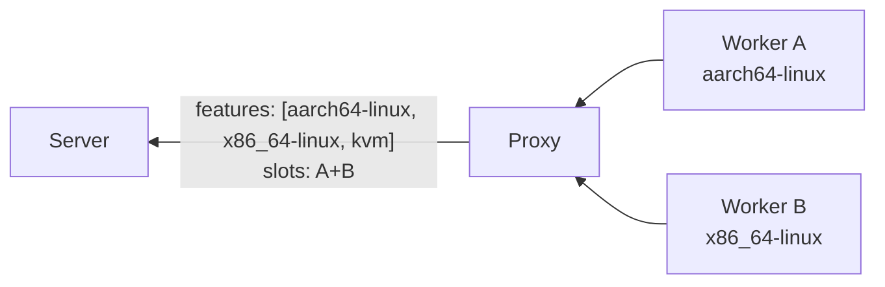

The server uses these to match `RequestJobChunk` to queued builds. A worker that does not send capabilities will only receive `FlakeJob`s, never `BuildJob`s.

### Capability Updates

`WorkerCapabilities` can be re-sent **at any point during the connection** to update the server's view. The server replaces the previous values immediately. This is the primary mechanism for proxies to keep the upstream server in sync when their downstream worker pool changes.

**Example — downstream worker disconnects from a proxy:**

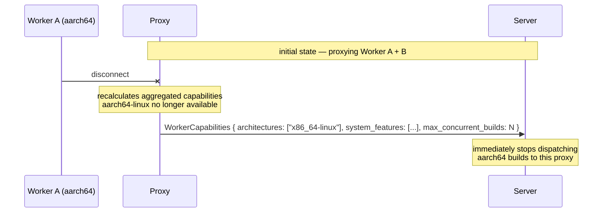

The server's handler processes mid-connection `WorkerCapabilities` identically to the initial send — it calls `scheduler.update_worker_capabilities()` which atomically replaces the worker's entry in the pool. Any pending build offers for architectures or features no longer advertised are revoked.

Re-sending `WorkerCapabilities` does **not** require reconnecting and does **not** interrupt in-flight jobs. Only future job offers are affected.

### Ephemeral Workers

Workers can run in ephemeral VMs (e.g. RAM-only, no persistent disk). To prevent resource leaks and state accumulation, workers can decide internally when to stop accepting work (e.g. after N jobs, or based on memory pressure). When ready to recycle, the worker sends `Draining`, waits for in-flight jobs to finish, then disconnects cleanly. The VM can then be destroyed and a fresh one spawned.

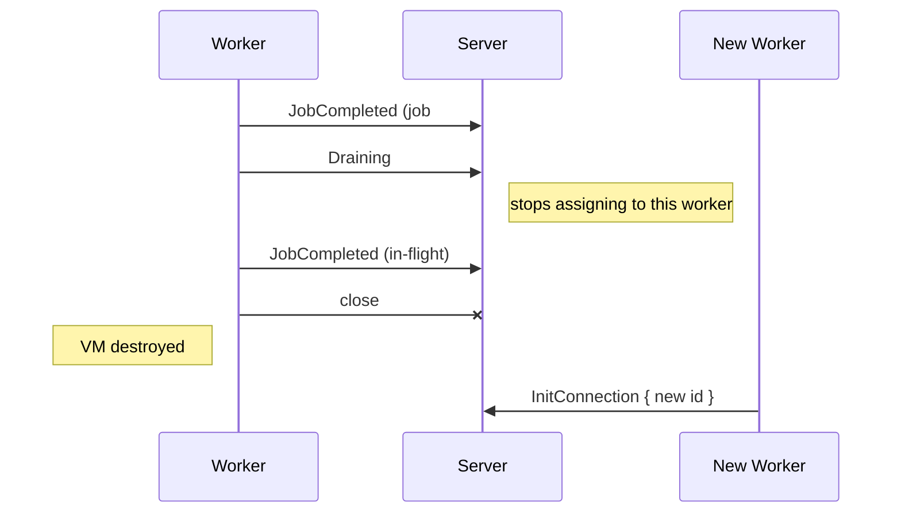

The server treats `Draining` as "do not assign new jobs to this worker". The worker is free to disconnect once all in-flight jobs complete.

---

## Job Dispatch

Job dispatch uses **eager push + pull-based claiming**. The server pushes **new** job candidates to eligible workers as they become available. Workers keep all received candidates in memory, score them against the local Nix store, and send back only **new or changed** scores. The server also keeps all scores in memory per worker. Both sides maintain a persistent view of the candidate/score state, enabling efficient delta-based communication and seamless recovery after server restarts.

Jobs are scoped to the worker's authorized peers — a worker only receives candidates from peers (orgs, caches) it has successfully authenticated against.

### Dispatch Flow

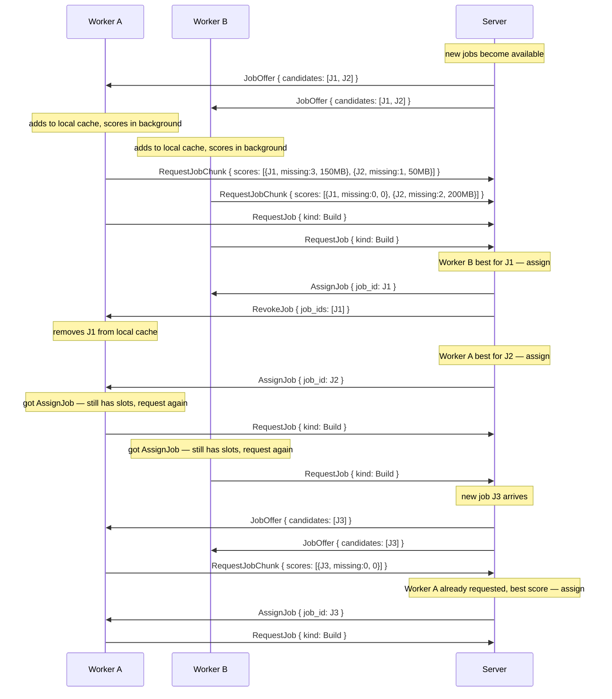

### How It Works

 1. **`JobOffer`** (server → workers, delta-only) — the server pushes only **new** candidates that the worker hasn't seen yet. Workers accumulate candidates in a persistent local cache. Each candidate includes `required_paths` (with optional `CacheInfo` for paths in the server's cache) so workers can score locally. Candidates are paginated at **1 000 entries per message**; `is_final: true` on `JobListChunk` marks the end of the initial list. The server dispatches builds immediately after three events: evaluation result (new builds queued), build completion (dependent builds unlocked), and build failure (cascade frees blocked builds). A background dispatch loop (5-second interval) acts as a safety net.
 2. **Workers score in the background** — on receiving `JobOffer`, the worker adds candidates to its local cache and scores them against the local Nix store. Scores are kept in memory. After a build completes (populating store paths), the worker re-scores affected candidates whose `required_paths` overlap with the new outputs.
 3. **`RequestJobChunk`** (worker → server, delta-only) — the worker sends only **new or changed** scores. A score changes when a path becomes available in the local store (e.g. after a build). The server accumulates scores per worker in memory. Scores are paginated at **1 000 entries per message**; `is_final: true` marks the last chunk in each scoring pass. An empty chunk with `is_final: true` signals the end of a pass when no scores changed.
 4. **`RequestJob`** (worker → server, pull-based) — the worker signals it has capacity for **one** job. `kind` specifies whether it wants a `FlakeJob` or `BuildJob`. The server either responds with `AssignJob` immediately (if a matching job with good scores exists) or marks internally that this worker needs a job and assigns one when available. On receiving `AssignJob`, the worker immediately sends another `RequestJob` if it still has capacity — this naturally fills all available slots. Workers also re-send `RequestJob` every **10 seconds** as a heartbeat if no `AssignJob` arrived, ensuring the server recovers the "worker needs work" state after a restart without persistent storage.

 5. **`AssignJob`** (server → winning worker) — the server compares scores across all workers that have requested a job. Lowest `missing_nar_size` wins (fewest bytes to download). Ties are broken by `missing_count`, then by fewest assigned jobs. The server may assign as soon as it sees an optimal score (e.g. `missing_nar_size: 0`).
 6. **`RevokeJob`** (server → losing workers) — all other workers that had this candidate in their cache are told to remove it. Workers delete the candidate and its score from their local cache.

### Initial Sync

Both sides persist candidate/score state in memory across the connection. On every new connection (including reconnects after a server restart), two startup-only messages perform the initial state sync:

 - **`RequestAllCandidates`** (worker → server) — sent **once** by the worker immediately after the handshake completes. The server responds with a paginated `JobListChunk` stream (1 000 entries per message, `is_final: true` on the last) containing all active candidates for this worker. All subsequent candidate updates arrive as delta `JobOffer` messages — `RequestAllCandidates` is not sent again on the same connection.
 - **`RequestAllScores`** (server → worker) — sent **once** by the server during handshake completion to rebuild its in-memory score table. The worker responds with a paginated `RequestJobChunk` stream of all scores from its local cache (`is_final: true` on the last chunk; an empty chunk with `is_final: true` when no scores are cached). All subsequent score updates arrive as delta `RequestJobChunk` messages — `RequestAllScores` is not sent again on the same connection.

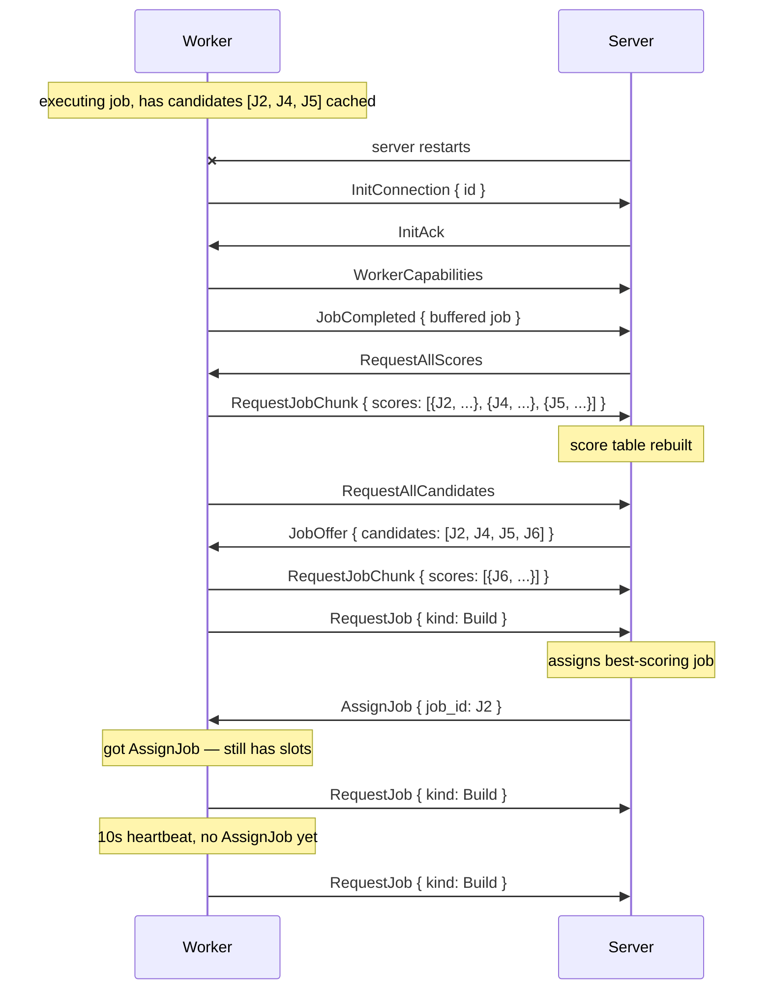

```rust
// Server → Worker (pushed eagerly, delta-only — only new candidates; paginated at 1 000)
JobOffer {
    candidates: Vec<JobCandidate>,
}

JobCandidate {
    job_id: Uuid,
    required_paths: Vec<RequiredPath>,  // store paths needed (worker scores against these)
    drv_paths: Vec<String>,             // .drv paths for build candidates; empty for eval jobs
}

RequiredPath {
    path: String,                       // /nix/store/xxx-name
    cache_info: Option<CacheInfo>,      // present when the path is in the server's binary cache
}

CacheInfo {
    file_size: u64,                     // compressed NAR size on disk (bytes)
    nar_size: u64,                      // uncompressed NAR size (bytes)
}

// Server → Worker (after assignment to another worker)
RevokeJob {
    job_ids: Vec<Uuid>,
}

// Server → Worker (startup-only — sent once at handshake completion; ask worker to re-send all scores)
RequestAllScores,

// Worker → Server (delta-only — only new or changed scores; paginated at 1 000)
RequestJobChunk {
    scores: Vec<CandidateScore>,        // batch of new/changed scores
    is_final: bool,                     // true on the last chunk of each scoring pass
}

// Worker → Server (pull-based — "I have capacity for one job")
// Sent again immediately after AssignJob if worker still has slots.
// Re-sent every 10s as heartbeat if no AssignJob arrived.
RequestJob {
    kind: JobKind,                      // FlakeJob or BuildJob
}

enum JobKind { Flake, Build }

// Worker → Server (startup-only — sent once at handshake completion; ask server to re-send all active candidates)
RequestAllCandidates,

CandidateScore {
    job_id: Uuid,
    missing_count: u32,                 // number of required_paths not in local store
    missing_nar_size: u64,              // total uncompressed NAR size of missing paths (bytes)
                                        // derived from CacheInfo.nar_size; 0 when unavailable
}
```

### Benefits

 - **No scoring round-trip at request time** — workers pre-score candidates as offers arrive and stream score deltas continuously.
 - **Minimal bandwidth** — only new candidates and changed scores are sent. After initial sync, traffic is proportional to changes, not total candidate count.
 - **Early assignment** — server can assign as soon as it sees an optimal score (e.g. `missing: 0`) without waiting for all workers to finish scoring.
 - **Optimal assignment** — server sees all workers' scores before deciding. A worker that already has 90% of the closure cached (lower `missing_nar_size`) gets the job over one that needs everything.
 - **Large build trees handled incrementally** — as evaluation discovers derivations in batches (`EvalResult`), the server pushes new `JobOffer`s immediately. Workers start scoring while evaluation is still in progress.
 - **Re-scoring after builds** — when a build completes and populates the worker's store, affected candidate scores automatically improve. The worker sends updated scores, potentially claiming jobs it previously scored poorly on.
 - **Seamless server restart** — `RequestAllScores` + `RequestAllCandidates` at connection startup rebuild state without re-evaluating everything from scratch. Both are startup-only; all subsequent updates are delta-only.

### Edge Cases

 - **Single eligible worker:** server skips scoring and sends `AssignJob` directly with the `JobOffer` — no `RequestJobChunk`/`RevokeJob` overhead.
 - **Worker disconnects with cached offers:** the server drops the worker's score entries from memory. On reconnect, `RequestAllScores` rebuilds them.
 - **Stale scores:** if a worker's store changes between scoring and `RequestJobChunk` (e.g. another job populated paths), the worker detects the change and sends an updated score. The server always uses the latest score per worker.

---

## Job Model

Each job is a sequence of **tasks** executed in order. If any task fails, the remaining tasks are skipped and the job is reported as failed.

### FlakeJob

Requires negotiated capability: `fetch` and/or `eval`. The server includes only the tasks the worker's capabilities allow. A fetch-only worker gets just `FetchFlake`; an eval-only worker gets `EvaluateFlake` + `EvaluateDerivations` (server or other worker must have already fetched); a worker with both gets the full chain.

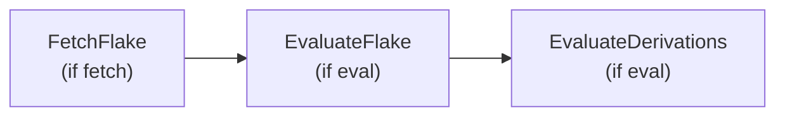

| Task | Requires | Input (from server) | Output (from worker) |
|------|----------|---------------------|----------------------|
| **FetchFlake** | `fetch` + `source: Repository` | `source.url` + `source.commit`, SSH credential | For each fetched path (source + flake inputs): zstd-compressed NAR uploaded via `NarPush` / S3 PUT, followed by `NarUploaded` with full metadata (`file_hash`, `file_size`, `nar_size`, `nar_hash`, `references`). Closing `FetchResult { flake_source: Option<String> }` reports the archived flake source store path — the server passes it to a subsequent eval-only job as `FlakeSource::Cached { store_path }`. |
| **EvaluateFlake** | `eval` | `wildcards` (attribute patterns), `timeout` (seconds) | `attrs: Vec<String>` — discovered attribute paths |
| **EvaluateDerivations** | `eval` | (uses attrs from previous task) | `derivations: Vec<DiscoveredDerivation>` — drv paths, outputs, closure, required features; each produced `.drv` is also pushed (compressed) via `NarUploaded` before the batch is reported |

```rust
FlakeJob {
    tasks: Vec<FlakeTask>,               // [FetchFlake, EvaluateFlake, EvaluateDerivations] — subset per worker capability
    source: FlakeSource,                 // where to get the flake source (see below)
    wildcards: Vec<String>,              // attribute patterns for EvaluateFlake (e.g. ["packages.*.*"])
    timeout_secs: Option<u64>,           // None = use server default (GRADIENT_EVALUATION_TIMEOUT)
}

enum FlakeSource {
    /// Clone the repo at `commit` via git. Valid only when `FetchFlake` is
    /// in `tasks` and the worker has the `fetch` capability; otherwise the
    /// server rejects the job.
    Repository { url: String, commit: String },
    /// Use a store path that's already in the cache as the flake source.
    /// Valid when `FetchFlake` is NOT in `tasks` — an eval-only worker
    /// can't clone a repo (no SSH key is delivered without the `fetch`
    /// capability) but can still evaluate an already-archived source.
    Cached { store_path: String },
}
```

When `FetchFlake` and `EvaluateFlake`/`EvaluateDerivations` are in the **same `FlakeJob`**, the worker reuses the local clone from the fetch step for evaluation. The repository is cloned exactly once; subsequent eval tasks reference the source as `path:/nix/store/xxx` — a pure, content-addressed reference. On fallback (temp checkout), `git+file://...?rev=` is used to keep Nix in pure evaluation mode.

When the tasks are in **separate jobs** — typical for a mix of fetch-only and eval-only workers — the scheduler dispatches FetchFlake as its own job to a `fetch`-capable worker (source = `Repository`), and later dispatches the Evaluate tasks as another job with source = `Cached { store_path }` pointing at the NAR the fetch worker archived into the cache. The eval worker never touches a remote URL and never needs an SSH key.

#### FetchFlake

Fetch runs on a worker that has the `fetch` capability. The fetch step performs up to four things:

 1. **Clone** the repository at the specified commit using libgit2 (handles SSH keys, `git://`, `https://`).
 2. **Archive** the flake source and all locked transitive inputs into the local Nix store by running `nix flake archive --json`. This goes through the nix daemon (subprocess) so network fetching and store-write access work correctly. Returns the nix store source path (e.g. `/nix/store/xxx-source`) and all input store paths.
 3. **Compress and push every uncached NAR** — the worker sends `CacheQuery { mode: Push }` for every fetched path. For uncached paths, it **zstd-compresses the NAR locally** and uploads (presigned S3 PUT or chunked `NarPush`); on completion it emits `NarUploaded` with the full metadata (`file_hash`, `file_size`, `nar_size`, `nar_hash`, `references`). **NARs are never transmitted uncompressed.**
 4. **Report `FetchResult`** carrying only the archived flake source store path (not the full input list — the server already has every `cached_path` row from the `NarUploaded` stream). The server hands this path to any subsequent eval-only job via `FlakeSource::Cached { store_path }`.

If `nix flake archive` fails (e.g. network unavailable), the worker falls back to the temporary git checkout path, skips step 3 (nothing to push), and sets `flake_source` to `None` to signal the fallback — no follow-up eval-only job can then use `FlakeSource::Cached`.

```rust
FetchResult {
    /// Nix store path of the archived flake source (e.g.
    /// `/nix/store/xxx-source`). `Some` when `nix flake archive`
    /// succeeded and the source now lives in the cache as a NAR;
    /// `None` when the worker fell back to a temporary git checkout —
    /// in that case the server cannot dispatch an eval-only follow-up
    /// job (no `FlakeSource::Cached` path is available).
    flake_source: Option<String>,
}
```

#### EvaluateDerivations — drv caching

Every `.drv` file discovered during `EvaluateDerivations` is a cacheable store path that substituters ask for by `<drv-hash>.narinfo`. The eval worker therefore:

 1. Runs `CacheQuery { mode: Push, paths: <new drv paths in wave> }` alongside each `EvalResult` batch.
 2. For uncached drvs, reads the `.drv` file from the local store, packs it into a NAR, **zstd-compresses it**, and uploads (S3 PUT or chunked `NarPush`) followed by `NarUploaded`.

The server records the drv's `cached_path` row directly from the `NarUploaded` message. The server never re-packs or re-hashes — it trusts the NAR metadata the worker reports.


```rust
DiscoveredDerivation {
    attr: String,                       // e.g. "packages.x86_64-linux.hello"
    drv_path: String,                   // /nix/store/xxx.drv
    outputs: Vec<DerivationOutput>,     // [{name: "out", path: "/nix/store/..."}]
    dependencies: Vec<String>,          // drv paths this depends on
    architecture: String,               // Nix system string, e.g. "x86_64-linux", "builtin"
    required_features: Vec<String>,     // Nix system features needed to build (e.g. "kvm")
    substituted: bool,                  // all outputs already present in the server's cache
}
```

`substituted: true` means all outputs for this derivation are already present in the **server's binary cache** — no build needed. The worker determines this by querying the server via `CacheQuery` during the closure walk (see below). The server marks these as `Substituted` (7).

The `architecture` field is a free-form Nix system string (e.g. `"x86_64-linux"`, `"aarch64-linux"`, `"builtin"`). `"builtin"` means the derivation uses `builtin:fetchurl` or similar — it can run on any worker regardless of architecture.

#### Cache Query

`CacheQuery` is used throughout the job lifecycle to check cache state and obtain transfer URLs. The `mode` field controls what the server returns:

| Mode | Use case | Server returns |
|------|----------|----------------|
| `Normal` | Eval: mark derivations as substituted | Only cached paths (`cached: true`), no URLs |
| `Pull` | Build: fetch required store paths | Cached paths with presigned S3 GET URL (or `url: None` for local — use `NarRequest`) |
| `Push` | Fetch: upload new inputs | **All** queried paths; uncached ones include presigned S3 PUT URL (or `url: None` — use `NarPush`) |

```rust
// Worker → Server
CacheQuery {
    job_id: String,
    paths: Vec<String>,                 // store paths to query
    mode: QueryMode,                    // default: Normal
}

enum QueryMode {
    Normal,   // return only cached paths — no URLs generated
    Pull,     // return cached paths with presigned GET URL (S3) or None (local)
    Push,     // return all paths; uncached get presigned PUT URL (S3) or None (local)
}

// Server → Worker
CacheStatus {
    job_id: String,
    cached: Vec<CachedPath>,
}

CachedPath {
    path: String,                       // /nix/store/xxx-name
    cached: bool,                       // true = path is in the Gradient cache
    file_size: Option<u64>,             // compressed NAR size on disk (bytes)
    nar_size: Option<u64>,              // uncompressed NAR size (bytes)
    url: Option<String>,                // presigned S3 URL (mode-dependent; see below)
                                        // None = use WebSocket direct transfer instead
}
```

**`url` semantics by mode:**

- `Normal` — always `None`.
- `Pull` + `cached: true` — presigned GET URL for S3-backed stores; `None` for local (use `NarRequest`).
- `Push` + `cached: false` — presigned PUT URL for S3-backed stores; `None` for local (use `NarPush`).
- `Push` + `cached: true` — always `None` (path is already in cache; skip upload).

**`Normal` mode during `EvaluateDerivations`:**

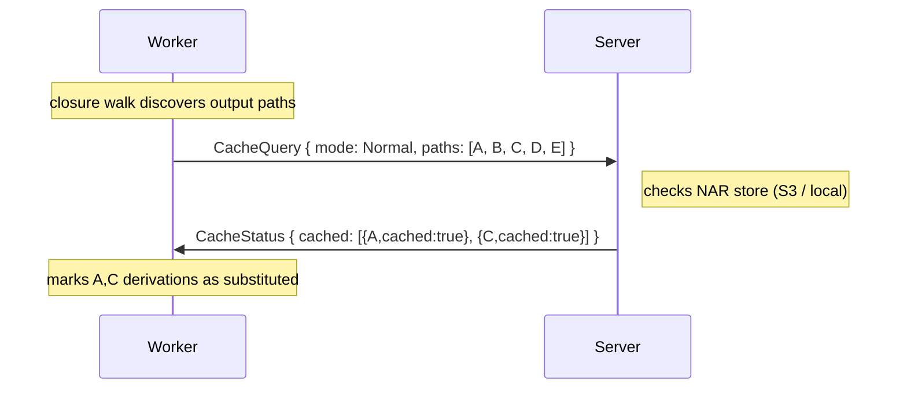

The server checks its local NAR store first. For paths not found locally, it fetches `.narinfo` from any upstream external caches configured for the org (`org → organization_cache → cache → cache_upstream`). Found upstream paths are returned with `cached: true` and `url: Some(absolute_nar_url)`.

The worker marks derivations as `substituted` for all entries with `cached: true` regardless of `url`. For upstream paths (`url: Some`), the worker downloads the NAR directly from the provided URL, re-zstd-compresses (upstream compression may differ), and uploads the compressed bytes to the Gradient cache.

### Cache population

The worker is the sole producer of compressed NARs. The server never packs or compresses — it only stores the bytes delivered over `NarPush`/S3 PUT and records the metadata the worker reports.

The flow for getting any store path (fetched flake input, evaluated `.drv`, or build output) into the cache:

 1. **Worker produces** the path locally (fetch, eval, or build).
 2. **Worker zstd-compresses** the NAR. The compressed stream is the only form in which a NAR is ever transmitted or stored.
 3. **Worker uploads** the compressed NAR via `NarPush` (local mode) or S3 PUT (cloud mode), then sends a single `NarUploaded` carrying `file_hash`, `file_size`, `nar_size`, `nar_hash`, and `references`. `nar_hash` and `nar_size` are computed locally over the uncompressed NAR; `file_hash` and `file_size` over the compressed stream. `references` is read from the local nix-daemon via harmonia's `DaemonStore::query_path_info` (no subprocess) — for build outputs this is the runtime reference set scanned out of the NAR; for `.drv` and fetched-source paths it's whatever the daemon records.
 4. **Server records** `cached_path` metadata (including `references` as a space-separated hash-name string in the `cached_path.references` column) from `NarUploaded`. No local re-packing, re-compression, or re-hashing ever happens.
 5. **Signing** is deferred. `mark_nar_stored` inserts one `cached_path_signature` row per org-cache with `signature = NULL`. A background sweep (`cache::cacher::sign_sweep`, ticking every 60 s) finds NULL rows, reads `nar_hash` / `nar_size` / `references` from `cached_path`, computes the narinfo fingerprint, and fills in the signature. New org ↔ cache subscriptions also enqueue NULL rows for every existing `cached_path` the org owns, so the same sweep back-fills signatures without any extra code path.

The server does **not** use `ensure_path` or GC roots. All cached content lives in the NAR store (S3 or local files), not in the server's Nix store.

### Incremental Evaluation

During `EvaluateDerivations`, the worker walks the derivation closure (BFS). Rather than waiting for the full walk to finish, the worker sends **`EvalResult` updates incrementally** in batches as it discovers derivations:

```mermaid
sequenceDiagram
    participant W as Worker
    participant S as Server

    W->>S: JobUpdate::Fetching
    Note over W: clone repo, nix flake archive → nix store
    W->>S: CacheQuery { mode: Push, paths: [source + all inputs] }
    Note over W: zstd-compress every uncached path
    alt S3 mode
        S->>W: CacheStatus { [{A,cached:false,url:s3}, {B,cached:false,url:s3}, {C,cached:true}, {D,cached:true}] }
        W->>S3: PUT A.zst, PUT B.zst (compressed bytes, direct to S3)
    else local mode
        S->>W: CacheStatus { [{A,cached:false,url:None}, {B,cached:false,url:None}, {C,cached:true}, {D,cached:true}] }
        W->>S: NarPush { path:A, compressed chunks ... is_final }
        W->>S: NarPush { path:B, compressed chunks ... is_final }
    end
    W->>S: NarUploaded { file_hash, file_size, nar_size, nar_hash, references } ×paths
    W->>S: JobUpdate::FetchResult { flake_source }
    Note right of S: records cached_path rows
    W->>S: JobUpdate::EvaluatingFlake
    Note over W: nix eval (uses local clone)
    W->>S: JobUpdate::EvaluatingDerivations
    Note over W: BFS closure walk; for each new .drv:
    W->>S: CacheQuery { paths: [output + drv paths] }
    S->>W: CacheStatus { cached: [subset] }
    Note over W: compress + upload each uncached .drv
    W->>S: NarUploaded { ... } ×drvs
    W->>S: JobUpdate::EvalResult (batch 1: 50 derivations, 12 substituted)
    Note right of S: inserts rows, marks substituted
    W->>S: JobUpdate::EvalResult (batch 2: 30 derivations)
    Note right of S: inserts rows, queues builds
    W->>S: JobCompleted
```

#### BFS Subtree Pruning

Before enqueuing each wave of input-derivation paths, the worker sends `QueryKnownDerivations` with all newly-discovered `.drv` paths in that wave. The server returns the subset it already has in its `derivation` table for the owning org. The worker:

 1. Pre-marks all new dep paths as visited (prevents double-enqueuing).
 2. Enqueues **unknown** paths for further BFS traversal.
 3. For **known** paths, adds a minimal `DiscoveredDerivation` entry (empty outputs/deps) directly to the batch — no further traversal needed. The server-side `DerivationInsertBatch` handles these via its `load_existing_derivations` path and creates build rows normally.

This avoids redundantly re-walking the entire closure of large packages (e.g. stdenv) that were already fully recorded in a previous evaluation of the same org.

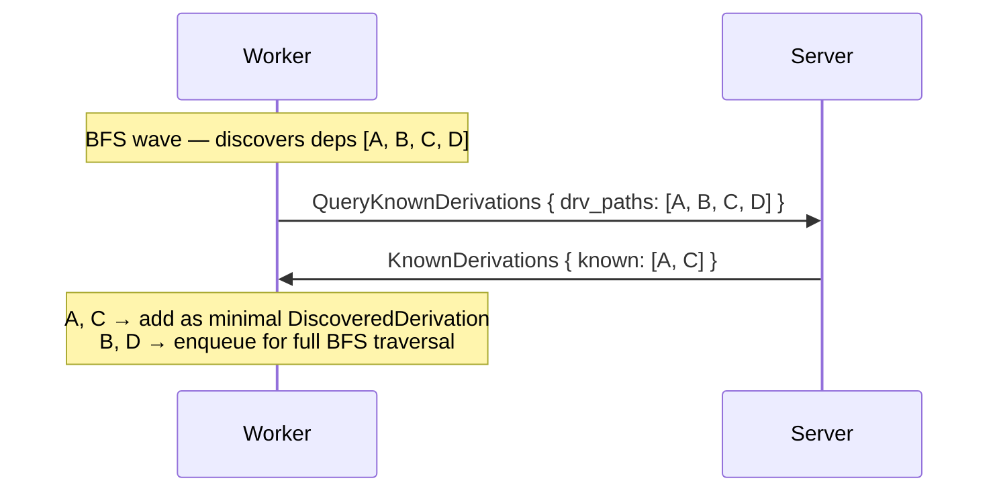

The server processes each batch immediately:

 1. Insert `derivation`, `derivation_output`, `derivation_dependency` rows.
 2. Insert `build` rows — `Substituted` for derivations the worker marked as `substituted` (confirmed in cache), `Created` for the rest.
 3. Create **entry points** for root derivations (those with a non-empty `attr`) — transitive dependencies are not tracked as entry points. Entry points map user-facing packages to their builds for CI reporting and the frontend UI.
 4. Transition non-substituted builds from `Created` → `Queued` and **immediately dispatch** them to the in-memory job tracker. Workers are notified via `JobOffer` without waiting for the background dispatch loop.

This means builds can start **while evaluation is still in progress**, significantly reducing end-to-end latency for large closures.

### BuildJob

Requires negotiated capability: `build`.

A `BuildJob` carries the **full dependency chain** in topological order — the worker executes them sequentially without round-tripping to the server for each dependency. Dependencies already present in the worker's store are skipped.

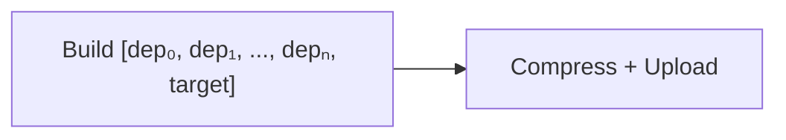

```rust
BuildJob {
    // Ordered list of derivations to build (dependencies first, target last).
    builds: Vec<BuildTask>,
}

BuildTask {
    build_id: Uuid,                     // DB build row ID
    drv_path: String,                   // /nix/store/xxx.drv
}
```

The worker always zstd-compresses before upload — that's invariant.

| Task | Requires | Input (from server) | Output (from worker) |
|------|----------|---------------------|----------------------|
| **Build** | `build` | `builds` + `required_paths` — full chain with pre-computed closure | Per-build `BuildOutput` via `JobUpdate` |
| **Compress + Upload** | `build` | (implicit) | zstd-compressed NAR uploaded via `NarPush` / S3 PUT, followed by `NarUploaded` carrying file/NAR metadata |

**NAR transfer flow:**

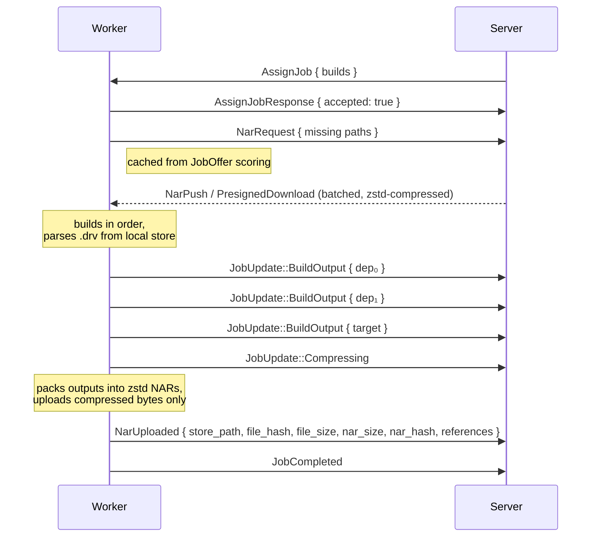

The `required_paths` were already sent in `JobCandidate` during the offer phase. The worker cached the missing set while scoring, so `NarRequest` is immediate after `AssignJob` — no second store query needed.

The server pre-computes `required_paths` from the evaluation's `derivation_dependency` and `derivation_output` tables — no `.drv` parsing on either side for dependency resolution. The worker parses each `.drv` file locally to construct a `BasicDerivation` and drives the build through harmonia's `BuildDerivation` RPC against the local nix-daemon. The daemon's log stream is consumed in parallel and forwarded to the server via `LogChunk` frames so the build log is captured live.

If any derivation in the chain fails, the worker skips the rest and reports `JobFailed` — the server cascades `DependencyFailed` to downstream builds.

---

## Messages

### Server → Worker

```rust
enum ServerMessage {
    // Handshake + auth
    AuthChallenge { peers: Vec<Uuid> },          // "these peers registered you — send tokens"
    InitAck { version: u16, capabilities: GradientCapabilities, authorized_peers: Vec<Uuid>, failed_peers: Vec<FailedPeer> },
    AuthUpdate { authorized_peers: Vec<Uuid>, failed_peers: Vec<FailedPeer> },  // reauth result
    Reject { code: u16, reason: String },       // decline connection (closes after send)
    Error { code: u16, message: String },

    // Job dispatch
    JobOffer { candidates: Vec<JobCandidate> },  // delta-only: only new candidates; paginated at 1 000
    RevokeJob { job_ids: Vec<Uuid> },            // remove candidates assigned to another worker
    AssignJob { job_id: Uuid, job: Job, timeout_secs: Option<u64> },
    AbortJob { job_id: Uuid, reason: String },
    RequestAllScores,                           // startup-only: ask worker to re-send all scores once
    Draining,                                   // server shutting down; finish work, buffer results, delay reconnect

    // Credentials (sent before or alongside AssignJob)
    Credential { kind: CredentialKind, data: Vec<u8> },

    // NAR transfer — direct mode
    NarPush { job_id: Uuid, store_path: String, data: Vec<u8>, offset: u64, is_final: bool },

    // NAR transfer — S3 mode (batched)
    PresignedUpload { job_id: Uuid, store_path: String, url: String, method: String, headers: Vec<(String, String)> },
    PresignedDownload { job_id: Uuid, store_path: String, url: String },

    // Cache queries
    CacheStatus { job_id: String, cached: Vec<CachedPath> },   // response to CacheQuery

    // BFS pruning (EvaluateDerivations)
    /// Response to `QueryKnownDerivations`.  `known` is the subset of the
    /// requested `.drv` paths that are already in the server's derivation table
    /// for the owning org.
    KnownDerivations { job_id: String, known: Vec<String> },
}

struct FailedPeer { peer_id: Uuid, reason: String }
enum CredentialKind { SshKey }
```

### Worker → Server

```rust
enum ClientMessage {
    // Handshake + auth
    InitConnection { version: u16, capabilities: GradientCapabilities, id: Uuid },
    AuthResponse { tokens: Vec<(String, String)> },  // [(peer_id, token), ...]
    ReauthRequest,                              // ask server to re-send AuthChallenge
    Reject { code: u16, reason: String },       // decline connection after InitAck
    WorkerCapabilities { architectures: Vec<String>, system_features: Vec<String>, max_concurrent_builds: u32 },
    AssignJobResponse { job_id: Uuid, accepted: bool, reason: Option<String> },

    // Job dispatch
    RequestJobChunk {                           // delta-only: new or changed scores; paginated at 1 000
        scores: Vec<CandidateScore>,
        is_final: bool,                         // true on last chunk of each scoring pass
    },
    RequestJob { kind: JobKind },               // "I have capacity for one job" — re-sent every 10s as heartbeat
    RequestAllCandidates,                       // startup-only: ask server to re-send all active candidates once
    JobUpdate { job_id: Uuid, update: JobUpdateKind },
    JobCompleted { job_id: Uuid },              // all tasks done; results already sent via JobUpdate
    JobFailed { job_id: Uuid, error: String },
    Draining,                                   // no more jobs; finishing in-flight work then disconnecting

    // Streaming
    LogChunk { job_id: Uuid, task_index: u32, data: Vec<u8> },

    // NAR transfer
    NarRequest { job_id: Uuid, paths: Vec<String> },    // "send me these paths"
    NarPush { job_id: Uuid, store_path: String, data: Vec<u8>, offset: u64, is_final: bool },
    NarUploaded {
        job_id: Uuid,
        store_path: String,
        file_hash: String,     // sha256:<hex> — hash of the compressed NAR file
        file_size: u64,        // size in bytes of the compressed NAR file
        nar_size: u64,         // uncompressed NAR size in bytes
        nar_hash: String,      // sha256:<nix32> or SRI — hash of the uncompressed NAR
        references: Vec<String>, // store-path references in hash-name format (no /nix/store/ prefix);
                                 // sourced from the local daemon via harmonia query_path_info
    },

    // Cache queries
    CacheQuery { job_id: String, paths: Vec<String>, mode: QueryMode },  // see QueryMode

    // BFS pruning (EvaluateDerivations)
    /// Ask the server which of the given `.drv` paths are already recorded in
    /// its derivation table for the org that owns `job_id`.  The server responds
    /// with `KnownDerivations`.  The worker uses this to skip re-traversing
    /// subtrees that were fully recorded during a previous evaluation.
    QueryKnownDerivations { job_id: String, drv_paths: Vec<String> },
}

enum QueryMode { Normal, Pull, Push }  // default: Normal
```

---

## Job Updates

Workers send `JobUpdate` messages to report progress. The server maps these directly to `EvaluationStatus` and `BuildStatus` in the database, which drives the frontend UI.

```rust
enum JobUpdateKind {
    // FlakeJob phases → EvaluationStatus
    Fetching,                                           // → Fetching
    FetchResult {                                       // fetch completed — report archived flake source
        flake_source: Option<String>,                    // Some = store path the archived flake lives at;
                                                         // None  = worker fell back to a tmp git checkout (no eval-only follow-up possible)
    },
    EvaluatingFlake,                                    // → EvaluatingFlake
    EvaluatingDerivations,                              // → EvaluatingDerivation
    EvalResult {                                        // incremental batch (can be sent multiple times)
        derivations: Vec<DiscoveredDerivation>,
        warnings: Vec<String>,                          // Nix evaluation warnings (captured from stderr, e.g. deprecations)
        errors: Vec<String>,                            // hard per-attr resolution failures; non-empty → evaluation marked Failed
    },

    // BuildJob phases → BuildStatus
    Building { build_id: Uuid },                        // → Building (per derivation in chain)
    BuildOutput { build_id: Uuid, outputs: Vec<BuildOutput> }, // per-derivation result
    Compressing,                                        // packing outputs into zstd NARs (no DB status change)
}

struct BuildOutput {
    name: String,                       // output name: "out", "dev", "doc", etc.
    store_path: String,                 // /nix/store/xxx-name
    hash: String,                       // <base64>-<package>
    nar_size: Option<i64>,              // NAR bytes (from query_pathinfo)
    nar_hash: Option<String>,           // NAR hash SRI (sha256-<base64>)
    has_artefacts: bool,                // true if <output>/nix-support/hydra-build-products exists
}
```

**Mapping to database status:**

| `JobUpdateKind` | DB Entity | Status set |
|-----------------|-----------|------------|
| `Fetching` | `evaluation` | `Fetching` (8) |
| `FetchResult` | `evaluation` | Stays `Fetching`; server records `flake_source` as the evaluation's source store path (used later to dispatch eval-only jobs with `FlakeSource::Cached`). `cached_path` rows for the archived NARs were already written by the preceding `NarUploaded` messages. |
| `EvaluatingFlake` | `evaluation` | `EvaluatingFlake` (1) |
| `EvaluatingDerivations` | `evaluation` | `EvaluatingDerivation` (2) |
| `EvalResult` | `evaluation` + `derivation` + `build` + `entry_point` + `evaluation_message` | Inserts rows per batch; substituted → `Substituted` (7), rest → `Created` (0) → `Queued` (1). Creates `entry_point` rows for root derivations (non-empty `attr`). Immediately dispatches ready builds to workers. First `EvalResult` sets eval to `Building` (3). Warnings stored as `evaluation_message` rows with level `Warning`. Errors stored as `evaluation_message` rows with level `Error`; if `derivations` is empty and `errors` is non-empty, evaluation is immediately marked `Failed`. |
| `Building` | `build` | `Building` (2) — per derivation in chain |
| `BuildOutput` | `build` + `derivation_output` | `Completed` (3); updates output hash/size/path |
| `Compressing` | — | No status change; informational — packing outputs into zstd NARs |

`JobCompleted` sets the final terminal status. `JobFailed` sets `Failed` and cascades `DependencyFailed` to downstream builds.

---

## NAR Transfer

Two modes, chosen by the server based on `NarStore` configuration. Both support **batched transfers** — the server sends all NARs for a job at once (e.g. all inputs for a build chain), avoiding per-path round trips.

### Worker → Server (upload, FetchFlake)

Before uploading fetched flake inputs, the worker sends `CacheQuery { mode: Push }` to filter out paths that are already cached and obtain upload URLs for uncached paths.

The server responds with a single `CacheStatus` containing **all** queried paths:

 - `cached: true` — path is already in the cache; worker skips it.
 - `cached: false, url: Some(presigned_put)` — S3 mode; worker uploads directly to S3.
 - `cached: false, url: None` — local mode; worker uses `NarPush` WebSocket frames.

**Local mode** — uncached paths have `url: None`; worker uses `NarPush`:

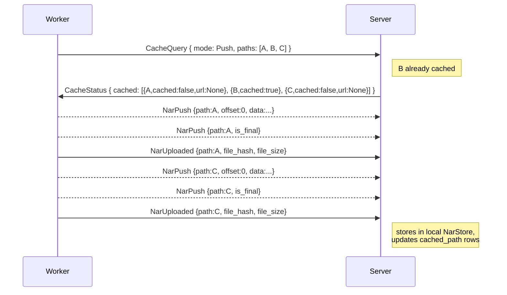

**S3 mode** — uncached paths have `url: Some(presigned_put)`; worker uploads directly to S3:

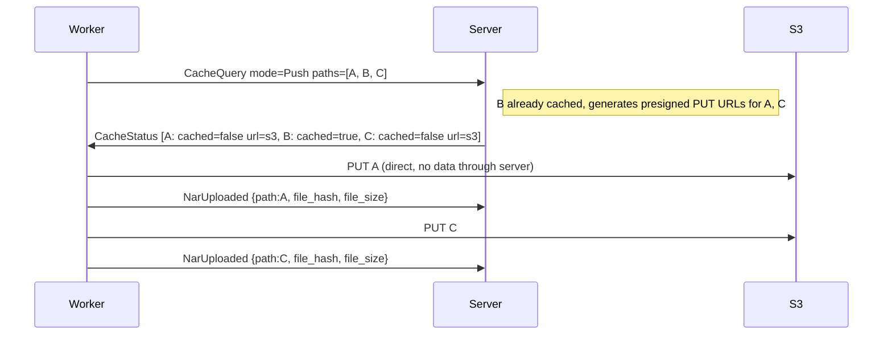

### Server → Worker (download, BuildJob)

The worker drives NAR requests — it knows what it needs to build, checks its local store, and asks the server for only the missing paths:

```rust
// Worker → Server: I need these paths to proceed
NarRequest { job_id: Uuid, paths: Vec<String> }
```

The server responds with batched `NarPush` (direct mode) or `PresignedDownload` (S3 mode) for the requested paths. This avoids the server needing to know the worker's store state.

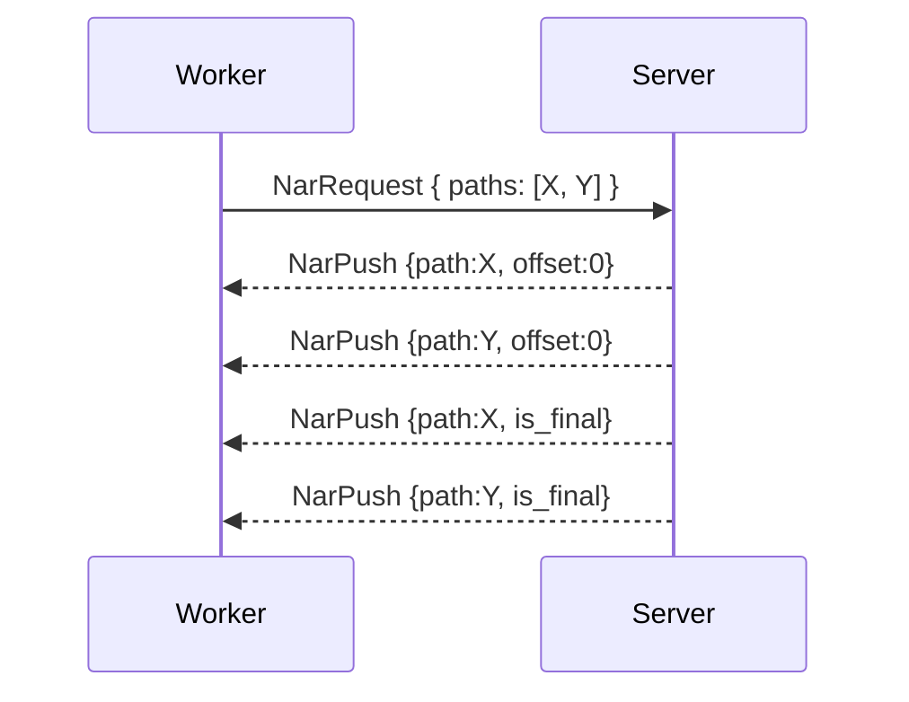

**Source selection in federated setups:** when multiple peers hold a requested NAR, the server prefers direct workers over federation proxies (fewer network hops), minimizing relay latency and bandwidth. If S3 is configured and the NAR is cached there, S3 is always preferred (direct HTTP, no relay).

---

NARs are always **zstd-compressed** on the wire and in storage (`*.nar.zst`). Workers decompress before importing into their local Nix store and compress before uploading any path — source, evaluated `.drv`, or build output. The server treats the compressed bytes as opaque: it never decompresses, re-packs, or re-compresses them.

---

## Timeouts

The server enforces timeouts on jobs. The timeout is communicated in `AssignJob`:

```rust
AssignJob {
    job_id: Uuid,
    job: Job,
    timeout_secs: Option<u64>,         // None = no timeout
}
```

When the timeout expires, the server sends `AbortJob { reason: "timeout" }`. The worker must stop and respond with `JobFailed`. If the worker is unreachable, the server marks the job as `Failed` after the grace period.

Default timeouts:
- FlakeJob (evaluation): `GRADIENT_EVALUATION_TIMEOUT` (default: 600s)
- BuildJob: no default timeout (builds can be long-running)

---

## Scheduling Priority

The server assigns jobs based on priority. Workers do not need to know the priority — it is purely server-side.

**Evaluation queue:** FIFO by `created_at`, up to `max_concurrent_evaluations` (default: 10) in parallel. `force_evaluation` projects are picked up immediately.

**Build queue:** ordered by:

 1. Dependency count descending — builds with more dependents (integration builds) start first
 2. `updated_at` ascending — older builds drain first

Builds are only eligible when all dependency builds are `Completed` or `Substituted`. The server matches eligible builds to `RequestJobChunk` by checking that the build's target system and required features are all present in the worker's `system_features`.

---

## Federation

Federation connects Gradient instances or workers to each other. A server with `federate` enabled can connect to other servers using the same proto protocol — it authenticates using the standard challenge-response, and the remote peer (org, cache, or proxy) sees it as a single worker/cache.

Federation can happen in two ways:

 - **`gradient-proxy`** — a lightweight binary that only federates. It has no local orgs, no UI, no database. Workers authenticate to it with a simple proxy-level token. It connects to upstream servers, authenticating against their peers. The proxy **detaches** the worker↔peer relationship: all its workers serve all authorized peers. The proxy itself is a peer — it registers workers and issues them tokens.
 - **A full Gradient server** — a server with its own orgs, projects, and workers. Its orgs and caches are peers that individually control which external workers/servers get tokens, deciding what to expose.

### How it works

A federation peer connects to a remote server as a regular worker. A peer on the remote server (org, cache, or proxy) registers the federation peer's ID and issues a token — exactly like registering any worker:

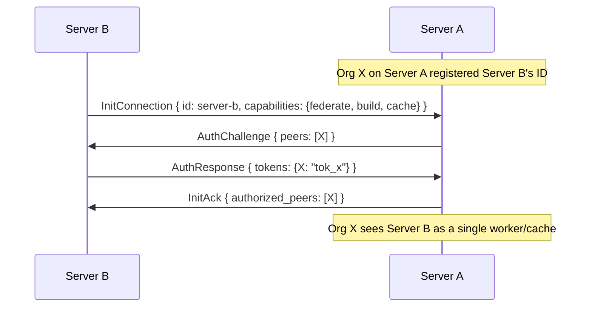

From Org X's perspective, Server B is just one worker that happens to have a lot of capacity. Server B internally routes jobs to its own workers and serves its own caches — Org X doesn't see or control that.

### `gradient-proxy`

The proxy detaches authorization. Workers authenticate to the proxy (which is itself a peer), and the proxy authenticates to upstream servers against their peers. All workers behind the proxy serve all authorized upstream peers:

```mermaid
graph RL
    W1[Worker 1] -->|"proxy token"| P[gradient-proxy]
    W2[Worker 2] -->|"proxy token"| P
    P -->|"Org X + Cache C tokens"| SA[Server A]
    P -->|"Org Z token"| SB[Server B]
```

```yaml
# gradient-proxy config
id: "proxy-001"
worker_token: "tok_proxy_shared"     # workers auth with this
upstream:
  - url: server-a.example.com
    peers:
      org-x:   "tok_org_x"          # Org X registered proxy-001
      cache-c: "tok_cache_c"        # Cache C registered proxy-001
  - url: server-b.example.com
    peers:
      org-z:   "tok_org_z"          # Org Z registered proxy-001
```

Org X's job arrives → proxy assigns to any available worker. Org Z's job arrives → same pool. The proxy doesn't distinguish — all workers serve all peers.

### Full Gradient server as federation peer

A full server's orgs and caches are independent peers. Each decides whether to register an external worker/server and issue a token:

```mermaid
graph RL
    W1[Worker 1] -->|"auth against<br/>Server B's peers"| SB[Server B]
    W2[Worker 2] -->|"auth against<br/>Server B's peers"| SB
    SB -->|"auth against<br/>Server A's peers"| SA[Server A]
```

Workers authenticate against Server B's peers (its orgs and caches). Server B authenticates upstream against Server A's peers. Each peer on each server independently controls access.

### Aggregation

Both federation forms aggregate downstream when advertising capabilities upstream:
- `GradientCapabilities`: OR of all downstream workers
- `system_features`: union of all downstream workers' features
- `max_concurrent_builds`: sum of all downstream slots

The upstream server sees one peer. Internal routing is the federation peer's problem.

### Cache federation

Caches behind a federation peer are exposed upstream. When a remote peer's build needs a NAR, the upstream server can request it from the federation peer, which serves it from its cache or downstream workers.

### Access control summary

| | `gradient-proxy` | Full Gradient server |
|---|---|---|
| Workers → peer | Proxy-level token (flat, no orgs) | Challenge-response against server's peers |
| Peer → upstream | Challenge-response against upstream's peers | Challenge-response against upstream's peers |
| What's exposed | Everything — all workers, all caches | Per-peer (org/cache) settings |
| Upstream sees peer as | One worker/cache | One worker/cache |

---

## Build Artefacts

After a successful build, the worker checks for `<output>/nix-support/hydra-build-products`. If present, `BuildOutput.has_artefacts` is set to `true`. The server stores this flag on `derivation_output.has_artefacts` for the frontend to display download links.

---

## DependencyFailed Cascade

When a build fails (`JobFailed` or `AbortJob`), the server walks reverse `derivation_dependency` edges within the same evaluation and marks all dependent builds as `DependencyFailed` (6). This is a server-side graph walk — workers are not notified about cascaded failures unless they hold an in-flight job for an affected build, in which case they receive `AbortJob`.

The evaluation's final status is determined by aggregating all build statuses:

 - All `Completed` or `Substituted` → `Evaluation::Completed`
 - Any `Failed` → `Evaluation::Failed`
 - Any `Aborted` or `DependencyFailed` (and none in-progress) → `Evaluation::Aborted`

---

## Log Streaming

Workers send `LogChunk` messages during task execution. The server appends them to `LogStorage` (file or S3-backed, same as current build logs).

```rust
LogChunk { job_id: Uuid, task_index: u32, data: Vec<u8> }
```

Fire-and-forget — no acknowledgement. WebSocket flow control provides backpressure if the server falls behind.

When the server receives `JobCompleted` or `JobFailed`, it **finalizes** the log (uploads to S3 if configured). Workers do not need to wait for finalization.

---

## Credential Distribution

The server sends credentials to workers before tasks that need them:

| Credential | Used by | Contents |
|------------|---------|----------|
| `SshKey` | `FetchFlake` task on a `fetch`-capable worker | Organization's SSH private key for cloning private repos. Sent at most once per job, **only if the negotiated `fetch` capability is true for the target worker** (otherwise the worker can't run `FetchFlake` anyway). |

Credentials are encrypted in transit (TLS). Workers MUST:

 - Keep credentials in memory only — never write to disk
 - Zeroize memory on drop
 - Discard credentials when the job completes or the connection closes (they are not reused across jobs)

---

## Abort

Either side can abort a job:

**Server-initiated:** `AbortJob { job_id, reason }` → worker stops current task, cleans up, responds `JobFailed` with the abort reason. The server sends `AbortJob` when an evaluation is aborted via the API (`POST /evals/{id}` with `method: "abort"`). The scheduler finds which worker holds the active job and delivers the message through a per-worker channel. Pending (unassigned) jobs for the aborted evaluation are removed from the in-memory tracker.

**Worker-initiated:** worker sends `JobFailed` at any time.

**Disconnect:** server marks all in-progress jobs for the disconnected worker as `Failed`. Downstream builds get `DependencyFailed`.

Workers should finish the current atomic operation (e.g. a single NarPush) before aborting, but must not start new tasks.

---

## Connection Lifecycle

```mermaid
graph TD
    A[connect] --> B[InitConnection]
    B --> C[InitAck]
    C --> D[WorkerCapabilities + RequestAllCandidates]
    D --> E[RequestJob]
    E --> F[AssignJob]
    F --> G[execute job]
    G --> E
    G --> H[disconnect]
    H --> I[reconnect]
    I --> B
```

- **Reconnect:** worker opens a new WebSocket and sends a fresh `InitConnection`. No session resumption.
- **Heartbeat:** WebSocket ping/pong at 30-second intervals. Server closes connections that miss 3 consecutive pongs.
- **Idempotency:** jobs have UUIDs. The server will not re-assign a job that already completed or failed.

### Server Restart

When the server restarts (deploy, crash, maintenance), workers experience a WebSocket disconnect. The protocol is designed so no work is lost:

**Worker behavior:**

 1. Detect disconnect (WebSocket close or missed pong).
 2. **Keep running in-progress jobs** — do not abort immediately. Results are buffered locally.
 3. **Keep candidate cache and scores in memory** — do not discard.
 4. Reconnect with exponential backoff: 1s → 2s → 4s → ... → 60s max, with jitter.
 5. On reconnect, send `InitConnection` + `WorkerCapabilities` (full re-handshake).
 6. Send `JobUpdate`/`JobCompleted`/`JobFailed` for any jobs that progressed or finished during the outage. The server matches these by `job_id`.
 7. Send `RequestAllCandidates` (startup-only) to resync the candidate cache (server may have revoked or added candidates during the outage).
 8. Respond to `RequestAllScores` (startup-only, sent by server at handshake) with all cached scores so the server can rebuild its in-memory score table.

**Server behavior on startup:**

 1. Scan for orphaned jobs: any `build` with status `Building` (2) or `evaluation` with status `Fetching`/`EvaluatingFlake`/`EvaluatingDerivation` that has no connected worker.
 2. Wait a **grace period** (default: 120s) for workers to reconnect and report results.
 3. After the grace period, mark remaining orphaned jobs as `Failed` and re-queue them.
 4. Send `RequestAllScores` to each reconnected worker (once, at handshake completion) to rebuild the in-memory score table.

```mermaid
sequenceDiagram
    participant W as Worker
    participant S as Server

    Note over W: executing job, candidates [J2,J4,J5] cached
    S-xW: server goes down
    W--xS: reconnect (backoff)
    Note over S: server comes back
    W->>S: InitConnection { id }
    S->>W: InitAck
    W->>S: WorkerCapabilities
    W->>S: JobCompleted { buffered job }
    S->>W: RequestAllScores
    W->>S: RequestJobChunk { scores: [{J2,...},{J4,...},{J5,...}] }
    Note over S: score table rebuilt
    W->>S: RequestAllCandidates
    S->>W: JobOffer { candidates: [J2,J4,J5,J6] }
    W->>S: RequestJobChunk { scores: [{J6,...}] }
    W->>S: RequestJob { kind: Build }
    Note over S: assigns best job
    S->>W: AssignJob { job_id: J2 }
    Note over W: got AssignJob — still has slots
    W->>S: RequestJob { kind: Build }
```

This means short server restarts (< grace period) cause **zero job loss** — workers buffer results and replay them on reconnect. Score state is rebuilt in a single startup round-trip via `RequestAllScores` + `RequestAllCandidates` (both sent exactly once per connection). The 10-second `RequestJob` heartbeat ensures the server recovers the "worker needs work" state even if it restarts and loses that information.

### Graceful Server Shutdown

When the server is shutting down intentionally (deploy, maintenance), it sends `Draining` to all connected workers before closing:

```mermaid
sequenceDiagram
    participant W as Worker
    participant S as Server

    S->>W: Draining
    Note left of W: stops requesting new jobs
    W->>S: JobCompleted (in-flight)
    S-xW: close
    Note left of W: waits before reconnecting
```

On receiving `ServerMessage::Draining`, workers:

 1. Stop sending `RequestJob` — no new work.
 2. Finish in-flight jobs and send results.
 3. After the connection closes, wait before reconnecting (e.g. 30s) to give the server time to restart.

---

## Error Codes

| Code | Meaning |
|------|---------|
| 400  | Malformed message or unsupported protocol version |
| 401  | Unauthorized (missing or invalid token) |
| 499  | Capability not negotiated for this session |
| 498  | Job not found (e.g. AbortJob for unknown job_id) |
| 497  | Job already assigned or completed |
| 496  | Duplicate connection (already connected) |
| 500  | Internal server error |
| 599  | Peer shutting down |
| 598  | Peer starting |

---

## Versioning

 - `PROTO_VERSION` (currently `1`) is incremented on breaking wire changes.
 - Server accepts any `client_version == PROTO_VERSION`.
 - New capabilities are gated by `GradientCapabilities` flags, not version numbers.
