# Proto

Gradient workers connect to the server over a persistent WebSocket at `/proto`. All messages are binary frames serialized with [rkyv](https://rkyv.org/). WebSocket framing handles message boundaries — no additional length-prefix is needed.

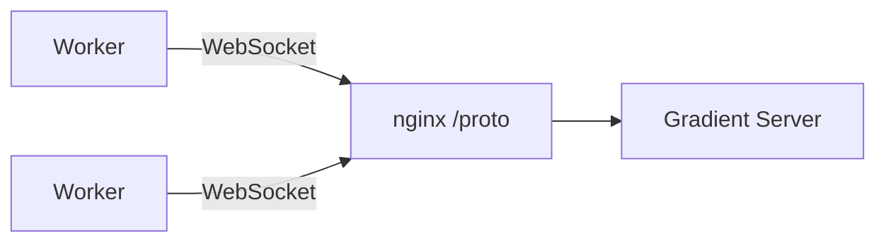

Connection lifecycle: **handshake → auth challenge → capabilities → pull-based job loop**.

---

## Handshake

The first message on every connection is `InitConnection`. The server responds with either an `AuthChallenge` (listing peers that have registered this worker) or `Reject`.

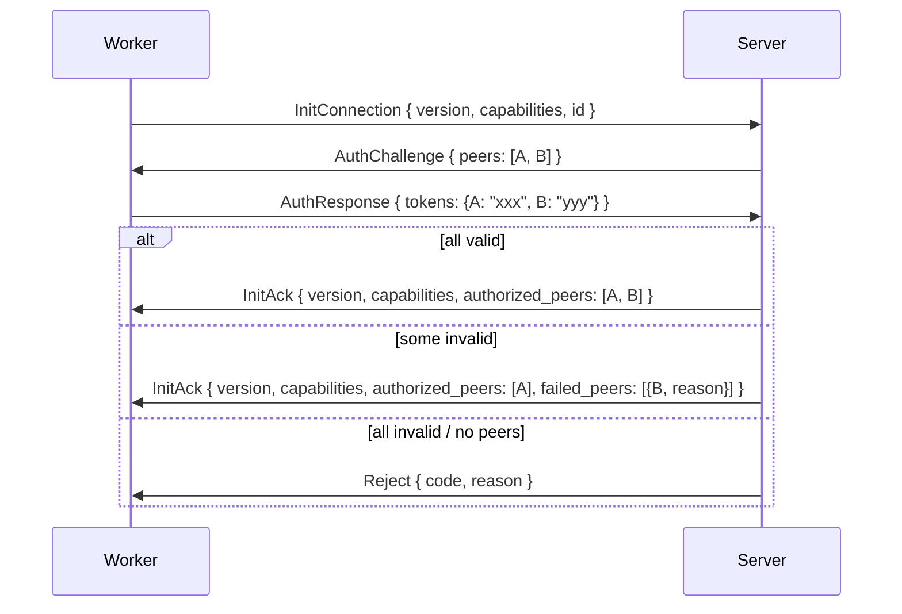

The worker can also reject after receiving `InitAck`:

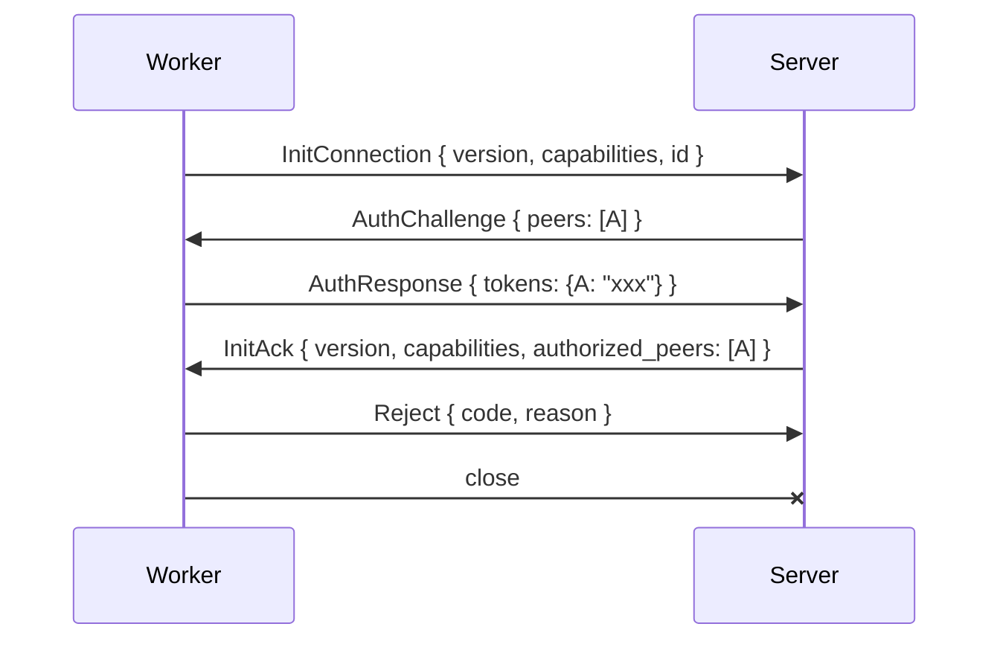

**Rejection reasons:**
- Server rejects when no peers have registered this worker ID (unknown worker)
- Server rejects a federated peer when `federate` is not enabled on the server
- Server rejects a worker whose capabilities are all disabled after negotiation (nothing useful to do)
- Server rejects a duplicate connection (same worker ID already connected)
- Server rejects when all peer tokens fail validation
- Worker rejects a server it does not trust (e.g. unknown server identity, policy mismatch)

### Peer Identity

Each peer (worker or server) has a persistent `id: Uuid` generated on first start and stored locally (e.g. `/var/lib/gradient-worker/id`). The peer sends it in `InitConnection`:

```rust
InitConnection {
    version: u16,
    capabilities: GradientCapabilities,
    id: Uuid,
}
```

The `id` enables:
- **Reconnect matching** — on reconnect after server restart, the server matches the peer to its previous session and reassigns orphaned jobs immediately instead of waiting for the grace period.
- **Duplicate detection** — the server rejects a second connection with the same `id`. One WebSocket connection per worker per server instance.
- **Admin visibility** — the server tracks connected peers by ID for the frontend UI (list workers, their capabilities, assigned jobs, status).
- **Logging** — all log lines and job assignments reference the peer ID for debugging.

On first connection with an unknown `id`, the server rejects — a worker must be registered by at least one peer before it can connect. On reconnect with a known ID, the server resumes the session.

---

## Authorization

Authorization uses a challenge-response flow based on **peers**. A peer is any entity on the server that can register a worker — an **org**, a **cache**, or a **proxy**. The worker doesn't know or care what type of peer it's authenticating against — it just holds `peer_id → token` pairs.

Mutual consent: the peer registers the worker ID (peer consents), the worker holds the peer's token (worker consents).

### Setup (before connection)

1. A peer (org admin, cache owner, or proxy) registers a worker ID → server generates a token for that `(peer, worker_id)` pair
2. The peer gives the token to the worker operator
3. Worker operator adds `peer_id → token` to worker config

```yaml
# worker config
id: "w-550e8400-e29b-41d4-a716-446655440000"
peers:
  peer-alpha: "tok_abc123"    # could be an org, cache, or proxy
  peer-beta:  "tok_def456"    # worker doesn't know or care which type
```

### Auth challenge flow

At connection time, the server looks up which peers have registered this worker ID and challenges for their tokens:

```rust
// Server → Worker: which peers have registered you
AuthChallenge {
    peers: Vec<Uuid>,          // peer IDs that registered this worker
}

// Worker → Server: here are my tokens for those peers
AuthResponse {
    tokens: HashMap<Uuid, String>,  // peer_id → token (only for peers the worker has tokens for)
}
```

The server validates each token independently. The worker is authorized for every peer whose token is valid. If some tokens fail, the connection continues with the successful peers — only a total failure causes `Reject`.

What authorization means depends on the peer type:
- **Org** — worker receives jobs from that org's projects
- **Cache** — worker can serve/pull from that cache
- **Proxy** — worker is part of the proxy's pool

### Reauth

Tokens can be added or rotated without reconnecting. At any point during the connection, either side can initiate reauth:

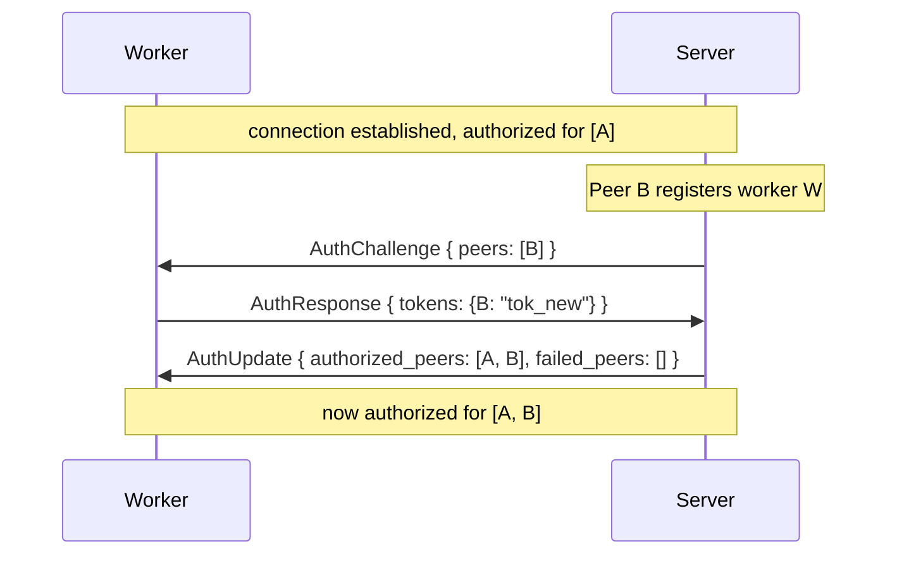

Worker-initiated reauth (e.g. operator added a new peer token to config):

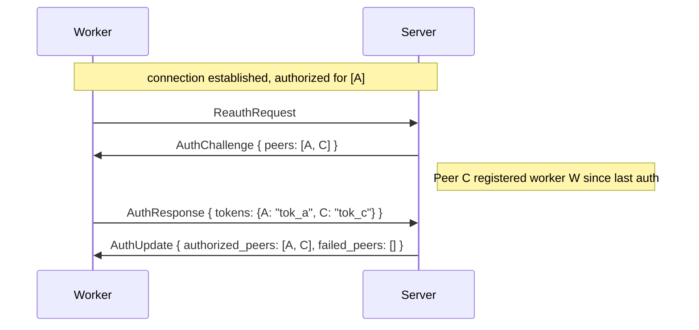

If a token fails during reauth, the worker keeps its existing authorizations for that peer (if any) — reauth never revokes already-granted access unless the server explicitly sends a revocation.

### Connection uniqueness

The server allows only **one WebSocket connection per worker ID per instance**. If a worker reconnects while its old connection is still open (e.g. network split), the server closes the old connection and accepts the new one.

### Key management

- Peers (org admins, cache owners, proxy operators) create worker tokens via the web API, scoped to a specific worker ID
- Workers store tokens in config file or environment (`GRADIENT_WORKER_PEERS="peer_id:token,peer_id:token"`)
- Keys can be rotated via reauth — no reconnect needed

### Admin visibility

The `GET /api/v1/workers` endpoint shows all connected workers and their status. Access is controlled by:

- **Superuser users** — users with the `superuser` flag set on their account can always access the endpoint
- **`GRADIENT_GLOBAL_STATS_PUBLIC=true`** — when set, the workers/stats endpoints are publicly visible without authentication

**Version negotiation:** the server accepts any `client_version <= PROTO_VERSION`. If the client sends a higher version, the server responds with `Reject { code: 400 }`.

**Capability negotiation:** each `GradientCapabilities` field is AND-ed — a capability is active only if both sides support it. Two fields are server-authoritative:

| Capability | Who controls | Description |
|------------|--------------|-------------|
| `core`     | Server only  | Always `true` on the server, always `false` on workers |
| `federate` | AND          | Relay work and NAR traffic between peers |
| `fetch`    | AND          | Prefetch flake inputs and clone repositories |
| `eval`     | AND          | Run Nix flake evaluations |
| `build`    | AND          | Execute Nix store builds |
| `sign`     | AND          | Sign store paths and upload signatures |
| `cache`    | Server only  | Server serves as a binary cache (`GRADIENT_SERVE_CACHE`) |

---

## Capability Advertisement

After a successful handshake, workers with the `build` capability negotiated send `WorkerCapabilities`. Workers without `build` (e.g. eval-only workers) never send this message.

```rust
WorkerCapabilities {
    architectures: Vec<String>,         // Nix system strings, e.g. ["x86_64-linux", "aarch64-linux"]
    system_features: Vec<String>,       // Nix system features, e.g. ["kvm", "big-parallel"]
    max_concurrent_builds: u32,         // how many parallel builds this worker accepts
}
```

Architectures are free-form strings (e.g. `"x86_64-linux"`, `"aarch64-linux"`) — not an enum. Custom or unusual platforms (e.g. `"riscv64-linux"`) can be advertised without any code changes.

When the server dispatches a build, it checks that the build's target architecture is present in the worker's `architectures` and all `required_features` are present in the worker's `system_features`. For example, a build targeting `aarch64-linux` with `required_features: ["kvm"]` requires a worker with `"aarch64-linux"` in `architectures` and `"kvm"` in `system_features`.

**Federation proxy behavior:** a proxy with `federate` enabled connects upstream as a single worker. It **aggregates** the capabilities of all its downstream workers:
- `GradientCapabilities` (in `InitConnection`) — OR of all downstream workers' capabilities (if any worker can build, the proxy advertises `build`)
- `system_features` — union of all downstream features (sorted by total capacity)
- `max_concurrent_builds` — sum of all downstream workers' slots

The upstream server sees the proxy as one powerful worker. The proxy handles internal job routing to its downstream workers transparently.

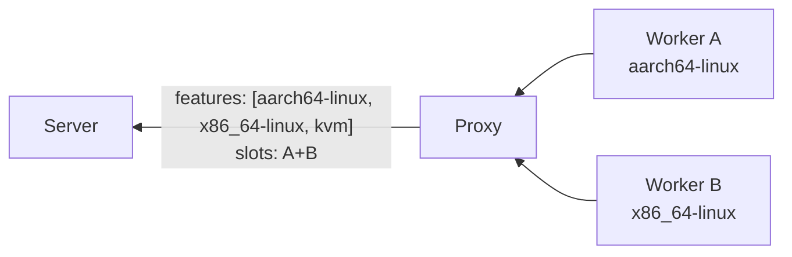

The server uses these to match `RequestJobChunk` to queued builds. A worker that does not send capabilities will only receive `FlakeJob`s, never `BuildJob`s.

### Capability Updates

`WorkerCapabilities` can be re-sent **at any point during the connection** to update the server's view. The server replaces the previous values immediately. This is the primary mechanism for proxies to keep the upstream server in sync when their downstream worker pool changes.

**Example — downstream worker disconnects from a proxy:**

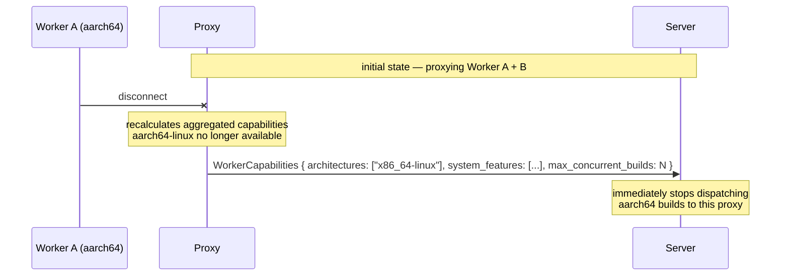

The server's handler processes mid-connection `WorkerCapabilities` identically to the initial send — it calls `scheduler.update_worker_capabilities()` which atomically replaces the worker's entry in the pool. Any pending build offers for architectures or features no longer advertised are revoked.

Re-sending `WorkerCapabilities` does **not** require reconnecting and does **not** interrupt in-flight jobs. Only future job offers are affected.

### Ephemeral Workers

Workers can run in ephemeral VMs (e.g. RAM-only, no persistent disk). To prevent resource leaks and state accumulation, workers can decide internally when to stop accepting work (e.g. after N jobs, or based on memory pressure). When ready to recycle, the worker sends `Draining`, waits for in-flight jobs to finish, then disconnects cleanly. The VM can then be destroyed and a fresh one spawned.

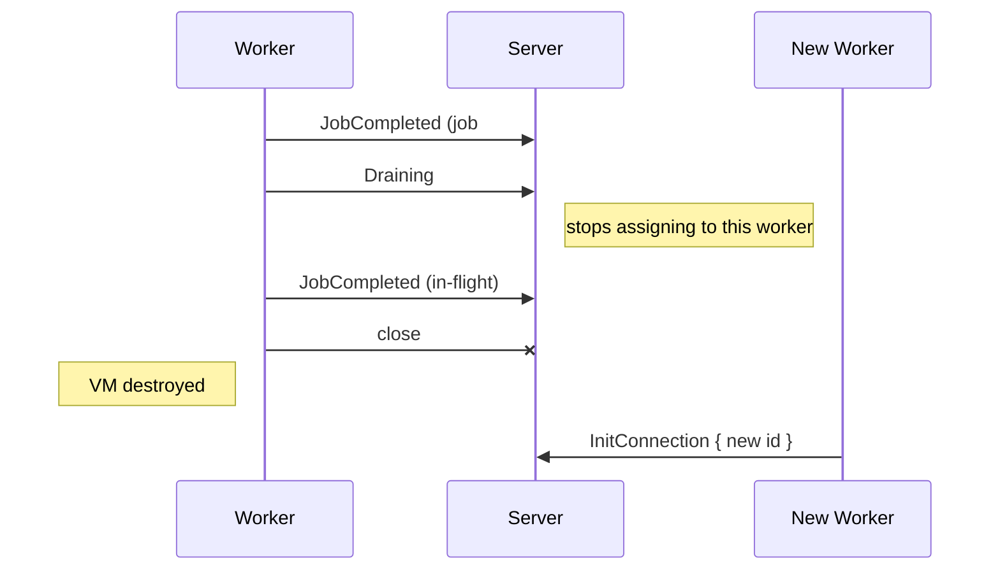

The server treats `Draining` as "do not assign new jobs to this worker". The worker is free to disconnect once all in-flight jobs complete. This is distinct from an unexpected disconnect — no grace period or orphan scan needed.

---

## Job Dispatch

Job dispatch uses **eager push + pull-based claiming**. The server pushes job candidates to eligible workers as soon as they become available. Workers score them in the background, then claim work when they have capacity. The server assigns each job to the best-scoring worker and revokes it from the rest.

Jobs are scoped to the worker's authorized peers — a worker only receives candidates from peers (orgs, caches) it has successfully authenticated against.

### Dispatch Flow

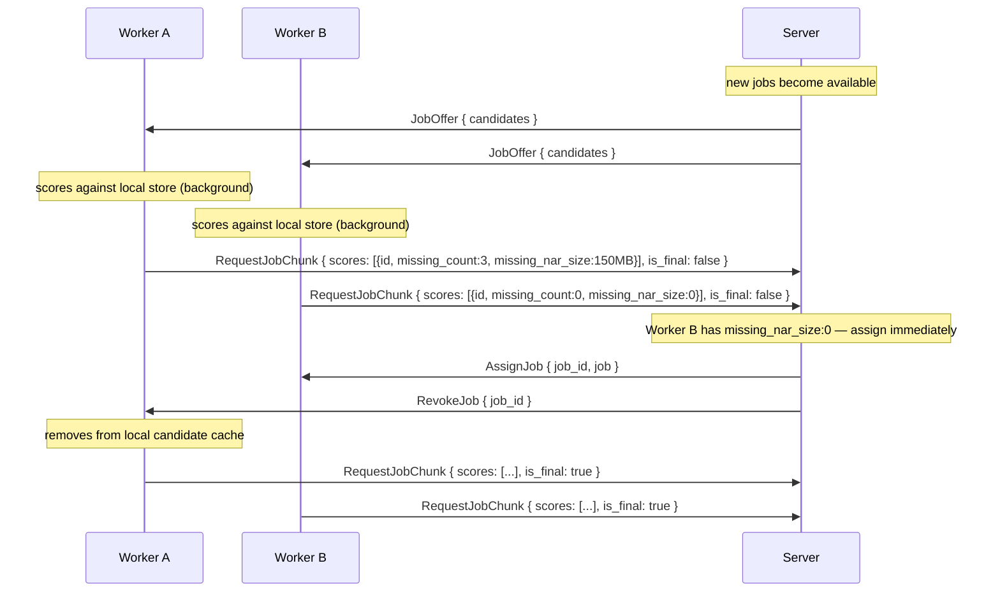

### How It Works

1. **`JobOffer`** (server → workers, pushed eagerly) — as soon as a job enters the queue (e.g. evaluation discovers new builds, or a build's dependencies complete), the server pushes it to all connected workers whose negotiated capabilities and advertised system features match, and who are authorized for the job's peer (org). Each candidate includes `required_paths` (with optional `CacheInfo` for paths in the server's cache) so workers can score locally. The server dispatches builds immediately after three events: evaluation result (new builds queued), build completion (dependent builds unlocked), and build failure (cascade frees blocked builds). A background dispatch loop (5-second interval) acts as a safety net.

2. **Workers score in the background** — on receiving `JobOffer`, the worker checks its local Nix store against each candidate's `required_paths` and caches the result. This is a fast local operation (no network I/O) and happens continuously, not on-demand.

3. **`RequestJobChunk`** (worker → server, streamed as scores are computed) — as the worker scores candidates against its local store, it sends batches of scores incrementally. `is_final: true` marks the last chunk. The server can start making decisions before all scores arrive — e.g. a `missing: 0` score can trigger immediate assignment.

4. **`AssignJob`** (server → winning worker) — the server compares scores across all workers that want the same job. Lowest `missing_nar_size` wins (fewest bytes to download). Ties are broken by `missing_count`, then by fewest assigned jobs. The server may assign before all workers have sent `is_final` if a score is clearly optimal (e.g. `missing_nar_size: 0`).

5. **`RevokeJob`** (server → losing workers) — all other workers that had this candidate in their cache are told to remove it.

```rust
// Server → Worker (pushed eagerly)
JobOffer {
    candidates: Vec<JobCandidate>,
}

JobCandidate {
    job_id: Uuid,
    required_paths: Vec<RequiredPath>,  // store paths needed (worker scores against these)
    drv_paths: Vec<String>,             // .drv paths for build candidates; empty for eval jobs
}

RequiredPath {
    path: String,                       // /nix/store/xxx-name
    cache_info: Option<CacheInfo>,      // present when the path is in the server's binary cache
}

CacheInfo {
    file_size: u64,                     // compressed NAR size on disk (bytes)
    nar_size: u64,                      // uncompressed NAR size (bytes)
}

// Server → Worker (after assignment to another worker)
RevokeJob {
    job_ids: Vec<Uuid>,
}

// Worker → Server (streamed as scores are computed)
RequestJobChunk {
    scores: Vec<CandidateScore>,        // batch of scores from local store check
    is_final: bool,                     // true = worker is done scoring
}

CandidateScore {
    job_id: Uuid,
    missing_count: u32,                 // number of required_paths not in local store
    missing_nar_size: u64,              // total uncompressed NAR size of missing paths (bytes)
                                        // derived from CacheInfo.nar_size; 0 when unavailable
}
```

### Benefits

- **No scoring round-trip at request time** — workers pre-score candidates as offers arrive and stream scores incrementally.
- **Early assignment** — server can assign as soon as it sees an optimal score (e.g. `missing: 0`) without waiting for all workers to finish scoring. For non-obvious cases, it waits for `is_final` from all workers before deciding.
- **Optimal assignment** — server sees all workers' scores before deciding. A worker that already has 90% of the closure cached (lower `missing_nar_size`) gets the job over one that needs everything.
- **Large build trees handled incrementally** — as evaluation discovers derivations in batches (`EvalResult`), the server pushes new `JobOffer`s immediately. Workers start scoring while evaluation is still in progress.

### Edge Cases

- **Single eligible worker:** server skips scoring and sends `AssignJob` directly with the `JobOffer` — no `RequestJobChunk`/`RevokeJob` overhead.
- **Worker disconnects with cached offers:** server simply doesn't receive scores from that worker. No cleanup needed — offers are stateless on the server side.
- **Stale scores:** if a worker's store changes between scoring and `RequestJobChunk` (e.g. another job populated paths), the score is conservative (overestimates missing). The server can re-offer revoked jobs if no worker claims them.

---

## Job Model

Each job is a sequence of **tasks** executed in order. If any task fails, the remaining tasks are skipped and the job is reported as failed.

### FlakeJob

Requires negotiated capability: `fetch` and/or `eval`. The server includes only the tasks the worker's capabilities allow. A fetch-only worker gets just `FetchFlake`; an eval-only worker gets `EvaluateFlake` + `EvaluateDerivations` (server or other worker must have already fetched); a worker with both gets the full chain.

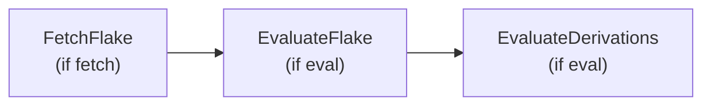

| Task | Requires | Input (from server) | Output (from worker) |
|------|----------|---------------------|----------------------|
| **FetchFlake** | `fetch` | `repository` (flake URL), `commit` (SHA), SSH credential | `FetchResult` — local clone path, fetched flake inputs as compressed NARs |
| **EvaluateFlake** | `eval` | `wildcards` (attribute patterns), `timeout` (seconds) | `attrs: Vec<String>` — discovered attribute paths |
| **EvaluateDerivations** | `eval` | (uses attrs from previous task) | `derivations: Vec<DiscoveredDerivation>` — drv paths, outputs, closure, required features |

When `FetchFlake` and `EvaluateFlake`/`EvaluateDerivations` are in the **same `FlakeJob`**, the worker reuses the local clone from the fetch step for evaluation. The repository is cloned exactly once; subsequent eval tasks operate on the local checkout. This guarantees the eval runs against the same commit the server detected and avoids a second remote fetch (which would fail for protocols Nix doesn't natively support, e.g. `git://`).

When the tasks are in **separate jobs** (e.g. a fetch-only worker and an eval-only worker), the eval worker receives the flake inputs as NARs from the server/cache before evaluation starts. The flake reference is then a Nix store path rather than a remote URL.

#### FetchFlake

The fetch step performs three things:

1. **Clone** the repository at the specified commit using libgit2 (handles SSH keys, `git://`, `https://`).
2. **Prefetch flake inputs** by running `nix flake lock` on the checkout, pulling all transitive inputs into the local Nix store.
3. **Report `FetchResult`** with the list of fetched store paths. These paths are the flake's locked inputs — the server can upload them to the binary cache so other workers or eval-only workers can substitute them.

```rust
FetchResult {
    fetched_paths: Vec<FetchedInput>,    // flake inputs now in the worker's store
}

FetchedInput {
    store_path: String,                  // /nix/store/xxx-source
    nar_hash: String,                    // sha256:xxx (SRI)
    nar_size: u64,                       // compressed NAR bytes
}
```

The server processes `FetchResult` by:
1. Recording the fetched input paths for the evaluation.
2. Optionally uploading the NARs to the binary cache (so eval-only workers or future builds can substitute them without re-fetching from upstream).

This makes the fetch step a first-class evaluation phase with its own database status (`Fetching`), not just a side effect. The fetched inputs flow into `EvaluateDerivations` as known-substituted paths.

```rust
DiscoveredDerivation {
    attr: String,                       // e.g. "packages.x86_64-linux.hello"
    drv_path: String,                   // /nix/store/xxx.drv
    outputs: Vec<DerivationOutput>,     // [{name: "out", path: "/nix/store/..."}]
    dependencies: Vec<String>,          // drv paths this depends on
    architecture: String,               // Nix system string, e.g. "x86_64-linux", "builtin"
    required_features: Vec<String>,     // Nix system features needed to build (e.g. "kvm")
    substituted: bool,                  // all outputs already present in the server's cache
}
```

`substituted: true` means all outputs for this derivation are already present in the **server's binary cache** — no build needed. The worker determines this by querying the server via `CacheQuery` during the closure walk (see below). The server marks these as `Substituted` (7).

The `architecture` field is a free-form Nix system string (e.g. `"x86_64-linux"`, `"aarch64-linux"`, `"builtin"`). `"builtin"` means the derivation uses `builtin:fetchurl` or similar — it can run on any worker regardless of architecture.

#### Cache Query

During `EvaluateDerivations`, the worker discovers output store paths and needs to know which ones the server already has cached. Rather than checking the worker's local Nix store (which is irrelevant — the server serves the cache, not the worker), the worker performs a bulk query against the server's cache:

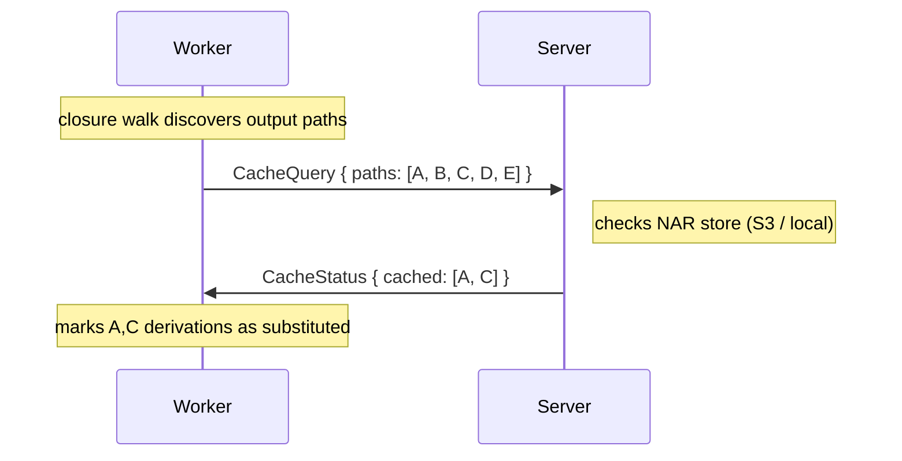

```rust
// Worker → Server
CacheQuery {
    job_id: String,
    paths: Vec<String>,                 // output store paths to check
}

// Server → Worker
CacheStatus {
    job_id: String,
    cached: Vec<CachedPath>,            // paths present in the cache with size metadata
}

CachedPath {
    path: String,                       // /nix/store/xxx-name
    file_size: Option<u64>,             // compressed NAR size on disk (bytes)
    nar_size: Option<u64>,              // uncompressed NAR size (bytes)
}
```

The query is batched — the worker collects output paths during the BFS walk and sends them in one or a few `CacheQuery` messages. The server checks its NAR store (S3 bucket or local `nars/` directory) and responds with the subset that already has `.narinfo` + `.nar.zst` files. This avoids the worker needing direct access to the cache backend.

### Cache Verification

After a build completes, the server **verifies** that the build outputs are present in the cache rather than trying to fetch them from its own local Nix store. The server never needs the built paths in its local store — it only needs the compressed NARs in its cache storage.

The flow for getting build outputs into the cache:

1. **Worker builds** the derivation and has the outputs in its local store.
2. **Worker compresses** outputs into zstd NARs (if `compress` task is in the `BuildJob`).
3. **Worker uploads** NARs to the server via `NarPush` (direct mode) or to S3 via `PresignedUpload`.
4. **Server records** the NAR metadata (hash, size) and verifies the NAR is present in cache storage.
5. **Server signs** the path (if a signing key is configured for the org's cache).

The server does **not** use `ensure_path` or GC roots. All cached content lives in the NAR store (S3 or local files), not in the server's Nix store.

### Incremental Evaluation

During `EvaluateDerivations`, the worker walks the derivation closure (BFS). Rather than waiting for the full walk to finish, the worker sends **`EvalResult` updates incrementally** in batches as it discovers derivations:

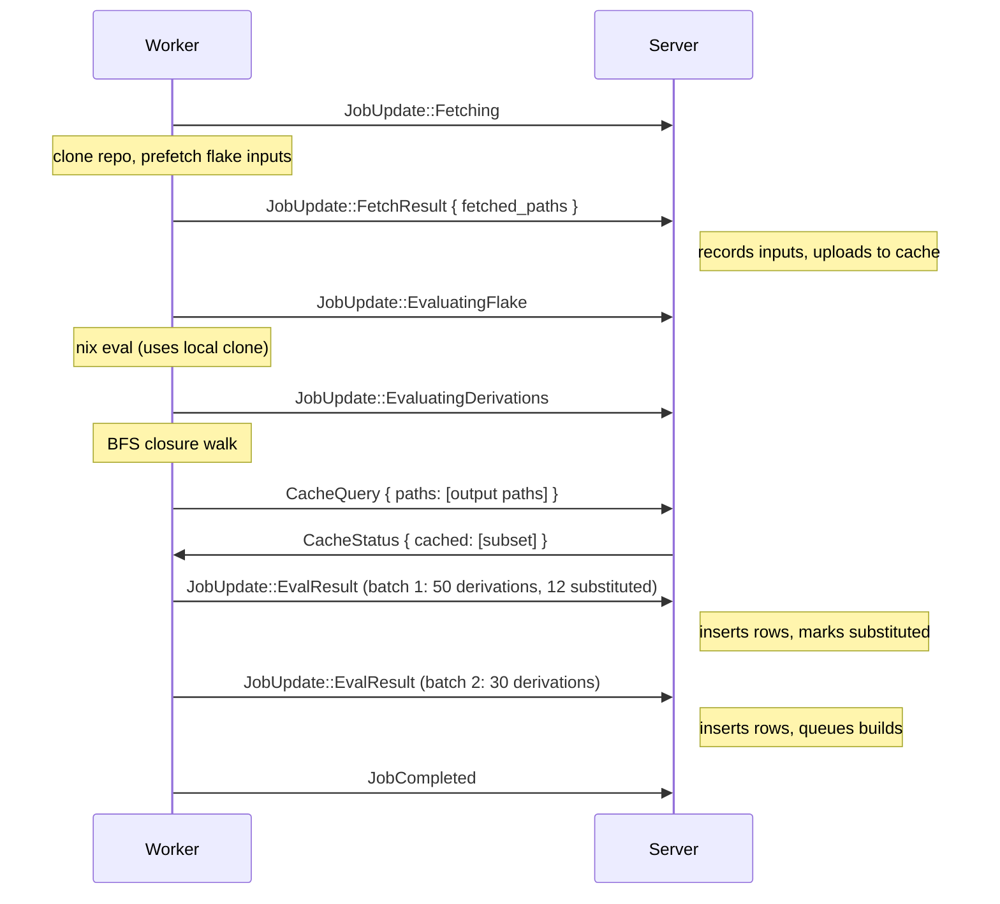

The server processes each batch immediately:
1. Insert `derivation`, `derivation_output`, `derivation_dependency` rows.
2. Insert `build` rows — `Substituted` for derivations the worker marked as `substituted` (confirmed in cache), `Created` for the rest.
3. Create **entry points** for root derivations (those with a non-empty `attr`) — transitive dependencies are not tracked as entry points. Entry points map user-facing packages to their builds for CI reporting and the frontend UI.
4. Transition non-substituted builds from `Created` → `Queued` and **immediately dispatch** them to the in-memory job tracker. Workers are notified via `JobOffer` without waiting for the background dispatch loop.

This means builds can start **while evaluation is still in progress**, significantly reducing end-to-end latency for large closures.

### BuildJob

Requires negotiated capability: `build` and/or `sign`. The server includes only the tasks the worker's capabilities allow.

A `BuildJob` carries the **full dependency chain** in topological order — the worker executes them sequentially without round-tripping to the server for each dependency. Dependencies already present in the worker's store are skipped.

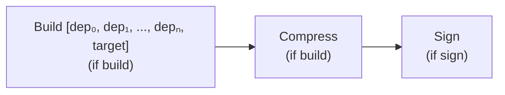

```rust
BuildJob {
    // Ordered list of derivations to build (dependencies first, target last).
    builds: Vec<BuildTask>,
    compress: Option<CompressTask>,     // pack outputs into zstd NARs before signing
    sign: Option<SignTask>,
    // required_paths is NOT here — it was already sent in JobCandidate during the offer phase.
    // The worker cached the missing set while scoring.
}

BuildTask {
    build_id: Uuid,                     // DB build row ID
    drv_path: String,                   // /nix/store/xxx.drv
}

CompressTask {
    store_paths: Vec<String>,           // outputs to compress into zstd NARs
}

SignTask {
    store_paths: Vec<String>,           // outputs to sign
    // signing key sent via Credential message
}
```

| Task | Requires | Input (from server) | Output (from worker) |
|------|----------|---------------------|----------------------|
| **Build** | `build` | `builds` + `required_paths` — full chain with pre-computed closure | Per-build `BuildOutput` via `JobUpdate` |
| **Compress** | `build` | `store_paths` — outputs to pack | zstd-compressed NARs ready for upload |
| **Sign** | `sign` | `store_paths`, signing key credential | `signatures: Vec<Signature>` — per-output Ed25519 signatures |

**NAR transfer flow (zero extra round trips — worker already knows what's missing from scoring):**

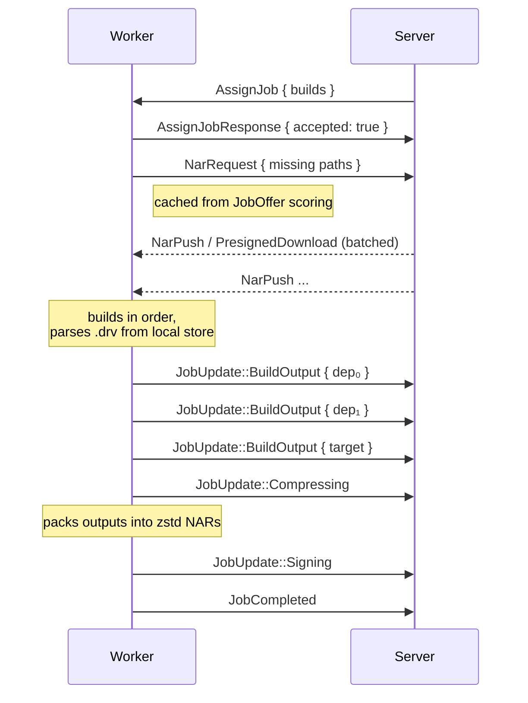

The `required_paths` were already sent in `JobCandidate` during the offer phase. The worker cached the missing set while scoring, so `NarRequest` is immediate after `AssignJob` — no second store query needed.

The server pre-computes `required_paths` from the evaluation's `derivation_dependency` and `derivation_output` tables — no `.drv` parsing on either side for dependency resolution. The worker only parses `.drv` to construct `BasicDerivation` for the actual `build_derivation` daemon call.

If any derivation in the chain fails, the worker skips the rest and reports `JobFailed` — the server cascades `DependencyFailed` to downstream builds.

---

## Messages

### Server → Worker

```rust
enum ServerMessage {
    // Handshake + auth
    AuthChallenge { peers: Vec<Uuid> },          // "these peers registered you — send tokens"
    InitAck { version: u16, capabilities: GradientCapabilities, authorized_peers: Vec<Uuid>, failed_peers: Vec<FailedPeer> },
    AuthUpdate { authorized_peers: Vec<Uuid>, failed_peers: Vec<FailedPeer> },  // reauth result
    Reject { code: u16, reason: String },       // decline connection (closes after send)
    Error { code: u16, message: String },

    // Job dispatch
    JobOffer { candidates: Vec<JobCandidate> },  // pushed eagerly as jobs become available
    RevokeJob { job_ids: Vec<Uuid> },            // remove candidates assigned to another worker
    AssignJob { job_id: Uuid, job: Job, timeout_secs: Option<u64> },
    AbortJob { job_id: Uuid, reason: String },
    Draining,                                   // server shutting down; finish work, buffer results, delay reconnect

    // Credentials (sent before or alongside AssignJob)
    Credential { kind: CredentialKind, data: Vec<u8> },

    // NAR transfer — direct mode
    NarPush { job_id: Uuid, store_path: String, data: Vec<u8>, offset: u64, is_final: bool },

    // NAR transfer — S3 mode (batched)
    PresignedUpload { job_id: Uuid, store_path: String, url: String, method: String, headers: Vec<(String, String)> },
    PresignedDownload { job_id: Uuid, store_path: String, url: String },

    // Cache queries
    CacheStatus { job_id: String, cached: Vec<CachedPath> },  // response to CacheQuery
}

struct FailedPeer { peer_id: Uuid, reason: String }
enum CredentialKind { SshKey, SigningKey }
```

### Worker → Server

```rust
enum ClientMessage {
    // Handshake + auth
    InitConnection { version: u16, capabilities: GradientCapabilities, id: Uuid },
    AuthResponse { tokens: Vec<(String, String)> },  // [(peer_id, token), ...]
    ReauthRequest,                              // ask server to re-send AuthChallenge
    Reject { code: u16, reason: String },       // decline connection after InitAck
    WorkerCapabilities { architectures: Vec<String>, system_features: Vec<String>, max_concurrent_builds: u32 },
    AssignJobResponse { job_id: Uuid, accepted: bool, reason: Option<String> },

    // Job dispatch
    RequestJobChunk {                           // streamed as scores are computed
        scores: Vec<CandidateScore>,            // batch of scores
        is_final: bool,                         // true = done scoring
    },
    JobUpdate { job_id: Uuid, update: JobUpdateKind },
    JobCompleted { job_id: Uuid },              // all tasks done; results already sent via JobUpdate
    JobFailed { job_id: Uuid, error: String },
    Draining,                                   // no more jobs; finishing in-flight work then disconnecting

    // Streaming
    LogChunk { job_id: Uuid, task_index: u32, data: Vec<u8> },

    // NAR transfer
    NarRequest { job_id: Uuid, paths: Vec<String> },    // "send me these paths"
    NarPush { job_id: Uuid, store_path: String, data: Vec<u8>, offset: u64, is_final: bool },
    NarReady { job_id: Uuid, store_path: String, nar_size: u64, nar_hash: String },

    // Cache queries
    CacheQuery { job_id: String, paths: Vec<String> },  // "which of these are already cached?"
}
```

---

## Job Updates

Workers send `JobUpdate` messages to report progress. The server maps these directly to `EvaluationStatus` and `BuildStatus` in the database, which drives the frontend UI.

```rust
enum JobUpdateKind {
    // FlakeJob phases → EvaluationStatus
    Fetching,                                           // → Fetching
    FetchResult {                                       // fetch completed — report fetched inputs
        fetched_paths: Vec<FetchedInput>,                // flake inputs now in the worker's store
    },
    EvaluatingFlake,                                    // → EvaluatingFlake
    EvaluatingDerivations,                              // → EvaluatingDerivation
    EvalResult {                                        // incremental batch (can be sent multiple times)
        derivations: Vec<DiscoveredDerivation>,
        warnings: Vec<String>,                          // Nix evaluation warnings (captured from stderr)
    },

    // BuildJob phases → BuildStatus
    Building { build_id: Uuid },                        // → Building (per derivation in chain)
    BuildOutput { build_id: Uuid, outputs: Vec<BuildOutput> }, // per-derivation result
    Compressing,                                        // packing outputs into zstd NARs (no DB status change)
    Signing,                                            // (no DB status change)
}

struct FetchedInput {
    store_path: String,                 // /nix/store/xxx-source
    nar_hash: String,                   // sha256:xxx (SRI)
    nar_size: u64,                      // NAR bytes
}

struct BuildOutput {
    name: String,                       // output name: "out", "dev", "doc", etc.
    store_path: String,                 // /nix/store/xxx-name
    hash: String,                       // <base64>-<package>
    nar_size: Option<i64>,              // NAR bytes (from query_pathinfo)
    nar_hash: Option<String>,           // NAR hash SRI (sha256-<base64>)
    has_artefacts: bool,                // true if <output>/nix-support/hydra-build-products exists
}
```

**Mapping to database status:**

| `JobUpdateKind` | DB Entity | Status set |
|-----------------|-----------|------------|
| `Fetching` | `evaluation` | `Fetching` (8) |
| `FetchResult` | `evaluation` | Stays `Fetching`; records fetched input paths, uploads NARs to cache |
| `EvaluatingFlake` | `evaluation` | `EvaluatingFlake` (1) |
| `EvaluatingDerivations` | `evaluation` | `EvaluatingDerivation` (2) |
| `EvalResult` | `evaluation` + `derivation` + `build` + `entry_point` + `evaluation_message` | Inserts rows per batch; substituted → `Substituted` (7), rest → `Created` (0) → `Queued` (1). Creates `entry_point` rows for root derivations (non-empty `attr`). Immediately dispatches ready builds to workers. First `EvalResult` sets eval to `Building` (3). Warnings stored as `evaluation_message` rows with level `Warning`. |
| `Building` | `build` | `Building` (2) — per derivation in chain |
| `BuildOutput` | `build` + `derivation_output` | `Completed` (3); updates output hash/size/path |
| `Compressing` | — | No status change; informational — packing outputs into zstd NARs |
| `Signing` | — | No status change; informational |

`JobCompleted` sets the final terminal status. `JobFailed` sets `Failed` and cascades `DependencyFailed` to downstream builds.

---

## NAR Transfer

Two modes, chosen by the server based on `NarStore` configuration. Both support **batched transfers** — the server sends all NARs for a job at once (e.g. all inputs for a build chain), avoiding per-path round trips.

### Direct Mode

NAR data flows as chunked `NarPush` messages over the WebSocket. Data is zstd-compressed. Default chunk size: 64 KiB. Multiple NARs can be interleaved — each chunk is tagged with `store_path`.

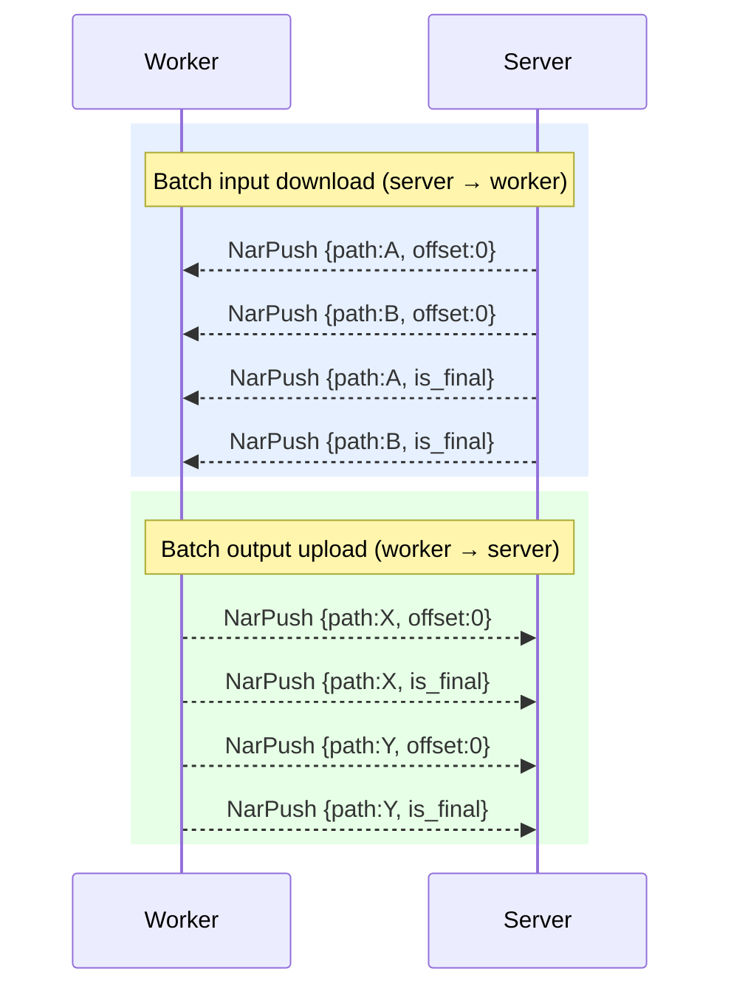

### S3 Mode

Server sends presigned URLs in bulk. Worker uploads/downloads directly via HTTP in parallel, then confirms each.

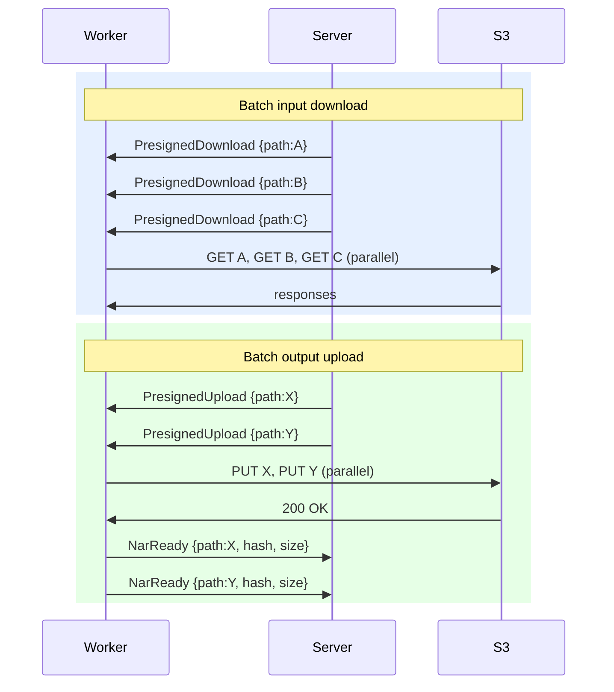

The worker drives NAR requests — it knows what it needs to build, checks its local store, and asks the server for only the missing paths:

```rust
// Worker → Server: I need these paths to proceed
NarRequest { job_id: Uuid, paths: Vec<String> }
```

The server responds with batched `NarPush` (direct mode) or `PresignedDownload` (S3 mode) for the requested paths. This avoids the server needing to know the worker's store state.

**Source selection in federated setups:** when multiple peers hold a requested NAR, the server prefers direct workers over federation proxies (fewer network hops), minimizing relay latency and bandwidth. If S3 is configured and the NAR is cached there, S3 is always preferred (direct HTTP, no relay).

---

NARs are always **zstd-compressed** on the wire and in storage (`*.nar.zst`). Workers decompress before importing into their local Nix store and compress before uploading build outputs.

---

## Timeouts

The server enforces timeouts on jobs. The timeout is communicated in `AssignJob`:

```rust
AssignJob {
    job_id: Uuid,
    job: Job,
    timeout_secs: Option<u64>,         // None = no timeout
}
```

When the timeout expires, the server sends `AbortJob { reason: "timeout" }`. The worker must stop and respond with `JobFailed`. If the worker is unreachable, the server marks the job as `Failed` after the grace period.

Default timeouts:
- FlakeJob (evaluation): `GRADIENT_EVALUATION_TIMEOUT` (default: 600s)
- BuildJob: no default timeout (builds can be long-running)

---

## Scheduling Priority

The server assigns jobs based on priority. Workers do not need to know the priority — it is purely server-side.

**Evaluation queue:** FIFO by `created_at`, up to `max_concurrent_evaluations` (default: 10) in parallel. `force_evaluation` projects are picked up immediately.

**Build queue:** ordered by:
1. Dependency count descending — builds with more dependents (integration builds) start first
2. `updated_at` ascending — older builds drain first

Builds are only eligible when all dependency builds are `Completed` or `Substituted`. The server matches eligible builds to `RequestJobChunk` by checking that the build's target system and required features are all present in the worker's `system_features`.

---

## Federation

Federation connects Gradient instances to each other. A server with `federate` enabled can connect to other servers using the same proto protocol — it authenticates using the standard challenge-response, and the remote peer (org, cache, or proxy) sees it as a single worker/cache.

There is no special "proxy" type. Federation can happen in two ways:

- **`gradient-proxy`** — a lightweight binary that only federates. It has no local orgs, no UI, no database. Workers authenticate to it with a simple proxy-level token. It connects to upstream servers, authenticating against their peers. The proxy **detaches** the worker↔peer relationship: all its workers serve all authorized peers. The proxy itself is a peer — it registers workers and issues them tokens.
- **A full Gradient server** — a server with its own orgs, projects, and workers. Its orgs and caches are peers that individually control which external workers/servers get tokens, deciding what to expose.

### How it works

A federation peer connects to a remote server as a regular worker. A peer on the remote server (org, cache, or proxy) registers the federation peer's ID and issues a token — exactly like registering any worker:

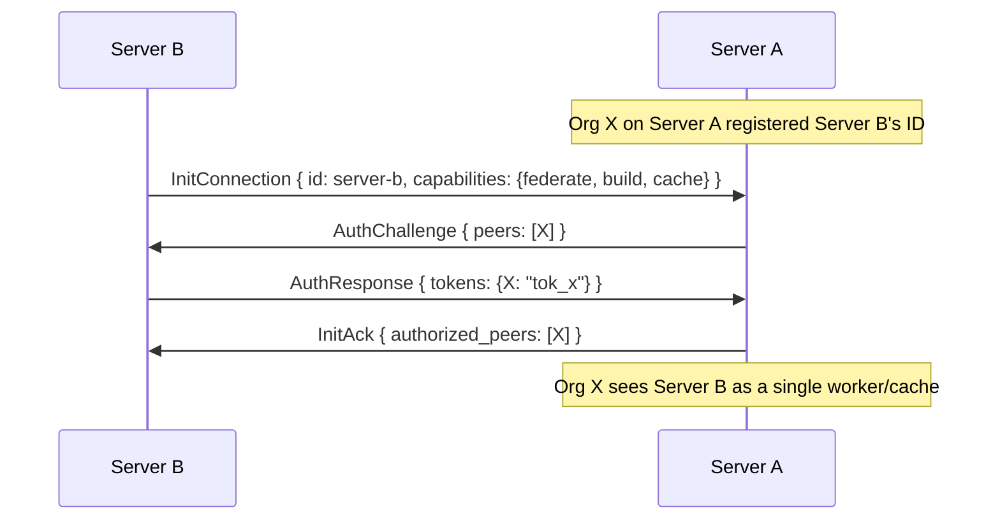

From Org X's perspective, Server B is just one worker that happens to have a lot of capacity. Server B internally routes jobs to its own workers and serves its own caches — Org X doesn't see or control that.

### `gradient-proxy`

The proxy detaches authorization. Workers authenticate to the proxy (which is itself a peer), and the proxy authenticates to upstream servers against their peers. All workers behind the proxy serve all authorized upstream peers:

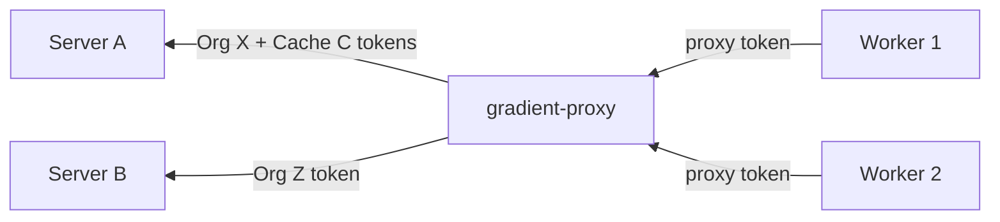

```yaml
# gradient-proxy config
id: "proxy-001"
worker_token: "tok_proxy_shared"     # workers auth with this
upstream:
  - url: server-a.example.com
    peers:
      org-x:   "tok_org_x"          # Org X registered proxy-001
      cache-c: "tok_cache_c"        # Cache C registered proxy-001
  - url: server-b.example.com
    peers:
      org-z:   "tok_org_z"          # Org Z registered proxy-001
```

Org X's job arrives → proxy assigns to any available worker. Org Z's job arrives → same pool. The proxy doesn't distinguish — all workers serve all peers.

### Full Gradient server as federation peer

A full server's orgs and caches are independent peers. Each decides whether to register an external worker/server and issue a token:

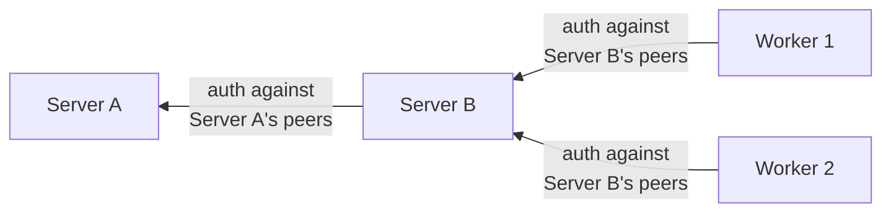

Workers authenticate against Server B's peers (its orgs and caches). Server B authenticates upstream against Server A's peers. Each peer on each server independently controls access.

### Aggregation

Both federation forms aggregate downstream when advertising capabilities upstream:
- `GradientCapabilities`: OR of all downstream workers
- `system_features`: union of all downstream workers' features
- `max_concurrent_builds`: sum of all downstream slots

The upstream server sees one peer. Internal routing is the federation peer's problem.

### Cache federation

Caches behind a federation peer are exposed upstream. When a remote peer's build needs a NAR, the upstream server can request it from the federation peer, which serves it from its cache or downstream workers.

- **`gradient-proxy`** — exposes all downstream caches (no access control layer)
- **Full server** — each cache is a peer that controls which external connections can access it

### Access control summary

| | `gradient-proxy` | Full Gradient server |
|---|---|---|
| Workers → peer | Proxy-level token (flat, no orgs) | Challenge-response against server's peers |
| Peer → upstream | Challenge-response against upstream's peers | Challenge-response against upstream's peers |
| What's exposed | Everything — all workers, all caches | Per-peer (org/cache) settings |
| Upstream sees peer as | One worker/cache | One worker/cache |

---

## Signing Details

When a worker receives a `SignTask`, it performs pure-Rust Ed25519 signing locally:

1. For each store path, query local store for `PathInfo` (NAR hash, NAR size, references).
2. Convert NAR hash from SRI format (`sha256-<base64>`) to Nix format (`sha256:<nix-base32>`).
3. Compute fingerprint: `fingerprint_path(store_path, nar_hash, nar_size, references)`.
4. Sign fingerprint with the cache's Ed25519 secret key (received via `Credential::SigningKey`).
5. Return signatures in `JobCompleted`.

The server inserts signatures into `derivation_output_signature` and calls `add_signatures` on its local store.

---

## Build Artefacts

After a successful build, the worker checks for `<output>/nix-support/hydra-build-products`. If present, `BuildOutput.has_artefacts` is set to `true`. The server stores this flag on `derivation_output.has_artefacts` for the frontend to display download links.

---

## DependencyFailed Cascade

When a build fails (`JobFailed` or `AbortJob`), the server walks reverse `derivation_dependency` edges within the same evaluation and marks all dependent builds as `DependencyFailed` (6). This is a server-side graph walk — workers are not notified about cascaded failures unless they hold an in-flight job for an affected build, in which case they receive `AbortJob`.

The evaluation's final status is determined by aggregating all build statuses:
- All `Completed` or `Substituted` → `Evaluation::Completed`
- Any `Failed` → `Evaluation::Failed`
- Any `Aborted` or `DependencyFailed` (and none in-progress) → `Evaluation::Aborted`

---

## Log Streaming

Workers send `LogChunk` messages during task execution. The server appends them to `LogStorage` (file or S3-backed, same as current build logs).

```rust
LogChunk { job_id: Uuid, task_index: u32, data: Vec<u8> }
```

Fire-and-forget — no acknowledgement. WebSocket flow control provides backpressure if the server falls behind.

When the server receives `JobCompleted` or `JobFailed`, it **finalizes** the log (uploads to S3 if configured). Workers do not need to wait for finalization.

---

## Credential Distribution

The server sends credentials to workers before tasks that need them:

| Credential | Used by | Contents |
|------------|---------|----------|
| `SshKey` | `FetchFlake` task | Organization's SSH private key for cloning private repos |
| `SigningKey` | `Sign` task | Cache Ed25519 secret key for signing store paths |

Credentials are encrypted in transit (TLS). Workers MUST:
- Keep credentials in memory only — never write to disk
- Zeroize memory on drop
- Discard credentials when the job completes or the connection closes

---

## Abort

Either side can abort a job:

**Server-initiated:** `AbortJob { job_id, reason }` → worker stops current task, cleans up, responds `JobFailed` with the abort reason. The server sends `AbortJob` when an evaluation is aborted via the API (`POST /evals/{id}` with `method: "abort"`). The scheduler finds which worker holds the active job and delivers the message through a per-worker channel. Pending (unassigned) jobs for the aborted evaluation are removed from the in-memory tracker.

**Worker-initiated:** worker sends `JobFailed` at any time.

**Disconnect:** server marks all in-progress jobs for the disconnected worker as `Failed`. Downstream builds get `DependencyFailed`.

Workers should finish the current atomic operation (e.g. a single NarPush) before aborting, but must not start new tasks.

---

## Connection Lifecycle

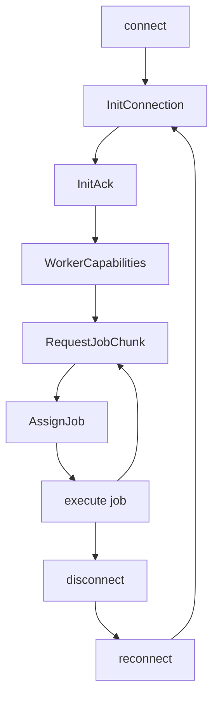

- **Reconnect:** worker opens a new WebSocket and sends a fresh `InitConnection`. No session resumption.
- **Heartbeat:** WebSocket ping/pong at 30-second intervals. Server closes connections that miss 3 consecutive pongs.
- **Idempotency:** jobs have UUIDs. The server will not re-assign a job that already completed or failed.

### Server Restart

When the server restarts (deploy, crash, maintenance), workers experience a WebSocket disconnect. The protocol is designed so no work is lost:

**Worker behavior:**
1. Detect disconnect (WebSocket close or missed pong).
2. **Keep running in-progress jobs** — do not abort immediately. Results are buffered locally.
3. Reconnect with exponential backoff: 1s → 2s → 4s → ... → 60s max, with jitter.
4. On reconnect, send `InitConnection` + `WorkerCapabilities` (full re-handshake).
5. Send `JobUpdate`/`JobCompleted`/`JobFailed` for any jobs that progressed or finished during the outage. The server matches these by `job_id`.
6. Resume `RequestJobChunk` loop for free capacity slots.

**Server behavior on startup:**
1. Scan for orphaned jobs: any `build` with status `Building` (2) or `evaluation` with status `Fetching`/`EvaluatingFlake`/`EvaluatingDerivation` that has no connected worker.
2. Wait a **grace period** (default: 120s) for workers to reconnect and report results.
3. After the grace period, mark remaining orphaned jobs as `Failed` and re-queue them.

```mermaid
sequenceDiagram
    participant W as Worker
    participant S as Server

    Note over W: executing job...
    S-xW: server goes down
    W--xS: reconnect (backoff)
    W--xS: reconnect (backoff)
    Note over S: server comes back
    W->>S: InitConnection { id }
    S->>W: InitAck
    W->>S: WorkerCapabilities
    W->>S: JobCompleted { job_id }
    Note right of W: buffered result
    Note right of S: matches id,<br/>reassigns orphaned jobs
    W->>S: RequestJobChunk
    Note right of W: ready for more
```

This means short server restarts (< grace period) cause **zero job loss** — workers buffer results and replay them on reconnect.

### Graceful Server Shutdown

When the server is shutting down intentionally (deploy, maintenance), it sends `Draining` to all connected workers before closing:

```mermaid
sequenceDiagram
    participant W as Worker
    participant S as Server

    S->>W: Draining
    Note left of W: stops requesting new jobs
    W->>S: JobCompleted (in-flight)
    S-xW: close
    Note left of W: waits before reconnecting
```

On receiving `ServerMessage::Draining`, workers:
1. Stop sending `RequestJobChunk` — no new work.
2. Finish in-flight jobs and send results.
3. After the connection closes, wait before reconnecting (e.g. 30s) to give the server time to restart.

This is distinct from a crash (unexpected disconnect) where workers reconnect immediately with exponential backoff. `Draining` tells workers the disconnect is planned.

---

## Error Codes

| Code | Meaning |
|------|---------|
| 400  | Malformed message or unsupported protocol version |
| 401  | Unauthorized (missing or invalid token) |
| 499  | Capability not negotiated for this session |
| 498  | Job not found (e.g. AbortJob for unknown job_id) |
| 497  | Job already assigned or completed |
| 496  | Duplicate connection (already connected) |
| 500  | Internal server error |
| 599  | Peer shutting down |
| 598  | Peer starting |

---

## Versioning

- `PROTO_VERSION` (currently `1`) is incremented on breaking wire changes.
- Server accepts any `client_version == PROTO_VERSION`.
- New capabilities are gated by `GradientCapabilities` flags, not version numbers.
