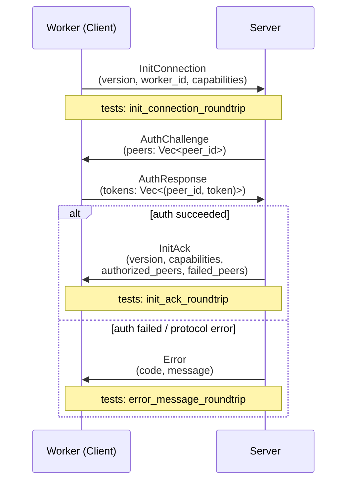
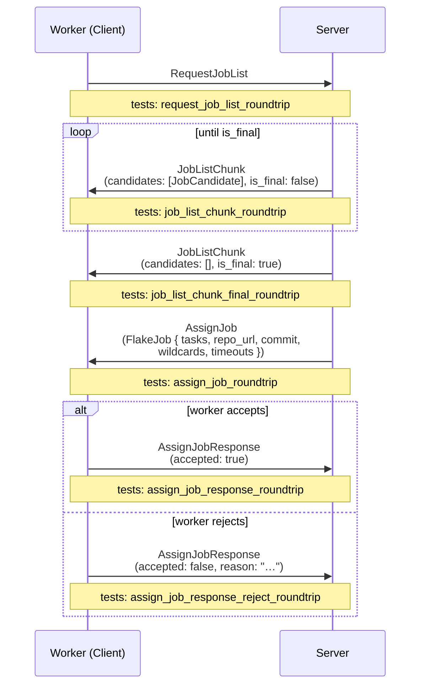
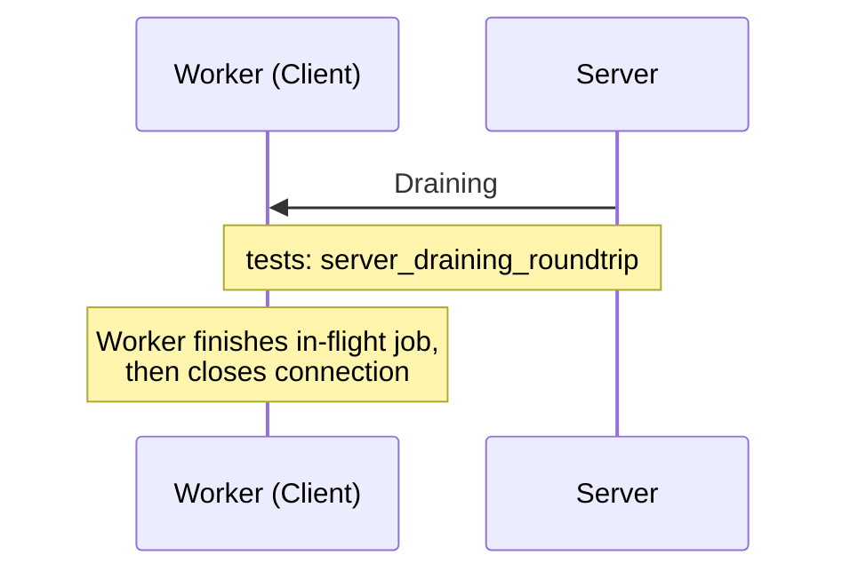
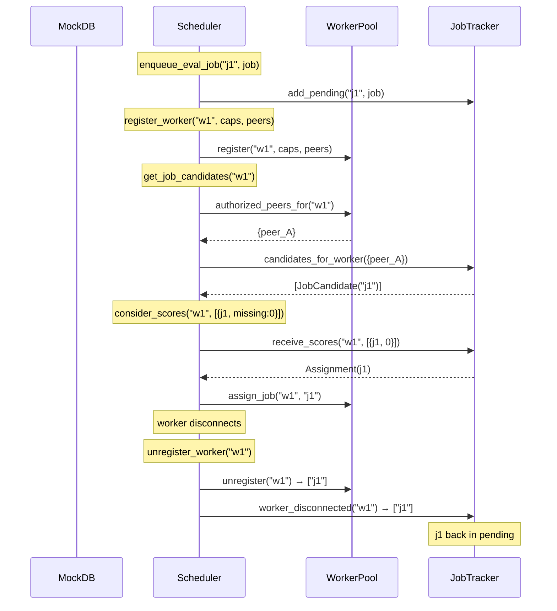
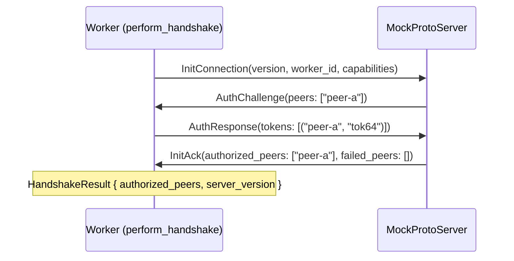

# Tests

This page documents all unit and integration tests in the Rust backend workspace
(across **8 crates**, including the `score` scoring crate). Run them with:

```sh
cargo test --workspace --tests
# core doctests require a separate invocation (package name shadows stdlib `core`):
cargo test -p core --tests
```

Tests are grouped by the module under test.

## Architecture overview

The test infrastructure is built around a set of trait abstractions and fakes
that replace production dependencies (nix-daemon, filesystem, WebSocket) with
in-memory implementations. The diagram below shows how production and test code
relate:

```text
                     ┌─────────────────────────────────────────┐
                     │              proto crate                │
                     │                                         │
                     │  traits.rs                              │
                     │  ┌───────────────────────────────────┐  │
                     │  │  WorkerStore    (has_path)        │  │
                     │  │  DrvReader      (read_drv)        │  │
                     │  │  JobReporter    (report_*)        │  │
                     │  └───────────────────────────────────┘  │
                     │                                         │
                     │  scheduler/                             │
                     │  ┌────────────────┐  ┌───────────────┐  │
                     │  │   JobTracker   │  │   WorkerPool  │  │
                     │  │   (pending/    │  │   (connected  │  │
                     │  │    active)     │  │   workers)    │  │
                     │  └────────────────┘  └───────────────┘  │
                     │         └──────────┬────────────┘       │
                     │                    v                    │
                     │              ┌────────────┐             │
                     │              │ Scheduler  │             │
                     │              └────────────┘             │
                     └─────────────────────────────────────────┘
                                         |
              ┌──────────────────────────┼───────────────────────────┐
              v                          v                           v
   ┌─────────────────────┐   ┌──────────────────────┐   ┌─────────────────────┐
   │    worker crate     │   │  test-support crate  │   │     core crate      │
   │                     │   │                      │   │                     │
   │  LocalNixStore      │   │  FakeWorkerStore     │   │  DerivationResolver │
   │    impl WorkerStore │   │    impl WorkerStore  │   │  (trait)            │
   │                     │   │                      │   │                     │
   │  FsDrvReader        │   │  FakeDrvReader       │   │  parse_drv()        │
   │    impl DrvReader   │   │    impl DrvReader    │   │                     │
   │                     │   │                      │   │                     │
   │  JobUpdater         │   │  RecordingJobReporter│   │  FakeDerivation-    │
   │    impl JobReporter │   │    impl JobReporter  │   │    Resolver         │
   │                     │   │                      │   │                     │
   │  evaluate_          │   │  StoreFixture        │   │  FakeNixStore-      │
   │    derivations_with │   │   (951 real .drv)    │   │    Provider         │
   └─────────────────────┘   └──────────────────────┘   └─────────────────────┘
```

## Test fakes & fixtures

All test fakes live in `backend/test-support/src/fakes/`. Each fake implements
a production trait and substitutes the real dependency with an in-memory version.

| Fake | File | Trait | Purpose |
|------|------|-------|---------|
| `FakeNixStoreProvider` | `nix_store.rs` | `NixStoreProvider`, `WorkerStore` | In-memory store with present/missing paths, pathinfo, GC roots |
| `FakeDerivationResolver` | `derivation_resolver.rs` | `DerivationResolver` | Scripted attr listing, drv path resolution, derivation data |
| `FakeWorkerStore` | `worker_store.rs` | `WorkerStore` | Minimal path-presence tracker |
| `FakeDrvReader` | `drv_reader.rs` | `DrvReader` | Serves raw `.drv` bytes from memory (backed by `StoreFixture.raw_drvs`) |
| `RecordingJobReporter` | `job_reporter.rs` | `JobReporter` | Captures all job status calls as `Vec<ReportedEvent>` |
| `MockProtoServer` / `MockServerConn` | `mock_server.rs` | - | In-process WebSocket server for testing `ProtoConnection`-based code; binds `127.0.0.1:0`, accepts one connection, provides typed `send(ServerMessage)` / `recv() → ClientMessage` over rkyv framing |
| `RecordingWebhookClient` | `webhooks.rs` | `WebhookClient` | Records webhook deliveries with scripted status codes |
| `InMemoryEmailSender` | `email.rs` | `EmailSender` | Captures verification/password-reset emails |
| `RecordingCiReporter` | `ci_reporter.rs` | `CiReporter` | Records CI status report calls |
| `FakeBuildExecutor` | `build_executor.rs` | `BuildExecutor` | Scripted build success/failure/error |
| `FakeFlakePrefetcher` | `flake_prefetcher.rs` | `FlakePrefetcher` | Records prefetch calls, returns `None` |
| `NoopLogStorage` | `log_storage.rs` | `LogStorage` | No-op append/read/delete |

### `StoreFixture` - real derivation trees

`StoreFixture` (`test-support/src/fakes/store_fixture.rs`) loads **real** Nix
`.drv` files from the `test/` directory (951 derivations for `hello-2.12.3`).
It performs a BFS from the entry-point derivation through `inputDrvs` to build
the full closure and populates fakes.

```text
  test/
  ├── output          # single line: /nix/store/<hash>-hello-2.12.3.drv
  └── store/          # 951 real ATerm .drv files
      ├── 7mdg60dr...-hello-2.12.3.drv   (entry point)
      ├── abc123...-glibc-2.40.drv
      └── ...
```

```text
         load_store("test/")
               │
               v
  ┌────────────────────────────────────────┐
  │     StoreFixture                       │
  ├────────────────────────────────────────┤
  │ entry_point: String                    │  ← "/nix/store/7mdg...-hello-2.12.3.drv"
  │ derivations: Vec<...>                  │  ← 951 DiscoveredDerivation structs
  │ tree: HashMap<...>                     │  ← drv_path → [dependency drv_paths]
  │ parsed: HashMap<...>                   │  ← drv_path → Derivation (parsed ATerm)
  │ raw_drvs: HashMap<...>                 │  ← drv_path → raw bytes (for FakeDrvReader)
  │ resolver: FakeDerivationResolver       │
  │ store: FakeNixStoreProvider            │
  └────────────────────────────────────────┘
               │
               v
       mark_all_built()  →  remove_random_subtrees(0.5, seed)
               │
               v
  ┌─────────────────────────────────────────┐
  │ Partial store: some outputs present,    │
  │ some missing. ready_to_build() returns  │
  │ derivations whose deps are all built    │
  │ but which aren't built themselves.      │
  └─────────────────────────────────────────┘
```

Key methods:

| Method | What it does |
|--------|-------------|
| `mark_built(drv_path)` | Mark all outputs of one derivation as present |
| `mark_subtree_built(drv_path)` | Mark a derivation and all transitive deps as built |
| `mark_all_built()` | Mark everything as built |
| `remove_random_subtrees(fraction, seed)` | Unbuild a fraction of derivations (deterministic LCG) |
| `built()` / `unbuilt()` | Query which derivations are/aren't built |
| `ready_to_build()` | Derivations whose deps are all built but that aren't built themselves |

---

## `proto` - Wire Message Serialization

**File:** `backend/proto/src/tests.rs`
**Run:** `cargo test -p proto`

All tests in this module verify the rkyv serialization round-trip: a message is serialized to bytes and deserialized back, then compared with `assert_eq!`.

The proto protocol runs over a persistent WebSocket (`/proto`) with rkyv binary framing. The three sub-flows below show which messages each test exercises.

### Handshake & Auth Sequence



### Job Dispatch Sequence



### Drain & Shutdown Sequence



### Test Table

| Test | Flow | What it checks |
|------|------|---------------|
| `init_connection_roundtrip` | Handshake | `ClientMessage::InitConnection` with version, capabilities, and worker ID survives a rkyv round-trip |
| `init_ack_roundtrip` | Handshake | `ServerMessage::InitAck` with version, capabilities, authorized peers, and failed peers survives a rkyv round-trip |
| `error_message_roundtrip` | Handshake | `ServerMessage::Error` with numeric code and string message survives a rkyv round-trip |
| `request_job_list_roundtrip` | Job Dispatch | Unit-variant `ClientMessage::RequestJobList` survives a rkyv round-trip |
| `job_list_chunk_roundtrip` | Job Dispatch | `ServerMessage::JobListChunk` with one `JobCandidate` (including `required_paths`) and `is_final: false` survives a rkyv round-trip |
| `job_list_chunk_final_roundtrip` | Job Dispatch | Empty `JobListChunk` with `is_final: true` survives a rkyv round-trip |
| `assign_job_response_roundtrip` | Job Dispatch | `ClientMessage::AssignJobResponse` with `accepted: true` and no reason survives a rkyv round-trip |
| `assign_job_response_reject_roundtrip` | Job Dispatch | `AssignJobResponse` with `accepted: false` and a rejection reason string survives a rkyv round-trip |
| `server_draining_roundtrip` | Drain | Unit-variant `ServerMessage::Draining` survives a rkyv round-trip |
| `assign_job_roundtrip` | Job Dispatch | `ServerMessage::AssignJob` with a `FlakeJob` (two tasks, repository URL, commit, wildcards, per-task and per-job timeouts) survives a rkyv round-trip |
| `proto_version_is_nonzero` | -- | Sanity check: `PROTO_VERSION >= 1` |

---

## `proto::scheduler::jobs` - Job Tracker

**File:** `backend/scheduler/src/jobs.rs`
**Run:** `cargo test -p proto`

`JobTracker` is a dual-queue (pending + active) that tracks jobs through their
lifecycle. Tests exercise the state machine directly without any async runtime.

### Job lifecycle state machine

```text
                     add_pending()
                          │
                          v
                    ┌──────────┐
                    │ PENDING  │◄────────────────────┐
                    └────┬─────┘                     │
                         │                           │
          receive_scores(missing: 0)          release_to_pending()
          or take_empty_required()            or worker_disconnected()
                         │                           │
                         v                           │
                    ┌──────────┐                     │
                    │  ACTIVE  │─────────────────────┘
                    └────┬─────┘
                         │
                   remove_active()
                         │
                         v
                      (done)
```

### Peer-based filtering

```text
  ┌─────────────────────────────────────────────────┐
  │               JobTracker                        │
  │                                                 │
  │  Pending:                                       │
  │    "ja" → PendingEvalJob { peer_id: peer_A }    │
  │    "jb" → PendingEvalJob { peer_id: peer_B }    │
  │                                                 │
  │  candidates_for_worker(authorized={peer_A})     │
  │    → returns only "ja"                          │
  │                                                 │
  │  candidates_for_worker(None)                    │
  │    → returns both "ja" and "jb" (open mode)     │
  └─────────────────────────────────────────────────┘
```

| Test | What it checks |
|------|---------------|
| `test_add_pending_and_candidates` | Add 3 jobs, `candidates_for_worker(None)` returns all 3 |
| `test_candidates_filtered_by_peer` | Jobs for peer A/B; worker authorized for A only sees A's job |
| `test_receive_scores_assigns_zero_missing` | Score with `missing: 0` assigns the job (pending -> active) |
| `test_receive_scores_no_assign_nonzero` | Score with `missing: 5` does not assign (stays pending) |
| `test_release_to_pending_after_rejection` | Assign then release: job reappears in pending candidates |
| `test_worker_disconnected_requeues` | Assign 2 jobs to "w1", disconnect: both return to pending |
| `test_take_empty_required` | Job with empty `required_paths` is taken; job with paths is not |
| `test_contains_job_both_maps` | `contains_job()` finds a job in both pending and active states |
| `test_candidates_filtered_by_architecture` | x86_64 worker only sees `x86_64-linux` and `builtin` build candidates; `aarch64-linux` builds are hidden |
| `test_take_first_of_kind_skips_wrong_arch` | Pull-based `RequestJob { kind: Build }` does not assign builds whose architecture isn't in the worker's `architectures` |
| `test_take_first_of_kind_requires_features` | Build requiring `kvm` is only assigned to a worker with `kvm` in its `system_features` |

---

## `proto::scheduler::worker_pool` - Worker Registry

**File:** `backend/scheduler/src/worker_pool.rs`
**Run:** `cargo test -p proto`

`WorkerPool` is an in-memory registry of connected workers with capabilities,
authorized peers, and assigned-job tracking.

### Worker lifecycle

```text
  register()                           unregister()
      │                                     │
      v                                     v
  ┌──────────┐  update_capabilities()  ┌──────────┐
  │CONNECTED │───────────────────────► │CONNECTED │──► returns assigned
  │(default  │  update_authorized()    │(updated) │    job IDs
  │ caps)    │                         └──────────┘
  └──────────┘
       │
       │ mark_draining()
       v
  ┌──────────┐
  │ DRAINING │  (still connected, finishes in-flight jobs)
  └──────────┘
```

| Test | What it checks |
|------|---------------|
| `test_register_and_is_connected` | Register "w1": `is_connected` true, count is 1 |
| `test_unregister_returns_assigned_jobs` | Assign 2 jobs, unregister: returns both job IDs, count drops to 0 |
| `test_unregister_unknown_returns_empty` | Unregistering unknown worker returns empty vec |
| `test_update_capabilities` | Set architectures/features/max_builds + static hardware caps, verify via `all_workers()` and `metrics_for()` |
| `test_update_metrics_updates_view` | Live-metrics heartbeat updates the worker's `WorkerMetricsView`; static caps survive; unknown worker returns `None` |
| `test_mark_draining` | Draining flag is reflected in `all_workers()` output |
| `test_authorized_peers_for` | Registered peers are accessible; unknown worker returns `None` |
| `test_update_authorized_peers` | Adding a peer via reauth expands the authorized set |
| `test_assign_and_release_job` | Assign increments count, release decrements it |
| `test_all_workers_info` | Multiple workers with different states are all reported correctly |

---

## `proto::scheduler` - Scheduler Coordination

**File:** `backend/scheduler/src/scheduler_tests.rs`
**Run:** `cargo test -p proto`

Integration tests for the `Scheduler` struct, which coordinates `WorkerPool`
and `JobTracker` behind `RwLock`s. Uses a mock database (no real Postgres).

### Job flow through the scheduler



| Test | What it checks |
|------|---------------|
| `test_enqueue_and_get_candidates` | Enqueue 2 jobs, open-mode worker sees both |
| `test_candidates_filtered_by_authorized_peers` | Worker authorized for peer_A sees only peer_A's jobs |
| `test_score_assignment_flow` | Score `missing: 0` assigns the job, pending count drops to 0 |
| `test_job_rejected_requeues` | Assign then reject: job returns to pending |
| `test_worker_disconnect_requeues_jobs` | Disconnect requeues all assigned jobs; new worker can see them |
| `test_update_authorized_peers_expands_access` | Reauth adds peer_B: worker now sees both peers' jobs |
| `test_draining_worker_still_has_assigned_jobs` | Draining worker retains its assigned job count |

---

## `test_support::fakes::store_fixture` - Store Fixture

**File:** `backend/test-support/src/fakes/store_fixture.rs`
**Run:** `cargo test -p test-support`

Tests for the `StoreFixture` itself, validating that real `.drv` files from
`test/` are loaded, parsed, and traversed correctly (951 derivations).

### Build-wave convergence

```text
  Wave 0 (nothing built):
    ready_to_build() → leaf nodes only (no dependencies)
       mark_built(leaves)

  Wave 1:
    ready_to_build() → nodes whose deps are all leaves
       mark_built(wave 1)

  Wave 2:
    ready_to_build() → next frontier
       ...

  Wave N:
    ready_to_build() → [] (everything built)
       assert: built().len() == total derivations
```

| Test | What it checks |
|------|---------------|
| `load_store_parses_all_derivations` | Entry point is the hello drv; derivations list is non-empty and contains it |
| `tree_has_entry_for_every_derivation` | Every `DiscoveredDerivation` has a corresponding entry in the adjacency tree |
| `initially_nothing_is_built` | Fresh fixture: `built()` empty, `unbuilt()` == total |
| `mark_all_built_then_everything_is_built` | After `mark_all_built()`: `built()` == total, `ready_to_build()` empty |
| `leaf_nodes_are_ready_to_build` | In a fresh fixture, all ready nodes have zero dependencies |
| `mark_subtree_built_includes_transitive_deps` | Building the entry point's subtree marks the full closure as built |
| `remove_random_subtrees_creates_partial_store` | After `mark_all_built()` + `remove_random_subtrees(0.5, 42)`: some built, some not |
| `ready_to_build_respects_dependencies` | After building leaves: ready nodes have all deps built but aren't built themselves |
| `ready_to_build_converges` | Iteratively building `ready_to_build()` waves terminates with everything built |
| `remove_random_subtrees_is_deterministic` | Same seed produces identical built/unbuilt sets |
| `single_leaf_unbuilt` | Mark all built, unbuild one leaf: it appears in `ready_to_build()` |

---

## `worker::executor::build` - Per-Build Metrics

**File:** `backend/worker/src/executor/build.rs`, `backend/worker/src/metrics/cgroup.rs`
**Run:** `cargo test -p worker executor::build`

Tests for best-effort per-build resource capture. The worker records wall-clock
`build_time_ms` for every build. When `--build-metrics` is enabled, CPU time
comes from the daemon's build result (`cpu_user + cpu_system`, read from the
cgroup by nix before it tears the cgroup down), while peak RAM and disk I/O are
sampled live from the build's cgroup — located via nix's
`<state-dir>/cgroups/<uid>` map (newest entry written after the build started,
since nix destroys the cgroup at build end). Stale map entries and idle/ambiguous
cases degrade to `None`.

| Test | What it checks |
|------|---------------|
| `newest_build_cgroup_ignores_entries_older_than_since` | Stale `<uid>` files (finished builds) are skipped; only an entry written at/after the build start is returned |
| `newest_build_cgroup_none_for_missing_dir` | Returns `None` when the cgroups map dir does not exist |
| `daemon_cpu_usec_sums_present_fields` | Sums `cpu_user`/`cpu_system`, `None` when both absent, clamps negatives to zero |
| `raw_to_metrics_always_sets_build_time` | `None` raw still yields `build_time_ms`; cgroup fields `None`, `oom_killed` false |
| `raw_to_metrics_handles_zero_divisors` | `build_time_ms=0` / `cpu_count=0` → `avg_cpu_pct: None` (no divide-by-zero); other fields still converted |
| `raw_to_metrics_computes_avg_cpu_pct` | `avg_cpu_pct = cpu_time_ms / (build_time_ms * cpu_count) * 100`; `peak_network_mbps` threaded through from the host-window sampler |
| `cgroup::*` (Phase 4a) | `parse_cpu_usage_usec`, `parse_io_stat`, `parse_oom_kill`, `parse_memory_peak`, and `read_build_cgroup` degrade gracefully on missing files/dirs |

---

## `worker::metrics::throughput` - Passive Throughput EWMA

**File:** `backend/worker/src/metrics/throughput.rs`
**Run:** `cargo test -p worker metrics::throughput`

Tests for the thread-safe EWMA accumulators that turn real NAR transfers and
per-build disk I/O into the `network_speed_mbps` / `disk_speed_mbps` heartbeat
values.

| Test | What it checks |
|------|---------------|
| `empty_is_none` | Reports `None` until the first observation |
| `first_sample_sets_value` | First observation seeds the EWMA exactly |
| `converges_toward_steady_state` | Repeated observations converge toward the steady-state rate |
| `non_positive_ignored` | Zero / negative / non-finite samples are ignored |

---

## `worker::executor::eval` - Evaluation Closure Walk

**File:** `backend/worker/src/executor/eval.rs`
**Run:** `cargo test -p worker`

Tests for `evaluate_derivations_with()`, which performs a BFS closure walk
from entry-point `.drv` files through `inputDrvs` to discover all derivations
and check their substitution status. Tests use `FakeDerivationResolver`,
`FakeDrvReader`, `FakeWorkerStore`, and `RecordingJobReporter` - no real
nix-daemon, filesystem, or WebSocket connection.

### Evaluation data flow (test configuration)

```text
  FakeDerivationResolver         FakeDrvReader
  ┌───────────────────────┐      ┌───────────────────────┐
  │ list_flake_derivations│      │ from_raw_drvs(        │
  │   "repo" → ["hello"]  │      │   fixture.raw_drvs    │
  │                       │      │ )                     │
  │ resolve_derivation_   │      │                       │
  │   paths               │      │ read_drv(path)        │
  │   "hello" → entry.drv │      │   → raw bytes         │
  └───────────┬───────────┘      └───────────┬───────────┘
              │                              │
              v                              v
  ┌──────────────────────────────────────────────────────┐
  │          evaluate_derivations_with()                 │
  │                                                      │
  │  1. list attrs via resolver                          │
  │  2. resolve attrs → drv paths via resolver           │
  │  3. BFS: read .drv → parse → extract outputs/deps    │
  │  4. Check has_path() for substitution                │
  │  5. Report EvalResult via reporter                   │
  └──────────┬───────────────────────────────┬───────────┘
             │                               │
             v                               v
  FakeWorkerStore                 RecordingJobReporter
  ┌───────────────────────┐       ┌──────────────────────┐
  │ has_path()            │       │ events:              │
  │   → present set       │       │   EvaluatingDervs    │
  │   (from fixture)      │       │   EvalResult {       │
  └───────────────────────┘       │     derivations,     │
                                  │     warnings         │
                                  │   }                  │
                                  └──────────────────────┘
```

| Test | What it checks |
|------|---------------|
| `test_eval_closure_walk_empty_store` | Full 951-drv fixture, empty store: all discovered, none substituted, entry point has attr, no warnings |
| `test_eval_partial_substitution` | 50% random built: substituted flags exactly match fixture `is_built()` for every derivation |
| `test_eval_all_substituted` | All built: every derivation is `substituted: true` |
| `test_eval_empty_attrs` | No attrs from resolver: empty `EvalResult`, no errors |
| `test_eval_missing_drv_fails_loudly` | Resolver points to a non-existent `.drv`: BFS aborts with a hard error so the server doesn't see a truncated dependency graph |
| `test_eval_dependencies_match_fixture` | Dependency lists in `EvalResult` exactly match the fixture's adjacency tree |

---

## `core::types::wildcard` - Evaluation Wildcard Parsing

**File:** `backend/gradient-types/src/wildcard.rs`  
**Run:** `cargo test -p core --tests`

Tests for the `Wildcard` type used in project evaluation patterns. Parsing is via `FromStr`; the inverse is `Display`. `get_eval_str()` produces the Nix attribute-set expression passed to the evaluator.

### Valid patterns

| Test | Input | What it checks |
|------|-------|---------------|
| `star_in_path_valid` | `packages.*.*` | Parses to a single pattern; `.patterns()` returns `["packages.*.*"]` |
| `multiple_patterns` | `packages.*.*,checks.*.*` | Parses to two patterns; round-trips to the original string |
| `trims_spaces_between_patterns` | `packages.*.*, checks.*.*` | Space after comma is trimmed; `to_string()` omits it |
| `quoted_segment_with_dot_valid` | `my."wild.card".is.*` | Quoted segments containing `.` are accepted and preserved verbatim |
| `quoted_segment_python_style_valid` | `packages.*."python3.12"` | Package names with dots (e.g. Python versions) accepted |
| `exclusion_pattern_valid` | `packages.*.*,!packages.x86_64-linux.broken` | `!`-prefixed patterns are parsed as exclusions |
| `exclusion_with_quoted_segment_valid` | `packages.*.*,!packages.x86_64-linux."broken.pkg"` | Quoted segments in exclusion paths are accepted |
| `roundtrip` | `packages.*.*,!packages.x86_64-linux.broken,my."wild.card".*` | Complex multi-pattern string round-trips exactly |

### Exclusion restrictions

| Test | Input | What it checks |
|------|-------|---------------|
| `exclusion_with_wildcard_rejected` | `my.*,!my.ignored.*` | `*` in an exclusion body is rejected |
| `exclusion_with_hash_rejected` | `packages.*.*,!packages.x86_64-linux.#` | `#` in an exclusion body is rejected |

### `get_eval_str()` - Nix expression output

| Test | Input | Expected output |
|------|-------|----------------|
| `eval_str_include_only` | `packages.*.*` | `{ "include" = [ [ "packages" "*" ] ]; "exclude" = [  ]; }` |
| `eval_str_bare_star` | `*` | `{ "include" = [ [ "*" ] ]; "exclude" = [  ]; }` |
| `eval_str_include_and_exclude` | `packages.*.*,!packages.x86_64-linux.broken` | Include list has one entry; exclude list has the three-segment path |
| `eval_str_quoted_segment_unwrapped` | `my."wild.card".*` | Quotes are stripped; `wild.card` appears as a plain segment in the list |
| `eval_str_multiple_includes` | `packages.*.*.*,checks.*` | Two entries in include list; consecutive `*` segments are collapsed to one |

### Bare special characters

| Test | Input | What it checks |
|------|-------|---------------|
| `bare_star_valid` | `*` | A lone `*` is accepted (means "evaluate everything") |
| `bare_hash_rejected` | `#` | A lone `#` with no preceding path is rejected |
| `bare_exclamation_rejected` | `!` | A lone `!` with no body is rejected |
| `mid_path_exclamation_rejected` | `my.!ignored`, `my.!*` | `!` inside a path segment (not as whole-pattern prefix) is rejected |

### Quoted special characters

| Test | Input | What it checks |
|------|-------|---------------|
| `quoted_star_segment_rejected` | `my."*".not.allowed.*` | `"*"` as a quoted segment is rejected (wildcards must be unquoted) |
| `quoted_hash_segment_rejected` | `my."#".something` | `"#"` as a quoted segment is rejected |
| `quoted_exclamation_segment_rejected` | `my."!".something` | `"!"` as a quoted segment is rejected |
| `quoted_star_in_exclusion_rejected` | `packages.*.*,!my."*".foo` | `"*"` in an exclusion path is rejected |

### Invalid patterns

| Test | Input | What it checks |
|------|-------|---------------|
| `empty_rejected` | `""` | Empty string is rejected |
| `double_comma_rejected` | `packages.*.*,,checks.*.*` | Consecutive commas (empty pattern between them) is rejected |
| `leading_space_rejected` | `" packages.*.*"` | Leading whitespace in a pattern is rejected |
| `internal_whitespace_rejected` | `"packages .*.* "` | Whitespace inside a segment is rejected |
| `starts_with_period_rejected` | `.packages.*.*` | Pattern starting with `.` is rejected |
| `exclusion_bare_body_rejected` | `packages.*.*,!` | `!` with no following path is rejected |
| `exclusion_starts_with_period_rejected` | `packages.*.*,!.packages` | Exclusion body starting with `.` is rejected |

---

## `core::nix::url` - Repository & Flake URL Parsing

**File:** `backend/gradient-nix/src/url.rs`  
**Run:** `cargo test -p core --tests`

Tests for `RepositoryUrl` (stored in the database, used for display and git operations) and `NixFlakeUrl` (passed to `nix flake` commands, always includes `?rev=`).

### `RepositoryUrl` - normalization

`RepositoryUrl::from_str` normalizes certain schemes for Nix compatibility. All others are preserved or rejected.

| Test | Input | Expected output / behaviour |
|------|-------|----------------------------|
| `repo_url_https_normalized` | `https://github.com/foo/bar.git` | Prepended to `git+https://github.com/foo/bar.git` |
| `repo_url_http_normalized` | `http://example.com/repo.git` | Prepended to `git+http://example.com/repo.git` |
| `repo_url_ssh_protocol_normalized` | `ssh://git@github.com/foo/bar.git` | Prepended to `git+ssh://git@github.com/foo/bar.git` |
| `repo_url_scp_passthrough` | `git@github.com:foo/bar.git` | SCP-style URLs are left unchanged |
| `repo_url_git_protocol_passthrough` | `git://server.example.com/repo.git` | `git://` URLs are left unchanged |
| `repo_url_empty_rejected` | `""` | Parse error |
| `repo_url_file_rejected` | `file:///local/repo` | `file://` URLs are rejected |
| `repo_url_plain_string_rejected` | `notaurl` | Strings with no recognized scheme are rejected |

### `NixFlakeUrl` - flake reference construction

`NixFlakeUrl::new(url, rev)` constructs a `?rev=<sha1>` flake URL. The revision must be a full 40-character SHA-1.

| Test | Input | Expected output / behaviour |
|------|-------|----------------------------|
| `nix_url_ssh_scp_style` | `git@github.com:Wavelens/Gradient.git` + 40-char rev | `url()` returns the raw SCP string; `to_string()` appends `?rev=…` |
| `nix_url_https_gets_git_plus_prefix` | `https://github.com/Wavelens/Gradient.git` + rev | `url()` returns `git+https://…`; `to_string()` appends `?rev=…` |
| `nix_url_short_hash_rejected` | any URL + `"abc123"` (6 chars) | Short revision strings are rejected |
| `nix_url_file_rejected` | `file:///local/repo` + rev | `file://` URLs are rejected even with a valid rev |
| `nix_url_rev_accessor` | SCP URL + rev | `.rev()` accessor returns the original revision string |
| `with_rev_roundtrip` | `https://github.com/foo/bar.git` (as `RepositoryUrl`) + rev | `RepositoryUrl::with_rev()` produces a `NixFlakeUrl` with normalized `git+https://` prefix and `?rev=` suffix |

---

## `core::db::derivation` - `.drv` File Parsing

**File:** `backend/gradient-db/src/derivation.rs`  
**Run:** `cargo test -p core --tests`

Tests for `parse_drv`, which parses the textual `Derive(…)` format produced by `nix derivation show`. The fixture derivation used by these tests is:

```text
Derive(
  [("out","/nix/store/abc-hello","","")],
  [("/nix/store/xyz.drv",["out"])],
  ["/nix/store/src"],
  "x86_64-linux",
  "/nix/store/bash",
  ["-e","/nix/store/builder.sh"],
  [("name","hello"),("requiredSystemFeatures","kvm big-parallel"),("system","x86_64-linux")]
)
```

| Test | What it checks |
|------|---------------|
| `test_parse_full` | All fields are parsed: one output `("out", "/nix/store/abc-hello")`, one input derivation with its output names, one input source, `system = "x86_64-linux"`, `builder = "/nix/store/bash"`, two args `["-e", "/nix/store/builder.sh"]`, and `environment["name"] = "hello"` |
| `test_required_system_features` | `required_system_features()` splits the space-separated `requiredSystemFeatures` env var into `["kvm", "big-parallel"]` |
| `test_no_features` | A derivation with no `requiredSystemFeatures` env entry returns an empty vec from `required_system_features()` |
| `build_meta_detects_fixed_output` | `build_meta().is_fixed_output` is true when an output carries a non-empty hash, false otherwise |

---

## `web::endpoints::badges` - CI Badge Rendering

**File:** `backend/web/src/endpoints/badges.rs`  
**Run:** `cargo test -p web`

Tests for the SVG badge renderer used by `GET /projects/{org}/{project}/badge`.

| Test | What it checks |
|------|---------------|
| `text_width_non_zero` | `text_width_px` returns a value `> 0` for any label; wider text ("passing") is wider than shorter text ("ok") |
| `badge_svg_contains_label_and_message` | `render_badge("build", "passing", "#4c1", Flat)` produces an SVG string containing the label, message, color, and the `svg` tag |
| `flat_square_has_no_gradient` | `BadgeStyle::Flat` SVG contains a `linearGradient` element; `BadgeStyle::FlatSquare` SVG does not |
| `badge_for_none_is_unknown` | `badge_for_status(None, _)` → `message = "unknown"` (no evaluation yet) |
| `completed_with_failures_is_partial` | `badge_for_status(Some(Completed), has_failures: true)` → `message = "partial"` |
| `completed_no_failures_is_passing` | `badge_for_status(Some(Completed), has_failures: false)` → `message = "passing"` |

---

## `core` - Input Validation

**File:** `backend/core/tests/input.rs`
**Run:** `cargo test -p core --tests`

Tests for input validation functions used by API endpoints. Each function
validates user-supplied values and returns a descriptive error on rejection.

### Hex encoding

| Test | What it checks |
|------|---------------|
| `hex_roundtrip` | `vec_to_hex(hex_to_vec(hex))` round-trips correctly |
| `hex_to_vec_decodes_correctly` | `"48656c6c6f"` decodes to `b"Hello"` |
| `hex_to_vec_odd_length_rejected` | Odd-length hex strings are rejected |
| `hex_to_vec_non_hex_char_rejected` | Non-hex characters (`"zz"`) are rejected |

### Numeric validation

| Test | What it checks |
|------|---------------|
| `greater_than_zero_valid` | `"5"` passes |
| `greater_than_zero_zero_rejected` | `"0"` fails |
| `greater_than_zero_negative_rejected` | `"-1"` fails |
| `greater_than_zero_non_numeric_rejected` | `"abc"` fails |

### Port validation

| Test | What it checks |
|------|---------------|
| `port_in_range_valid` | Port 8080 passes |
| `port_in_range_zero_rejected` | Port 0 fails |
| `port_in_range_too_large_rejected` | Port 70000 fails |

### URL / address parsing

| Test | What it checks |
|------|---------------|
| `url_to_addr_ipv4` | `"http://127.0.0.1:3000"` parses to `127.0.0.1:3000` |
| `url_to_addr_ipv6` | `"http://[::1]:3000"` parses correctly |
| `url_to_addr_localhost_resolves_to_loopback` | `"http://localhost:3000"` resolves to `127.0.0.1:3000` |
| `url_to_addr_port_zero_is_rejected` | Port 0 in URL is rejected |
| `url_to_addr_negative_port_is_rejected` | Negative port is rejected |
| `url_to_addr_port_above_max_is_rejected` | Port >65535 is rejected |
| `ssh_url_detection` | `is_ssh_url()` returns true for SCP/SSH schemes, false for HTTPS |
| `https_is_not_ssh` | `is_ssh_url("https://...")` returns false |

### Repository URL normalization

| Test | What it checks |
|------|---------------|
| `repository_url_https_gets_git_plus_prefix` | HTTPS URLs get `git+` prefix |
| `repository_url_git_protocol_passthrough` | `git://` URLs are left unchanged |
| `repository_url_ssh_scp_style` | SCP-style URLs are left unchanged |

### Index name validation

| Test | What it checks |
|------|---------------|
| `index_name_valid` | `"my-index"` passes |
| `index_name_empty_rejected` | Empty string rejected |
| `index_name_space_rejected` | Spaces rejected |
| `index_name_trailing_dash_rejected` | Trailing dash rejected |
| `index_name_underscore_rejected` | Underscores rejected |
| `index_name_uppercase_rejected` | Uppercase rejected |

### Password policy

| Test | What it checks |
|------|---------------|
| `password_valid` | `"MyP@ss1234"` passes all rules |
| `password_too_short_rejected` | Under 8 chars rejected |
| `password_too_long_rejected` | Over 128 chars rejected |
| `password_exactly_128_chars_is_valid` | Exactly 128 chars passes |
| `password_missing_uppercase_rejected` | Must have uppercase |
| `password_missing_lowercase_rejected` | Must have lowercase |
| `password_missing_digit_rejected` | Must have digit |
| `password_missing_special_char_rejected` | Must have special character |
| `password_repeated_chars_rejected` | Three repeated chars rejected |
| `password_sequential_chars_rejected` | Three sequential chars (`abc`) rejected |
| `password_non_sequential_alternating_is_valid` | Alternating chars (`aba`) passes |
| `password_containing_word_password_rejected` | Literal "password" rejected |

### Wildcard validation (integration layer)

| Test | What it checks |
|------|---------------|
| `wildcard_star_is_valid` | `"*"` passes |
| `wildcard_empty_rejected` | `""` fails |
| `wildcard_double_comma_rejected` | `"a,,b"` fails |
| `wildcard_leading_space_rejected` | `" a"` fails |
| `wildcard_multiple_patterns` | `"packages.*.*,checks.*.*"` passes |
| `wildcard_trims_spaces_between_patterns` | `"a.*, b.*"` trims and passes |

---

## `core` - Source Utilities

**File:** `backend/core/tests/sources.rs`
**Run:** `cargo test -p core --tests`

| Test | What it checks |
|------|---------------|
| `generate_ssh_key_produces_valid_ed25519_keypair` | Generated keypair is valid Ed25519 |
| `generate_ssh_key_different_secrets_produce_different_keys` | Different secrets produce different keys |
| `nar_location_shards_by_first_two_hex_chars` | NAR path uses `<hash[0..2]>/<hash>.nar` sharding |
| `nar_compressed_location_has_zst_extension` | Compressed NAR path ends in `.nar.zst` |

---

## `worker::config` - Peer Token Parsing

**File:** `backend/worker/src/config.rs`
**Run:** `cargo test -p worker`

Tests for `WorkerConfig::peer_tokens()` and `WorkerConfig::resolve_tokens_for_challenge()`,
the two functions responsible for reading peer-to-token pairs from `--peers` /
`--peers-file` and expanding them during challenge-response auth.

### Token source precedence

```text
  peers_file set? ──yes──► read file contents  ──► parse lines
                  │
                  no
                  │
  peers set?    ──yes──► use inline string     ──► parse lines
                  │
                  no
                  │
                  └──────► return [] (open mode, no auth)
```

### Line format

```text
  peer_id:token64    →  ("peer_id", "token64")  ✓
  *:token64          →  ("*", "token64")         ✓  (wildcard)
  # comment          →  skipped
  <blank line>       →  skipped
  :token64           →  skipped (empty peer_id)
  peer:              →  skipped (empty token)
  nocolon            →  skipped (no separator)
  peer:short_token   →  skipped (token < 64 chars)
```

### `peer_tokens()` tests

| Test | What it checks |
|------|---------------|
| `peer_tokens_from_inline_string` | `"peer1:tok64\npeer2:tok64"` → 2 pairs in order |
| `peer_tokens_skips_blank_lines_and_comments` | Blank lines and `#`-prefixed lines are silently skipped |
| `peer_tokens_skips_short_tokens` | Tokens < 64 chars are rejected; 64-char tokens pass |
| `peer_tokens_empty_when_neither_set` | Both `--peers` and `--peers-file` unset → empty vec |
| `peer_tokens_skips_empty_peer_or_token` | `":tok"`, `"peer:"`, and `"nocolon"` are all skipped |
| `peer_tokens_preserves_wildcard` | `"*:tok64"` → `("*", "tok64")` - wildcard is preserved verbatim |
| `peer_tokens_from_file` | Writes a temp file, sets `peers_file`; file takes precedence over `--peers` |

### `resolve_tokens_for_challenge()` tests

| Test | What it checks |
|------|---------------|
| `resolve_tokens_explicit_only` | Only the challenged peer that has an explicit token is returned |
| `resolve_tokens_wildcard_fills_gaps` | Explicit peer-a token + `*:wild`; all challenged peers covered, peer-a keeps its explicit token |
| `resolve_tokens_wildcard_only` | Only `*:wild`; all 3 challenged peers receive the wildcard token |
| `resolve_tokens_empty_when_no_match` | No match and no wildcard → empty result |

---

## `worker::credentials` - Credential Store

**File:** `backend/worker/src/credentials.rs`
**Run:** `cargo test -p worker`

Tests for `CredentialStore`, a shared (cloneable) in-memory store for the two
credential kinds the server sends during a job: a UTF-8 signing key and raw SSH
private key bytes. Both are wrapped in `SecureString`/`SecureBytes` to avoid
accidental logging.

```text
  CredentialStore (Arc<Mutex<Inner>>)
  ┌───────────────────────────────────┐
  │ signing_key: Option<SecureString> │  ← UTF-8 Ed25519 secret key
  │ ssh_key:     Option<SecureBytes>  │  ← raw private key bytes
  ├───────────────────────────────────┤
  │ store_signing_key(bytes) → Ok/Err │
  │ store_ssh_key(bytes)              │
  │ signing_key() → Option<&Secure…>  │
  │ ssh_key()     → Option<&Secure…>  │
  │ clear()                           │
  └───────────────────────────────────┘
```

| Test | What it checks |
|------|---------------|
| `store_and_retrieve_signing_key` | UTF-8 bytes stored via `store_signing_key`; retrieved via `signing_key()` |
| `store_and_retrieve_ssh_key` | Raw bytes stored via `store_ssh_key`; retrieved via `ssh_key()` |
| `signing_key_invalid_utf8_stores_none` | `vec![0xFF]` is not valid UTF-8; `store_signing_key` fails and `signing_key()` returns `None` |
| `clear_drops_both` | Store both keys, call `clear()`; both `signing_key()` and `ssh_key()` return `None` |
| `overwrite_replaces_previous` | Store `"A"` then `"B"`; `signing_key()` returns `"B"` |
| `clone_shares_state` | Clone the store, store a key via the clone; original reflects the change (shared `Arc`) |

---

## `worker::scorer` - Job Candidate Scoring

**File:** `backend/worker/src/scorer.rs`
**Run:** `cargo test -p worker`

Tests for `score_candidates()`, which annotates each `JobCandidate` with the
number of its `required_paths` that are absent from the worker's local store.
The scheduler uses this score to prefer jobs whose inputs are already cached.

```text
  score_candidates(candidates, store)
       │
       ├─ for each candidate:
       │     missing = required_paths not in store.has_path()
       │     → JobScore { job_id, missing }
       │
       └─ return Vec<JobScore>
```

| Test | What it checks |
|------|---------------|
| `score_empty_candidates` | Empty input → empty output |
| `score_sets_missing_to_required_count` | 5 `required_paths`, none in store → `missing = 5` |
| `score_multiple_candidates` | 3 candidates with 0, 3, and 5 required paths → correct `missing` counts and `job_id`s preserved |

---

## `score` - Scheduler Scoring Policies

**File:** `backend/score/src/policy.rs`, `backend/score/src/context.rs`, `backend/score/src/rules/*.rs`
**Run:** `cargo test -p score`

Tests for the pluggable scheduler scoring crate: each `ScoreRule`'s individual
contribution, the lazy `ScoringCtx` providers, and the composed `default` /
`resource-aware` policies. See [scheduler scoring](scheduler-scoring.md).

| Test | What it checks |
|------|---------------|
| `missing_paths_scored_zero_wins_over_unscored` / `missing_paths_fewer_missing_wins` | `MissingPathsRule`: known availability beats unknown; fewer missing paths score higher |
| `missing_nar_size_smaller_wins` | `MissingNarSizeRule`: smaller fetch volume scores higher |
| `builtin_deprioritize_penalises_builtin` | `BuiltinDeprioritizeRule`: `builtin`-arch builds penalised |
| `dependency_count_more_deps_wins` / `dependency_count_zero_deps_zero_score` | `DependencyCountRule`: more deps score higher; zero deps score zero |
| `wait_time_longer_wait_scores_higher_but_capped` | `WaitTimeRule`: bonus grows with wait, capped at one hour |
| `reserve_rule_penalizes_fetch_worker_for_cached_eval_only` | `ReserveFetchWorkersRule`: only fetch-worker + cached-eval combo penalised |
| `ram_overshoot_is_negative_and_scales_with_overshoot` / `higher_oom_rate_is_more_negative_for_same_overshoot` | `ResourceFitRule`: RAM overshoot penalty scales with overshoot and past OOM rate |
| `cpu_heavy_on_strong_worker_is_positive_and_capped` / `no_samples_is_zero` / `no_metrics_is_zero` | `ResourceFitRule`: CPU-heavy bonus capped; no-op without history samples or worker metrics |
| `local_worker_with_full_cache_gets_full_bonus` / `more_missing_paths_lowers_bonus_floored_at_zero` / `unknown_missing_count_is_zero` / `not_prefer_local_is_zero_regardless_of_missing_count` | `PreferLocalBuildRule`: full bonus on cached local worker, decays to a floor of 0, no-op without `preferLocalBuild` |
| `busier_org_scores_more_negative` / `zero_share_and_none_score_zero` / `fair_share_overrides_wait_gradient` | `FairShareRule`: busier org penalised; fair-share dominates the wait-time gradient |
| `network_rule_prefers_fast_net_for_fod` / `network_rule_zero_for_non_fod` / `network_rule_zero_without_metric` | `NetworkAffinityRule`: FODs prefer faster-network workers; no-op for non-FOD or missing metric |
| `disk_rule_prefers_fast_disk_for_heavy_build` / `disk_rule_zero_for_light_build` / `disk_rule_zero_without_history` | `DiskAffinityRule`: disk-heavy jobs prefer faster-disk workers; no-op below threshold or without history |
| `resource_aware_prefers_fast_net_for_fod` | Composed `resource-aware` policy steers a FOD to the faster-network worker |
| `closure_size_computed_at_most_once` / `history_not_computed_unless_read` | `ScoringCtx` lazy providers memoise and skip unread lookups |
| `registry_selects_known_and_falls_back` | `policy_by_name` resolves known names, falls back to `resource-aware` |
| `simple_policy_long_waiting_build_overcomes_fresh_cached` / `simple_policy_prefers_ready_over_costly` | Composed `simple` policy: anti-starvation and ready-over-costly ordering |

---

## `scheduler::history` - Build History Prediction

**File:** `backend/scheduler/src/history.rs`
**Run:** `cargo test -p scheduler`

Tests for the closure-size-bucketed prediction that feeds `ResourceFitRule`
and `DiskAffinityRule`: log2-MiB bucketing, neighbour-bucket widening when a
bucket is sparse, and aggregation of peak RAM, average CPU time, disk bytes and
OOM rate from `derivation_metric` rows.

| Test | What it checks |
|------|---------------|
| `buckets_are_log2_of_mb` | Closure size maps to a log2-MiB bucket index |
| `bucket_bounds_bucket0_lower_bound_is_zero` | Bucket 0's lower bound is zero |
| `bucket_bounds_widen_by_one_bucket_each_side` | Sparse buckets widen to neighbours for more samples |
| `empty_rows_yield_default` | No history rows yields the default (zero-sample) prediction |
| `summarize_aggregates_peak_cpu_and_oom` | Aggregates peak RAM, avg CPU time and OOM rate across rows |
| `summarize_aggregates_disk_bytes` | Aggregates mean per-build disk bytes (read + write) across rows |

---

## `core::db::closure` - Derivation Closure Helpers

**File:** `backend/gradient-db/src/closure.rs`
**Run:** `cargo test -p core --tests`

Tests for the shared closure helpers (`transitive_closure_reachable`,
`output_sizes_by_drv`, `transitive_closure_size`, `transitive_closure_sizes`)
extracted from the web closure-graph endpoint and reused by scheduler scoring.
`transitive_closure_sizes` sizes many roots in one batched walk (used by the
dispatch backfill).

| Test | What it checks |
|------|---------------|
| `sums_closure_output_sizes` | Sums coalesced output NAR sizes over the reachable closure |
| `empty_roots_is_zero` | Empty seed set yields a zero/empty result |
| `bulk_sizes_dedup_diamond` | Multi-root bulk sizing counts a shared (diamond) dependency once |

---

## `worker::metrics` - Host Metrics & CPU-Core Score

**File:** `backend/worker/src/metrics/mod.rs`
**Run:** `cargo test -p worker metrics`

Tests for the host static/dynamic metrics the worker advertises, including the
single-core speed benchmark used for `cpu_core_score`.

| Test | What it checks |
|------|---------------|
| `cpu_core_score_in_bounds_and_positive` | Benchmarked single-core score is positive and within sane bounds |
| `host_static_reports_nonzero` | Static host metrics (cores, total RAM) report non-zero values |

---

## `worker::handshake` - Challenge-Response Handshake

**File:** `backend/worker/src/handshake.rs`
**Run:** `cargo test -p worker`

Tests for `perform_handshake()`, which drives the full challenge-response auth
sequence over a live `ProtoConnection`. All tests use `MockProtoServer` -
no real Gradient server needed.

### Handshake sequence



| Test | What it checks |
|------|---------------|
| `handshake_success` | Full flow succeeds; `HandshakeResult` has correct `authorized_peers` and `server_version` |
| `handshake_reject_at_challenge` | Server sends `Reject` instead of `AuthChallenge` → `Err` containing the rejection reason |
| `handshake_reject_at_ack` | `AuthChallenge` ok, then server sends `Reject` instead of `InitAck` → `Err("bad token")` |
| `handshake_unexpected_message_at_challenge` | Server sends `Draining` instead of `AuthChallenge` → `Err` mentioning "authchallenge" |
| `handshake_wildcard_expansion` | Config has `*:wild-tok`; server challenges two peers → `AuthResponse` covers both with the wildcard token |

---

## `worker::job` - Job Updater Protocol

**File:** `backend/worker/src/job.rs`
**Run:** `cargo test -p worker`

Tests for `JobUpdater`, which wraps a `ProtoConnection` and provides typed
methods for reporting job progress. Each test uses `MockProtoServer` and a
`server_then_client!` macro that spawns the server accept task **before** the
client opens its connection (required to avoid deadlock on the single-thread
tokio runtime).

```text
  JobUpdater::report_fetching()
       │
       └─► ProtoConnection::send(ClientMessage::JobUpdate {
               job_id: "…",
               update: JobUpdateKind::Fetching,
           })
               │
               └─► MockServerConn::recv() → assert message shape
```

| Test | What it checks |
|------|---------------|
| `updater_report_fetching` | Sends `JobUpdate { update: Fetching }` with correct `job_id` |
| `updater_report_eval_result` | Sends `JobUpdate { update: EvalResult { derivations: [], warnings: ["warn1"] } }` |
| `updater_send_log_chunk` | Sends `LogChunk { job_id, task_index: 3, data: b"hello log" }` |
| `updater_complete` | Sends `JobCompleted { job_id }` |
| `updater_fail` | Sends `JobFailed { job_id, error: "something went wrong" }` |

---

## `worker::nar` - NAR Push & Upload

**File:** `backend/worker/src/nar.rs`
**Run:** `cargo test -p worker`

Tests for `push_direct()` (chunk-streaming to server) and `upload_presigned()`
(streaming to a presigned URL). Both use `MockProtoServer` and temp directories;
`push_direct` also validates zstd compression integrity.

### `push_direct` flow

```text
  push_direct(job_id, store_path, conn)
       │
       ├─ NarByteStream::new(store_path) → async byte stream
       ├─ zstd-compress chunks (64 KiB each)
       │
       ├─► NarPush { job_id, store_path, offset: 0, data: <bytes>, is_final: false }
       ├─► NarPush { job_id, store_path, offset: N, data: <bytes>, is_final: false }
       └─► NarPush { job_id, store_path, offset: M, data: [],      is_final: true  }
```

### `upload_presigned` flow

```text
  upload_presigned(job_id, store_path, url, conn)
       │
       ├─ stream NAR → HTTP PUT to presigned URL
       ├─ compute sha256 of raw NAR bytes
       │
       └─► NarReady { job_id, store_path, sha256: "sha256:<hex>", nar_size: N }
```

| Test | What it checks |
|------|---------------|
| `push_direct_sends_chunks_and_final` | At least 2 `NarPush` messages sent; last has `is_final: true` and empty `data`; offsets are monotonically increasing |
| `push_direct_data_is_valid_zstd` | All chunk `data` bytes concatenated then zstd-decompressed without error |
| `upload_presigned_sends_nar_ready` | Spins up a one-shot HTTP server (accepts PUT, returns 200); verifies `NarReady` message has `sha256:` prefix and nonzero `nar_size` |

---

## `worker::executor::sign` - Nix Path Signing Helpers

**File:** `backend/worker/src/executor/sign.rs`
**Run:** `cargo test -p worker`

Tests for the two private pure functions that convert between hash formats
required by `fingerprint_path`. No nix-daemon, filesystem, or network access.

### Hash conversion pipeline

```text
  sign_one_path()
       │
       ├─ query_path_info() → path_info.nar_hash  (SRI format: "sha256-<base64>")
       │
       ├─ sri_to_nix_hash("sha256-<base64>")
       │       │
       │       ├─ strip "sha256-" prefix
       │       ├─ base64-decode → raw bytes
       │       └─ nix_base32_encode(raw) → "sha256:<nix-base32>"
       │
       └─ fingerprint_path(store_dir, store_path, nar_hash_nix, nar_size, refs)
```

| Test | What it checks |
|------|---------------|
| `nix_base32_encode_zeros` | `[0u8; 32]` → 52 `'0'` characters (all 5-bit groups are zero) |
| `nix_base32_encode_known_vector` | SHA-256 of empty string encodes to `"0mdqa9w1p6cmli6976v4wi0sw9r4p5prkj7lzfd1877wk11c9c73"` |
| `sri_to_nix_hash_valid` | `"sha256-<base64-of-sha256-empty>"` → `"sha256:0mdqa9w1p6cmli6976v4wi0sw9r4p5prkj7lzfd1877wk11c9c73"` |
| `sri_to_nix_hash_rejects_non_sha256` | `"md5-AAAA"` → `Err` containing `"sha256"` |

---

## `worker::executor::fetch` - Flake Fetching

**File:** `backend/worker/src/executor/fetch.rs`
**Run:** `cargo test -p worker`

Tests for `fetch_repository()`, which clones or fetches a git repository for
a given commit and optionally injects an SSH key from `CredentialStore`.
Tests use `RecordingJobReporter` - no real git server or WebSocket needed.

| Test | What it checks |
|------|---------------|
| `fetch_reports_fetching_and_succeeds` | Reporter receives a `Fetching` event; function returns `Ok(())` |
| `fetch_with_ssh_key_reports_fetching` | Same as above, but an SSH key credential is pre-loaded; still reports `Fetching` and succeeds |

---

## `core::types::secret` - Secret Memory Wrappers

| Test | What it checks |
|------|---------------|
| `secret_string_debug_redacted` | `Debug` format prints `[REDACTED]` |
| `secret_string_display_redacted` | `Display` format prints `[REDACTED]` |
| `secret_string_expose` | `.expose()` returns the original string |
| `secret_bytes_debug_redacted` | `Debug` format for `SecretBytes` prints `[REDACTED]` |
| `secret_bytes_expose` | `.expose()` returns the original byte slice |

---

## `core::state_machine::build` - Build Status Machine

| Test | What it checks |
|------|---------------|
| `build_sm_created_to_queued` | Created → Queued is valid |
| `build_sm_queued_to_building` | Queued → Building is valid |
| `build_sm_building_to_completed` | Building → Completed is valid |
| `build_sm_building_to_failed` | Building → Failed is valid |
| `build_sm_any_nonterminal_to_aborted` | Created/Queued/Building → Aborted all valid |
| `build_sm_any_nonterminal_to_dep_failed` | Created/Queued/Building → DependencyFailed all valid |
| `build_sm_terminal_rejects_all` | Completed/Failed/Aborted/DependencyFailed/Substituted cannot transition away |
| `build_sm_same_state_ok` | from == to → Ok (idempotent) |
| `build_sm_skip_queued_rejected` | Created → Building (skipping Queued) is rejected |
| `build_sm_is_terminal` | Identifies all 5 terminal states correctly |

---

## `core::state_machine::eval` - Evaluation Status Machine

| Test | What it checks |
|------|---------------|
| `eval_sm_happy_path` | Full chain Queued→Fetching→EvaluatingFlake→EvaluatingDerivation→Building→Completed |
| `eval_sm_building_waiting_cycle` | Building↔Waiting back-and-forth is valid |
| `eval_sm_any_nonterminal_to_failed` | All non-terminal states → Failed valid |
| `eval_sm_any_nonterminal_to_aborted` | All non-terminal states → Aborted valid |
| `eval_sm_pre_build_states_can_enter_waiting` | Queued/Fetching/EvaluatingFlake/EvaluatingDerivation → Waiting all valid (pre-build stall when no worker is connected, issue #97) |
| `eval_sm_waiting_recovers_to_queued` | Waiting → Queued valid (pre-build recovery once a worker becomes available) |
| `eval_sm_waiting_cannot_skip_into_pre_build_phases` | Waiting → Fetching/EvaluatingFlake/EvaluatingDerivation rejected; recovery routes through Queued only |
| `eval_sm_terminal_rejects_all` | Completed/Failed/Aborted cannot transition away |
| `eval_sm_skip_fetching_ok` | Queued → EvaluatingFlake (skip Fetching) is valid |
| `eval_sm_same_state_ok` | from == to → Ok |
| `eval_sm_is_terminal` | 3 terminal states return true; 6 non-terminal return false |

---

## `core::forge::github_app` - GitHub App JWT & Webhook Verification

| Test | What it checks |
|------|---------------|
| `generate_jwt_three_parts` | Generated JWT has `header.payload.signature` format |
| `generate_jwt_header_rs256` | Decoded header contains `"alg":"RS256"` |
| `generate_jwt_payload_iss` | Decoded payload `iss` matches the given `app_id` |
| `generate_jwt_invalid_pem_err` | Garbage PEM → `Err` |
| `verify_github_signature_valid` | Correctly HMAC-signed body → true |
| `verify_github_signature_wrong_body` | Tampered body → false |
| `verify_github_signature_wrong_secret` | Wrong secret → false |
| `verify_github_signature_missing_prefix` | No `sha256=` prefix → false |
| `verify_github_signature_invalid_hex` | `sha256=ZZZZ` → false |
| `verify_github_signature_empty_body` | Empty body + correct signature → true |
| `verify_gitea_signature_valid` | Bare hex + correct secret → true |
| `verify_gitea_signature_whitespace_trimmed` | Trailing whitespace in header → still valid |
| `verify_gitea_signature_wrong_secret` | Wrong secret → false |
| `verify_gitea_signature_invalid_hex` | Non-hex signature → false |
| `pem_to_der_valid` | Strips PEM headers and base64-decodes body correctly |
| `pem_to_der_invalid_base64` | Invalid base64 body → `Err` |

---

## `core::ci::webhook` - Webhook Signing & Encryption

| Test | What it checks |
|------|---------------|
| `sign_payload_has_sha256_prefix` | Output starts with `sha256=` |
| `sign_payload_deterministic` | Same inputs produce the same signature |
| `sign_payload_different_secret_different_sig` | Different secrets → different signatures |
| `sign_payload_roundtrip_with_verify_github` | `sign_webhook_payload` + `verify_github_signature` → true |
| `encrypt_decrypt_roundtrip` | Encrypt then decrypt returns original plaintext |
| `decrypt_invalid_base64_fails` | Non-base64 ciphertext → `Err` |

---

## `core::ci::trigger` - Evaluation Trigger Guard

| Test | What it checks |
|------|---------------|
| `trigger_creates_queued_eval` | No in-progress eval → creates a new `Queued` evaluation |
| `trigger_already_in_progress` | Existing `Queued` eval → `Err(AlreadyInProgress)` |
| `trigger_each_active_status_blocks` | Fetching/EvaluatingFlake/EvaluatingDerivation/Building/Waiting all block |
| `trigger_terminal_does_not_block` | Only terminal evals in DB → new trigger succeeds |

---

## `core::state::provisioning` - Inbound Integration Lookup

| Test | What it checks |
|------|---------------|
| `inbound_integrations_lookup_sql_filters_kind_inbound` | Regression: the SELECT behind `inbound_integrations_by_name` must restrict to `kind = Inbound`. Without the filter, the auto-managed GitHub App's two `name = "github"` rows (inbound + outbound) collapse in the resulting HashMap and reporter triggers persist the outbound id, so the inbound webhook resolver never matches and triggers configured via state never fire. |
| `build_reporter_pr_rejects_outbound_integration_with_kind_aware_error` | Regression (#326): a reporter trigger referencing a name that exists only as an `outbound` integration fails with a kind-aware message naming both `inbound` and `outbound`, instead of the misleading "unknown integration" raised when the name genuinely does not exist. |

---

## `core::sources::ssh_key` - SSH Key Formatting

| Test | What it checks |
|------|---------------|
| `format_public_key_strips_https` | `https://host` → hostname only |
| `format_public_key_strips_path` | `https://host/api/v1` → host only (path stripped) |
| `format_public_key_format` | Output is `"{pubkey} {hostname}-{orgname}"` |

---

## `web::endpoints::caches::nar` - NAR URL Resolver

Unit tests for `resolve_effective_hash_db`, which maps the file-hash embedded in a narinfo URL back to the store-hash key used by the NAR blob storage.

| Test | What it checks |
|------|---------------|
| `resolve_falls_back_to_cached_path_for_drv` | No matching `derivation_output` → falls back to `cached_path.file_hash` lookup and returns that row's store hash. Covers `.drv` file narinfo requests. |
| `resolve_falls_back_to_url_hash_when_no_match` | Neither table matches → URL hash returned unchanged (legacy/direct-hash URL behaviour preserved). |

---

## `core::sources::cache_key` - Cache Signing Key Lifecycle

| Test | What it checks |
|------|---------------|
| `generate_decrypt_roundtrip` | Generate → decrypt → 64-byte ed25519 keypair |
| `format_cache_public_key_stored` | Non-empty `public_key` → `"{base_url}-{name}:{pubkey}"` |
| `format_cache_public_key_legacy` | Empty `public_key` → derives from encrypted private key |
| `sign_narinfo_fingerprint_format` | Output starts with `"{base_url}-{name}:"` |
| `sign_narinfo_sorts_references` | Same refs in different order → identical signature |
| `decrypt_corrupted_base64_fails` | Invalid base64 `private_key` → `Err` |

---

## `builder::status` - Evaluation Terminal Status

| Test | What it checks |
|------|---------------|
| `eval_status_all_completed` | All Completed/Substituted → `Some(Completed)` |
| `eval_status_failed_no_active` | Failed + Completed, no active → `Some(Failed)` |
| `eval_status_active_builds_none` | Some Queued remaining → `None` (no change yet) |
| `eval_status_aborted_no_active` | Aborted/DependencyFailed only → `Some(Aborted)` |
| `eval_status_empty_builds` | No builds → `Some(Completed)` (vacuously true) |

---

## `worker::nix_eval` - Nix String Escaping

| Test | What it checks |
|------|---------------|
| `escape_nix_str_plain` | Plain string → unchanged |
| `escape_nix_str_backslash` | `\` → `\\` |
| `escape_nix_str_double_quote` | `"` → `\"` |
| `escape_nix_str_both` | Mixed → correct ordering of escapes |
| `escape_nix_str_empty` | Empty string → empty string |

---

## `worker::flake` - Flake Attribute Path Utilities

| Test | What it checks |
|------|---------------|
| `split_attr_path_simple` | `packages.x86_64-linux.hello` → 3 segments |
| `split_attr_path_quoted_dot` | `packages."python3.12"` preserves quoted segment with dot |
| `split_attr_path_wildcard` | `*.*` → `["*", "*"]` |
| `split_attr_path_single_segment` | Single segment returned as-is |
| `pattern_to_nix_list_simple` | `a.b` → `[ "a" "b" ]` |
| `pattern_to_nix_list_unquotes_inner` | Quoted `"python3.12"` segment → outer quotes stripped in output |
| `pattern_to_nix_list_collapses_consecutive_wildcards` | `*.*` → `[ "*" ]` (single wildcard) |
| `pattern_to_nix_list_wildcard_then_name` | `packages.*.hello` → `[ "packages" "*" "hello" ]` |
| `build_wildcard_nix_expr_include_only` | No `!` prefix → `include` non-empty, `exclude` empty |
| `build_wildcard_nix_expr_exclude_only` | All `!` prefix → `include` empty, `exclude` non-empty |
| `build_wildcard_nix_expr_mixed` | Mix → both `include` and `exclude` non-empty |
| `partition_forwards_exact_exclusion_alongside_hash_include` | Regression: `packages.X.#,!packages.X.Y` keeps the exclusion in the eval-bound stream instead of silently dropping it |
| `partition_filters_literal_include_named_in_exclusion` | Literal-only inputs: an `!path` exclusion removes a matching literal include from the bypass list, and `eval.nix` is not called |
| `partition_pure_literal_passthrough` | Literal-only input with no exclusions returns the include as-is and skips `eval.nix` |
| `partition_mixed_literal_and_wildcard_includes_with_exclusion` | Literal include bypasses `eval.nix`; wildcard include + exclusion both travel to `eval.nix` together |
| `partition_preserves_input_order_for_eval_patterns` | Eval-bound patterns retain their input order |

---

## `worker::worker_pool::resolver` - Attr Path Matching

| Test | What it checks |
|------|---------------|
| `match_pattern_prefix_suffix` | `hello-*-world` matches by prefix and suffix around `*` |
| `match_pattern_no_star_returns_empty` | Pattern without `*` → no matches |
| `match_pattern_empty_candidates` | Empty candidate list → empty results |
| `match_pattern_prefix_and_suffix` | Prefix + suffix pattern filters correctly |
| `quote_if_needed_plain_ident` | `hello` → unquoted |
| `quote_if_needed_hyphenated` | `x86_64-linux` → quoted |
| `quote_if_needed_dotted` | `python3.12` → quoted |
| `nix_store_path_absolute_unchanged` | Already-absolute path → returned as-is |
| `nix_store_path_bare_prefixed` | Bare name → `/nix/store/` prefix added |

---

## `worker::executor::build` - BasicDerivation Construction

| Test | What it checks |
|------|---------------|
| `build_basic_drv_empty_path_deferred` | Output with empty path → `DerivationOutput::Deferred` |
| `build_basic_drv_nonempty_path_input_addressed` | Output with store path → `DerivationOutput::InputAddressed` |
| `build_basic_drv_name_extraction` | `/nix/store/hash-name.drv` → name component `name.drv` |
| `build_basic_drv_no_dash_full_base` | No `-` in path → full base used as name |

---

## `worker::worker` - Persistent Worker ID

| Test | What it checks |
|------|---------------|
| `load_or_generate_id_creates_new` | Empty dir → generates UUID, writes to file, returns valid UUID |
| `load_or_generate_id_reads_existing` | Pre-written UUID file → returns that UUID unchanged |
| `load_or_generate_id_invalid_uuid_fails` | File contains non-UUID string → `Err` |

---

## `worker::eval_worker` - Eval Worker Protocol Serde

| Test | What it checks |
|------|---------------|
| `eval_request_serde_roundtrip` | All `EvalRequest` variants serialize → deserialize → re-serialize identically |
| `eval_response_serde_roundtrip` | All `EvalResponse` variants serialize → deserialize → re-serialize identically |

---

## `proto::scheduler::dispatch_tests` - Dispatch Loop Functions

**File:** `backend/scheduler/src/dispatch_tests.rs`
**Run:** `cargo test -p proto`

Integration tests for the two background dispatch functions that feed the
in-memory scheduler from the database. Both are normally private but are
exposed as `pub(crate)` for testability.

Tests use a staged `MockDatabase` and a real `Scheduler` instance; after each
call the pending job count is asserted directly on the scheduler.

### `dispatch_queued_evals` - DB call sequence

```text
  dispatch_queued_evals(scheduler)
       │
       ├─ 1. EEvaluation::find().filter(status=Queued).all()       Q
       │
       └─ for each eval (if not already in scheduler):
               ├─ 2. ECommit::find_by_id(commit_id).one()          Q
               │
               └─ 3. organization_id_for_eval:
                       ├─ if eval.project = Some(pid):
                       │     EProject::find_by_id(pid).one()       Q
                       └─ else (direct build):
                             EDirectBuild::find()
                               .filter(evaluation=id).one()        Q
```

### `dispatch_ready_builds` - DB call sequence

```text
  dispatch_ready_builds(scheduler)
       │
       ├─ 1. EBuild::find().from_raw_sql(ready_builds_query).all() Q
       │       (Queued builds with no unsatisfied dependencies)
       │
       └─ for each build (if not already in scheduler):
               ├─ 2. EDerivation::find_by_id(drv_id).one()         Q
               ├─ 3. EEvaluation::find_by_id(eval_id).one()        Q
               └─ 4. organization_id_for_eval (see above)          Q
```

### Group F: `dispatch_queued_evals`

| Test | Scenario | What it checks |
|------|----------|---------------|
| `dispatch_queued_eval_enqueues_job` | One Queued eval with valid commit and project | `scheduler.pending_job_count() == 1` after dispatch |
| `dispatch_queued_eval_skips_already_enqueued` | Same eval dispatched twice | Second call is a no-op; job count stays at 1 |
| `dispatch_queued_eval_skips_missing_commit` | Commit row not found in DB | Eval is skipped; no job enqueued |
| `dispatch_queued_eval_via_direct_build_org` | Eval with `project: None` (direct build) | Org ID looked up via `DirectBuild`; job enqueued |

### Group F: `dispatch_ready_builds`

| Test | Scenario | What it checks |
|------|----------|---------------|
| `dispatch_ready_build_enqueues_job` | One ready Queued build with derivation, eval, and project | `scheduler.pending_job_count() == 1`; `drv_path` from derivation row |
| `dispatch_ready_build_skips_already_enqueued` | Same build dispatched twice | Second call is a no-op; job count stays at 1 |

---

## `proto::scheduler::handler_tests` - Scheduler DB Handler Functions

**File:** `backend/scheduler/src/handler_tests.rs`
**Run:** `cargo test -p proto`

Integration tests for the six handler functions that the scheduler calls when
workers report results. These are the most critical code paths in the system:
they insert derivations and builds into the database, cascade failures through
dependency edges, and determine when an evaluation is complete.

Tests drive the handler functions directly (`eval::handle_eval_result`,
`build::handle_build_job_completed`, etc.) using SeaORM's `MockDatabase` with
staged query/exec results - no real Postgres required.

### MockDatabase staging rules

SeaORM 1.x on Postgres has a subtle split between two result queues:

```text
  append_query_results  →  consumed by SELECT, UPDATE…RETURNING, find_by_id,
                           and insert_many().exec() (Postgres uses RETURNING)

  append_exec_results   →  consumed by update_many().exec() and single-row
                           insert() with an explicit primary key
```

The critical non-obvious rule: `EEntity::insert_many().exec()` on the Postgres
backend calls `db.query_all()` internally (because `primary_key = None` +
`support_returning = true`), so it consumes from `query_results`, not
`exec_results`. Each staged query result for an `insert_many` only needs a row
with a valid `id: Uuid`.

### Data flow through `handle_eval_result`

```text
  Worker sends EvalResult
       │
       v
  handle_eval_result(state, job, derivations, warnings)
       │
       ├─ 1. EEvaluation::find_by_id()          Q
       │       abort if status == Aborted
       │
       ├─ 2. EDerivation::find()...all()         Q   (existing drv check)
       │
       ├─ 3. EDerivation::insert_many().exec()   Q   (new drvs only)
       ├─ 4. EDerivationOutput::insert_many()    Q
       ├─ 5. EDerivationDependency::insert_many()Q   (if deps present)
       ├─ 6. EBuild::insert_many().exec()        Q
       │
       ├─ 7. record_evaluation_message() ×N      E   (per warning)
       │
       ├─ 8. EBuild::find() Created builds       Q
       │
       ├─ 9. update_build_status() ×N            Q   (Created → Queued)
       │
       └─ 10. update_evaluation_status()         E + Q
```

### Cascade flow through `handle_build_job_failed`

```text
  handle_build_job_failed(state, build_id, error)
       │
       ├─ EBuild::find_by_id()                              Q
       ├─ update_build_status(build, Failed)                Q  (Building→Failed)
       │
       └─ cascade_dependency_failed(eval_id, failed_drv_id)
               │
               ├─ EBuild::find() Created/Queued builds      Q
               └─ for each candidate build:
                       ├─ EDerivationDependency::find()     Q  (dep edge check)
                       └─ if edge: update_build_status      Q  (→ DependencyFailed)
```

### Group A: `handle_eval_result`

| Test | Scenario | What it checks |
|------|----------|---------------|
| `eval_result_aborted_eval_discarded` | Eval status = Aborted | Returns `Ok(())` immediately, no inserts |
| `eval_result_missing_eval_errors` | Eval row not found | Returns `Err` |
| `eval_result_empty_derivations_completes` | Zero derivations in result | No builds inserted; eval → Completed directly |
| `eval_result_single_derivation_creates_build` | One new derivation with one output | Derivation + output + build rows inserted; build transitions Created → Queued; eval stays Building |
| `eval_result_existing_derivation_reuses_id` | Derivation already in DB | No derivation/output insert; only a new build row created for this evaluation |
| `eval_result_substituted_derivation_completes_eval` | Derivation is substituted | Build inserted with `Substituted` status; "find Created builds" returns empty → eval → Completed |
| `eval_result_with_dependencies` | Two drvs where A depends on B | Dependency edge row inserted; both builds queued; eval stays Building |
| `eval_result_with_warnings` | Eval result includes warning strings | `evaluation_message` row inserted per warning before build queue transition |

### Group B: `handle_build_job_completed` + `check_evaluation_done`

| Test | Scenario | What it checks |
|------|----------|---------------|
| `build_completed_last_build_completes_eval` | Last active build finishes, no failed siblings | Build → Completed; eval → Completed |
| `build_completed_with_remaining_active` | Other builds still running | `check_evaluation_done` exits early; eval stays Building |
| `build_completed_with_failed_sibling` | All builds done, one sibling Failed | Eval → Failed |
| `build_completed_eval_not_building_noop` | Eval already Completed | `check_evaluation_done` sees non-Building eval; no status change |
| `build_completed_unknown_build_noop` | `build_id` not in DB | Returns `Ok(())` silently |
| `build_completed_dep_failed_siblings_cause_eval_failed` | All done, one sibling DependencyFailed | `DependencyFailed` counts in the failed query; eval → Failed |

### Group C: `handle_build_job_failed` + `cascade_dependency_failed`

| Test | Scenario | What it checks |
|------|----------|---------------|
| `build_failed_cascades_to_direct_dependent` | Build A fails; B depends on A | B → DependencyFailed; cascade checks dep edge presence; eval → Failed |
| `build_failed_no_dependents` | Build fails, no Created/Queued siblings | Cascade is a no-op; eval → Failed |
| `build_failed_cascade_only_direct_dependents` | A fails; B depends on A, C does not | Only B → DependencyFailed; C stays Queued (still active) → eval stays Building |
| `build_failed_unknown_build_noop` | `build_id` not in DB | Returns `Ok(())` silently |
| `build_failed_cascade_skips_building_status` | The only sibling is Building | `cascade_dependency_failed` filters for Created/Queued only; Building sibling untouched → eval stays Building |

### Group D: `handle_build_output`

| Test | Scenario | What it checks |
|------|----------|---------------|
| `build_output_updates_derivation_output` | Output row exists in DB | `nar_size`, `file_hash`, and `has_artefacts` fields updated via `UPDATE…RETURNING` |
| `build_output_with_metrics_records_one_metric_row` | `BuildOutput` carries per-build `BuildMetrics` | Persists `build_time_ms` onto the build and inserts one `derivation_metric` row, plus the normal output update |
| `build_output_missing_row_warns_not_errors` | `derivation_output` row not found | Logs a warning, returns `Ok(())` (best-effort update) |
| `build_output_unknown_build_errors` | `build_id` not in DB | Returns `Err` (build context is required) |

### Group E: `handle_eval_job_completed` / `handle_eval_job_failed`

| Test | Scenario | What it checks |
|------|----------|---------------|
| `eval_job_completed_no_active_builds_completes_eval` | Eval job done, no active builds, no failed builds | Eval → Completed via `check_evaluation_done` |
| `eval_job_completed_with_failed_build_marks_eval_failed` | Eval job done, no active builds, but at least one Failed build | Eval → Failed (regression guard against the bug where a failed build was masked into Completed) |
| `eval_job_completed_active_builds_remain_noop` | Active builds still running | No status change (eval will complete when last build finishes) |
| `eval_job_failed_transitions_eval_to_failed` | Eval job crashed | `evaluation_message` error row inserted; eval → Failed |
| `eval_job_failed_terminal_eval_noop` | Eval already Completed | Terminal guard prevents overwrite; no status change |

### Group G: `abort_evaluation`

Tests for `gradient_ci::abort_evaluation`, which cascades `Aborted` to
all active builds before aborting the evaluation itself.

**DB call sequence:**
```text
  abort_evaluation(state, evaluation)
       │
       ├─ guard: if eval.status == Completed → return (no DB calls)
       │
       ├─ 1. EBuild::find()
       │       .filter(evaluation=id)
       │       .filter(status IN Created/Queued/Building)
       │       .all()                                                Q
       │
       ├─ for each active build:
       │     update_build_status(build, Aborted)                    Q  (UPDATE…RETURNING)
       │     spawns fire_build_webhook(Aborted) → returns early
       │     spawns log_finalize (NoopLogStorage → no-op)
       │
       └─ update_evaluation_status(eval, Aborted)
               update_many().exec()                                  E
               find_by_id(eval)                                      Q
               spawns fire_evaluation_webhook(project=None → early return)
```

| Test | Scenario | What it checks |
|------|----------|---------------|
| `abort_cascades_to_active_builds` | Eval Building, 2 active builds (Queued + Building) | Both builds → Aborted via `update_build_status`; eval → Aborted |
| `abort_skips_completed_eval` | Eval already Completed | Guard fires immediately - empty MockDB means any unexpected query would surface as an error |
| `abort_no_active_builds` | Eval Building, no active builds found | Build query returns empty; eval still transitions → Aborted |

### Group H: Handler behavioral gaps

Tests for error paths and edge cases not covered by Groups A–E.

| Test | Scenario | What it checks |
|------|----------|---------------|
| `eval_result_error_on_derivation_insert_transitions_eval_failed` | `EDerivation::insert_many()` returns empty rows → `RecordNotInserted` | Handler calls `update_evaluation_status_with_error`; `evaluation_message` row inserted; eval → Failed; handler returns `Err` |
| `eval_result_build_insert_fails_transitions_eval_failed` | Derivations insert successfully but `EBuild::insert_many()` returns empty rows | Same error path as above but triggered by the build-row insert; handler returns `Err` |
| `eval_result_existing_drv_still_creates_dep_edge` | Derivation A already in DB; new derivation B depends on A | A's ID is in `drv_path_to_id` from the initial existing-derivation lookup; dep edge B→A is still inserted; both A and B get new build rows for this evaluation |

### Group I: Webhook delivery

Tests that use `eval.project: Some(project_id)` to exercise the full webhook
delivery path. A real temporary key file is created so `decrypt_webhook_secret`
can succeed. After the handler returns, `tokio::task::yield_now().await` lets
the spawned webhook tasks run on the `current_thread` runtime. Deliveries are
captured by `RecordingWebhookClient` (returned alongside the state by
`test_state_recorded`).

```text
  handle_build_job_completed()
         │
         ├─ update_build_status(Completed)
         │     spawns ──► fire_build_webhook(Completed)
         │                    ├─ get_build_org_id → eval → project → org
         │                    ├─ find_by_id(derivation) [best-effort]
         │                    └─ fire_webhooks → decrypt → sign → deliver
         │                                                  ↓
         │                                       RecordingWebhookClient.calls()
         │
         └─ update_evaluation_status(Completed)
               spawns ──► fire_evaluation_webhook(Completed)
                              ├─ eval.project = Some → find project → org
                              └─ fire_webhooks → subscription check → deliver
```

| Test | Scenario | What it checks |
|------|----------|---------------|
| `webhook_fired_on_build_completed` | Build completes; eval has `project: Some`; webhook subscribed to `"build.completed"` | After `yield_now()`, `recorder.calls()` contains a delivery with `event == "build.completed"` |
| `webhook_not_fired_for_dep_failed` | Build A fails → B cascaded to DependencyFailed; eval has `project: Some`; webhook subscribed to `"build.failed"` | After `yield_now()`, `calls` contains `"build.failed"` but NOT `"build.dependency_failed"` (DependencyFailed hits the `Created \| Aborted \| DependencyFailed => return` early exit in `fire_build_webhook`) |

---

## `core::storage::nar_extract` - NAR Single-File Extractor

### NAR extraction (`core/tests/nar_extract.rs`)

Tests for `extract_file_from_nar_bytes`, which decompresses a zstd-compressed NAR
from `nar_storage` and returns the contents of a single file identified by its
relative path.

| Test | Scenario | What it checks |
|------|----------|----------------|
| `extracts_file_at_relative_path` | Round-trip: build a NAR with one file, zstd-compress, extract by name | Contents and `executable` flag match |
| `extracts_file_in_nested_directory` | Target path under a subdirectory (`nix-support/hydra-build-products`) | Correct file returned when stack depth is 1 |
| `returns_not_found_for_missing_file` | Path absent from NAR | `ExtractError::NotFound` returned |

> Note: tests use sync `#[test]` + manual `tokio::runtime::Builder::block_on` because
> the `core` package name shadows stdlib `::core`, which breaks `#[tokio::test]` macro
> expansion. See the MEMORY.md entry on the "core crate name shadowing" gotcha.

---

## Cache NAR management (issue #260)

### Backend (`backend/web/tests/`)
- `cache_nar_list::list_empty_cache_returns_empty_items`
- `cache_nar_list::list_private_cache_requires_auth`
- `cache_nar_list::list_accepts_pagination_query_params`
- `cache_nar_show::show_returns_full_detail`
- `cache_nar_show::show_404_when_signature_missing`
- `cache_nar_stats::stats_returns_aggregates`
- `cache_nar_available::available_returns_true_when_signature_present`
- `cache_nar_available::available_returns_false_when_no_cached_path`
- `cache_nar_delete::delete_unauthenticated_returns_403`
- `cache_nar_delete::delete_owner_removes_signature_and_writes_audit_row` *(ignored - requires real-DB harness)*

### Notes

Tests that depend on read-after-write persistence (signature removal,
`is_cached` flip, blob GC) are gated `#[ignore]` because the existing test
harness uses SeaORM `MockDatabase`. Verifying these behaviors needs a real
Postgres backend, which is a follow-up infrastructure task.

---

## Test count summary

| Crate | Runner | Count |
|-------|--------|-------|
| `core` | inline unit tests + `tests/` | 208 |
| `proto` | inline unit tests | 73 |
| `test-support` | inline unit tests | 11 |
| `web` | inline unit tests | 11 |
| `worker` | inline unit tests | 79 |
| **Total** | | **382** |

---

## Integration Tests

The NixOS VM integration tests live in `nix/tests/gradient/` and are documented in [Contributing](contributing.md#integration-tests). They test the full server + worker stack end-to-end, including the proto handshake, job dispatch, cache serving, and declarative state management.

### Worker Authentication

Both the `building` and `cache` integration tests validate the challenge-response
authentication flow that workers use to connect to the server:

**`gradient-building`** - API-based worker registration:
1. Worker boots and generates a persistent UUID
2. User creates an organization via CLI
3. Worker's UUID is registered with the org via `POST /api/v1/orgs/{org}/workers`
4. **Negative sub-test**: Worker restarts WITHOUT a peers file → server challenges,
   worker has no tokens → `Reject(401)`. Test asserts rejection in journalctl.
5. **Positive sub-test**: Peers file is written with `{peer_id}:{token}`, worker
   restarts with `GRADIENT_WORKER_PEERS_FILE` → handshake succeeds. Test asserts
   `"handshake successful"` in journalctl.
6. Project is created and evaluation + build complete with the authenticated worker.

**`gradient-cache`** - Declarative state-managed worker registration:
1. Worker UUID is pre-seeded via `systemd.tmpfiles.rules` to a known value
2. Server state config registers the worker with a shared token (hashed and stored)
3. Worker's `peersFile` contains `*:{token}` (wildcard matches any org UUID)
4. On boot, worker authenticates via challenge-response with the pre-shared token
5. Test asserts `"handshake successful"` in journalctl before proceeding to builds

**`gradient-api`** - Worker registration CRUD:
- Tests `POST /api/v1/orgs/{org}/workers` returns a valid 64-character base64 token
- Tests `GET /api/v1/orgs/{org}/workers` lists the registered worker
- Tests `DELETE /api/v1/orgs/{org}/workers/{id}` removes the registration
