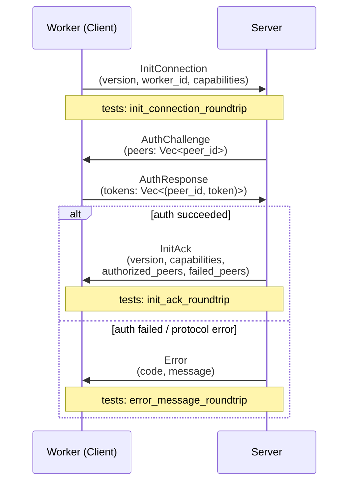
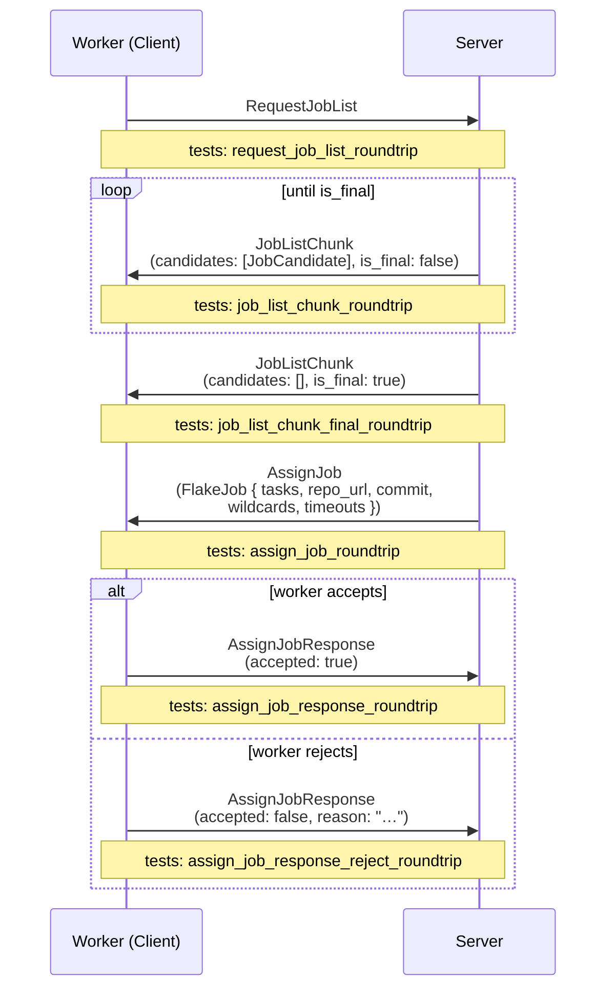
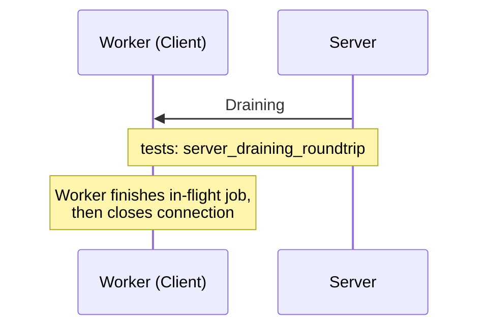
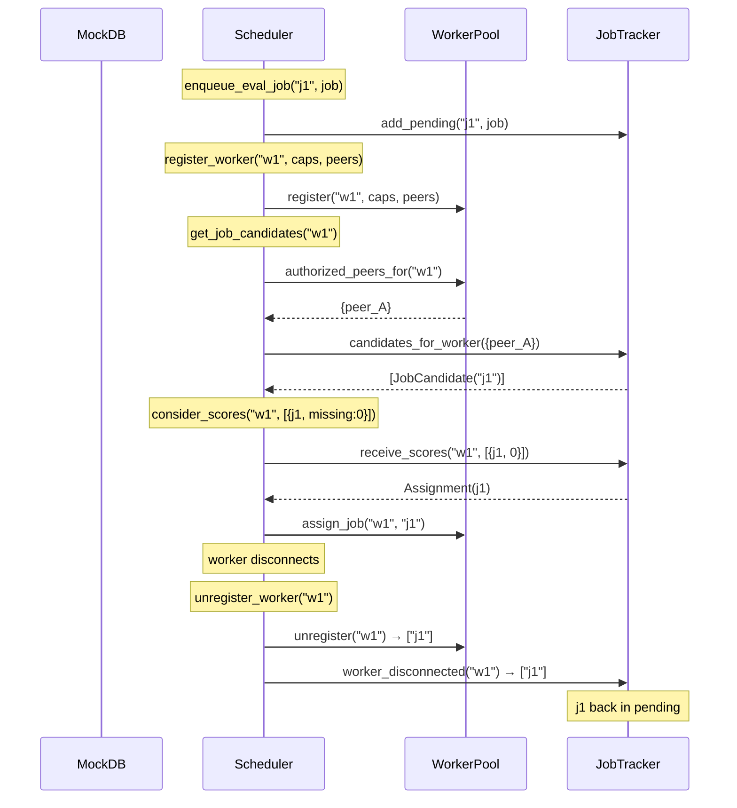

# Tests

This page documents all unit and integration tests in the Rust backend workspace
(**205 tests** across **7 crates**). Run them with:

```sh
cargo test --workspace --tests
# core doctests require a separate invocation (package name shadows stdlib `core`):
cargo test -p core --tests
```

Tests are grouped by the module under test.

## Architecture overview

The test infrastructure is built around a set of trait abstractions and fakes
that replace production dependencies (nix-daemon, filesystem, WebSocket) with
in-memory implementations. The diagram below shows how production and test code
relate:

```
                        ┌─────────────────────────────────────────┐
                        │              proto crate                │
                        │                                         │
                        │  traits.rs                              │
                        │  ┌───────────────────────────────────┐  │
                        │  │  WorkerStore    (has_path)        │  │
                        │  │  DrvReader      (read_drv)        │  │
                        │  │  JobReporter    (report_*)        │  │
                        │  └───────────────────────────────────┘  │
                        │                                         │
                        │  scheduler/                             │
                        │  ┌──────────┐  ┌───────────────┐       │
                        │  │JobTracker│  │  WorkerPool   │       │
                        │  │(pending/ │  │(connected     │       │
                        │  │ active)  │  │ workers)      │       │
                        │  └──────────┘  └───────────────┘       │
                        │         └──────┬──────┘                │
                        │                v                       │
                        │         ┌────────────┐                 │
                        │         │ Scheduler  │                 │
                        │         └────────────┘                 │
                        └─────────────────────────────────────────┘
                                         |
              ┌──────────────────────────┼───────────────────────────┐
              v                          v                           v
   ┌─────────────────────┐   ┌─────────────────────┐   ┌─────────────────────┐
   │    worker crate     │   │  test-support crate  │   │     core crate      │
   │                     │   │                      │   │                     │
   │  LocalNixStore      │   │  FakeWorkerStore     │   │  DerivationResolver │
   │    impl WorkerStore │   │    impl WorkerStore  │   │  (trait)            │
   │                     │   │                      │   │                     │
   │  FsDrvReader        │   │  FakeDrvReader       │   │  parse_drv()        │
   │    impl DrvReader   │   │    impl DrvReader    │   │                     │
   │                     │   │                      │   │                     │
   │  JobUpdater         │   │  RecordingJobReporter│   │  FakeDerivation-    │
   │    impl JobReporter │   │    impl JobReporter  │   │    Resolver         │
   │                     │   │                      │   │                     │
   │  evaluate_          │   │  StoreFixture        │   │  FakeNixStore-      │
   │    derivations_with │   │    (951 real .drv)    │   │    Provider         │
   └─────────────────────┘   └──────────────────────┘   └─────────────────────┘
```

## Test fakes & fixtures

All test fakes live in `backend/test-support/src/fakes/`. Each fake implements
a production trait and substitutes the real dependency with an in-memory version.

| Fake | File | Trait | Purpose |
|------|------|-------|---------|
| `FakeNixStoreProvider` | `nix_store.rs` | `NixStoreProvider`, `WorkerStore` | In-memory store with present/missing paths, pathinfo, GC roots |
| `FakeDerivationResolver` | `derivation_resolver.rs` | `DerivationResolver` | Scripted attr listing, drv path resolution, derivation data |
| `FakeWorkerStore` | `worker_store.rs` | `WorkerStore` | Minimal path-presence tracker |
| `FakeDrvReader` | `drv_reader.rs` | `DrvReader` | Serves raw `.drv` bytes from memory (backed by `StoreFixture.raw_drvs`) |
| `RecordingJobReporter` | `job_reporter.rs` | `JobReporter` | Captures all job status calls as `Vec<ReportedEvent>` |
| `RecordingWebhookClient` | `webhooks.rs` | `WebhookClient` | Records webhook deliveries with scripted status codes |
| `InMemoryEmailSender` | `email.rs` | `EmailSender` | Captures verification/password-reset emails |
| `RecordingCiReporter` | `ci_reporter.rs` | `CiReporter` | Records CI status report calls |
| `FakeBuildExecutor` | `build_executor.rs` | `BuildExecutor` | Scripted build success/failure/error |
| `FakeFlakePrefetcher` | `flake_prefetcher.rs` | `FlakePrefetcher` | Records prefetch calls, returns `None` |
| `NoopLogStorage` | `log_storage.rs` | `LogStorage` | No-op append/read/delete |

### `StoreFixture` — real derivation trees

`StoreFixture` (`test-support/src/fakes/store_fixture.rs`) loads **real** Nix
`.drv` files from the `test/` directory (951 derivations for `hello-2.12.3`).
It performs a BFS from the entry-point derivation through `inputDrvs` to build
the full closure and populates fakes.

```
  test/
  ├── output          # single line: /nix/store/<hash>-hello-2.12.3.drv
  └── store/          # 951 real ATerm .drv files
      ├── 7mdg60dr...-hello-2.12.3.drv   (entry point)
      ├── abc123...-glibc-2.40.drv
      └── ...
```

```
         load_store("test/")
               │
               v
  ┌────────────────────────┐
  │     StoreFixture       │
  ├────────────────────────┤
  │ entry_point: String    │  ← "/nix/store/7mdg...-hello-2.12.3.drv"
  │ derivations: Vec<...>  │  ← 951 DiscoveredDerivation structs
  │ tree: HashMap<...>     │  ← drv_path → [dependency drv_paths]
  │ parsed: HashMap<...>   │  ← drv_path → Derivation (parsed ATerm)
  │ raw_drvs: HashMap<...> │  ← drv_path → raw bytes (for FakeDrvReader)
  │ resolver: FakeDerivationResolver │
  │ store: FakeNixStoreProvider      │
  └────────────────────────┘
               │
               v
  mark_all_built()  →  remove_random_subtrees(0.5, seed)
               │
               v
  ┌─────────────────────────────────────────┐
  │ Partial store: some outputs present,    │
  │ some missing. ready_to_build() returns  │
  │ derivations whose deps are all built    │
  │ but which aren't built themselves.      │
  └─────────────────────────────────────────┘
```

Key methods:

| Method | What it does |
|--------|-------------|
| `mark_built(drv_path)` | Mark all outputs of one derivation as present |
| `mark_subtree_built(drv_path)` | Mark a derivation and all transitive deps as built |
| `mark_all_built()` | Mark everything as built |
| `remove_random_subtrees(fraction, seed)` | Unbuild a fraction of derivations (deterministic LCG) |
| `built()` / `unbuilt()` | Query which derivations are/aren't built |
| `ready_to_build()` | Derivations whose deps are all built but that aren't built themselves |

---

## `proto` — Wire Message Serialization

**File:** `backend/proto/src/tests.rs`
**Run:** `cargo test -p proto`

All tests in this module verify the rkyv serialization round-trip: a message is serialized to bytes and deserialized back, then compared with `assert_eq!`.

The proto protocol runs over a persistent WebSocket (`/proto`) with rkyv binary framing. The three sub-flows below show which messages each test exercises.

### Handshake & Auth Sequence



### Job Dispatch Sequence



### Drain & Shutdown Sequence



### Test Table

| Test | Flow | What it checks |
|------|------|---------------|
| `init_connection_roundtrip` | Handshake | `ClientMessage::InitConnection` with version, capabilities, and worker ID survives a rkyv round-trip |
| `init_ack_roundtrip` | Handshake | `ServerMessage::InitAck` with version, capabilities, authorized peers, and failed peers survives a rkyv round-trip |
| `error_message_roundtrip` | Handshake | `ServerMessage::Error` with numeric code and string message survives a rkyv round-trip |
| `request_job_list_roundtrip` | Job Dispatch | Unit-variant `ClientMessage::RequestJobList` survives a rkyv round-trip |
| `job_list_chunk_roundtrip` | Job Dispatch | `ServerMessage::JobListChunk` with one `JobCandidate` (including `required_paths`) and `is_final: false` survives a rkyv round-trip |
| `job_list_chunk_final_roundtrip` | Job Dispatch | Empty `JobListChunk` with `is_final: true` survives a rkyv round-trip |
| `assign_job_response_roundtrip` | Job Dispatch | `ClientMessage::AssignJobResponse` with `accepted: true` and no reason survives a rkyv round-trip |
| `assign_job_response_reject_roundtrip` | Job Dispatch | `AssignJobResponse` with `accepted: false` and a rejection reason string survives a rkyv round-trip |
| `server_draining_roundtrip` | Drain | Unit-variant `ServerMessage::Draining` survives a rkyv round-trip |
| `assign_job_roundtrip` | Job Dispatch | `ServerMessage::AssignJob` with a `FlakeJob` (two tasks, repository URL, commit, wildcards, per-task and per-job timeouts) survives a rkyv round-trip |
| `proto_version_is_nonzero` | -- | Sanity check: `PROTO_VERSION >= 1` |

---

## `proto::scheduler::jobs` — Job Tracker

**File:** `backend/proto/src/scheduler/jobs.rs`
**Run:** `cargo test -p proto`

`JobTracker` is a dual-queue (pending + active) that tracks jobs through their
lifecycle. Tests exercise the state machine directly without any async runtime.

### Job lifecycle state machine

```
                     add_pending()
                          │
                          v
                    ┌──────────┐
                    │ PENDING  │◄────────────────────┐
                    └────┬─────┘                     │
                         │                           │
          receive_scores(missing: 0)          release_to_pending()
          or take_empty_required()            or worker_disconnected()
                         │                           │
                         v                           │
                    ┌──────────┐                     │
                    │  ACTIVE  │─────────────────────┘
                    └────┬─────┘
                         │
                   remove_active()
                         │
                         v
                      (done)
```

### Peer-based filtering

```
  ┌─────────────────────────────────────────────────┐
  │               JobTracker                        │
  │                                                 │
  │  Pending:                                       │
  │    "ja" → PendingEvalJob { peer_id: peer_A }    │
  │    "jb" → PendingEvalJob { peer_id: peer_B }    │
  │                                                 │
  │  candidates_for_worker(authorized={peer_A})     │
  │    → returns only "ja"                          │
  │                                                 │
  │  candidates_for_worker(None)                    │
  │    → returns both "ja" and "jb" (open mode)     │
  └─────────────────────────────────────────────────┘
```

| Test | What it checks |
|------|---------------|
| `test_add_pending_and_candidates` | Add 3 jobs, `candidates_for_worker(None)` returns all 3 |
| `test_candidates_filtered_by_peer` | Jobs for peer A/B; worker authorized for A only sees A's job |
| `test_receive_scores_assigns_zero_missing` | Score with `missing: 0` assigns the job (pending -> active) |
| `test_receive_scores_no_assign_nonzero` | Score with `missing: 5` does not assign (stays pending) |
| `test_release_to_pending_after_rejection` | Assign then release: job reappears in pending candidates |
| `test_worker_disconnected_requeues` | Assign 2 jobs to "w1", disconnect: both return to pending |
| `test_take_empty_required` | Job with empty `required_paths` is taken; job with paths is not |
| `test_contains_job_both_maps` | `contains_job()` finds a job in both pending and active states |

---

## `proto::scheduler::worker_pool` — Worker Registry

**File:** `backend/proto/src/scheduler/worker_pool.rs`
**Run:** `cargo test -p proto`

`WorkerPool` is an in-memory registry of connected workers with capabilities,
authorized peers, and assigned-job tracking.

### Worker lifecycle

```
  register()                           unregister()
      │                                     │
      v                                     v
  ┌──────────┐  update_capabilities()  ┌──────────┐
  │CONNECTED │───────────────────────► │CONNECTED │──► returns assigned
  │(default  │  update_authorized()    │(updated) │    job IDs
  │ caps)    │                         └──────────┘
  └──────────┘
       │
       │ mark_draining()
       v
  ┌──────────┐
  │ DRAINING │  (still connected, finishes in-flight jobs)
  └──────────┘
```

| Test | What it checks |
|------|---------------|
| `test_register_and_is_connected` | Register "w1": `is_connected` true, count is 1 |
| `test_unregister_returns_assigned_jobs` | Assign 2 jobs, unregister: returns both job IDs, count drops to 0 |
| `test_unregister_unknown_returns_empty` | Unregistering unknown worker returns empty vec |
| `test_update_capabilities` | Set architectures/features/max_builds, verify via `all_workers()` |
| `test_mark_draining` | Draining flag is reflected in `all_workers()` output |
| `test_authorized_peers_for` | Registered peers are accessible; unknown worker returns `None` |
| `test_update_authorized_peers` | Adding a peer via reauth expands the authorized set |
| `test_assign_and_release_job` | Assign increments count, release decrements it |
| `test_all_workers_info` | Multiple workers with different states are all reported correctly |

---

## `proto::scheduler` — Scheduler Coordination

**File:** `backend/proto/src/scheduler/scheduler_tests.rs`
**Run:** `cargo test -p proto`

Integration tests for the `Scheduler` struct, which coordinates `WorkerPool`
and `JobTracker` behind `RwLock`s. Uses a mock database (no real Postgres).

### Job flow through the scheduler



| Test | What it checks |
|------|---------------|
| `test_enqueue_and_get_candidates` | Enqueue 2 jobs, open-mode worker sees both |
| `test_candidates_filtered_by_authorized_peers` | Worker authorized for peer_A sees only peer_A's jobs |
| `test_score_assignment_flow` | Score `missing: 0` assigns the job, pending count drops to 0 |
| `test_job_rejected_requeues` | Assign then reject: job returns to pending |
| `test_worker_disconnect_requeues_jobs` | Disconnect requeues all assigned jobs; new worker can see them |
| `test_update_authorized_peers_expands_access` | Reauth adds peer_B: worker now sees both peers' jobs |
| `test_draining_worker_still_has_assigned_jobs` | Draining worker retains its assigned job count |

---

## `test_support::fakes::store_fixture` — Store Fixture

**File:** `backend/test-support/src/fakes/store_fixture.rs`
**Run:** `cargo test -p test-support`

Tests for the `StoreFixture` itself, validating that real `.drv` files from
`test/` are loaded, parsed, and traversed correctly (951 derivations).

### Build-wave convergence

```
  Wave 0 (nothing built):
    ready_to_build() → leaf nodes only (no dependencies)
       mark_built(leaves)

  Wave 1:
    ready_to_build() → nodes whose deps are all leaves
       mark_built(wave 1)

  Wave 2:
    ready_to_build() → next frontier
       ...

  Wave N:
    ready_to_build() → [] (everything built)
       assert: built().len() == total derivations
```

| Test | What it checks |
|------|---------------|
| `load_store_parses_all_derivations` | Entry point is the hello drv; derivations list is non-empty and contains it |
| `tree_has_entry_for_every_derivation` | Every `DiscoveredDerivation` has a corresponding entry in the adjacency tree |
| `initially_nothing_is_built` | Fresh fixture: `built()` empty, `unbuilt()` == total |
| `mark_all_built_then_everything_is_built` | After `mark_all_built()`: `built()` == total, `ready_to_build()` empty |
| `leaf_nodes_are_ready_to_build` | In a fresh fixture, all ready nodes have zero dependencies |
| `mark_subtree_built_includes_transitive_deps` | Building the entry point's subtree marks the full closure as built |
| `remove_random_subtrees_creates_partial_store` | After `mark_all_built()` + `remove_random_subtrees(0.5, 42)`: some built, some not |
| `ready_to_build_respects_dependencies` | After building leaves: ready nodes have all deps built but aren't built themselves |
| `ready_to_build_converges` | Iteratively building `ready_to_build()` waves terminates with everything built |
| `remove_random_subtrees_is_deterministic` | Same seed produces identical built/unbuilt sets |
| `single_leaf_unbuilt` | Mark all built, unbuild one leaf: it appears in `ready_to_build()` |

---

## `worker::executor::eval` — Evaluation Closure Walk

**File:** `backend/worker/src/executor/eval.rs`
**Run:** `cargo test -p worker`

Tests for `evaluate_derivations_with()`, which performs a BFS closure walk
from entry-point `.drv` files through `inputDrvs` to discover all derivations
and check their substitution status. Tests use `FakeDerivationResolver`,
`FakeDrvReader`, `FakeWorkerStore`, and `RecordingJobReporter` — no real
nix-daemon, filesystem, or WebSocket connection.

### Evaluation data flow (test configuration)

```
  FakeDerivationResolver                FakeDrvReader
  ┌───────────────────────┐            ┌──────────────────┐
  │ list_flake_derivations│            │ from_raw_drvs(   │
  │   "repo" → ["hello"] │            │   fixture.raw_drvs│
  │                       │            │ )                 │
  │ resolve_derivation_   │            │                   │
  │   paths               │            │ read_drv(path)    │
  │   "hello" → entry.drv │            │   → raw bytes     │
  └───────────┬───────────┘            └────────┬─────────┘
              │                                 │
              v                                 v
  ┌──────────────────────────────────────────────────────┐
  │          evaluate_derivations_with()                 │
  │                                                      │
  │  1. list attrs via resolver                          │
  │  2. resolve attrs → drv paths via resolver           │
  │  3. BFS: read .drv → parse → extract outputs/deps   │
  │  4. Check has_path() for substitution                │
  │  5. Report EvalResult via reporter                   │
  └──────────┬───────────────────────────────┬───────────┘
             │                               │
             v                               v
  FakeWorkerStore                  RecordingJobReporter
  ┌──────────────────┐             ┌──────────────────────┐
  │ has_path()       │             │ events:              │
  │   → present set  │             │   EvaluatingDervs    │
  │   (from fixture) │             │   EvalResult {       │
  └──────────────────┘             │     derivations,     │
                                   │     warnings         │
                                   │   }                  │
                                   └──────────────────────┘
```

| Test | What it checks |
|------|---------------|
| `test_eval_closure_walk_empty_store` | Full 951-drv fixture, empty store: all discovered, none substituted, entry point has attr, no warnings |
| `test_eval_partial_substitution` | 50% random built: substituted flags exactly match fixture `is_built()` for every derivation |
| `test_eval_all_substituted` | All built: every derivation is `substituted: true` |
| `test_eval_empty_attrs` | No attrs from resolver: empty `EvalResult`, no errors |
| `test_eval_missing_drv_warns` | Resolver points to a non-existent `.drv`: warning emitted, no panic |
| `test_eval_dependencies_match_fixture` | Dependency lists in `EvalResult` exactly match the fixture's adjacency tree |

---

## `core::types::wildcard` — Evaluation Wildcard Parsing

**File:** `backend/core/src/types/wildcard.rs`  
**Run:** `cargo test -p core --tests`

Tests for the `Wildcard` type used in project evaluation patterns. Parsing is via `FromStr`; the inverse is `Display`. `get_eval_str()` produces the Nix attribute-set expression passed to the evaluator.

### Valid patterns

| Test | Input | What it checks |
|------|-------|---------------|
| `star_in_path_valid` | `packages.*.*` | Parses to a single pattern; `.patterns()` returns `["packages.*.*"]` |
| `multiple_patterns` | `packages.*.*,checks.*.*` | Parses to two patterns; round-trips to the original string |
| `trims_spaces_between_patterns` | `packages.*.*, checks.*.*` | Space after comma is trimmed; `to_string()` omits it |
| `quoted_segment_with_dot_valid` | `my."wild.card".is.*` | Quoted segments containing `.` are accepted and preserved verbatim |
| `quoted_segment_python_style_valid` | `packages.*."python3.12"` | Package names with dots (e.g. Python versions) accepted |
| `exclusion_pattern_valid` | `packages.*.*,!packages.x86_64-linux.broken` | `!`-prefixed patterns are parsed as exclusions |
| `exclusion_with_quoted_segment_valid` | `packages.*.*,!packages.x86_64-linux."broken.pkg"` | Quoted segments in exclusion paths are accepted |
| `roundtrip` | `packages.*.*,!packages.x86_64-linux.broken,my."wild.card".*` | Complex multi-pattern string round-trips exactly |

### Exclusion restrictions

| Test | Input | What it checks |
|------|-------|---------------|
| `exclusion_with_wildcard_rejected` | `my.*,!my.ignored.*` | `*` in an exclusion body is rejected |
| `exclusion_with_hash_rejected` | `packages.*.*,!packages.x86_64-linux.#` | `#` in an exclusion body is rejected |

### `get_eval_str()` — Nix expression output

| Test | Input | Expected output |
|------|-------|----------------|
| `eval_str_include_only` | `packages.*.*` | `{ "include" = [ [ "packages" "*" ] ]; "exclude" = [  ]; }` |
| `eval_str_bare_star` | `*` | `{ "include" = [ [ "*" ] ]; "exclude" = [  ]; }` |
| `eval_str_include_and_exclude` | `packages.*.*,!packages.x86_64-linux.broken` | Include list has one entry; exclude list has the three-segment path |
| `eval_str_quoted_segment_unwrapped` | `my."wild.card".*` | Quotes are stripped; `wild.card` appears as a plain segment in the list |
| `eval_str_multiple_includes` | `packages.*.*.*,checks.*` | Two entries in include list; consecutive `*` segments are collapsed to one |

### Bare special characters

| Test | Input | What it checks |
|------|-------|---------------|
| `bare_star_valid` | `*` | A lone `*` is accepted (means "evaluate everything") |
| `bare_hash_rejected` | `#` | A lone `#` with no preceding path is rejected |
| `bare_exclamation_rejected` | `!` | A lone `!` with no body is rejected |
| `mid_path_exclamation_rejected` | `my.!ignored`, `my.!*` | `!` inside a path segment (not as whole-pattern prefix) is rejected |

### Quoted special characters

| Test | Input | What it checks |
|------|-------|---------------|
| `quoted_star_segment_rejected` | `my."*".not.allowed.*` | `"*"` as a quoted segment is rejected (wildcards must be unquoted) |
| `quoted_hash_segment_rejected` | `my."#".something` | `"#"` as a quoted segment is rejected |
| `quoted_exclamation_segment_rejected` | `my."!".something` | `"!"` as a quoted segment is rejected |
| `quoted_star_in_exclusion_rejected` | `packages.*.*,!my."*".foo` | `"*"` in an exclusion path is rejected |

### Invalid patterns

| Test | Input | What it checks |
|------|-------|---------------|
| `empty_rejected` | `""` | Empty string is rejected |
| `double_comma_rejected` | `packages.*.*,,checks.*.*` | Consecutive commas (empty pattern between them) is rejected |
| `leading_space_rejected` | `" packages.*.*"` | Leading whitespace in a pattern is rejected |
| `internal_whitespace_rejected` | `"packages .*.* "` | Whitespace inside a segment is rejected |
| `starts_with_period_rejected` | `.packages.*.*` | Pattern starting with `.` is rejected |
| `exclusion_bare_body_rejected` | `packages.*.*,!` | `!` with no following path is rejected |
| `exclusion_starts_with_period_rejected` | `packages.*.*,!.packages` | Exclusion body starting with `.` is rejected |

---

## `core::nix::url` — Repository & Flake URL Parsing

**File:** `backend/core/src/nix/url.rs`  
**Run:** `cargo test -p core --tests`

Tests for `RepositoryUrl` (stored in the database, used for display and git operations) and `NixFlakeUrl` (passed to `nix flake` commands, always includes `?rev=`).

### `RepositoryUrl` — normalization

`RepositoryUrl::from_str` normalizes certain schemes for Nix compatibility. All others are preserved or rejected.

| Test | Input | Expected output / behaviour |
|------|-------|----------------------------|
| `repo_url_https_normalized` | `https://github.com/foo/bar.git` | Prepended to `git+https://github.com/foo/bar.git` |
| `repo_url_http_normalized` | `http://example.com/repo.git` | Prepended to `git+http://example.com/repo.git` |
| `repo_url_ssh_protocol_normalized` | `ssh://git@github.com/foo/bar.git` | Prepended to `git+ssh://git@github.com/foo/bar.git` |
| `repo_url_scp_passthrough` | `git@github.com:foo/bar.git` | SCP-style URLs are left unchanged |
| `repo_url_git_protocol_passthrough` | `git://server.example.com/repo.git` | `git://` URLs are left unchanged |
| `repo_url_empty_rejected` | `""` | Parse error |
| `repo_url_file_rejected` | `file:///local/repo` | `file://` URLs are rejected |
| `repo_url_plain_string_rejected` | `notaurl` | Strings with no recognized scheme are rejected |

### `NixFlakeUrl` — flake reference construction

`NixFlakeUrl::new(url, rev)` constructs a `?rev=<sha1>` flake URL. The revision must be a full 40-character SHA-1.

| Test | Input | Expected output / behaviour |
|------|-------|----------------------------|
| `nix_url_ssh_scp_style` | `git@github.com:Wavelens/Gradient.git` + 40-char rev | `url()` returns the raw SCP string; `to_string()` appends `?rev=…` |
| `nix_url_https_gets_git_plus_prefix` | `https://github.com/Wavelens/Gradient.git` + rev | `url()` returns `git+https://…`; `to_string()` appends `?rev=…` |
| `nix_url_short_hash_rejected` | any URL + `"abc123"` (6 chars) | Short revision strings are rejected |
| `nix_url_file_rejected` | `file:///local/repo` + rev | `file://` URLs are rejected even with a valid rev |
| `nix_url_rev_accessor` | SCP URL + rev | `.rev()` accessor returns the original revision string |
| `with_rev_roundtrip` | `https://github.com/foo/bar.git` (as `RepositoryUrl`) + rev | `RepositoryUrl::with_rev()` produces a `NixFlakeUrl` with normalized `git+https://` prefix and `?rev=` suffix |

---

## `core::db::derivation` — `.drv` File Parsing

**File:** `backend/core/src/db/derivation.rs`  
**Run:** `cargo test -p core --tests`

Tests for `parse_drv`, which parses the textual `Derive(…)` format produced by `nix derivation show`. The fixture derivation used by these tests is:

```
Derive(
  [("out","/nix/store/abc-hello","","")],
  [("/nix/store/xyz.drv",["out"])],
  ["/nix/store/src"],
  "x86_64-linux",
  "/nix/store/bash",
  ["-e","/nix/store/builder.sh"],
  [("name","hello"),("requiredSystemFeatures","kvm big-parallel"),("system","x86_64-linux")]
)
```

| Test | What it checks |
|------|---------------|
| `test_parse_full` | All fields are parsed: one output `("out", "/nix/store/abc-hello")`, one input derivation with its output names, one input source, `system = "x86_64-linux"`, `builder = "/nix/store/bash"`, two args `["-e", "/nix/store/builder.sh"]`, and `environment["name"] = "hello"` |
| `test_required_system_features` | `required_system_features()` splits the space-separated `requiredSystemFeatures` env var into `["kvm", "big-parallel"]` |
| `test_no_features` | A derivation with no `requiredSystemFeatures` env entry returns an empty vec from `required_system_features()` |

---

## `web::endpoints::badges` — CI Badge Rendering

**File:** `backend/web/src/endpoints/badges.rs`  
**Run:** `cargo test -p web`

Tests for the SVG badge renderer used by `GET /projects/{org}/{project}/badge`.

| Test | What it checks |
|------|---------------|
| `text_width_non_zero` | `text_width_px` returns a value `> 0` for any label; wider text ("passing") is wider than shorter text ("ok") |
| `badge_svg_contains_label_and_message` | `render_badge("build", "passing", "#4c1", Flat)` produces an SVG string containing the label, message, color, and the `svg` tag |
| `flat_square_has_no_gradient` | `BadgeStyle::Flat` SVG contains a `linearGradient` element; `BadgeStyle::FlatSquare` SVG does not |
| `badge_for_none_is_unknown` | `badge_for_status(None, _)` → `message = "unknown"` (no evaluation yet) |
| `completed_with_failures_is_partial` | `badge_for_status(Some(Completed), has_failures: true)` → `message = "partial"` |
| `completed_no_failures_is_passing` | `badge_for_status(Some(Completed), has_failures: false)` → `message = "passing"` |

---

## `core` — Input Validation

**File:** `backend/core/tests/input.rs`
**Run:** `cargo test -p core --tests`

Tests for input validation functions used by API endpoints. Each function
validates user-supplied values and returns a descriptive error on rejection.

### Hex encoding

| Test | What it checks |
|------|---------------|
| `hex_roundtrip` | `vec_to_hex(hex_to_vec(hex))` round-trips correctly |
| `hex_to_vec_decodes_correctly` | `"48656c6c6f"` decodes to `b"Hello"` |
| `hex_to_vec_odd_length_rejected` | Odd-length hex strings are rejected |
| `hex_to_vec_non_hex_char_rejected` | Non-hex characters (`"zz"`) are rejected |

### Numeric validation

| Test | What it checks |
|------|---------------|
| `greater_than_zero_valid` | `"5"` passes |
| `greater_than_zero_zero_rejected` | `"0"` fails |
| `greater_than_zero_negative_rejected` | `"-1"` fails |
| `greater_than_zero_non_numeric_rejected` | `"abc"` fails |

### Port validation

| Test | What it checks |
|------|---------------|
| `port_in_range_valid` | Port 8080 passes |
| `port_in_range_zero_rejected` | Port 0 fails |
| `port_in_range_too_large_rejected` | Port 70000 fails |

### URL / address parsing

| Test | What it checks |
|------|---------------|
| `url_to_addr_ipv4` | `"http://127.0.0.1:3000"` parses to `127.0.0.1:3000` |
| `url_to_addr_ipv6` | `"http://[::1]:3000"` parses correctly |
| `url_to_addr_localhost_resolves_to_loopback` | `"http://localhost:3000"` resolves to `127.0.0.1:3000` |
| `url_to_addr_port_zero_is_rejected` | Port 0 in URL is rejected |
| `url_to_addr_negative_port_is_rejected` | Negative port is rejected |
| `url_to_addr_port_above_max_is_rejected` | Port >65535 is rejected |
| `ssh_url_detection` | `is_ssh_url()` returns true for SCP/SSH schemes, false for HTTPS |
| `https_is_not_ssh` | `is_ssh_url("https://...")` returns false |

### Repository URL normalization

| Test | What it checks |
|------|---------------|
| `repository_url_https_gets_git_plus_prefix` | HTTPS URLs get `git+` prefix |
| `repository_url_git_protocol_passthrough` | `git://` URLs are left unchanged |
| `repository_url_ssh_scp_style` | SCP-style URLs are left unchanged |

### Index name validation

| Test | What it checks |
|------|---------------|
| `index_name_valid` | `"my-index"` passes |
| `index_name_empty_rejected` | Empty string rejected |
| `index_name_space_rejected` | Spaces rejected |
| `index_name_trailing_dash_rejected` | Trailing dash rejected |
| `index_name_underscore_rejected` | Underscores rejected |
| `index_name_uppercase_rejected` | Uppercase rejected |

### Password policy

| Test | What it checks |
|------|---------------|
| `password_valid` | `"MyP@ss1234"` passes all rules |
| `password_too_short_rejected` | Under 8 chars rejected |
| `password_too_long_rejected` | Over 128 chars rejected |
| `password_exactly_128_chars_is_valid` | Exactly 128 chars passes |
| `password_missing_uppercase_rejected` | Must have uppercase |
| `password_missing_lowercase_rejected` | Must have lowercase |
| `password_missing_digit_rejected` | Must have digit |
| `password_missing_special_char_rejected` | Must have special character |
| `password_repeated_chars_rejected` | Three repeated chars rejected |
| `password_sequential_chars_rejected` | Three sequential chars (`abc`) rejected |
| `password_non_sequential_alternating_is_valid` | Alternating chars (`aba`) passes |
| `password_containing_word_password_rejected` | Literal "password" rejected |

### Wildcard validation (integration layer)

| Test | What it checks |
|------|---------------|
| `wildcard_star_is_valid` | `"*"` passes |
| `wildcard_empty_rejected` | `""` fails |
| `wildcard_double_comma_rejected` | `"a,,b"` fails |
| `wildcard_leading_space_rejected` | `" a"` fails |
| `wildcard_multiple_patterns` | `"packages.*.*,checks.*.*"` passes |
| `wildcard_trims_spaces_between_patterns` | `"a.*, b.*"` trims and passes |

---

## `core` — Source Utilities

**File:** `backend/core/tests/sources.rs`
**Run:** `cargo test -p core --tests`

| Test | What it checks |
|------|---------------|
| `generate_ssh_key_produces_valid_ed25519_keypair` | Generated keypair is valid Ed25519 |
| `generate_ssh_key_different_secrets_produce_different_keys` | Different secrets produce different keys |
| `nar_location_shards_by_first_two_hex_chars` | NAR path uses `<hash[0..2]>/<hash>.nar` sharding |
| `nar_compressed_location_has_zst_extension` | Compressed NAR path ends in `.nar.zst` |

---

## Test count summary

| Crate | Runner | Count |
|-------|--------|-------|
| `core` | inline unit tests | 47 |
| `core` | `tests/mod.rs` (input + sources) | 50 |
| `core` | `tests/sources.rs` | 4 |
| `proto` | inline unit tests | 35 |
| `test-support` | inline unit tests | 11 |
| `web` | inline unit tests | 6 |
| `worker` | inline unit tests | 6 |
| **Total** | | **205** |

(The `tests/mod.rs` tests are the same as `tests/input.rs` + `tests/sources.rs`
re-exported; cargo runs them through separate test binaries.)

---

## Integration Tests

The NixOS VM integration tests live in `nix/tests/gradient/` and are documented in [Contributing](contributing.md#integration-tests). They test the full server + worker stack end-to-end, including the proto handshake, job dispatch, cache serving, and declarative state management.
