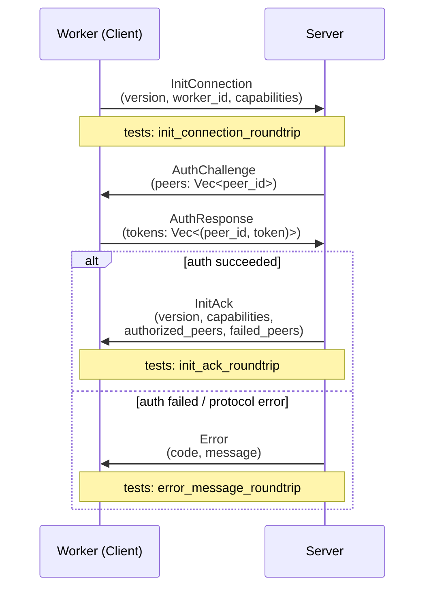
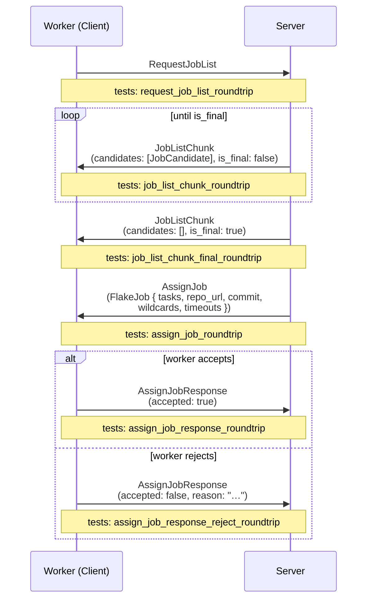
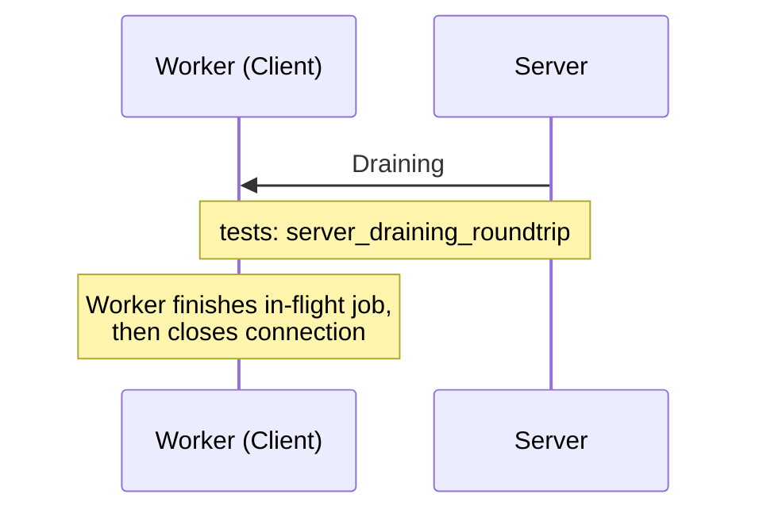

# Unit Tests

This page documents all unit tests in the Rust backend. Run them with:

```sh
cargo test --workspace --tests
# core doctests require a separate invocation (package name shadows stdlib `core`):
cargo test -p core --tests
```

Tests are grouped by the module under test.

---

## `proto` — Wire Message Serialization

**File:** `backend/proto/src/tests.rs`  
**Run:** `cargo test -p proto`

All tests in this module verify the rkyv serialization round-trip: a message is serialized to bytes and deserialized back, then compared with `assert_eq!`.

The proto protocol runs over a persistent WebSocket (`/proto`) with rkyv binary framing. The three sub-flows below show which messages each test exercises.

### Handshake & Auth Sequence



### Job Dispatch Sequence



### Drain & Shutdown Sequence



### Test Table

| Test | Flow | What it checks |
|------|------|---------------|
| `init_connection_roundtrip` | Handshake | `ClientMessage::InitConnection` with version, default capabilities, string ID, and an optional token survives a rkyv round-trip |
| `init_ack_roundtrip` | Handshake | `ServerMessage::InitAck` with version and default capabilities survives a rkyv round-trip |
| `error_message_roundtrip` | Handshake | `ServerMessage::Error` with numeric code and string message survives a rkyv round-trip |
| `request_job_list_roundtrip` | Job Dispatch | Unit-variant `ClientMessage::RequestJobList` survives a rkyv round-trip |
| `job_list_chunk_roundtrip` | Job Dispatch | `ServerMessage::JobListChunk` with one `JobCandidate` (including `required_paths`) and `is_final: false` survives a rkyv round-trip |
| `job_list_chunk_final_roundtrip` | Job Dispatch | Empty `JobListChunk` with `is_final: true` survives a rkyv round-trip |
| `assign_job_response_roundtrip` | Job Dispatch | `ClientMessage::AssignJobResponse` with `accepted: true` and no reason survives a rkyv round-trip |
| `assign_job_response_reject_roundtrip` | Job Dispatch | `AssignJobResponse` with `accepted: false` and a rejection reason string survives a rkyv round-trip |
| `server_draining_roundtrip` | Drain | Unit-variant `ServerMessage::Draining` survives a rkyv round-trip |
| `assign_job_roundtrip` | Job Dispatch | `ServerMessage::AssignJob` with a `FlakeJob` (two tasks, repository URL, commit, wildcards, per-task and per-job timeouts) survives a rkyv round-trip |
| `proto_version_is_nonzero` | — | Sanity check: `PROTO_VERSION >= 1` |

---

## `core::types::wildcard` — Evaluation Wildcard Parsing

**File:** `backend/core/src/types/wildcard.rs`  
**Run:** `cargo test -p core --tests`

Tests for the `Wildcard` type used in project evaluation patterns. Parsing is via `FromStr`; the inverse is `Display`. `get_eval_str()` produces the Nix attribute-set expression passed to the evaluator.

### Valid patterns

| Test | Input | What it checks |
|------|-------|---------------|
| `star_in_path_valid` | `packages.*.*` | Parses to a single pattern; `.patterns()` returns `["packages.*.*"]` |
| `multiple_patterns` | `packages.*.*,checks.*.*` | Parses to two patterns; round-trips to the original string |
| `trims_spaces_between_patterns` | `packages.*.*, checks.*.*` | Space after comma is trimmed; `to_string()` omits it |
| `quoted_segment_with_dot_valid` | `my."wild.card".is.*` | Quoted segments containing `.` are accepted and preserved verbatim |
| `quoted_segment_python_style_valid` | `packages.*."python3.12"` | Package names with dots (e.g. Python versions) accepted |
| `exclusion_pattern_valid` | `packages.*.*,!packages.x86_64-linux.broken` | `!`-prefixed patterns are parsed as exclusions |
| `exclusion_with_quoted_segment_valid` | `packages.*.*,!packages.x86_64-linux."broken.pkg"` | Quoted segments in exclusion paths are accepted |
| `roundtrip` | `packages.*.*,!packages.x86_64-linux.broken,my."wild.card".*` | Complex multi-pattern string round-trips exactly |

### Exclusion restrictions

| Test | Input | What it checks |
|------|-------|---------------|
| `exclusion_with_wildcard_rejected` | `my.*,!my.ignored.*` | `*` in an exclusion body is rejected |
| `exclusion_with_hash_rejected` | `packages.*.*,!packages.x86_64-linux.#` | `#` in an exclusion body is rejected |

### `get_eval_str()` — Nix expression output

| Test | Input | Expected output |
|------|-------|----------------|
| `eval_str_include_only` | `packages.*.*` | `{ "include" = [ [ "packages" "*" ] ]; "exclude" = [  ]; }` |
| `eval_str_bare_star` | `*` | `{ "include" = [ [ "*" ] ]; "exclude" = [  ]; }` |
| `eval_str_include_and_exclude` | `packages.*.*,!packages.x86_64-linux.broken` | Include list has one entry; exclude list has the three-segment path |
| `eval_str_quoted_segment_unwrapped` | `my."wild.card".*` | Quotes are stripped; `wild.card` appears as a plain segment in the list |
| `eval_str_multiple_includes` | `packages.*.*.*,checks.*` | Two entries in include list; consecutive `*` segments are collapsed to one |

### Bare special characters

| Test | Input | What it checks |
|------|-------|---------------|
| `bare_star_valid` | `*` | A lone `*` is accepted (means "evaluate everything") |
| `bare_hash_rejected` | `#` | A lone `#` with no preceding path is rejected |
| `bare_exclamation_rejected` | `!` | A lone `!` with no body is rejected |
| `mid_path_exclamation_rejected` | `my.!ignored`, `my.!*` | `!` inside a path segment (not as whole-pattern prefix) is rejected |

### Quoted special characters

| Test | Input | What it checks |
|------|-------|---------------|
| `quoted_star_segment_rejected` | `my."*".not.allowed.*` | `"*"` as a quoted segment is rejected (wildcards must be unquoted) |
| `quoted_hash_segment_rejected` | `my."#".something` | `"#"` as a quoted segment is rejected |
| `quoted_exclamation_segment_rejected` | `my."!".something` | `"!"` as a quoted segment is rejected |
| `quoted_star_in_exclusion_rejected` | `packages.*.*,!my."*".foo` | `"*"` in an exclusion path is rejected |

### Invalid patterns

| Test | Input | What it checks |
|------|-------|---------------|
| `empty_rejected` | `""` | Empty string is rejected |
| `double_comma_rejected` | `packages.*.*,,checks.*.*` | Consecutive commas (empty pattern between them) is rejected |
| `leading_space_rejected` | `" packages.*.*"` | Leading whitespace in a pattern is rejected |
| `internal_whitespace_rejected` | `"packages .*.* "` | Whitespace inside a segment is rejected |
| `starts_with_period_rejected` | `.packages.*.*` | Pattern starting with `.` is rejected |
| `exclusion_bare_body_rejected` | `packages.*.*,!` | `!` with no following path is rejected |
| `exclusion_starts_with_period_rejected` | `packages.*.*,!.packages` | Exclusion body starting with `.` is rejected |

---

## `core::nix::url` — Repository & Flake URL Parsing

**File:** `backend/core/src/nix/url.rs`  
**Run:** `cargo test -p core --tests`

Tests for `RepositoryUrl` (stored in the database, used for display and git operations) and `NixFlakeUrl` (passed to `nix flake` commands, always includes `?rev=`).

### `RepositoryUrl` — normalization

`RepositoryUrl::from_str` normalizes certain schemes for Nix compatibility. All others are preserved or rejected.

| Test | Input | Expected output / behaviour |
|------|-------|----------------------------|
| `repo_url_https_normalized` | `https://github.com/foo/bar.git` | Prepended to `git+https://github.com/foo/bar.git` |
| `repo_url_http_normalized` | `http://example.com/repo.git` | Prepended to `git+http://example.com/repo.git` |
| `repo_url_ssh_protocol_normalized` | `ssh://git@github.com/foo/bar.git` | Prepended to `git+ssh://git@github.com/foo/bar.git` |
| `repo_url_scp_passthrough` | `git@github.com:foo/bar.git` | SCP-style URLs are left unchanged |
| `repo_url_git_protocol_passthrough` | `git://server.example.com/repo.git` | `git://` URLs are left unchanged |
| `repo_url_empty_rejected` | `""` | Parse error |
| `repo_url_file_rejected` | `file:///local/repo` | `file://` URLs are rejected |
| `repo_url_plain_string_rejected` | `notaurl` | Strings with no recognized scheme are rejected |

### `NixFlakeUrl` — flake reference construction

`NixFlakeUrl::new(url, rev)` constructs a `?rev=<sha1>` flake URL. The revision must be a full 40-character SHA-1.

| Test | Input | Expected output / behaviour |
|------|-------|----------------------------|
| `nix_url_ssh_scp_style` | `git@github.com:Wavelens/Gradient.git` + 40-char rev | `url()` returns the raw SCP string; `to_string()` appends `?rev=…` |
| `nix_url_https_gets_git_plus_prefix` | `https://github.com/Wavelens/Gradient.git` + rev | `url()` returns `git+https://…`; `to_string()` appends `?rev=…` |
| `nix_url_short_hash_rejected` | any URL + `"abc123"` (6 chars) | Short revision strings are rejected |
| `nix_url_file_rejected` | `file:///local/repo` + rev | `file://` URLs are rejected even with a valid rev |
| `nix_url_rev_accessor` | SCP URL + rev | `.rev()` accessor returns the original revision string |
| `with_rev_roundtrip` | `https://github.com/foo/bar.git` (as `RepositoryUrl`) + rev | `RepositoryUrl::with_rev()` produces a `NixFlakeUrl` with normalized `git+https://` prefix and `?rev=` suffix |

---

## `core::db::derivation` — `.drv` File Parsing

**File:** `backend/core/src/db/derivation.rs`  
**Run:** `cargo test -p core --tests`

Tests for `parse_drv`, which parses the textual `Derive(…)` format produced by `nix derivation show`. The fixture derivation used by these tests is:

```
Derive(
  [("out","/nix/store/abc-hello","","")],
  [("/nix/store/xyz.drv",["out"])],
  ["/nix/store/src"],
  "x86_64-linux",
  "/nix/store/bash",
  ["-e","/nix/store/builder.sh"],
  [("name","hello"),("requiredSystemFeatures","kvm big-parallel"),("system","x86_64-linux")]
)
```

| Test | What it checks |
|------|---------------|
| `test_parse_full` | All fields are parsed: one output `("out", "/nix/store/abc-hello")`, one input derivation with its output names, one input source, `system = "x86_64-linux"`, `builder = "/nix/store/bash"`, two args `["-e", "/nix/store/builder.sh"]`, and `environment["name"] = "hello"` |
| `test_required_system_features` | `required_system_features()` splits the space-separated `requiredSystemFeatures` env var into `["kvm", "big-parallel"]` |
| `test_no_features` | A derivation with no `requiredSystemFeatures` env entry returns an empty vec from `required_system_features()` |

---

## `web::endpoints::badges` — CI Badge Rendering

**File:** `backend/web/src/endpoints/badges.rs`  
**Run:** `cargo test -p web`

Tests for the SVG badge renderer used by `GET /projects/{org}/{project}/badge`.

| Test | What it checks |
|------|---------------|
| `text_width_non_zero` | `text_width_px` returns a value `> 0` for any label; wider text ("passing") is wider than shorter text ("ok") |
| `badge_svg_contains_label_and_message` | `render_badge("build", "passing", "#4c1", Flat)` produces an SVG string containing the label, message, color, and the `svg` tag |
| `flat_square_has_no_gradient` | `BadgeStyle::Flat` SVG contains a `linearGradient` element; `BadgeStyle::FlatSquare` SVG does not |
| `badge_for_none_is_unknown` | `badge_for_status(None, _)` → `message = "unknown"` (no evaluation yet) |
| `completed_with_failures_is_partial` | `badge_for_status(Some(Completed), has_failures: true)` → `message = "partial"` |
| `completed_no_failures_is_passing` | `badge_for_status(Some(Completed), has_failures: false)` → `message = "passing"` |

---

## Integration Tests

The NixOS VM integration tests live in `nix/tests/gradient/` and are documented in [Contributing](contributing.md#integration-tests). They test the full server + worker stack end-to-end, including the proto handshake, job dispatch, cache serving, and declarative state management.
