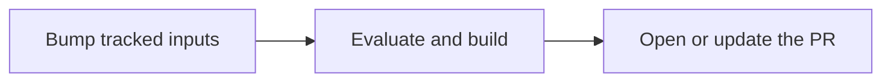

# Update Flake Inputs

Pull requests that bump `flake.lock`, opened only after the updated flake builds.

**Requirements:**

- A task connected to a forge with an outbound integration, see [Connect GitHub](forge-github.md), [Connect Gitea or Forgejo](forge-gitea.md) or [Connect GitLab](forge-gitlab.md)
- A **Polling** or **Time (cron)** trigger on the task, which sets how often updates run

## 1. Track the Inputs

=== "UI"

    On the task, **Settings -> Flake Inputs -> New Override**: the **Input Name** and **Force update using the URL declared in flake.nix**.

=== "Declarative"

    ```nix
    services.gradient.state.tasks.web-app.flake_input_overrides = {
      nixpkgs.keep_url = true;
      "home-manager*".keep_url = true; # (1)!
    };
    ```

    1.  `*` and `?` match several inputs; a bare `*` tracks every input.

`github`, `gitlab` and `git` inputs are supported, including `git` over SSH with the project's SSH key.

!!! warning
    An override with a **URL** pins that input and blocks every update run of the task: no pull request lands while an input is held.

## 2. Add the Open PR Action

=== "UI"

    On the task, **Actions -> New Action**, type **Open PR**, with the **Outbound Integration**. The defaults fit most repositories.

=== "Declarative"

    ```nix
    services.gradient.state.tasks.web-app.actions = [{
      name = "flake-update";
      type = "open_pr";
      config.integration = "github-acme";
    }];
    ```

| Field | Default | Effect |
|---|---|---|
| Granularity | `per_run` | `per_input` opens one pull request per input instead of one for all |
| Verify Gate | `build` | `eval` and `none` open the pull request once the updated flake evaluates, before the builds finish |
| Branch Pattern | `gradient/flake-lock-update` | Must contain `{input}` with `per_input` |
| Title / Body Template | `flake.lock: update <inputs>` | Placeholders `{input}`, `{inputs}`, `{count}` |
| Update existing PR | on | Refreshes an open pull request instead of opening a second one |

## Update Run

Each trigger fire (and each **Start Evaluation**) starts an update evaluation next to the normal one:



- The branch is force-pushed as one commit on the current base; the pull request never falls behind.
- No change in `flake.lock` means no pull request.
- A failed build means no pull request with the default `build` gate.

## Verify Deployment

- **Start Evaluation** on the task shows a second evaluation for the update.
- After the evaluation completes, the forge shows the pull request with each input's old and new revision.

## Next Steps

- [Notify with Actions](actions.md): mails and web requests on failed updates
- [Projects and Tasks](../concepts/projects-and-tasks.md): triggers and actions
