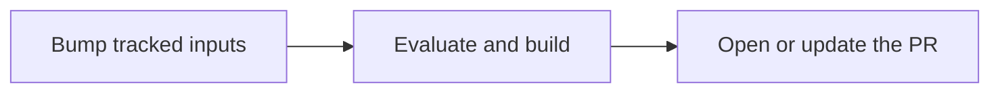

<!--
SPDX-FileCopyrightText: 2026 Wavelens GmbH <info@wavelens.io>
SPDX-License-Identifier: AGPL-3.0-only
-->

# Update Flake Inputs

Pull requests that bump `flake.lock`, opened only after a successful build of the updated flake.

**Requirements:**

- A task with an outbound Git host integration, see [Connect GitHub](github.md), [Connect Gitea or Forgejo](gitea.md) or [Connect GitLab](gitlab.md)
- A **Polling** or **Time (cron)** trigger, for the update interval

## 1. Track the Inputs

=== "UI"

    Open **Settings -> Flake Inputs -> New Override** on the task. Set the **Input Name** and enable **Force update using the URL declared in flake.nix**.

=== "Declarative"

    ```nix
    services.gradient.state.tasks.web-app.flake_input_overrides = {
      nixpkgs.keep_url = true;
      "home-manager*".keep_url = true; # (1)!
    };
    ```

    1.  `*` and `?` match many inputs. A bare `*` will track every input.

`github`, `gitlab` and `git` inputs are supported, including `git` over SSH with the project's SSH key.

!!! warning
    An override with a **URL** will pin that input. The pin will block every update run of the task. No pull request can land while an input is held.

## 2. Add the PR Action

=== "UI"

    Open **Actions -> New Action** on the task. Pick the type **PR** and the **Outbound Integration**. The defaults fit most repositories.

=== "Declarative"

    ```nix
    services.gradient.state.tasks.web-app.actions = [{
      name = "flake-update";
      type = "open_pr";
      config.integration = "github-acme";
    }];
    ```

| Field | Default | Effect |
|---|---|---|
| Granularity | `per_run` | `per_input` is opening one pull request per input instead of one for all |
| Verify Gate | `build` | `eval` and `none` open the pull request once the updated flake is evaluated, before the builds finish |
| Branch Pattern | `gradient/flake-lock-update` | Must contain `{input}` with `per_input` |
| Title Template | `flake.lock: update <inputs>` | Placeholders `{input}`, `{inputs}`, `{count}` |
| Body Template | Each input's old and new revision | Same placeholders as the title |
| Update existing PR | on | Refreshing an open pull request instead of opening a second one |

## Update Run

Each trigger fire (and each **Start Evaluation**) will start an update evaluation next to the normal one.



- Gradient is force-pushing the branch as one commit on the current base.
- The pull request is never falling behind.
- No pull request for an unchanged `flake.lock`.
- No pull request after a failed build, with the default `build` check.

## Verify Deployment

- A click on **Start Evaluation** in the task will add a second evaluation for the update.
- The Git host will show the pull request with each input's old and new revision after the evaluation.

## Next Steps

- [Notify with Actions](actions.md): mails and web requests on failed updates
- [Projects and Tasks](../concepts/projects-and-tasks.md): triggers and actions
