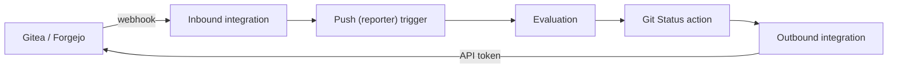

# Connect Gitea or Forgejo

Evaluations on push and pull request. Commit statuses back on the Git host.

**Requirements:**

- A task with a repository URL on the Gitea or Forgejo instance, see [First Project](../get-started/first-project.md)
- Admin access to the Gitea or Forgejo instance, or to the repository's owner, for a bot account

## Inbound and Outbound

Gradient and the Git host exchange data in two directions. Each direction is a separate integration of the project.



| | Inbound | Outbound |
|---|---|---|
| Direction | Git host -> Gradient | Gradient -> Git host |
| Holds | Webhook secret, allowed source IPs | Endpoint URL, access token of a bot account |
| Picked by | **Push (reporter)** and **Pull Request (reporter)** triggers | **Git Status** and **PR** actions |
| Covers | Evaluations on push, pull request and release. `/gradient` comment commands | Commit statuses. Reactions to `/gradient` comments. Writer check of pull request authors. [Flake update](flake-updates.md) pull requests |
| Without | Git host events never reach Gradient | No status on commits. `/gradient` comments ignored. All pull request authors count as non-writers |

- A inbound integration can receive webhooks from all repositories of the project's tasks. Incoming events match tasks by the `owner/repo` part of the repository URL.
- Outbound calls act as the token's account. Statuses and comments appear under that account's name.
- Writer checks and comment reactions use the outbound integration of the task's **Git Status** action.

## 1. Create the Integrations

### Bot Account and Token

Gitea and Forgejo issue tokens per user only. Dedicated bot accounts keep statuses and comments apart from personal accounts.

| Repository owner | Access for the bot account |
|---|---|
| User | **Settings -> Collaborators** of each repository, permission **Admin** |
| Organization | Member of a team with **Administrator Access** to the repositories |

Admin rights allow the writer check of pull request authors. Gitea and Forgejo answer permission queries for repository admins only. **Write** access is enough for tasks without a **Pull Request (reporter)** trigger.

The token needs these scopes.

| Scope | Needed for |
|---|---|
| `write:repository` | Commit statuses, the writer check, flake update branches and pull requests |
| `write:issue` | Reactions and replies on pull request comments |
| `read:user` | Commit author of flake update commits |

=== "UI"

    Sign in as the bot account and open **Settings -> Applications -> Generate New Token**. Pick **Repository and Organization Access** **All** for private repositories, then the scopes above.

=== "CLI"

    ```sh
    # on the Gitea host, as the Gitea service user (forgejo instead of gitea for Forgejo)
    gitea admin user create --username gradient-bot \
      --email gradient-bot@example.com --random-password
    gitea admin user generate-access-token --username gradient-bot \
      --token-name gradient --scopes write:repository,write:issue,read:user --raw
    ```

### Integrations

=== "UI"

    Open **Integrations -> New Integration** in the project twice, once per kind.

    | Kind | Fields |
    |---|---|
    | Inbound | Name, **Git Host** Gitea or Forgejo and a **Webhook Secret**. The refresh button can generate a secret. The secret is visible only once, copy it right away. Created integrations display the **Webhook URL**. |
    | Outbound | Name, **Git Host**, **Endpoint URL** (e.g. `https://gitea.example.com`, without `/api/v1`) and the bot's **Access Token** |

=== "Declarative"

    ```nix
    services.gradient.state.integrations = {
      gitea-in = {
        project = "acme";
        kind = "inbound";
        git_host_type = "gitea"; # (1)!
        secret_file = "/run/secrets/gitea-webhook-secret"; # (2)!
        created_by = "alice";
      };
      gitea-out = {
        project = "acme";
        kind = "outbound";
        git_host_type = "gitea";
        endpoint_url = "https://gitea.example.com"; # (3)!
        access_token_file = "/run/secrets/gitea-token"; # (4)!
        created_by = "alice";
      };
    };
    ```

    1.  `forgejo` for Forgejo.
    2.  Any random string, e.g. `openssl rand -hex 32`. The Git host webhook must use the same value.
    3.  Base URL of the Git host, without `/api/v1`.
    4.  The bot's token from above, as the only content of the file.

    The webhook URL is `https://gradient.example.com/api/v1/hooks/gitea/acme/gitea-in` (`forgejo` instead of `gitea` for Forgejo).

## 2. Add the Webhook on the Git Host

Open **Settings -> Webhooks -> Add Webhook** in the repository (or organization) on the Git host.

| Field | Value |
|---|---|
| Target URL | The webhook URL from step 1 |
| HTTP method, content type | `POST`, `application/json` |
| Secret | The secret from step 1 |
| Trigger on | Custom events: **Push**, **Pull Request**, **Issue Comment**, **Pull Request Comment**, **Pull Request Review**, **Release** |

A push-only webhook can never deliver pull requests or the `/gradient` comment commands.

## 3. Wire the Task

Tasks connect the two integrations. Triggers point at the inbound integration, actions at the outbound integration.

=== "UI"

    New tasks get a **Push (reporter)** trigger and a **Git Status** action automatically. Two conditions apply.

    - Task created after both integrations.
    - A single inbound and a single outbound integration matching the repository host.

    Other tasks need both added by hand.

    - **Triggers -> New Trigger**: **Push (reporter)** and, for pull requests, **Pull Request (reporter)**, each with the inbound integration.
    - **Actions -> New Action**: **Git Status** with the outbound integration.

=== "Declarative"

    Declared tasks get no automatic trigger or action. Both belong in the task's `triggers` and `actions` lists.

    ```nix
    services.gradient.state.tasks.app = {
      project = "acme";
      repository = "https://gitea.example.com/acme/app.git";
      created_by = "alice";
      triggers = [
        { type = "reporter_push"; integration = "gitea-in"; } # (1)!
        { type = "reporter_pull_request"; integration = "gitea-in"; } # (2)!
      ];
      actions = [
        {
          name = "report-status";
          type = "git_host_status_report";
          config.integration = "gitea-out"; # (3)!
        }
      ];
    };
    ```

    1.  Trigger-level `integration`, naming the inbound integration. Branch and tag filters go into `config`, see [Trigger Types](../reference/state.md#trigger-types).
    2.  Optional. Evaluations of pull requests, with fork pull requests waiting for maintainer approval.
    3.  `config.integration`, naming the outbound integration.

## Verify Deployment

- Pushes start an evaluation within seconds.
- Webhook deliveries on the Git host answer `200`.
- Gradient's commit status visible on the Git host.

## Pull Requests

| Action on the Git host | Effect |
|---|---|
| Open or update a pull request | Evaluation of the pull request's head commit |
| Comment `/gradient run` | New evaluation of the pull request |
| Comment `/gradient approve` or approve the review | Release of a pull request from a fork waiting for maintainer approval |

The approval check is a setting of the **Pull Request (reporter)** trigger: **Require maintainer approval for PRs from non-writers** (`require_approval` in `config`).

Only repository writers can issue `/gradient` commands. Accepted commands get a 👀 reaction, rejected commands a 😕.

## Troubleshooting

| Symptom | Fix |
|---|---|
| `401` in the Git host's delivery log | Secret mismatch. Enter the secret again on both sides (**Edit -> Webhook Secret** in Gradient) |
| `403 forbidden_source_ip` | The Git host's address is missing from the integration's allowed source IPs |
| `404` | Wrong project or integration name in the webhook URL, or an inbound integration without a secret |
| `200`, but no evaluation | No task trigger is using this integration, or no task repository URL is matching |
| No status on the commit | Task without **Git Status** action, or token without `write:repository` |
| 😕 on a maintainer's `/gradient` comment | Bot account without admin access to the repository |

## Next Steps

- [Actions](actions.md): mail, web requests and flake update pull requests
- [Declarative State](../reference/state.md): all task, trigger and action options
- [Connect GitLab](gitlab.md): the same setup for GitLab
