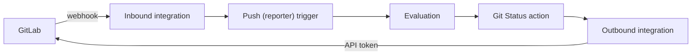

# Connect GitLab

Evaluations on every push and merge request. Commit statuses back on GitLab.

**Requirements:**

- A task with a repository URL pointing to GitLab (gitlab.com or self-hosted), see [First Project](../get-started/first-project.md)
- The Maintainer role on the GitLab project or group, for an access token

## Inbound and Outbound

Gradient and GitLab exchange data in two directions. Each direction is a separate integration of the project.



| | Inbound | Outbound |
|---|---|---|
| Direction | GitLab -> Gradient | Gradient -> GitLab |
| Holds | Webhook secret, allowed source IPs | Endpoint URL, access token |
| Picked by | **Push (reporter)** and **Pull Request (reporter)** triggers | **Git Status** and **PR** actions |
| Covers | Evaluations on push, merge request and release. `/gradient` comment commands | Commit statuses. Reactions to `/gradient` comments. Writer check of merge request authors. [Flake update](flake-updates.md) merge requests |
| Without | GitLab events never reach Gradient | No status on commits. `/gradient` comments ignored. All merge request authors count as non-writers |

- A single inbound integration can receive webhooks from all repositories of the project's tasks. Incoming events match tasks by the `owner/repo` part of the repository URL.
- Outbound calls act as the token's account. Statuses and comments appear under that account's name.
- Writer checks and comment reactions use the outbound integration of the task's **Git Status** action.

## 1. Create the Integrations

### Access Token

Project and group access tokens come with their own bot user on GitLab. Group tokens cover all projects of the group.

| Setting | Value |
|---|---|
| Where | **Settings -> Access tokens -> Add new token** of the GitLab project or group |
| Role | **Developer**. Writer checks treat Developer and above as writers |
| Scopes | `api` |

A personal access token of a dedicated account also works. The account then needs the Developer role on each project.

### Integrations

=== "UI"

    Open **Integrations -> New Integration** in the project twice, once per kind.

    | Kind | Fields |
    |---|---|
    | Inbound | Name, **Git Host** GitLab and a **Webhook Secret**. The refresh button can generate a secret. The secret is visible only once, copy it right away. Created integrations display the **Webhook URL**. |
    | Outbound | Name, **Git Host** GitLab, **Endpoint URL** (e.g. `https://gitlab.com`, without `/api/v4`) and the **Access Token** |

=== "Declarative"

    ```nix
    services.gradient.state.integrations = {
      gitlab-in = {
        project = "acme";
        kind = "inbound";
        git_host_type = "gitlab";
        secret_file = "/run/secrets/gitlab-webhook-secret"; # (1)!
        created_by = "alice";
      };
      gitlab-out = {
        project = "acme";
        kind = "outbound";
        git_host_type = "gitlab";
        endpoint_url = "https://gitlab.com"; # (2)!
        access_token_file = "/run/secrets/gitlab-token"; # (3)!
        created_by = "alice";
      };
    };
    ```

    1.  Any random string, e.g. `openssl rand -hex 32`. The GitLab webhook must use the same value.
    2.  Base URL of GitLab, without `/api/v4`.
    3.  The access token from above, as the only content of the file.

    The webhook URL is `https://gradient.example.com/api/v1/hooks/gitlab/acme/gitlab-in`.

## 2. Add the Webhook on GitLab

Open **Settings -> Webhooks -> Add new webhook** in the GitLab project (or group).

| Field | Value |
|---|---|
| URL | The webhook URL from step 1 |
| Secret token | The secret from step 1 |
| Trigger | **Push events**, **Tag push events**, **Comments**, **Merge request events**, **Releases events** |

A push-only webhook can never deliver merge requests or the `/gradient` comment commands.

## 3. Wire the Task

Tasks connect the two integrations. Triggers point at the inbound integration, actions at the outbound integration.

=== "UI"

    New tasks get a **Push (reporter)** trigger and a **Git Status** action automatically. Two conditions apply.

    - Task created after both integrations.
    - A single inbound and a single outbound integration matching the repository host.

    Other tasks need both added by hand.

    - **Triggers -> New Trigger**: **Push (reporter)** and, for merge requests, **Pull Request (reporter)**, each with the inbound integration.
    - **Actions -> New Action**: **Git Status** with the outbound integration.

=== "Declarative"

    Declared tasks get no automatic trigger or action. Both belong in the task's `triggers` and `actions` lists.

    ```nix
    services.gradient.state.tasks.app = {
      project = "acme";
      repository = "https://gitlab.com/acme/app.git";
      created_by = "alice";
      triggers = [
        { type = "reporter_push"; integration = "gitlab-in"; } # (1)!
        { type = "reporter_pull_request"; integration = "gitlab-in"; } # (2)!
      ];
      actions = [
        {
          name = "report-status";
          type = "git_host_status_report";
          config.integration = "gitlab-out"; # (3)!
        }
      ];
    };
    ```

    1.  Trigger-level `integration`, naming the inbound integration. Branch and tag filters go into `config`, see [Trigger Types](../reference/state.md#trigger-types).
    2.  Optional. Evaluations of merge requests, with fork merge requests waiting for maintainer approval.
    3.  `config.integration`, naming the outbound integration.

## Verify Deployment

- Pushes start an evaluation within seconds.
- A `200` delivery on the webhook's **Settings -> Webhooks -> Edit -> Recent events** page.
- Gradient's pipeline status visible on the GitLab commit.

## Merge Requests

| Action on GitLab | Effect |
|---|---|
| Open or update a merge request | Evaluation of the merge request's head commit |
| Comment `/gradient run` | New evaluation of the merge request |
| Comment `/gradient approve` | Release of a merge request from a fork waiting for maintainer approval |

The approval check is a setting of the **Pull Request (reporter)** trigger: **Require maintainer approval for PRs from non-writers** (`require_approval` in `config`). Review approvals on GitLab trigger no webhook. The comment is the only way to approve.

Only project members with the Developer role or above can issue `/gradient` commands. Accepted commands get a 👀 reaction, rejected commands a 😕.

## Troubleshooting

| Symptom | Fix |
|---|---|
| `401` in the webhook's recent events | Secret mismatch. Enter the secret again on both sides (**Edit -> Webhook Secret** in Gradient) |
| `403 forbidden_source_ip` | GitLab's address is missing from the integration's allowed source IPs |
| `404` | Wrong project or integration name in the webhook URL, or an inbound integration without a secret |
| `200`, but no evaluation | No task trigger is using this integration, or no task repository URL is matching |
| No status on the commit | Task without **Git Status** action, or token without the `api` scope or the Developer role |

## Next Steps

- [Actions](actions.md): mail, web requests and flake update merge requests
- [Declarative State](../reference/state.md): all task, trigger and action options
- [Connect Gitea or Forgejo](gitea.md): the same setup for Gitea and Forgejo
