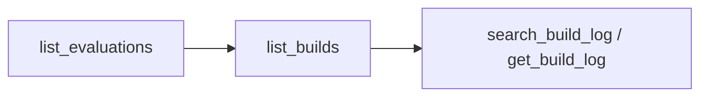

<!--
SPDX-FileCopyrightText: 2026 Wavelens GmbH <info@wavelens.io>
SPDX-License-Identifier: AGPL-3.0-only
-->

# Connect an AI Assistant

Every evaluation, build and build log readable through `gradient mcp` by any [Model Context Protocol](https://modelcontextprotocol.io) client (Claude Code, Claude Desktop, Cursor). An assistant can find the failed build and read the log line that broke the build.

**Requirements:**

- The CLI, see [Install](../reference/cli.md#install)

## 1. Log In

```sh
gradient login https://gradient.example.com
```

Every tool call will run as this user. Tool calls see only the user's projects. `gradient project select <name>` can set the default project for tools that take one.

## 2. Add the Server to the Client

=== "Claude Code"

    ```sh
    claude mcp add gradient -- gradient mcp
    ```

=== "JSON config"

    ```json
    {
      "mcpServers": {
        "gradient": {
          "command": "gradient",
          "args": ["mcp"]
        }
      }
    }
    ```

## Verify Deployment

Ask the assistant: "Explain the last failed evaluation of `web-app`." The assistant will walk down the tools.



## Tools

| Tool | Result |
|---|---|
| `list_projects`, `list_tasks` | The user's projects and their tasks |
| `list_evaluations`, `get_evaluation` | A task's evaluations with build counts. One evaluation with commit, status and error |
| `list_builds`, `get_build` | The builds of an evaluation. One build with derivation, system and outputs |
| `get_build_log` | A log, whole or by line range. More than 10 lines go to a temp file, and the tool is returning its path |
| `search_build_log` | Matching log lines with line numbers |

## Control Tools

`gradient mcp --control` will let the assistant act on the CI, limited by the user's project permissions.

| Tool | Effect |
|---|---|
| `start_evaluation` | Starting an evaluation of a task, optionally at a commit |
| `abort_evaluation` | Aborting the running and queued builds of an evaluation |
| `watch_evaluation` | Waiting until an evaluation is finished, up to `timeout_seconds` (600 by default, at most 3600) |

The server is read-only without `--control`.

## Troubleshooting

| Symptom | Fix |
|---|---|
| `Server URL not set` | Run `gradient login` first |
| Client reporting a protocol error in a wrapper script | The server is speaking JSON-RPC on stdout. Keep stderr out of stdout |

## Next Steps

- [Evaluations and Builds](../concepts/evaluations-and-builds.md): what the tools return
- [CLI](../reference/cli.md): the other `gradient` commands
