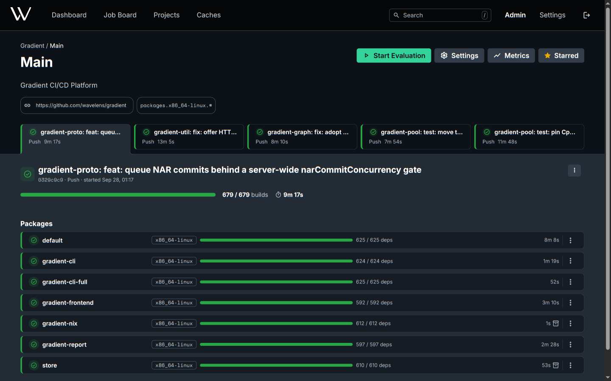

<!--
SPDX-FileCopyrightText: 2026 Wavelens GmbH <info@wavelens.io>
SPDX-License-Identifier: AGPL-3.0-only
-->

# Gradient

**Nix-CI for Teams.** Every flake built once, on any machine, cached for everyone.



## Features

<div class="grid cards" markdown>

-   :material-source-branch: **[Git Host Integration](guides/github.md)**

    Building on push and pull request from GitHub, Gitea / Forgejo and GitLab. Status checks sent back.

-   :material-console: **[Build Before Pushing](guides/build-before-push.md)**

    Uncommitted changes built on the CI workers with `gradient build`, no local Nix needed.

-   :material-database: **[Built-in Binary Cache](concepts/caches.md)**

    Per-project caches with S3 storage, signing and sharing between projects.

-   :material-server-network: **[Scales With Workers](concepts/workers.md)**

    Evaluation and building both on workers. More capacity with every added machine.

-   :material-robot: **[MCP Server](guides/mcp.md)**

    Logs, evaluations and failed builds, readable by any AI assistant.

-   :material-rocket-launch: **[Pull Deployment](guides/pull-deployment.md)**

    Machines fetch and switch to their latest built NixOS configuration on their own.

-   :material-file-code: **[Declarative Setup](reference/state.md)**

    Users, projects, caches and workers as NixOS options, validated at build time.

-   :material-account-group: **[SSO and Teams](guides/sso.md)**

    OIDC login, SCIM provisioning, roles and invitations per project and cache.

</div>

## Compared to Hydra and GitHub Actions

| | [Hydra](https://github.com/NixOS/hydra) | GitHub Actions + [Cachix](https://www.cachix.org) | Gradient |
|---|---|---|---|
| Build start | After the end of the whole evaluation | After the job has evaluated the flake | While the evaluation is still running |
| Evaluation | On the server, limited by one machine | Inside each job, limited by the runner | On workers, scaling with them |
| Import from derivation (IFD) | Not supported | Built by the runner inside the job | Built on the workers as shared builds, cached and logged like any build |
| Nix store | Kept on the server and builders | Empty on every job. Every job will download its closure again | Kept on the workers between builds |
| Shared work | One build per derivation | Parallel jobs can build the same derivation twice | Every derivation built once, shared across projects |
| Build outputs | Pass through the server | Pushed from the runner to Cachix | Large outputs go from worker straight to S3 |
| Server host | Writable Nix store required | Hosted by GitHub | No Nix store required, small enough for a micro-VM |
| Heavy builds | Static machine list with speed factors | Fixed runner sizes | Scoring system placing them by predicted memory, learned from past builds |
| Remote building over SSH | Only outbound, to its own build machines | Not available | [`ssh-ng://` store](guides/build-over-ssh.md) for `nixos-rebuild --build-host` and `nix copy` straight to the CI workers |
| Private caches | One store for the whole instance | Free plan: 5 GB, filled quickly by full closures | Per-project caches with access control, on own S3 or disk storage |
| Sign-in | Local accounts, LDAP, OIDC with roles for the whole instance | GitHub accounts | [OIDC](guides/sso.md) with provider groups mapped to roles per project, SCIM provisioning |
| Integrations | Minimal JSON API | GitHub only | REST API, webhooks, Git Integrations and MCP server |
| Web UI | Server-rendered pages | GitHub job logs | Responsive UI with live log streaming |
| Stars | &color=rgba(30%2C34%2C42%2C1)&label=high) | - | &color=rgba(30%2C34%2C42%2C1)&label=low) |

## Public Binary Cache

Pre-built Gradient packages are available from the public cache.

```text
URL:        https://public.gradient.ci/cache/main
Public Key: public.gradient.ci-main:qmxRE+saUvhNa3jqaCMWje+feVU77TjABchZrPGf7A8=
```

## Links

- Source code: <https://github.com/wavelens/gradient>
- API reference: [Swagger UI](https://petstore.swagger.io/?url=https://raw.githubusercontent.com/wavelens/gradient/main/docs/gradient-api.yaml)
- NixOS options search: <https://wavelens.github.io/gradient-search>
- Chat: [#gradient-ci:matrix.org](https://matrix.to/#/#gradient-ci:matrix.org)

## Project

- **[Support](https://github.com/wavelens/gradient/blob/main/SUPPORT.md)**: community help, long-term and commercial support.
- **[Security Policy](https://github.com/wavelens/gradient/blob/main/SECURITY.md)**: private vulnerability reports.
- **[Privacy](https://github.com/wavelens/gradient/blob/main/PRIVACY.md)**: no telemetry, all data self-hosted.
- **[Governance](https://github.com/wavelens/gradient/blob/main/GOVERNANCE.md)**: roles, maintainers and decisions.
- **[Accessibility](https://github.com/wavelens/gradient/blob/main/ACCESSIBILITY.md)**: web UI support and barrier reports.

[Get started](get-started/quick-start.md){ .md-button .md-button--primary }
[Try the public instance](https://public.gradient.ci){ .md-button }

The developer of Gradient is [Wavelens GmbH](https://wavelens.io). Gradient is available under the [AGPL-3.0-only](https://github.com/wavelens/gradient/blob/main/LICENSE) license.
