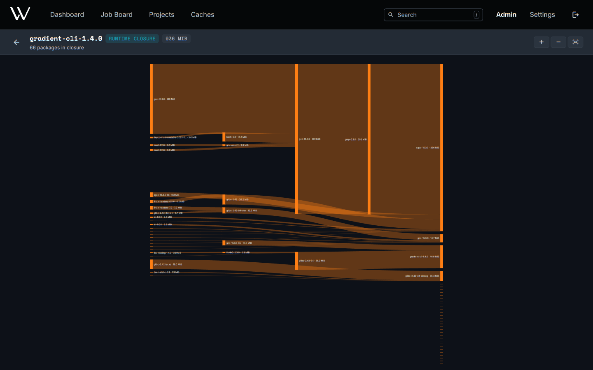

# Closure View

The origin of a build output's size, as a Sankey diagram of the closure. Useful for trimming ISOs, netboot images and container layers. **View Closure** on an entry point's metrics page will open the closure of the newest build.

| Area | Content | Actions |
|---|---|---|
| Header | Total closure size, closure type, truncation warning | Zoom in, zoom out, fit to screen |
| Diagram | Packages as bars, flowing from dependencies on the left into the root on the right | Scroll to zoom, drag to pan |

A bar's height is the package's closure size. This size is the package's own NAR plus everything the package pulled in. The tallest bars are the best candidates to remove.

## Runtime and Build Closure

| Closure | Contains | Open with |
|---|---|---|
| Runtime | Store paths referenced by the outputs, required at runtime | Default |
| Build | Every derivation needed to build the output | `?type=build` in the URL |

The runtime closure can only cover outputs already in the cache.

## Large Closures

- The 500 largest packages show one by one. The rest collapse into an **others** bar under the nearest shown package.
- Packages appear under one parent only. The bars add up to the total.
- The total will stay exact, even with a truncation warning in the header.

## Related

- [Evaluations and Builds](../concepts/evaluations-and-builds.md): entry points and the build model
- [API](../reference/api.md#examples): the closure endpoints for scripts
